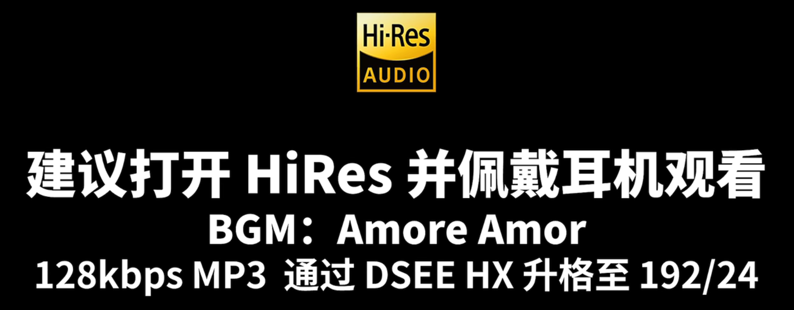

音乐与游戏发烧友入门指南

- [数字音频原理](#数字音频原理)
- [软件优化](#软件优化)
  - [获得高音质](#获得高音质)
  - [还原原声](#还原原声)
  - [3D 音效和 HRTF](#3d-音效和-hrtf)
  - [EQ 和响度均衡](#eq-和响度均衡)
- [音频传输原理](#音频传输原理)
- [发声单元](#发声单元)
  - [独立声卡](#独立声卡)
- [杂七杂八](#杂七杂八)

# 数字音频原理

声的本质是物体的振动。在现代媒介上储存的声音，无论其格式（.wav .mp3 .flac...）如何，本质都储存着以采样点模拟的波形信号。真实的声信号是连续的波，而数字音频信号是由离散的采样点构成的，因此在记录和还原声的过程中，会有不可避免的信息损失。hifi 高保真的本质，就是数字音频复现的声对原始声的高度还原

数字音频具有三个性质：采样率、位深和声道数。其中采样率是时间尺度的精度，即图中 x 轴的密度；位深是振幅大小的精度，即图中 y 轴理论上能达到的最大值和最小正值的比；声道数则表示了一个数字音频记录了几个位置的声音，理论上声道数越多，声音的空间感就能更强，产生空间音频效果至少需要双声道。采样率、位深和声道数的积越大，音频的质量越高

假设一段音频以 16 bit, 44100 Hz 的位深和采样率录制，我们的听音设备再好也不可能还原出比这更高的音质（用 AI 等技术对位深和采样率升格是重新创造了声而不是还原声），另外，声音的有损压缩如 mp3 等压缩格式也会对音质产生影响。因此，高质量的音源首先必须是位深高、采样率高且尽可能无损压缩的音源

# 软件优化

## 获得高音质

对数字音频有基础的了解后，我们可以在设置中确认自己的硬件设置能够播放高质量的音频。hi-res 是索尼制定的极高质量音乐标准，需要位深和采样率大于等于 24 bit, 96000 Hz，通常我们的硬件规格达到播放 hi-res 的标准就足够了

  
按 Win+I 进入设置界面，搜索 sound，进入声音设置，找到你目前正在使用的扬声器（耳机、音响）

  
点击进入该声音输出的设置页，将位深和采样率设为大于等于音乐质量的格式

> 码率更高的音源在声音还原精度和动态范围等硬参数上有客观优势，但双盲实验已表明人类极难分辨 CD 级音质（16 bit, 44100 Hz）和 hi-res 的区别。另外，ASIO Buffer Size 是声卡为了保证声音的稳定输出而做的缓冲，会造成毫秒级的延迟；音频码率越高，声卡硬件规格越低，ASIO 延迟越高。因此请勿过度看重位深和采样率

选择先进的解码格式和音频接口也有利于提高音质，以 QQ 音乐为例，输出设备选择 WASAPI，优先 Native DSD 优选模式几个操作就能够优化音质；独占模式理论上也有较大的提升，视具体使用情形开启。本文重视实操，具体原理就不赘述

  
在 QQ 音乐的设置中找到音频设备，按如图格式设置

## 还原原声

Windows10/11 自带**音频增强**功能，其本质就是~~无用地~~补偿耳机的低频不足和~~没什么用地~~执行一些诸如虚拟环绕和房间声学纠正等算法

音频增强开启时，即使你在使用立体声（即双声道）系统，Windows 也会尝试从音源接收并处理 7.1 声道的信号，这可能导致游戏错误识别你使用的声学系统并造成声道丢失等各种音频 bug，降低你的听音辨位准确度。比如游戏 Apex Legends 就会错误地认为你在使用 7.1 声道系统

除非你真的在用一些低频过于残疾的耳塞，且对声场和听音辨位效果不在意，并感觉这个效果能给你提供显著的音质提升，否则请关闭它。强行增强低频等效果会导致声音严重失真并损失动态范围

  
回到[获得高音质](#获得高音质)一节中打开的设置页，关闭音频增强

  
关闭音频增强后，Apex 声音设置中不会有输出设置

## 3D 音效和 HRTF

现代影视和游戏的 3D 音效是通过 HRTF (head-related transfer function) 算法实现的，这个算法试图将声音模拟成你在现实中听到的，具有空间感的声音。对于玩家而言，游戏内外的 3D 音效设置也是影响你听声辩位能力的重要因素。HRTF 设置是否得当直接决定了你能否听清游戏中各种声音的来源

Windows Sonic、Dolby Atmos 和 DTS:X 是目前市占率最高的三款外置 HRTF。其中，Windows Sonic 在 Windows 中免费预装，而 Dolby Atmos 和 DTS:X 则需要在微软商店购买（当然，也可以在闲鱼花 40 块左右找人代购）。外置 HRTF 的优劣众说纷纭，大致上杜比更有临场感而 DTS 的音频还原度硬素质更高，而 Windows Sonic 的优点或许只有免费，在这两位大爹面前实在不太够看

  
杜比和 DTS 是微软商店唯二的 3D 空间音效软件，都可以免费下载体验一段时间

  
配置杜比音效（耳机）

  
配置 DTS:X（以大耳为例）

  
在 Windows 设置中选择你想要使用的 HRTF

**但并不是所有游戏都需要开启外置 HRTF！**

绝大部分单机游戏都不会内置 HRTF，可以根据个人喜好选择外置 HRTF 增强声音的空间感，但在主流竞技 FPS 游戏中，CSGO、卡拉比丘、PUBG、Valorant、彩虹六号目前都已经明确内置 HRTF（Apex Legends 没有内置 HRTF）。**如果你玩的游戏已经内置 HRTF，那就在游戏内打开即可，不要开启任何外置 HRTF 了！**

## EQ 和响度均衡

> 经典 hifi 笑话一则：有位烧友为此从上海搬家到广州，声音好很多，因为南方电网以大亚湾核电和两广水电为主，音响既有力度，又比较清澈。最近准备投资建设独立不并网的雅鲁藏布江水电站，高山雪原的天水，将使音响脱胎换骨，可惜报告遭到印度的反对。太阳能发电，有何不同？声音偏向温暖，不冷，但是有点薄！一日，某位国内资深的烧友尝试 AT-HA25D 推 AD2000，听着听着突然摘下耳机说“今天没法听了，一定是水电站的水位又涨了”令在场其他烧友目瞪口呆！

无论有没有用过，对音乐稍有了解的人都应该对 EQ 即 equalization 略知一二。不同耳机的调音策略不同导致了其主观听感的不同，而 EQ 可以通过调整声音在不同频段的响度来改变听感，以达到客制化调音策略的目的。恰当的 EQ 可以用来部分补偿小振膜耳机低音不足的缺陷，突出枪声、脚步声等游戏中重要的信息，削弱爆头声、闪光弹等干扰性的声音，也可以让耳机频响更贴合[哈曼曲线](https://zhuanlan.zhihu.com/p/65228980)或自己的听音偏好以达到主观上更“好听”的效果

免费开源且地表最强的 Equalizer APO 是 EQ 软件中的佼佼者，它可以在硬件层面上储存 EQ 信息，而不是像大多数所谓“电竞调音软件”一样必须挂在后台才能生效。从 Equalizer APO 官网 https://sourceforge.net/projects/equalizerapo 下载安装包后，根据如下视频或图文教程选中你的收音和听音设备（如果你不知道你的设备是哪个，那全选上就行了）安装 Equalizer APO 并根据指引重启

**安装 Equalizer APO 视频教程 (2mb)** resource/eq1.mp4

[可能是全网最详细的 Equalizer APO 使用教程（一）软件安装](https://www.bilibili.com/read/cv21469511/)

如果你的耳机是名牌知名产品，你可以根据以下视频尝试用 autoeq.app 检索自己的耳机来自动 EQ，该视频建议戴上耳机开高音量观看

**使用 autoeq.app 自动 EQ 视频教程 (15mb)** resource/eq2.mp4

如果要通过 Equalizer APO 实现更个性化的效果比如加强脚步声，降低爆头声等，可以学习以下图文教程

[可能是全网最详细的 Equalizer APO 使用教程（二）功能介绍](https://www.bilibili.com/read/cv21502062)

[可能是全网最详细的 Equalizer APO 使用教程（三）图形均衡器](https://www.bilibili.com/read/cv21667609)

[学会这个操作，让你的耳机免费升级为 HiFi 耳机](https://www.bilibili.com/read/cv22197389)

# 音频传输原理

软件层面的优化是几乎 0 成本的，但也是有限的，如果想进一步提高听音体验，只能通过选配合理的硬件来实现。但是别担心，有多少预算我们玩什么规格的硬件，本文会给大家符合自己预算的购买建议，不会贩卖配置焦虑

在软件系统处理完数字音频后，一段数字音频还需要经过分别对应 DAC、功放、发声单元的数模转换、功率放大、模声转换的三个环节才能被听到。使用不同声学搭配时，这些元件的连接方式和集成状况天差地别，但基本的转换模式都是一致的

- DAC 即数字/模拟信号转换器，将数字音频信号转换为模拟电压信号输出给功放，但此时模拟信号的电压不足以驱动发声单元
- 功放即功率放大器，耳机用的功放俗称耳放，负责将 DAC 输出的低电压信号放大到足以驱动发声单元
- 发声单元即耳机、音响等，本质就是通过动圈或振膜等将电压信号转换为物理振动的转换器

电脑或手机通过 3.5mm 音频接口（就是那种最常见的耳机孔）连接**无主动降噪功能的**耳机时，由板载声卡担任 DAC 和功放。机箱、笔记本电脑内部的电磁环境非常复杂，板载声卡容易受显卡、电源甚至风扇的干扰而产生严重的底噪，实际信噪比 S/N 通常低于 90dB

> 常用有线耳机直插电脑的同学可能体会过，播放一份特定的 Wallpaper 或游戏进入特定场景时听到底噪却找不出原因。这可能是电脑执行特定任务时板载声卡与机箱内某些信号源（比如显卡）发生电磁共振引起的

通过蓝牙或 2.4GHz 等无线技术连接耳机时，耳机实际上收到一个来自电脑的数字信号并由其内部的 DAC 和功放驱动，这种情况下电脑板载声卡不会参与声音的处理，因此不会有来自电脑内部的底噪，但会有来自无线传输的音质损耗和耳机内部解码功放的底噪

使用独立声卡时，电脑、手机通过光纤、USB、PCIe 等接口连接独立声卡，再通过 3.5 mm 接口或 6.3 mm 接口连接**无主动降噪功能的**耳机时，底噪取决于解码耳放和耳机线的质量；而 4.4 mm 平衡接口理论上可以完全杜绝传输过程引入的底噪

# 发声单元

发声单元是一套音频系统中最核心的部件，选择合适的发声单元对听音系统的构建至关重要

以**发声单元的体积**来区分，我们通常有音响、头戴式耳机（大耳）和耳塞三种选择。发声单元的体积是影响动态范围和频响能力的最重要因素之一，因此体积最大的音响在声场、分离度和低频力度以及沉浸感等等方面都是耳机无法比拟的，是同价位下听音设备的最优解。如果~~和笔者一样~~没有条件用音响，预算在三百元及以上价位的话，大耳是次优解。如果没有苛刻的便携需求和特别紧张的预算，就尽量不要考虑耳塞。耳塞的不仅低频残疾，基本没有动次打次的能力，还容易诱发中耳炎，对耳朵的伤害是三者中最大的

以**结构和隔音设计**区分，耳机可以分为封闭式和开放式，以及介于两者之间的半开放式。封闭式耳机的耳罩完全封闭，可以一定程度上被动隔绝外界噪音，也会使振膜推动空气的能量利用率更高，产生力度更强的低频，动次打次的低频解析力更好。但也会导致声音在耳罩内部反射，产生声场狭窄、声音不够自然的缺陷。所有降噪耳机和绝大部分游戏耳机都是封闭式耳机，主动降噪能让耳机的隔音效果更上一层楼，但缺点也相应放大了。开放式耳机的耳罩完全开放，能让声音在耳罩内部自由扩散，有声场宽阔、声音自然的优点，是古典音乐的最优解。但开放式耳机完全舍弃了降噪能力，且可能伴随严重的漏音，只适合在安静的环境中使用（甚至对机箱的噪音要求也很严格）而不适合出街。所谓半开放则是对以上两者优劣的折衷和妥协

以**用途**区分，耳机还可以分为 hifi 耳机、监听耳机、游戏耳机和降噪耳机

**hifi 耳机** 是针对某些特定音乐类型加以调音修饰的耳机，如专精古典的森海 HD800、女毒经典 ATH c502 ~~以及原道和大奥~~等。高素质的 hifi 耳机在搭配合适的解码耳放后，定位准度绝不会输于任何游戏耳机。不过 hifi 耳机大多都没有麦克风，且调音风格各不相同，不一定会遵循三频均衡的原则，因此使用 hifi 耳机打游戏前最好先进行 EQ。hifi 耳机适合想兼顾听音乐和打游戏，且音乐品味有明确偏好的烧友（如果你的歌单中金属、流行、古典、电子等任何一大类占比超过 40% 的话，你就是这类了）

**监听耳机** 则能使人听到最为接近真实的、未加任何修饰的音质（reference monitering）或检测音频缺陷（critical listening），如拜亚 DT770、索尼 MDR-MV1 等。监听耳机和 hifi 耳机并没有明确的界限，但鉴于其本身追求还原原音的特质，不一定需要 EQ，因此适合想兼顾听音乐和打游戏，但音乐品味比较杂食的烧友

**游戏耳机** 和 hifi 耳机都是面向使用场景进行调音的耳机，游戏耳机通常针对游戏需求做调音且大多自带麦克风，如赛睿寒冰新星、Audeze Maxwell，以及罗技 g333、BOSE QC20 等，部分~~只坑傻逼的~~游戏耳机如 ROG 创世 7.1 等甚至有物理多声道来~~仅存在于理论上地~~增强垂直定位能力。游戏耳机适合只打竞技游戏不听音乐，以及某些有无线需求且不想搭配独立声卡的玩家

其实游戏耳机其实应该被称为“竞技耳机”，因为它们的调音策略和整体听感的设计很大程度上都是以提高竞技游戏的信息收集能力为目标，而并不提高游戏的主观听音体验。换句话说，游戏的音效设计本意是在满足玩家信息收集需求的条件下尽可能追求好的听感，而所谓游戏调音则几乎完全牺牲听感以追求极致的信息收集能力，更适合严肃竞技玩家。这种倾向于定位脚步声的调音策略是极为恶劣的音染，几乎重塑了艺术家设计的音频

**降噪耳机** 通常指带有主动降噪功能适合出街的耳机，主动降噪耳机的声场有固有缺陷但能有效降低环境噪音，如索尼 WH-1000XM5、BOSE QC45 以及索尼 WF-1000XM5、苹果 Airpods 等。降噪耳机能有效降低环境噪音但声场的缺陷和多次额外的数模转换导致了它们只适合需要兼顾出门听音乐和功能性但不玩竞技游戏不需要听音辨位，或游戏环境实在过于嘈杂的玩家。如果实在需要用降噪耳机打竞技游戏，请务必搭配一根音频线。~~什么 TWS？~~

## 独立声卡

选配音频设备时，首先要分析清楚自己的需求：

- 环境噪音，我的听音环境有多嘈杂
- 便携要求，我是否需要携带耳机出门
- 竞技强度，我玩的游戏对音频细节和延迟的要求有多高
- 音乐偏好，我是否喜欢听音乐，听什么类型的音乐
- 麦克风，我是否需要耳麦
- 预算，我能接受的一整套设备最高价格是多少

举几个根据需求进行技术选型的例子：

- 预算有限，想用一套设备既听音乐又能准确定位的竞技游戏玩家，最优解是购买一只传统有线监听耳机和一个独立声卡
- 我所处环境比较嘈杂，不太玩竞技游戏，

如果环境

# 杂七杂八
