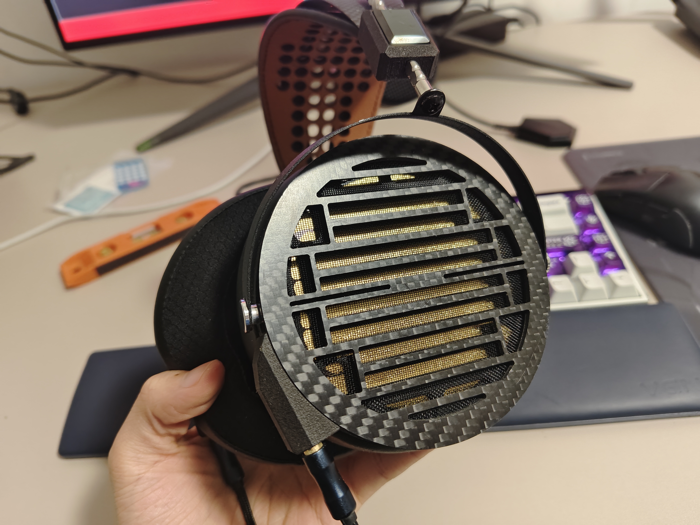

The design of planar magnetic headphones, aka planar headphones, is a systematic engineering process, which mainly involve three main components: driver, cavity, and other parts. Sound quality of planar headphones is determined by their drivers. The cavity serves as an important tuning method, but improper design degrades sound quality and even durability. Other components such as the headband and connectors of ear pads and headphone body, can affect weight, wearing comfort, and sound too.

This article will introduce some design logic of planar headphones from an audiophile's perspective.

# Diaphragm

The operating principle of planar headphones can be summarized as follows: when electrical signals pass through the voice coil attached to the diaphragm, the magnets generate Ampere's force, causing the diaphragm to vibrate and produce sound. **Thus, the diaphragm is the core technology of planar headphones, and its performance is crucial to sound quality.**

To optimize diaphragm's transient response to high-frequency signals and minimize distortion, planar diaphragms are often extremely lightweight and thin to reduce inertia. For instance, the diaphragms of Moondrop Cosmo and Audeze LCD5 are only 0.5μm thick, qualifying as "Nanometer Thickness Diaphragm" by Hifiman standards.

**Lighter diaphragms** are a primary pursuit in planar headphone design, relying fundamentally on advancements in material science and supply chains rather than acoustics. Only a few HiFi manufacturers are capable to develop premium diaphragms themselves, while others depend on upstream suppliers. Dr. Bian 边仿, Hifiman's founder and CEO, earned his chemistry PhD in America. His knowledge laid the groundwork for his team's research on diaphragm materials and processes.

  
Hifiman Susvara's Nanometer Thickness Diaphragm (hundreds of nanometers actually 🤣)

Voice coil is also a critical part in diaphragm manufacturing. The legendary summit-end headphone HE6 and its successor, the Susvara, use gold voice coil due to the metal's excellent ductility, enabling very thin applications. Similiar diaphragms and headphones that apply gold voice coil are called "golden diaphragm" by Chinese Audiophiles. The yield of golden diaphragms are very low, thus expensive. They appear only in higher-end flagship headphones like the upcoming Fiio FT7 and niche models like NAN-6, NAN-7, XK's Serene, and Ori Sonic's CS97G.

However, **hype around the material of voice coil is basically just some marketing bullshit.** While golden diaphragms are expensive, they are not necessarily "the best". Gold's electrical conductivity is average, and when stretched thinly, the cross-sectional area of voice coil becomes super small. These made golden diaphragm super challenging to drive. Additionally, gold's high density conflicts with the goal of the lightweight pursuit of diaphragms. Alternatives like silver/silver alloys (Susvara Unveiled, Moondrop's planar headphones, Fosi I5...) and aluminum/aluminum alloys (Audeze LCD series, Fiio FT1 Pro...) are also popular. Each material imparts unique sound characteristics based on their physical and electrical properties. (**Sound characteristics in this article mean headphones' linear and non-linear acoustic properties**)

Diaphragm technology reflects the maturity of planar headphones' supply chain. Over the past decade, there have been significant advancements in diaphragm QC, consistency, and other objective physical performance. Planar headphones are no longer that fragile. Techniques like "gluing gold foil to diaphragm" are outdated. As far as I know, companies like Hifiman, Moondrop, and Fiio now employ photolithography, while Ori Sonic CS97G uses targeted-sputtering process to achieve exceptional precision and performance in diaphragm processes. Different process will not only affect the sound characteristics, but also greatly determine the cost, consistency, stability and lifespan of diaphragms.

  
Targeted-sputtering golden diaphragm of Ori Sonic CS97G.

Diaphragm tension is another crucial design consideration. Most planar headphones' diaphragms are taut, but some, like a graphene planar headphone of Ori Sonic, uses corrugated diaphragms. Variations in diaphragm tension and distribution greatly impact sound and can lead to damage or degradation if imporoperly designed, which will be more significant under higher sound pressure. One reason for why burn-in affects sound of planar headphones is the changes in tension due to prolonged use.

  
Corrugated graphene diaphragm of Ori Sonic

# Magnets

Magnets are the most critical component besides the diaphragm in planar headphones. Most modern models use neodymium magnets, although some, like the HE400se, use weaker ferrite magnets to cut costs. The Susvara Unveiled also reportedly uses ferrite, which doesn't seem to be a result of cost concerns.

The magnitude of the Ampere's force is proportional to the product of current and the perpendicular magnetic flux density. Thus stronger magnets can reduce the current needed to drive the diaphragm, lower power requirements and increase efficiency which benefits to diaphragm due to less heat. However, the structural components securing these powerful magnets must be exceptionally durable, lightweight, and acoustically optimized, posing significant design challenges.

  
The integrated driver-cavity Structure of Moondrop Para and Cosmo helped them cut cost and weight compared to Venus.

The arrangement of magnets is also important and complements the layout of conductive traces on the diaphragm. The most typical design is a circular, elliptical, or square vibration area with bar magnets arranged in parallel. However, audiophile industry is full of whimsy designers. Meze Elite applies an oddly shaped magnet array while Yamaha persists in traditional spiral-shaped magnets in their planar headphones. But in any case, their pursuit is inseparable from **increasing the effectively drived area** and **homogenizing the driving force**

  
Meze Elite's magnet arrangement is unique, so are its structure parts. I wonder if it was carefully considered in acoustics.

Planar headphones face inherent challenges such as sound wave reflections and diffractions caused by magnet array. **Reducing the impact of magnets on sound waves** is a critical design goal, leading to designs like Hifiman Stealth Magnets, Audeze Fazor™ waveguides, and Moondrop's Super-Long-Named waveguides.

  
Acoustically optimized magnets of Moondrop Venus.

One of the most well-known advantages of planar headphones has lower partition vibration 分割振动, aka "breakups"(?), than dynamic coil. "Breakups" are not completely absent in planar headphones however. The uneven distribution of the magnetic field at the voice coil will also lead to unevenly stress of the diaphragm, being one of the factors that deteriorate the sound quality of planar headphones.

Thus, **how to reach a more evenly distributed magnetic field at voice coil** becomes one of the top concerns of planar headphones. Designers nowadays have developed several approaches like changing the shape of magnets and applying magnetically conductive stator plates to optimize the magnetic field. However, in many cases, better acoustic structure conflicts better electrical structure, so designer must trade-off between magnetic field strength, the uniformity of the magnetic field, and the acoustical effects of magnets.

  
Magnetic field simulation of Fiio FT1 Pro magnet array

# Systematic Engineering of Planar Magnetic Drivers

Designing headphones is a systematic engineering process. It's not something that can be conjured up on a whim or pieced together from a few "good" designs. Designing planar headphone drivers involves multiple disciplines, requiring designers to possess extensive experience and technical skills. This is why most HiFi manufacturers cannot develop the entire system independently and instead purchase parts of the driver design from professional solution providers.

Acoustic simulation plays a crucial role in the design of planar headphones. Modern designers often use finite element analysis tools like COMSOL or ANSYS to aid in the electromagnetic and acoustic design of headphones. BTW, COMSOL is the inspiration for Moondrop Cosmo's name.

Below are some analysis of planar magnetic driver designs.

## Hifiman "Stealth Magnets"

To minimize the impact of magnets on sound waves, Hifiman developed the so-called "Stealth Magnets", which claim to be "transparent" to sound waves. Essentially, Stealth Magnets just mean replacing rectangular magnets with semicircular ones.

These magnets can not only reduce the interference of magnets on sound waves but also make the magnetic field distribute more evenly than rectangular magnets. However, the downside is that the field strength is significantly weakened, making Hifiman headphones notoriously hard to drive.

## Audeze Fluxor™ Magnets and Fazor™ Waveguides

Another major player in planar headphones, Audeze, has also invested heavily in magnet design. To enhance magnetic field uniformity, they innovatively combined two rounded-edge magnets to create a highly uniform and strong magnetic field, branding this design as Fluxor™ magnets.

As shown, the Fluxor™ magnets have a unique direction of magnetization, resulting in distinctive magnetic field characteristics. While this design optimizes the magnetic field, it positions the voice coil directly beneath the magnets, resulting in an even more severe interference with sound waves.

To mitigate the diffraction issues of high-frequency sound waves, Audeze introduced Fazor™ waveguides on the magnets. This design essentially shares the same principle as Hifiman Stealth Magnets and Moondrop Venus's innovative magnet design.

## The Disappeared Stator Plates

Stator plates, aka magnetic plates, can enhance the strength of magnetic field and optimize its distribution. However, they will also increase the weight of headphones and interfere with sound waves, similar to magnets. With advancements in the rare earth industry and the development of high-performance neodymium magnets, stator plates are becoming more and more rarely used in planar headphones.

Discarding the stator plate is one of the major design changes seen in Hifiman's flagship headphones series, from the HE6 to the Susvara.

## Integrated Non-Uniform Magnets of Abyss

Single-sided magnet array, where magnets are arranged only on one side of the diaphragm, is a technical route adopted by Abyss for their AB-1266 model. However, if arrange magnets of different widths non-equidistantly, we can still achieve better magnetic field uniformity.

However, arranging magnets of different widths non-equidistantly leads to severe QC and cost problems. Even a 0.1mm deviation on magnets spacing can cause serious magnetic field confusion. Thus, Abyss designed a single-piece non-uniform molded magnet, ensuring an easier QC. As long as the single-piece magnet meets the standards, it can be directly assembled to a driver without further error worries.

  
Imitation of AB-1266's magnet

This large single-piece magnet design not only improves QC but also allows the conductor at the diaphragm's edge to actively vibrate, reducing passive areas. (More detailed explanation on relative design idea will be showen in the next chapter.) However, this design also introduces drawbacks: 1. the magnets are visibly bulkier and heavier; 2. edge vibrations of diaphragm, while theoretically beneficial to sound, pose significant challenges to diaphragm stability.

  
The voice coil of the X1226, an imitation model of AB-1266

## Moondrop FDT Full-Drive Technology

A sufficiently large diaphragm is one of the key factors for superior bass performance. Generally, a larger diaphragm translates to better bass extension. However, larger diaphragms have greater inertia, which will degrade transient response and result in inaccurate treble. So, is there a way to achieve both? Moondrop's solution is to increase the effectively drived area of the diaphragm.

In planar headphones, the diaphragm itself is not directly subjected to force. It's the voice coil that are driven by magnets, known as the effectively drived area of the diaphragm. The diagram below shows the diaphragm of the Hifiman Edition X. While the diaphragm is large, much of it is passive, with corners of voice coil at the edges not affected by the magnets. The effectively drived area only covers the rectangular section under magnets in the center.

Moondrop's planar headphones, however, feature a wiring pattern where the voice coil bends are hidden at the diaphragm's edges, ensuring nearly the entire diaphragm is effectively driven by the magnets. This results in more consistent and uniform force distribution, achieving their ultralow distortion.

However, FDT technology also leads to larger magnets, increased headphone weight, and potentially reduced diaphragm lifespan due to stress at the edges.

  
Patent diagram of Moondrop FDT Full-Drive Technology

---

Various planar headphone driver designs showcase the designers' expertise and creativity. There's no absolute superiority among these designs; it's more a matter of trade-offs.

# Cavity

Planar headphones have very thin diaphragms, making them more sensitive to sound wave reflections and air pressure changes compared to dynamic headphones. As a result, planar headphones are mostly open-backs. Open-back planar headphones are also generally much more open than dynamic headphones. Many designers and audiophiles also believe that highly opened rear cavity often indicates a wider soundstage, which possibly relates to acoustic impedance.

  
The rear cavity of NAN-7 exposes the diaphragm and magnets directly.

There are exceptions though. The best-sounding closed-back planar headphones in the world (based on my subjective evaluation), the DCA Stealth and ZMF Caldera Closed both have well-designed acoustic structures. While the open-back Caldera has a visibly less opened rear cavity, its soundstage is still impressive.

Many planar headphones, like NAN-7, allow you to directly see the diaphragm from the side, essentially eliminating the concept of rear cavity. "The best rear cavity is no cavity." (I made that up) The importance of cavity design for planar headphones is typically much lower than for dynamic headphones. Thinner headphone bodies, using the ear pads as the front cavity, are also typical characteristics of modern open-back planar headphone.

  
NAN-7 has a very thin body after removing the ear pads.

The thin diaphragms of planar headphones are also quite delicate due to thickness. One reason for Audeze's infamous failure rate is their completely sealed, unvented ear pad design. While this may have acoustic benefits, its lack of breathability can easily cause pressure imbalances in the front cavity, eventually damaging the diaphragm. Nowadays, most planar headphones feature perforated or otherwise vented ear pads to balance air pressure. Generally, thinner diaphragms require more effective pressure relief mechanisms.

Ear pads are the most important tuning method for planar headphones, with a far greater impact than cables. "Changing ear pads is changing headphones." Different ear pad materials, perforation patterns, hole sizes, thickness, and internal/external cavity shapes all have **very significant** effects on sound. For audiophiles, music is priceless, but budget constraints are ever-present. Experimenting with ear pad swapping can be one of the most cost-effective upgrades for higher-end headphones.

# Other Structures

Besides drivers and cavities, other structures also influence the sound, though to a lesser degree but in more subtle ways. According to psychoacoustic experts, the appearance of headphones significantly affect listeners' evaluations of sound quality. Perhaps the shell is actually the most critical aspect of headphone design. 🥲

  
Yamaha YH5000SE: excellent ID, supreme comfort, and what I subjectively consider the worst sound.

The connectors between the ear pads and headphone body are another challenging aspect. [Audeze's research](https://www.audeze.com/blogs/technology-and-innovation/why-we-use-adhesive-to-attach-earpads-on-our-upper-end-models) is quite convincing. They argue that no replaceable ear pad design (snap-on, magnetic, etc.) currently matches the acoustic performance of glued ear pads. I personally agree with this viewpoint.

Moondrop's magnetic ear pads, Hifiman's side-inserted snap-on pads, Fiio's press-fit snap-on pads, and Audeze's glued pads, all these connection methods continue to coexist, proving there is no absolute superiority. The design of ear pad connectors is also a matter of trade-offs.

  
Magnetic ear pads of Moondrop's planar headphones are very easy to replace while resist sliding and bass leakage.

# Conclusion

Architecture is considered "the 7th art", but it's more a science. Architectural designs without sufficient scientific and technical support, no matter how visually appealing, are nothing more than rubble. HiFi headphone design is similar. It is essentially an integration of acoustics, electroacoustics, psychoacoustics, materials science, and ergonomics.

I'm not here to instill any particular philosophy in audiophiles, but knowing more about how your toys are designed should always be funny.

That's it for now. **Go listen, measure, discuss, and enjoy!**

# Thanks

_[Planar Headphones Electroacoustic popular Science Talk (I) - What and Why](https://www.bilibili.com/opus/951667351549378580)_ The writing is flying and in-depth, gave me a great inspiration and provided a lot of image material.

Owner of XK Audio, Mr. Xu 徐's _planar magnet headphone design_ video series, solved me a lot of questions on design ideas. Related videos can be found on Wechat video channel "榭兰图 0519".

