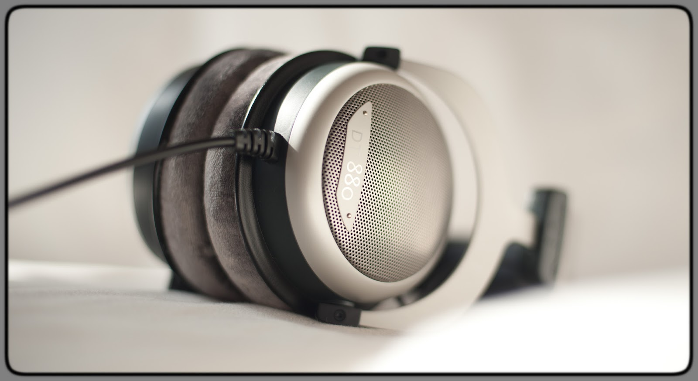

> Understanding this article requires basic knowledge of complex numbers and high-school-level electricity knowledge.

Special thanks to Engineer Mr. Xu from XK-Audio for his patient guidance; and to amirm, the moderator of [AudioScienceReview Forum](https://audiosciencereview.com), for authorizing the usage of his measurements, which made this article possible.

Essentially, headphone drivers are just electric components, and headphone systems are just complex circuits. To analyze the electroacoustic performance of headphone drivers, we can consider all the components from the last stage of amplifier to the headphone driver as an active local circuit. This article will unveil one of the most important parameters of headphones — **the impedance**.

# Impedance and Impedance Curve

**Impedance** describes the opposition that an electronic component presents to the flow of current. It consists of **resistance** and **reactance**, where reactance is further divided into **inductive reactance** and **capacitive reactance**. Impedance can be described mathematically as follows:

$$
Z=R+jX=R+j(X_L+X_C)\\
|Z|=\sqrt{R^2+X^2}
$$

Where Z is impedance, R is linear resistance, X is reactance, $X_L$ is inductive reactance, $X_C$ is capacitive reactance, and j is the imaginary unit $\sqrt{-1}$. All these quantities are measured in ohms (Ω). Impedance is a complex number, with its real part being resistance and its imaginary part being reactance. The magnitude of impedance reflects the extent to which a component opposes the flow of current.

For dynamic and planar magnetic headphone drivers, the capacitive reactance is usually much smaller than the linear resistance and inductive reactance, i.e., $X\approx X_L$. Therefore, the impedance of headphones can be approximated as being composed only of resistance and inductive reactance, i.e.,

$$|Z|=\sqrt{R^2+X_L^2}$$

Inductive reactance is the opposition to current flow caused by inductance and is positively correlated with the rate of change of current. Therefore, the frequency of electric signal affects the inductive reactance, which in turn affects the impedance. The relationship between signal frequency and impedance is known as the **impedance curve**.

>   
> **Guess which headphone's impedance curve it is!** The answer will be revealed at the end of the article.

# Impedance of Planar Magnetic Headphones

Planar magnetic headphones use conductive traces printed on a diaphragm and drive the diaphragm using electromagnetic induction. A planar magnetic headphone driver consists of magnets and a diaphragm with conductive traces. The magnets produce a magnetic field, and the conductive traces carry the signal current, which creates a force that drives the diaphragm, causing it to vibrate and produce sound. The following images show two typical planar magnetic driver structures.

In the second image, the conductive traces and magnetic field lines are perpendicular to each other, and the current flowing in the direction shown generates a downward force. Because the vibrating part of planar magnetic headphones is very light, the conversion of electric energy to mechanical energy is minimal, resulting in very low inductive reactance. Therefore, the impedance of most planar magnetic headphones is almost equal to their linear resistance. Since linear resistance is not affected by the signal current frequency (as it's called "linear"), the impedance curves of most planar magnetic headphones are flat.

  

The impedance curve of HIFIMAN Susvara is flat.

  

However, not all planar have perfectly flat impedance curves, as seen with the DCA Expanse.

# Impedance of Dynamic Headphones

Dynamic headphones bind a voice coil to a diaphragm and use electromagnetic induction to drive the voice coil, which in turn drives the diaphragm. A dynamic driver consists of a magnet, a voice coil, and a diaphragm. The magnet produces a magnetic field, and the voice coil carries the signal current, generating a force that drives the diaphragm, causing it to vibrate and produce sound. The following images show a typical structure of dynamic driver.

As shown in the images, the voice coil acts the same like all coils which exhibit self-inductance. Additionally, the vibration of dynamic drivers cuts through the magnetic induction line more than planars, resulting in significant inductive reactance. Since inductive reactance is affected by signal frequency, the impedance curves of dynamic headphones are not flat.

As shown, the impedance of the Beyerdynamic dt880 (600 Ω) fluctuates significantly with frequency.

You may notice that early premium dynamic headphones generally had higher impedance, such as the hd600 and dt880. This is because early headphone amplifiers had high output impedance, making it quite inefficient to drive low-impedance headphones due to the voltage division principle of series circuits. Therefore, some headphones increased their resistance by reducing the wire diameter, to subsequently increase impedance. Additionally, the materials and craftsmanship of early dynamic diaphragms, voice coils, and magnets were not as advanced as today, so increasing the number of voice coil results in the enhancement of the response to magnetic, and significantly increased resistance and self-induction effects.

## Resonance and Self-Induction in Dynamic Headphones

You may have noticed a great peak in dt880's impedance curve at low frequencies. This is because dynamic drivers tend to resonate near certain frequencies, causing a large amount of electromagnetic and mechanical energy to convert back and forth. This phenomenon is known as **resonance**, and the frequency at which it occurs is the resonant frequency, aka **f0**, which is of great interest to audiophiles and acoustic engineers.

Severe resonance can cause both frequency response defects and nonlinear distortion. Therefore, in headphone design, resonance is often suppressed by increasing damping, enhancing diaphragm stiffness, and enlarging the diaphragm area. Increasing resistance can also "dilute" the effect of resonant inductive reactance.

According to Engineer Mr. Xu from XK-Audio, the first generation of Avalon headphones, similar to the dt880, experienced a significant increase in impedance at certain low frequencies due to resonance, negatively affecting sound quality. The second generation of Avalon learned from the first generation's experience, increased resistance, and used an ultra-large diaphragm (d = 70 mm) to make the impedance curve flatter, resulting in a high-impedance dynamic headphone.

Returning to the impedance curve of dt880, you may also notice an upward trend in impedance at high frequencies. This is because (higher frequency + more turns in the voice coil) -> (more pronounced the self-induction effect of the voice coil) -> (greater inductive reactance) -> (more pronounced high-frequency rise in the impedance curve).

These two effects will also cause the voltage sensitivity calculated from impedance and power sensitivity to be lower than the actual situation. Therefore, when evaluating the "difficulty" of driving dynamic headphones, voltage sensitivity is more meaningful than power sensitivity. The calculation method and derivation process can be found in ths article [_The Algebraic Relationship Between Sensitivity and Impedance_](./Algebraic%20Relation%20between%20Sensitivities%20and%20Impedance.md)

The impedance curves of some modern dynamic headphones can be flatter, such as the Aune AR5000.

# Does Output Impedance Affect Frequency Response Curves?

**In most cases, no.** The frequency response distortion caused by the high output impedance of tube amplifiers is negligible!

> The following section can be skipped by general readers. There is an old Chinese saying: "To know what is so, and to know why it is so." This section is for true audiophiles.

## Algebraic Relationship

The output section of an amplifier and the headphone driver form a series circuit, causing the voltage distribution across the headphone unit to vary at different frequencies. If the impedance curve, linear resistance, and frequency response curve of the headphone and the tube amp are known, we can accurately calculate the frequency response of the headphone on this tube amp.

If at a certain frequency, the linear resistance of the headphone is $R$, the reactance is $X$; the linear resistance part of output impedance the tube amp is $r$, and the reactance is $x$, then while under the same total equivalent voltage, the decibel sound pressure level, aka dBSPL, driven by the tube amp will be:

$$-10lg\frac{(R+r)^2+(X+x)^2}{R^2+X^2}$$

If the linear resistance of a certain headphone is $R$, and the linear resistance part of the output impedance of a certain tube amp is $r$; at 1 kHz, the reactance of the headphone is $X_1$, and the reactance part of the output impedance of the tube amp is $x_1$; at frequency f, the reactance of the headphone is $X_2$, and the reactance part of the output impedance of the tube amp is $x_2$. Then, when the tube amp and a regular low-output-impedance headphone amp drive the same headphone to same dBSPL at 1 kHz, the dBSPL driven by the tube amp at frequency $f$ will be:

$$-10lg\frac{(R^2+X_1^2)((R+r)^2+(X_1+x_1)^2)}{(R^2+X_2^2)((R+r)^2+(X_2+x_2)^2)}$$

## Derivation Process

> Understanding the following derivation process requires understanding [_The Algebraic Relationship Between Sensitivity and Impedance_](./Algebraic%20Relation%20between%20Sensitivities%20and%20Impedance.md) and knowledge of AC circuits.

Given that at a certain frequency, the linear resistance of the headphone is $R$, and the reactance is $X$; the linear resistance part of the output impedance of the tube amp is $r$, and the reactance is $x$.

First, we find the total impedance of this local circuit
$Z_{total}$ (j is the imaginary unit $\sqrt{-1}$):

$$Z_{total}=R+jX+r+jx=(R+r)+j(X+x)$$

Then, the ratio of the equivalent voltage $U$ on the headphone to the total voltage $U_{total}$ is:

$$\frac{U}{U_{total}}=\frac{|R+jX|}{|Z_{total}|}=\frac{\sqrt{R^2+X^2}}{\sqrt{(R+r)^2+(X+x)^2}}$$

Based on the definition of dBSPL and the proportional relationship between sound pressure and equivalent voltage, we can obtain the difference in dBSPL driven by the tube amp and the dBSPL when the entire voltage is applied to the headphone:

$$\Delta I=20lg\frac{\sqrt{R^2+X^2}}{\sqrt{(R+r)^2+(X+x)^2}}=-10lg\frac{(R+r)^2+(X+x)^2}{R^2+X^2}$$

This is the difference in dBSPL driven by the tube amp and a regular low-output-impedance headphone amp.

---

Given that the linear resistance of a certain headphone is $R$, and the linear resistance part of the output impedance of a certain tube amp is $r$; at 1 kHz, the reactance of the headphone is $X_1$, and the reactance part of the output impedance of the tube amp is $x_1$; at frequency f, the reactance of the headphone is $X_2$, and the reactance part of the output impedance of the tube amp is $x_2$.

With the experience from the previous problem, we can directly find the differences in dBSPLs driven by the tube amp and a regular low-output-impedance headphone amp at 1 kHz and frequency f, $I_1$ and $I_2$ respectively:

$$
I_1=-10lg\frac{(R+r)^2+(X_1+x_1)^2}{R^2+X_1^2}\\
I_2=-10lg\frac{(R+r)^2+(X_2+x_2)^2}{R^2+X_2^2}
$$

From $I_1-I_2$, we get:

$$\Delta I=-10lg\frac{(R^2+X_1^2)((R+r)^2+(X_1+x_1)^2)}{(R^2+X_2^2)((R+r)^2+(X_2+x_2)^2)}$$

This is the difference in dBSPL driven by the tube amp and a regular low-output-impedance headphone amp at frequency $f$ when both drive the headphone to the same dBSPL at 1 kHz.

## Frequency Response Simulation

Based on the above principles, we can use code to simulate the effect of output impedance of tube amps on headphone frequency response.

  
[tube amp simulator.py](../../analysis%20tools/tube%20amp%20simulator.py)

In this program, I used the frequency response and impedance curve of the Beyerdynamic dt1990 measured by amirm from ASR Forum and reduced the overall linear resistance by 230 Ω to create a hypothetical "low-impedance dt1990" to **amplify the effect of output impedance on headphone frequency response**. I also assumed a tube amp with an output impedance of $Z=300+0.01*frequency+100/frequency$ (very few tube amps have such high output impedance nowadays).

We then get the following output, where the blue line is the original frequency response of our hypothetical "low-impedance dt1990", and the red line is the frequency response of the "low-impedance dt1990" driven by a high-output-impedance tube amp.

What? You mean, where's the red line? 😀

# Answer Revealed

Thanks for reading this far, you are true audiophiles! Let's reveal the answer to the question at the beginning:

>   
> **Guess which headphone's impedance curve this is!**

**It's ATH-R70x with super cool super high super varied impedance curve!**
