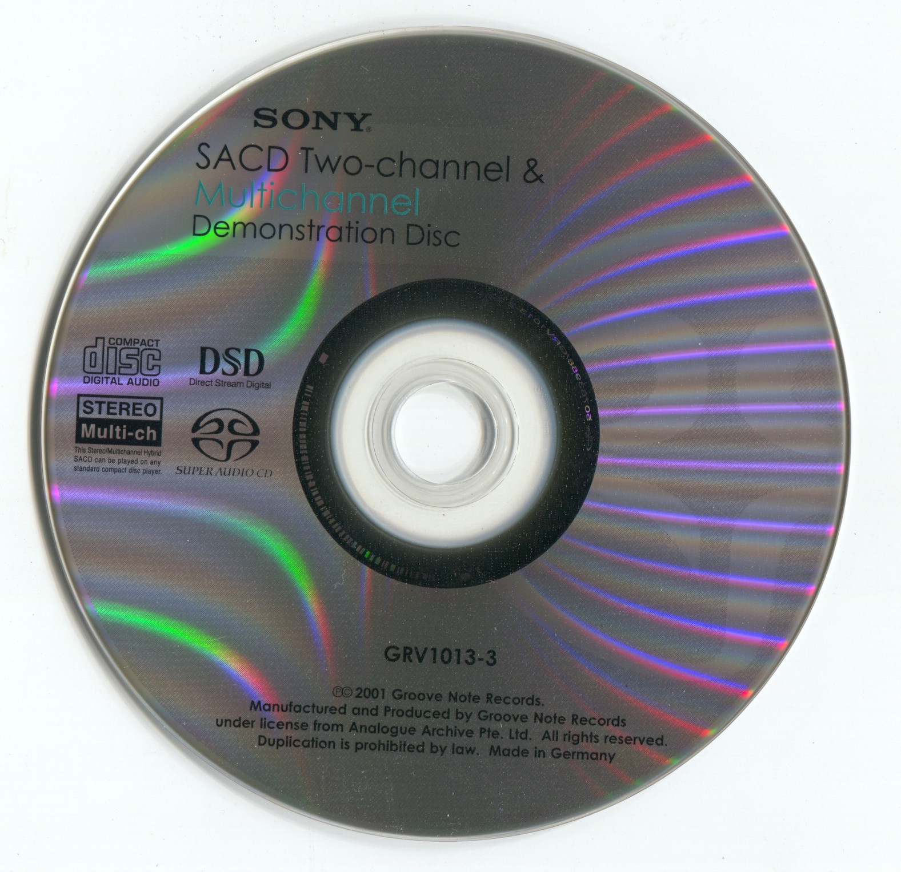

# Encoding of Digital Audio

Sound is vibration. Regardless of its form, modern digital audio storage fundamentally involves recording continuous waves as discrete sampling points. The process of converting a continuous analog signal into a digital signal includes **sampling**, **quantization**, and **encoding**, accomplished by ADC (Analog-to-Digital Converter).

> To playback digital audio, digital signal must be converted back into analog signal. This process is the inverse of encoding and is referred to as decoding, performed by DAC (Digital-to-Analog Converter). The performance of modern ADC and DAC is great, they are usually no longer bottlenecks in music production or playback systems.

Digital audio can be encoded using two main methods: **PCM** (Pulse Code Modulation) and **DSD** (Direct Stream Digital). **The fundamental difference between PCM and DSD lies in how sampling points are recorded.**

The vast majority of digital audio is encoded in PCM format. PCM encoding describes vibration by **recording the deviation of sampling points from a reference position at a constant frequency**. Its precision depends on two factors: **bit depth** and **sampling rate**. Audio metadata such as 16bit/44.1kHz, 24bit/96kHz, or 32bit float/48kHz refers to bit depth/sampling rate.

Bit depth defines the precision of the vibration amplitude, represented by the scale on the y-axis in the diagram. Bit depth determines the ratio between the smallest and largest signals that digital audio can represent, known as the **dynamic range**. A 16-bit depth can represent $2^{16}$ amplitudes, providing a dynamic range of 96dB, while 24-bit depth can represent $2^{24}$ amplitudes, resulting in a dynamic range of 144dB...

> The vast majority of the audio we use has integer bit depth, and there is a PCM audio encoding specification that uses floating point bit depth. The bit depth and dynamic range of this audio are almost unlimited, but due to the huge cost of computing and storage, it is basically only seen in audio production and signal processing.

Sampling rate defines the precision of the time scale, represented by the density of sampling points on the x-axis in the diagram. The sampling rate determines the maximum frequency that can be accurately reproduced, known as the bandwidth limit. According to the Nyquist sampling theorem, the highest frequency that can be reproduced undistorted is half the PCM sampling rate. For example, 44.1kHz audio can reproduce frequencies up to 22.05kHz, while 48kHz audio can reproduce frequencies up to 24kHz... All beyond the highest frequency that human can hear, 20kHz.

> The odd figure of 44.1kHz is a historical artifact of early digital recording formats. The huge success of CD kept it alive till today. Nowadays, the HD Audio specfication suggests using 48kHz, but music labels still prefer 44.1kHz, mainly to maintain compatibility with CD sales. 

DSD is a higher-spec digital audio encoding format. It describes vibration by **recording the directional deviation of each sampling point from the previous point at a super high frequency**. Since each DSD sampling point contains only the information + or -, its precision depends solely on the sampling rate. Therefore, DSD is also called 1bit audio, but it's fundamentally different from PCM. DSD's sampling rate and information density are typically much higher than PCM, providing almost unlimited dynamic range. However, due to its enormous file size and weak dsp support, DSD remains a niche format primarily for audiophiles.

# Storage and Transmission of Digital Audio

Digital audio files often require compression to balance file size, audio quality, and decoding complexity. Compression is divided into two types: lossless compression and lossy compression. **The distinction lies in whether the compression process is reversible.**

Uncompressed digital audio formats include **wav**, **aiff**, **dsf** (DSD), and **dff** (DSD). These formats have large file sizes but incur no decompression performance overhead during playback. Lossless compression formats include **flac**, **alac**, and **dst** (DSD). These formats reduce file size by reversibly compressing audio data without any loss in sound quality. Lossy compression formats, such as **mp3**, **aac**, **ogg**, and **MQA**, irreversibly compress audio data significantly based on psychoacoustic models to reduce file size. Advanced lossy compression algorithms can achieve perceptually lossless results at sufficient bitrates. Some formats such as **flac** can also store metadata like album covers, lyrics, and other information.

Streaming audio requires trade-offs between sound quality, wireless stability, and latency, so is more complex than local playback. This is one limitation of audio playback over Bluetooth. With the explosive growth of TWS market, companies like Qualcomm and Sony have developed and iterated on audio transmission protocols like **aptX** and **LDAC**, which has significantly improved the overall quality of wireless audio playback.

Digital audio can also be stored on physical media such as CD, SACD, or DVD. CD is optical discs designed for storing 16bit/44.1kHz stereo audio and remain the most common physical audio medium. SACD (Super Audio CD) is higher-spec digital audio carrier that is compatible with regular CD while also recording DSD and supporting up to six channels. SACD includes copyright protection mechanisms and typically require certified devices to play. CD and SACD can be **losslessly extracted**, meaning they can be transcribed and copied without degrading audio quality.

