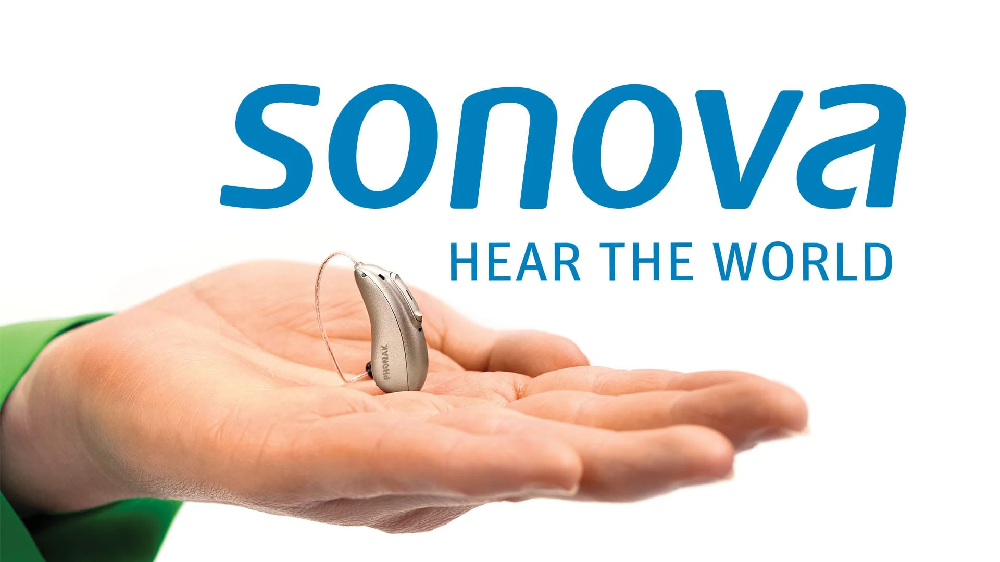
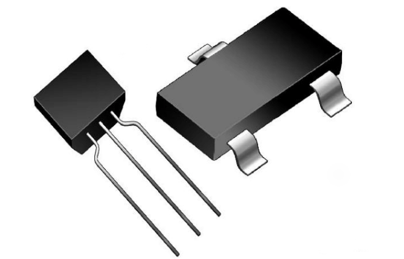
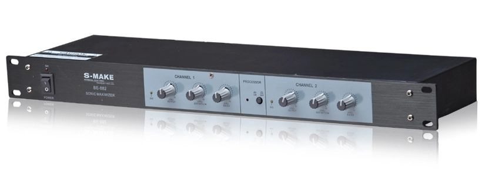

Headphone amplifiers amplify analog signal to drive headphones. This article will introduce some advanced knowledge of headphone amps for those who are interested in electroacoustics, and help you better choose the right headphone amp for you.

/15.jpg>)  
Amplifier doesn't have to be a box or box with bulbs plugged on it. It's built in every audio device used to drive headphones.

# Output Power

One of the most important metrics of a headphone amp is its output power. This section explains specific impacts of output power and its significance for audiophiles to choose headphone amp, as well as explaining the concept of gain.

## What is output power?

**Maximum Undistorted Output Power** = the maximum output power of an headphone amp when THD+N is < 1% or 0.1%.

When driving a headphone whose impedance is over 32Ω, the maximum undistorted power of an amp will usually be lower with higher impedance, which indicates that the amplifier's maximum output voltage is limited. Below 32Ω, the power of an amp may be lower with lower impedance, which indicates that the maximum output current of the amp is limited.

**The power of an amp represents its ability to output voltage, current, and energy.**

---

Headphones with lower sensitivities require more power and voltage. Clipping distortion will occur when power of the headphone amp is not enough to meet the headphone's need to reach a certain loudness.

There are two types of clipping distortion: hard clipping and soft clipping. When hard clipping occurs, the vibration over a certain limit is like being clipped; soft clipping will be smoother in the transition of the clipping amplitude, and the degradation of the listening experience is less obvious. Hard clipping often occors when a transistor amp is experiencing current or voltage overload. Soft clipping happens in the same situation on tube amps.

Since vacuum tubes have lower native distortion than transistors and higher voltages (you read that right), they are ideal for use in high-end systems to drive high resistance headphones. As electrostatic headphones are essentially a type of headphone with ultra-high impedance, low power requirement, and extremely high voltage requirement, they are also very suitable for tube amps, such as Sennheiser Orpheus and Hifiman Shangri-La.

**It is worth noting that the maximum undistorted output power labeled by the manufacturer is usually measured at 1000hz. Output power in other frequency varies**.

## What is the use of output power?

**How much power does it take to drive a certain headphone?** There is no standard answer to this question.  
**Can a certain headphone amp drive a certain headphone?** As long as user enjoys music at a healthy volume, 99.9% of the time the amp is able to drive the headphone.

---

**Clipping distortion is not a concern in 99% of cases.**

The vast majority of digital audio for human listening is only 16bit deep, which means that the maximum loudness of music without quantization noise is only 96dB. As long as you listen to music at a volume above 96dB for one second, you may be able to hear that noise in the quietest part of the music.

Don't say that some classics with super high dynamic range may reach 110dB instantaneous loudness. There won't be a single moment of music you listen to on headphones that can reach the loudness of an airplane taking off. If it does, then Sennheiser is not what you need, what you need is Sennheiser's old man.

Nowadays, there are more and more low-cost, small-sized, low-distortion, powerful headphone amps on the market, and even entry-level usb dongles can easily drive most headphones above 96dB. Theoretically, the 5 grams Fiio JA11 can drive HD800s to 102dB.

So what's the point of pursuing big thrust?

---

**Loud enough = be able to drive ≠ be able to drive well**

**More output power is not for more loudness, but for better distortion performance at normal volume levels.** For example, if a 800mW@32Ω amplifier and a 400mW@32Ω amplifier with similar design are connected to the same headphone and output the same volume, although they both output 1mW, the distortion performance of the former is more likely to be better than that of the latter.

This is because the nature of the amplifier is a transistor-based signal transmission device, and the linear relationship between the input and output of transistor triode tends to deteriorate as the signal strength increases, so the distortion of the amplifier tends to be more significant as the signal increases.

In other words, **more powerful, less distortion**. This is one of the reasons why veteran audiophiles used to loud volumes are more likely to hear the difference between amps than average audiophiles. The louder the volume is turned up, the more noticeable the differences in the performance of headphone amps are.

**This section does not apply to tube amps and Class D amplifiers.**

## Characteristics of various headphone loads

Headphones vary greatly in sensitivity and impedance characteristics, so performs very different when being driven. As a result, headphone amps produce different distortion characteristics when driving different headphones, which is the origin of statements like “xx amp can't drive a planar headphone well, but performs good with a high-impedance dynamic headphone”, etc. The following table shows some examples of typical headphone loads. The following table shows some examples of how some typical headphones require amps.

| Headphone     | Load                                                                  | Voltage Demand | Current Demand |
| ------------- | --------------------------------------------------------------------- | -------------- | -------------- |
| Empty Load    | Equal to open circuit                                                 |                |                |
| HD800s、HD600 | Dynamic headphone with high impedance                                 | ⭐⭐⭐⭐⭐     | ⭐             |
| Utopia        | Dynamic headphone with low nominal impedance but high peak impedance  | ⭐⭐⭐⭐       | ⭐             |
| AR5000、FT1   | Dynamic headphone with low nominal impedance and flat impedance curve | ⭐             | ⭐⭐           |
| MM100         | Planar headphone with low impedance and high power sensitivity        | ⭐             | ⭐⭐           |
| Edition XS    | Planar headphone with low impedance and lower power sensitivity       | ⭐             | ⭐⭐⭐         |
| Susvara       | Planar headphone with low impedance and super low power sensitivity   | ⭐⭐⭐         | ⭐⭐⭐⭐⭐     |

As you can see, different types of headphones have different demands on various capabilities of amps. Among them, dynamic headphones with high nominal impedance or peak impedance are expecially voltage-demanding. Though some planar headphones such as the Susvara, which is known as super hard to drive, have lower voltage sensitivity than traditional high-impedance dynamic headphones such as the HD800s, the latter may have higher voltage demand. This is because high-impedance dynamic headphones tend to have significant inductance. The inductance brings significant back electromotive force while being driven, and leads to phase problem. To ease this phase problem, higher voltage output capacity of headphone amps is required to drive these high-impedance dynamic headphones.

## How to drive a headphone "well"?

Audiophiles argue about how much power is required to drive a headphone well. There's a rumor that “Headphones are harder to drive in bass and have fewer bass with not enough power.”

In fact, most headphone amps don't change the fr (frequency response) of headphones. Bass strength doesn't vary with power.

  
[_Is iPhone able to drive HD800s?!_ - Zhihu 村姑阳子](https://zhuanlan.zhihu.com/p/51180207)

This rumor comes from various reasons. First of all, energy of music concentrates in low frequencies, so it's easier to notice the distortion performance in bass.

[.png>)  
.png>)](../../analysis%20tools/power%20analysis%20of%20music.py)  
The energy distribution in frequencies of Hotel California supports this.

On the other hand, dynamic headphones are prone to resonance at low frequencies, resulting in a sharp increase in inductive reactance. A peak in the impedance curve (f0) indicates the phenomenon, which may leads to increased phase shift in specific frequency bands. If the amplifier's control over this phase distortion is bad, it may produce a weird listening experience.

---

The essence of **"Is xx amp able to drive xx headphone well?"** is actually audiophile's subjective evaluation of the sound of a headphone system, which current development of psychoacoustic is unable to tell. Not yet any objective standard. The so-called “over-drive 过推” and “can't drive well” are essentially the same, just the words of audiophile who's not satisfied with a certain headphone system.

Again, **Loud enough = be able to drive ≠ be able to drive well**. Building a Hi-Fi headphone system is an example of Cannikin's law. In 99% of cases, amp is not the shortest board, while headphone is.

  
[《【茶音社 HIFI 月报】北京耳机展特别作战记录！（上篇）》- Bilibili](https://www.bilibili.com/video/BV1HG411R7bb)

## What is gain?

There's a huge difference in the sensitivities of different speakers and headphones, and to make them reach a certain volume, the volume knob is often screwed to an extreme position, which is not only inconvenient, but also prone to sound bias caused by potentiometer at low volumes.

For this reason, it is common for modern amplifiers to have both gain and volume adjustments. **The purpose of gain is to provide right volume range for speakers and headphones of all sensitivities**.

The graph below shows some of the output power parameters of Fiio K19.

We can interpret from this table that a higher gain magnifies the output power of this amp, and therefore the distortion performance may be better at the same load. However, at 16Ω load, higher gain does not increase the maximum output power. This is because the current hits the maximum before the voltage does.

We also found that the signal-to-noise ratio (SNR) is greater at higher gain, which is misleading as the SNR is measured at maximum output. With a higher signal strength, SNR is naturally higher, but at a certain volume, higher gain is usually accompanied by a higher noise floor. However, the noise floor of a modern headphone amp should be inaudible, so this is usually not a problem.

Modern headphone amps are designed in a variety of ways, so does the implementation of gain. Thus, **the exact effect of gain varies**. Since modern headphone amps generally have super low noise, there is usually no need for separate noise suppression measures for high-sensitivity headphones. **Sometimes adjusting gain is simply a matter of changing the volume adjustment step size and upper limit, with completely no effect on sound quality**.

In the case of K19, "Low", "Medium" and "High" gain are software- and affect neither distortion nor noise; while "Super High" and "Ultra High" gain are hardware-implemented as the traditional sense, and may have a real impact on the sound quality.

# Distortion

Distortion is the alteration of original signal. Distortion is the essence of the difference of headphone amps' sound.

Insufficient output power causes distortion. Enough output power is also accompanied by distortion. Where does distortion come from? How does distortion affect subjective listening experience? Read this section to unveil the distortion and the measurements of distortion.

## Frequency-Response Distortion

Frequency-response distortion (fr distortion) is a type of linear distortion, i.e., it does not produce extra frequencies which doesn't exist in the original signal. Fr distortion refers to the gain difference of frequencies. In other words, not-flat frequency response (fr) curve. Fr is one of the most basic indicators of headphone amps.

  
Fig. 1. Input signal to the amplifier.  
Fig. 2. Decomposition of the input signal.  
Fig. 3. Distorted signal.  
Fig. 4. 1dB gain difference between 100hz and 1000hz signals found by decomposing the distorted signal.

This figure shows the fr of K19. As you can see it's flat in 20-20000Hz. If K19's fr doesn't vary with load, the fr of the headphone it's driving won't change significantly either. In other words, the headphone will sound more "original".

Not all headphone amps have a flat fr. **Some unique-sounding amps which hide their fr from customers may have done some thing to it**.

## Harmonic distortion

Harmonic distortion is the most common type of nonlinear distortion. Nonlinear distortion, i.e., distortion that produce frequency which the original signal doesn't have. Harmonic distortion refers to the phenomenon that output signal contains harmonic of input frequency. Total harmonic distortion (THD) is one of the most valued indicators for modern audiophiles.

  
Fig. 1. Comparison chart of input signal and odd harmonic distorted signal.  
Fig. 2. Decomposition of odd harmonic distorted signal.  
Fig. 3. Comparison chart of input signal and even harmonic distorted signal.  
Fig. 4. Decomposition of even harmonic distorted signal.

Since harmonic distortion is rather noticable in hearing and the measurement method is very mature and easy to understand, audiophiles know pretty much about it. Thus modern "scientific" headphone amps tend to reach a very low harmonic distortion.

I heard that before the rise of Chinese "scientific" headphone amps (like Topping's and SMSL's), dac and amplifier manufacturers in China love to boast with slogans like "We applied xxx technology and reduced xxx much of harmonic distortion" so much that at that time academism audiophiles took THD as the golden rule for measuring sound quality.

---

Harmonic distortion can be divided into odd harmonic distortion and even harmonic distortion. Audiophiles generally believe that odd harmonic distortion degrades sound quality much more severely than even harmonic distortion. Some even argue that "even harmonic distortion is the source of the warm and pleasant tone of tube amps", leading to a misguided focus on this distinction. However, **the relationship between sound and subjective listening experience is extremely complex**, and all types of harmonic distortion are important factors in shaping timbre.

  
An actuator is an effect that adjusts timbre using harmonic distortion. It generate various subjective listening experiences through the combination of odd and even harmonics.

The fundamental reason that tube amps have not been replaced by transistor amps is the high linearity of vacuum tubes. Linearity is contrary to any distortion; paying for even harmonic distortion of tube amps is like buy the box and throw the pearls (an old Chinese idiom 买椟还珠). If you do enjoy the rich timbre of even harmonics, why not apply a DSP to a transistor amp system which is often cheaper with superior specifications to customize harmonic yourself?

If one blindly accepts arbitrary distinctions of superiority, scoffing at transistor amps while allowing the uncontrolled even harmonic distortion of tube amps, dubbed "tube flavor", it contradicts the original intention of High-Fidelity.

# Crossover Distortion and Thermal Drift

Crossover distortion is a type of nonlinear distortion commonly found in Class B amplifiers. To improve efficiency, this type of amplifier uses a push-pull configuration, which causes distortion at the crossover point where the output signals alternate between transistors.

Class AB amplifiers are similar to Class A at low output and similar to Class B at high output. Their efficiency is higher than that of Class A, and distortion is lower than that of Class B. Crossover distortion of Class AB is more significant at higher output.

Most speaker amps today are either Class D or Class AB. Due to headphones' lower power consumption, many of headphone amps are Class A. Class A is inefficient and consumes a lot of power, necessitating careful heat management to mitigate temperature effects on component lifespan and performance. Poor heat dissipation design can lead to damage to components like transistors or cause **thermal drift**, which occurs when performance deviates from ideal conditions due to temperature changes. However, some Class A amps like Burson Soloist Voyager, are specifically designed to operate at high temperatures and require warm-up for optimal sound quality.

  
Top: Fiio K19. Class AB, designed to work at room temperature  
Bottom: Burson Soloist Voyager, Class A, designed to work at high temperatures, requires warm-up for optimal sound quality

Human ears are highly sensitive to crossover distortion. Thus, high-end headphone amps are predominantly Class A. When having a similar cost, Class B generally provides greater output power than Class A. Due to Class B's higher efficiency, it is also less affected by thermal drift. Therefore, there is no superiority between Class A and Class B. It is only about suit or not.

# "Multitone Distortion"

I made the term "Multitone distortion" up to differentiate between simpler single-signal distortion and distortion issues that only manifest when multiple signals are involved. This section introduces distortion issues beyond harmonic distortion, clipping distortion, and noise.

---

Phase distortion is a type of linear distortion, referring to amplifier's distortion of the input signal's phase. In other words, it results in time discrepancies for various output frequencies.

  
Fig. 1. Input signal to the amplifier.  
Fig. 2. Decomposition of the input signal.  
Fig. 3. Distorted signal.  
Fig. 4. Phase difference between 100hz and 1000hz signals is found when decomposing the distorted signal.

---

Intermodulation distortion is a type of nonlinear distortion that occurs when frequencies interact, producing new frequencies which don't exist in the original signal.

  
Fig. 1. Input signal to the amplifier.  
Fig. 2. Decomposition of the input signal.  
Fig. 3. Distorted signal.  
Fig. 4. New frequencies were found when decomposing the distorted signal.

# Output Impedance

Not all voltage output from a headphone amp reaches the headphones. Some energy is absorbed by the amplifier's output impedance, leading to various issues.

High output impedance can cause fr distortion in an audio system that may not be reflected in the amplifier's fr curve. If headphones have varied impedances at different frequencies (like most dynamic headphones and a few planar headphones), then an amplifier with high output impedance will allocate less voltage to the headphones at frequencies with lower impedance, altering the overall fr of the headphone system.

The Sennheiser HDV820 is a typical headphone amp with flat fr but may experience fr distortion due to its high output impedance. Below is an excerpt from ASR Forum's HDV820 review.

Similarly, output impedance may also introduce "multitone distortion" due to its inductive, capacitive, and resistive characteristics, which could be really complex. However, it's rogue to talk about toxicity without dose. Modern transistor amps generally have very low output impedance, so these issues are minimal.

Tube amps have high output impedance, and the various distortions caused by this high output impedance contribute to the unique sound character of tube amps. Some manufacturers now employ designs like "tube preamp + transistor power amp" and impedance selection to achieve "modern sound" from tube amps.

## Distortion Measurement and Psychoacoustics

Nonlinear distortion can be categorized into many types based on its source and characteristics, each with specific indicators and measuring methods. Interpreting distortion metrics requires expertise. This section will only focus on some of the most representative indicators.

  
Audio Precision APx555, a professional audio analyzer

SINAD (signal to noise and distortion ratio) is one of the most critical indicators for headphone amps, encompassing all components of noise and distortion. SINAD under certain loads can be considered the best single measure of a headphone amp's **acoustic fidelity performance**.

However, SINAD does not represent amplifier's **psychoacoustic fidelity performance**. This is because human sensitivity varies to different types of distortion; for instance, humans are particularly sensitive to transient intermodulation and crossover distortion, but less so to phase distortion. Two amplifiers with same SINAD may produce distinctly different listening experience based on the type of distortion present.

---

**Transient Intermodulation (TIM) Distortion** is a popular concept among higher level audiophiles. This distortion typically arises from negative feedback delays and manifests in phase and nonlinear distortion issues under multitone signals, clearly seen in square wave tests.

However, square waves do not naturally occur in the real world, and pure square wave tests are not one of the methods for measuring TIM. They do not reflect any specific indicators or performance characteristics. Square wave tests serve more as a visual demonstration to showcase the amplifier's capabilities to consumers rather than a definitive measure.

Note that TIM is just one source of distortion and does not directly correspond to subjective listening experiences. For example, it includes issues like slew rate deficiency, inadequate power supply, and distortion caused by deep negative feedback, all with differing waveform characteristics. **There's no direct correlation between TIM and subjective feeling of "transients".** Sometimes, the perceived "transients" are merely the effect of certain harmonics.

  
a virtual bass transient enhancement system which has nothing much to do with TIM

Some audiophiles mistakenly take TIM as gospel, equating square wave tests with an amplifier's transient response performance, and simplistically attributing subjective impressions like "chaotic high-frequency", "weak dynamic", or "poor transients" solely to negative feedback, and conclude "'scientific' amps with good THD metrics always have poor transient response", which is highly irresponsible.

---

How one interprets various measurement metrics often distinguishes between "scientific deafs" (Those know half about electroacoustics who generally consider Hi-Fi a swindle. “科 hi” in Chinese) and "brain ampers" (Those addict to all kinds of Hi-Fi snake oils. 老烧 in Chinese). The former criticize the latter for blindly follow subjective impressions and do not believe measurements; while the latter criticize the former for blindly follow the measurements and do not believe subjective impressions... Both idiots.

The causes of distortion in headphone amps and their impacts on subjective listening experience are diverse and interrelated, and reflected in various measurements. Thus, one should view measurement metrics dialectically, avoiding blind pursuit of specific data, and not impose causality between subjective experiences and measurement indicators. This is the correct attitude toward electroacoustics, psychoacoustics, and the love towards audio.

**Hearing sound is sound, hearing sound is not sound, hearing sound is still sound.**  
**Viewing measurements as measurements, viewing measurements as not measurements, viewing measurements as still measurements.**  
(Not sure if you guys understand this, but it's a famous Chinese allegory. 看山是山，看山不是山，看山还是山)

# How to Discuss Headphone Amps with Audiofools

Discussions among audiophiles form the Hi-Fi community, which is filled with anti-intellectual rhetoric, flawed logic, hate speech, and pseudoscience. The following points is a guide to help you navigate the Hi-Fi community and engage in discussions with audiophiles.

0. ~~The most important thing when chatting with audiofools is that your equipment is more expensive.~~

1. Engage responsibly; do not assume your ears are infallible. In today's highly developed audio landscape, psychological factors significantly outweigh the differences in sound quality between devices.

2. Your ears are untrained and lack the ability to link subjective experiences to objective factors. Subjective judgments on why you hear something are often mistaken causal interpretations. Discuss subjective impressions as such and avoid oversimplified scientific explanations; if you must, use qualifiers.

3. Do not dismiss others' subjective impressions; do not assume someone is wrong simply because their perception differs from yours. Subjective impressions are influenced by psychology, environment, physiological differences, and objective sound, with no absolute right or wrong.

4. Avoid hearsay! Impressions based on hearsay are not your own; recommending equipment based on hearsay is irresponsible.

5. Unless someone seeks your advice, do not suggest they spend more money on Hi-Fi. Hi-Fi is essentially a luxury market, and financially straining oneself for it is foolish.

**We always pretend to know a lot more about audio than we really do.**

# Reference

Plomp R, Steeneken HJ. Effect of phase on the timbre of complex tones. J Acoust Soc Am. 1969 Aug;46(2):409-21. doi: 10.1121/1.1911705. PMID: 5804112.

J. Lohstroh and M. Otala, "An audio power amplifier for ultimate quality requirements," in IEEE Transactions on Audio and Electroacoustics, vol. 21, no. 6, pp. 545-551, December 1973, doi: 10.1109/TAU.1973.1162523.

Leinonen, Eero et al. “Method for Measuring Transient Intermodulation Distortion (TIM).” Journal of The Audio Engineering Society 25 (1976): 170-177.

J. Lohstroh and M. Otala, "An audio power amplifier for ultimate quality requirements," in IEEE Transactions on Audio and Electroacoustics, vol. 21, no. 6, pp. 545-551, December 1973, doi: 10.1109/TAU.1973.1162523.

Herzog, Stephan; Investigations of the Effects of Nonlinear Distortions on Psychoacoustical Measures [PDF]; TU Kaiserslautern, Kaiserslautern, Germany; Paper 7751; 2009 Available: https://aes2.org/publications/elibrary-page/?id=14947

H. Mu, W. -S. Gan and E. -L. Tan, "A psychoacoustic bass enhancement system with improved transient and steady-state performance," 2012 IEEE International Conference on Acoustics, Speech and Signal Processing (ICASSP), Kyoto, Japan, 2012, pp. 141-144, doi: 10.1109/ICASSP.2012.6287837.
