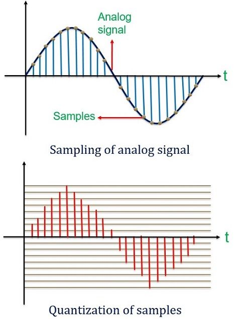
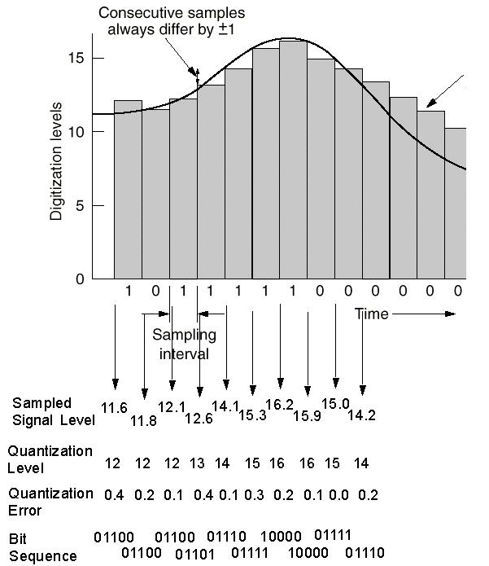
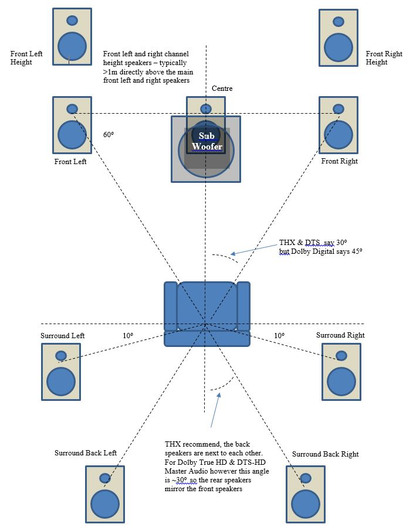
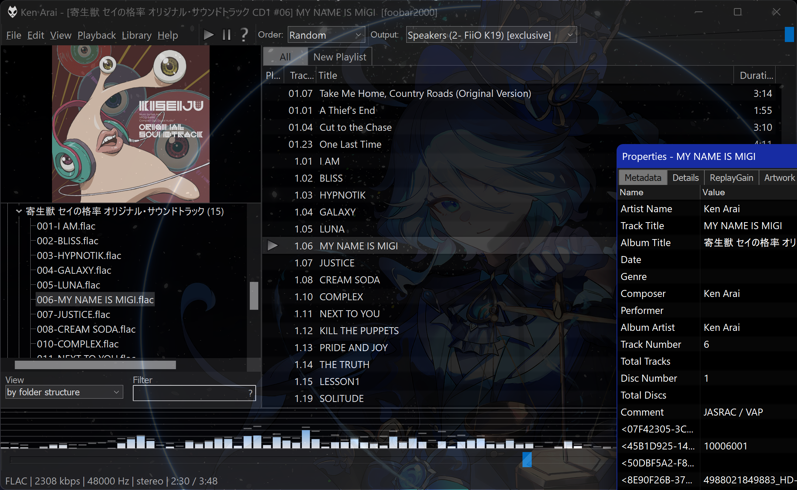
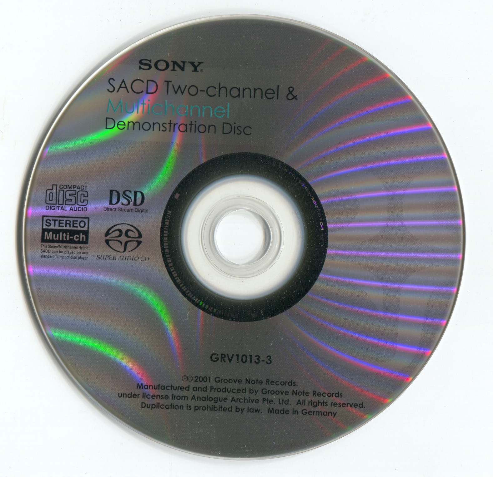
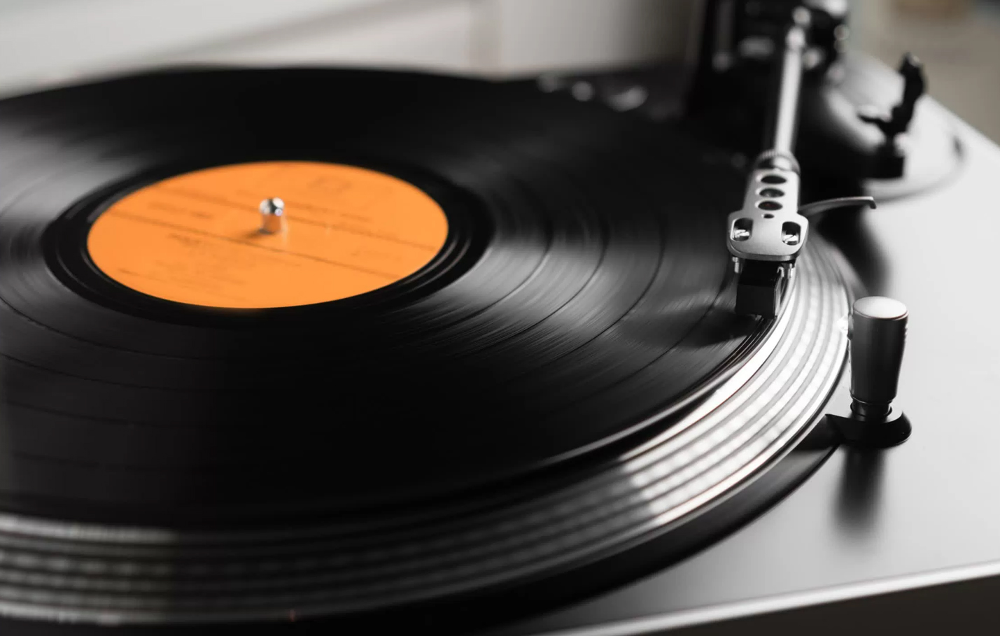
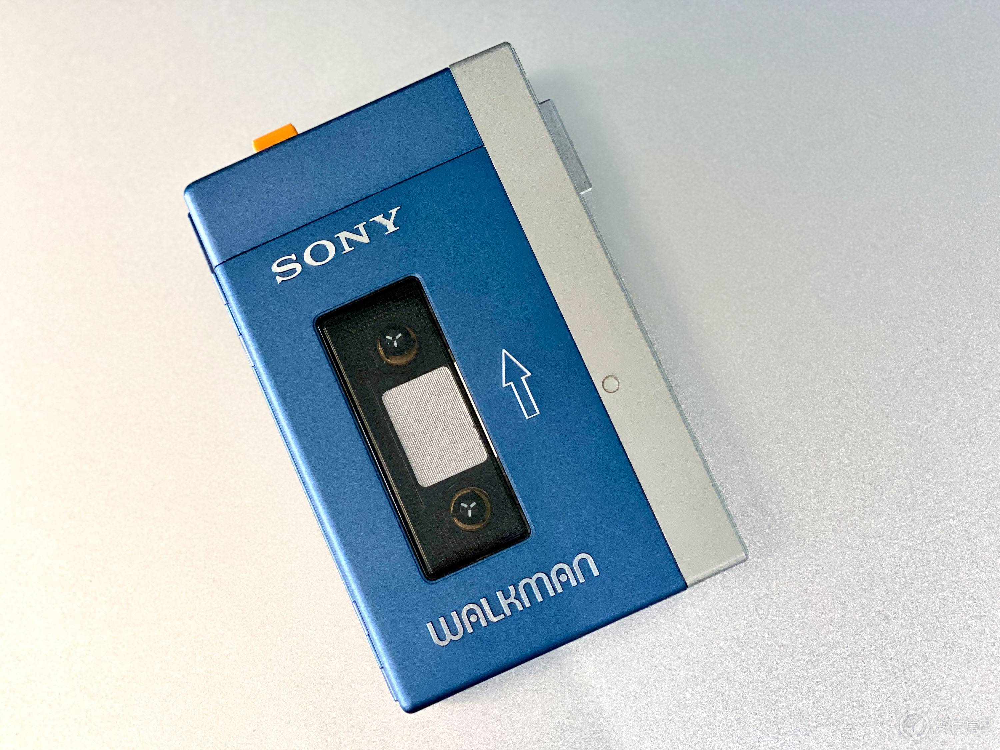

# Digitization of Sound

Sound is vibration. On modern digital media, sound is stored as a waveform signal represented by discrete sampling points. Real sound signals are continuous, while digital audio signals are discrete, leading to inevitable information loss during recording.

Most digital audio is stored as Pulse Code Modulation (PCM). PCM involves high-frequency sampling of vibrations relative to a reference position. Each sampling point can take integer values between 0 and $2^{bit depth} - 1$.

PCM has two properties: bit depth and sampling rate. Bit depth determines the precision of the amplitude scale (y-axis), affecting dynamic range. The sampling rate determines the precision of the time scale (x-axis), affecting bandwidth. Higher sampling rates and bit depths of PCM result in better sound quality.

Direct Stream Digital (DSD) is a digital audio storage format with better sound quality than PCM. DSD quantizes the original analog audio signal into 1-bit digital audio at a much higher sampling rate than PCM. Each sampling point takes two values, `+` and `-`, indicating whether the current vibration position is "advancing" or "retreating" relative to the previous position. Higher sampling rates of DSD result in better sound quality.

Similar to how a single eye cannot accurately judge the position of an object, a single audio channel cannot create a sense of space. When played back through headphones, single-channel audio can cause In-Head Localization Effect, leading to dizziness. Therefore, many audio recordings have two or more channels.

The number of channels indicates the number of positions from which the sound is recorded (or pretends to be recorded). Theoretically, multichannel audio can produce better sense of space with properly placed speakers.

Producing spatial audio requires at least two channels, aka stereo system. Most music has and only has two channels, and all standard headphones are stereo systems. Audio with more channels is more commonly used in movies and video games, which require higher spatial perception. Stereo Systems like headphones require "downmix" to replay multichannel audio, which indicates mixing multichannel audio into stereo sound through algorithm. Both PCM and DSD can store multichannel audio as multiple independent tracks.

Converting an analog signal to a digital signal requires Analog-to-Digital Conversion (ADC), and converting a digital signal to an analog signal requires Digital-to-Analog Conversion (DAC). DAC is essential for playing digital audio.

# Storage of Digital Audio

PCM and DSD are types of digital audio, not file formats. In practice, digital audio is often compressed into specific file formats using specific encoding schemes to balance file size and quality. Compression can be lossless or lossy, depending on whether the compression process is reversible and whether any data is lost. Generally, in terms of sound quality: Uncompressed = Lossless > Lossy. In terms of file size: Uncompressed > Lossless > Lossy.

Common formats for PCM audio files include **wav** and **aiff**, which do not compress audio data, resulting in larger file sizes. Lossless compression formats for PCM include **flac** and **alac**, which reduce file size without losing sound quality. Lossy compression formats for PCM include **mp3**, **aac**, and **ogg**, which further reduce file size but at the expense of sound quality. Some audio file formats, such as flac, can store metadata like cover art, lyrics, and album information, etc.

> The improvement of DAC, the fact that bandwidth and network traffic has become one of the crucial costs and the bottleneck of streaming media, and copyright protection has now gained more attention, together led to the creation of Master Quality Authenticated (MQA), a highly compressed audio encoding format compatible with CD format. MQA compresses flac files by "folding" the original PCM lossily, attempting to store higher quality audio at lower bitrates, with some mechanisms to protect file copyright. Thus, it used to be favored by streaming services like Tidal.
>
> However, complete unfolding of MQA files requires supported MQA decoders, otherwise, sound quality is further compromised. The principle that "Lossless > Lossy" still applies to MQA. Currently, with MQA's parent company going bankrupt, various music platforms and producers are now abandoning it.
>
> 

Common formats for DSD audio files include dsf and dff. DSD files are usually much larger than PCM files and require better production and decoder, making them much less common than PCM. However, DSD can theoretically provide an extremely high sound quality.

Digital audio can also be stored and played using physical media like CD and SACD. CD uses the 16 bit/44100 Hz stereo PCM format and is the most common physical audio carrier. SACD (Super Audio CD) is a higher quality digital audio carrier that supports up to six channels. SACD carries high quality DSD, but is backward compatible with regular CD.
SACD has copyright protection features and can only play DSD on SACD-compatible machines. Ordinary CD players can only read the CD layer, but SACD players usually also support playing regular CD. Through "ripping", CDs and SACDs can be losslessly converted to PCM or DSD files.

# Analog Audio

Analog audio is a very old storage format. It stores sound in the form of an analog signal, avoiding discrete sampling of sound. Vinyl records and tapes are two common carriers of analog audio. Both have relatively poor stability and higher background noise compared with digital medias, but they still have a market among audiophiles.

Vinyl records use mechanical engravings to record sound. The sound signal is converted into spiral grooves carved on the record's surface by a cutting knife. During playback, the stylus travels along the grooves, converting mechanical vibrations into electrical signals, which are then restored to sound through the sound system.

Tapes use magnetic materials to record sound signals and come in reel-to-reel and cassette tape forms. Reel-to-reel tapes were typically used in professional recording and production fields, offering higher sound quality and longer lifespan. Cassette tapes were widely used in consumer electronics markets and were popular in the 70s to 90s due to their portability.

Analog audio does not require DAC but needs corresponding analog audio equipment, such as turntables and tape players to play.
