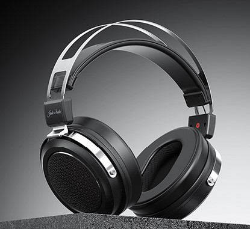

本文于 11 月 1 日预发布于 CC98，未来三日内将会在 [GitHub > Sound-Library > 2023 双十一头戴式耳机选购攻略](https://github.com/Sha1rholder/Sound-Library/blob/main/zh-CN/2023%E5%8F%8C%E5%8D%81%E4%B8%80%E5%A4%B4%E6%88%B4%E5%BC%8F%E8%80%B3%E6%9C%BA%E9%80%89%E8%B4%AD%E6%94%BB%E7%95%A5.md) 更新未完成的部分，由于 CC98 对 markdown 的语法支持不是很好，**推荐在 GitHub 阅读以获取最佳体验**

斥资 5.5w 写成的全网最专业的头戴式耳机选购攻略，所有耳机本人均自费购买仔细聆听过或厂家送测（无利益相关）。昨天因为一些不文明用语问题导致 LZ 被禁止在数码版面发帖，因此发在这个版面。希望本期攻略的内容值得你的留言，也欢迎在帖子下方提问任何声学相关问题

本文脱胎于 GitHub 知识库 [Sound-Library](https://github.com/Sha1rholder/Sound-Library) 的构建过程 ，该库旨在帮助发烧友、音乐爱好者以及游戏玩家了解声学知识，优化声音环境，塑造正确科学的听音观，不至于被网上良莠不齐的信息误导。如果你想进一步了解、优化自己的听音环境，或单纯对声学知识感兴趣，欢迎给这个施工中的知识库点个 Star

先收藏/Star，再跳着看。本期攻略相当硬核，内容量极大，如果哪一部分看不明白再翻翻前面的，本文主要评测有线耳机，基本按照价格顺序排列。无线耳机仅仅评测了这个领域的最佳耳机，因为其实没啥性价比——要在预算内购得一款质量和实用性上乘的耳机，其实有线的性价比会高得多

- [以原道为例的基础知识](#以原道为例的基础知识)
- [头戴式降噪耳机 Top1 · Sony WH-1000XM5](#头戴式降噪耳机-top1--sony-wh-1000xm5)
- [无线游戏耳机 Top1 · Audeze Maxwell](#无线游戏耳机-top1--audeze-maxwell)
- [HiFi 0 门槛 · Philips SHP9500](#hifi-0-门槛--philips-shp9500)
- [飞傲 JT1（即将上市）](#飞傲-jt1即将上市)
- [物如其名 · 水月雨 Joker](#物如其名--水月雨-joker)
- [黑得有多惨，卖得有多好 · Audio-Technica ATH-M50x](#黑得有多惨卖得有多好--audio-technica-ath-m50x)
- [索狗最有厨力的一集 · Sony MDR-CD900ST](#索狗最有厨力的一集--sony-mdr-cd900st)
- [“HiFi 三剑客”大手办 · AKG K701](#hifi-三剑客大手办--akg-k701)
- [Beyerdynamic DT Series](#beyerdynamic-dt-series)
	- [本期测试全场最佳！· Byerdynamic DT 700 Pro X](#本期测试全场最佳-byerdynamic-dt-700-pro-x)
	- [“HiFi 三剑客”均衡之最 · Beyerdynamic DT 880 (250 Ω)](#hifi-三剑客均衡之最--beyerdynamic-dt-880-250-ω)
	- [“哪个傻逼用 HiFi 耳机打游戏？”· Byerdynamic DT 990 Pro](#哪个傻逼用-hifi-耳机打游戏-byerdynamic-dt-990-pro)
- [水平板的成熟之作 · 水月雨 Para](#水平板的成熟之作--水月雨-para)
- [Sennheiser HD6xx Series](#sennheiser-hd6xx-series)
	- [“HiFi 三剑客”最经典的耳机，没有之一 · Sennheiser HD 600](#hifi-三剑客最经典的耳机没有之一--sennheiser-hd-600)
- [国产动圈 Top1 · 飞傲 FT3](#国产动圈-top1--飞傲-ft3)
- [Audio-Technica ATH-R70x](#audio-technica-ath-r70x)
- [头戴式杜比影厅 · VZR Model One](#头戴式杜比影厅--vzr-model-one)
- [国产平板巅峰之作 · HIFIMAN Edition XS](#国产平板巅峰之作--hifiman-edition-xs)
- [混音师 · Shure SRH1840](#混音师--shure-srh1840)
- [重塑经典 · Audeze LCD-1](#重塑经典--audeze-lcd-1)
- [UltraSone Edition 11](#ultrasone-edition-11)
- [音乐精灵 PMH-1](#音乐精灵-pmh-1)
- [HiFi 耳机 Top1 · Senheiser HD 800 S](#hifi-耳机-top1--senheiser-hd-800-s)
- [瞎写两笔](#瞎写两笔)
- [鸣谢](#鸣谢)

# 以原道为例的基础知识

  
https://detail.1688.com/offer/521792513665.html

  
https://zhuanlan.zhihu.com/p/97706759

> 频响曲线图，不标注则默认来源为 [autoeq.app](https://autoeq.app) 网站。下图以 Senheiser HD 800 S 的频响为例介绍如何初步解读频响曲线
>
>   
> x 轴是频率，单位是 Hz；y 轴是特定频率下产生声音的相对强度，单位为 dBr
>
> - Raw，原始频响曲线。此结果为测试者测得的耳机原始频响曲线
> - Error，偏差曲线。此结果为原始曲线和目标曲线的偏差，Error 在某个频段越高则意味着相对于目标曲线，这款耳机更突出这一频段；反之则越削弱这一频段。Error 曲线越平直通常意味着这款耳机的频响越接近目标曲线
> - Target，目标频响曲线。不同的测试者可能会参考不同的目标曲线，如 Rtings 测试团队可能会使用 _Rtings Harman Over-ear 2018_ 而 Ordinary1990 倾向于 _Harman Over-ear 2018_，本文均使用原测试者的默认目标曲线。关于什么是目标曲线可以参考这篇文章：[什么是哈曼曲线 _Harman Target Curve_ - 知乎](https://zhuanlan.zhihu.com/p/65228980)
> - Equalizer，EQ 曲线。此结果为使用均衡器软件对原始曲线进行的补偿，一般就是低频较少则补偿低频，高频较多就压制高频。本文均使用 EqualizerAPO GraphicEQ 方法
> - Equalized，EQ 后曲线。此结果为将 EQ 曲线和原始曲线叠加后的结果，这条曲线通常和目标曲线吻合度较高，但也因为耳机物理性质的问题无法完全吻合
>
> 以下是 [Mixing Techniques > Audio Spectrum - Teach Me Audio](https://www.teachmeaudio.com/mixing/techniques/audio-spectrum) 提供的非权威的频段划分表
>
> | Frequency Range | Frequency Values |
> | --------------- | ---------------- |
> | Sub-bass        | 20 - 60 Hz       |
> | Bass            | 60 - 250 Hz      |
> | Low midrange    | 250 - 500 Hz     |
> | Midrange        | 500 - 2000 Hz    |
> | Upper midrange  | 2000 - 4000 Hz   |
> | Presence        | 4000 - 6000 Hz   |
> | Brilliance      | 6000 - 20000 Hz  |

- 有线平头 HiFi 耳塞

> 耳机的基本类型。监听耳机和 HiFi 耳机并没有明确的界限，两者往往被音频从业者和发烧友混用。常有一个误区就是监听耳机通常频响平直音染较弱，其实不然，监听耳机分为录音监听和混音监听耳机，它们各有侧重和用处
>
> 其中，录音监听耳机又被称为耳返，顾名思义，就是将演奏者或演唱者的声音结合背景音乐返回到耳朵中辅助出好声。为了避免耳机漏音被录制进去劣化录音质量，录音监听耳机一定是封闭式的。这类耳机中用于人声监听的耳机在听众耳中常常触发“女毒”效果（即女声听起来好听），就是因为这类耳机通常相对削弱了其他频段而放大了要监听的频段
>
> 混音监听耳机大多数是开放式的，因为其声场通常更开阔，听感上限更高。混音监听主要可以被视为“挑刺型”和“均衡型”两类，这两类的界限更模糊，往往也可以通用。“挑刺型”监听耳机比较有代表性的比如 Beyerdynamic DT 990 Pro 等，它们往往会突出一些比较容易“出错”的频段（典型的比如加强高频齿音频段）来让混音师更容易发现录音和混音阶段的失误。“均衡性”监听耳机顾名思义，更适合作为最终阶段成品的试听，它们通常会尽可能还原并高质量地表达录音的原始声音，如 Focal Utopia 等，三频相对比较均衡；也有一些刻意模拟 Low-End（与 Hi-End 相对，对大多数听众的听音设备的戏称）声音表现的耳机如 ATH-M50x 等
>
> 相比于监听耳机，HiFi 耳机更注重、追求对声音美感的表达，大多数监听耳机也可以作为 HiFi 耳机使用

- 动圈

> 发声单元类型。动圈、动铁、圈铁是常见的耳塞发声单元类型，通常动圈单元低频下沉较好，动铁高频延展较好，结合了动圈和动铁单元的混合类型被称为圈铁，通过同时使用二者发声来试图结合两者的优点
>
> 在大耳中常见的发声单元有动圈、平面磁、静电，其中动圈单元应用最广，绝大部分大耳都是动圈耳机，阻抗和灵敏度天差地别，属于上限高下限低最花样繁多的成熟技术
>
> 由于动圈单元的进步已十分缓慢，部分新兴音频厂如 Audeze、Hifiman 等开辟了平面磁单元（也称为平板）的新赛道。平板耳机通常相当重，阻抗较低但对于功率要求较高（俗称需要大电流，不好推），手机甚至大部分播放器都不一定能推好，总体比较吃预算；但平板耳机通常解析力强（即在复杂的声音中的分辨率更高）、频响区间广（即能同时表达好 Sub-bass 和 Brilliance 频段），被认为有比动圈耳机更大的潜力
>
> 静电耳机不是这篇文章的受众需要了解的内容

- 32 Ω

> 阻抗。通常阻抗大于 150 Ω 的耳机就不太可能适合搭配手机或小尾巴（即 USB-C/3.5 mm 接口转接器）直推而需要配合功放了，但低阻耳机也不意味着它就适合直推，许多低阻低敏耳机（尤其是平面磁振膜耳机，即平板耳机）需要较大电流。阻抗不是绝对的，关于阻抗还有很多复杂的知识，不在这篇文章的篇幅内

- 113 dB/mW

> 灵敏度，指发声单元在单位功率或交流电压下产生的声压级大小。dB/mW 和 dB/Vrms 灵敏度有着根本的区别，不能相互比较，也不能通过阻抗简单换算。通常可以根据阻抗和灵敏度的大小粗略预测耳机需要多大的“推力”，适不适合直推

- xx g

> 裸机重量。头戴式耳机的重量直接影响佩戴舒适度

- 3.5 mm 不可换线

> 接口类型，如未标明可否换线则耳机可以换线，未标明耳机是单双接口则耳机为单接口。3.5 mm 和 6.35 mm 都是单端接口，而 4.4 mm 是平衡接口，理论上抗干扰能力和功率承载能力都会更好一点。本文提到的所有双端 3.5 mm 接口的耳机都支持 4.4 mm 一分二平衡输入，单端 3.5 mm 或 6.35 mm 接口的耳机都不支持平衡输入

- 京东 ￥ 20.9

> 定价。如果官网有定价则采用官网定价，找不到定价则优先采用京东官方旗舰店的定价。**全新到手价通常会远低于这个价格**，小黄鱼二手更便宜，不推荐大家盲狙任何全新耳机，不同人的听音偏好和头型相差很大

原道本是经典手机配塞森海塞尔 mx500 耳机的仿品，诞生于小作坊冒牌耳机中。mx500 是由日本丰达制造设计生产的红极一时的经典耳塞，其声音素质之高导致国内许多假货厂都不得不用高质量单元造假，否则连普通人都能一耳朵听出区别。国内假货厂通过 1:1 仿制这款耳机外壳（腔体）气动布局设计和耳机单元达到了非常惊艳且适合大众口味的声音效果（也可能和国内代工厂私自生产有一定关系）。在那个普通听众的音频码率和录音质量还没大幅提高的年代，这个高质量的仿品已经能超额满足绝大部分人的需求……

> 如果这款耳机的文化比较有意思，我通常会介绍下这款耳机的文化背景

~~这款耳机 EQ 后秒杀大奥~~ 5 块钱包邮的原道在人声频段至少发出了 50 块钱的声音，比市场上一众抽象廉价无线耳机好得多。即使单元素质的上限摆在这里，失真是不可避免的，但它讨巧地突出了大部分听众主要关注的频段，把人身表现得很近，搭配扬仕 30 多块钱的小尾巴简直是天籁 p😭q（当然是在两位数价位内）

> 这款耳机的声音素质。我会尽可能少写一些主观的东西，多谈客观风格，减少主观评判。但是由于本人的主观感受和听音偏好的影响以及文笔功力，不可能不存在一些偏差，你的听感和文字描述的不一样很正常

佩戴舒适度方面，公模平头塞肯定没法做得十全十美，对某些人来说可能会比较胀耳朵（我感觉还好）。这个没啥好说的，毕竟是大众货不可能做一些适配特定人群的私模。另外这款耳机在发烧友圈子里也是极有牌面，如果你跟别人说你主力是一条 [水月雨竹](https://moondroplab.com/cn/products/chu)（￥ 99 平价入耳塞子），别人可能看不起你，哈哈；但是你要说你是原道的拥趸，那么恭喜你成为了一名有品位懂消费的 HiFi 入门烧友。顺带一提，如果你的手机没有 3.5 mm 接口，可以去买条扬仕的 39 块钱包邮小尾巴，你可以暂且理解为 USB-C 到 3.5 mm 转接器

> 佩戴舒适度和其他方面的一些综合表现。耳放等相关内容我仅在这款耳机公认“难推”的情况下才会提及。虽然搭配耳放使用可能会对耳机声音表现有一定提升，但是通常不值这个钱——发声结构永远是影响声音最重要的因素，得明白 HiFi 器材水桶的短板究竟在哪里

适合：所有人  
不适合：没有人  
推荐指数：⭐⭐⭐⭐⭐⭐ 所有人都应该拥有一条

> 最后会总结耳机适合和不适合人群并给出最终得分（本期既是推荐也是避雷。⭐ 为垃圾，⭐⭐ 为不推荐，⭐⭐⭐ 为挺不错，⭐⭐⭐⭐ 为非常推荐，⭐⭐⭐⭐⭐ 为绝世神作，⭐⭐⭐⭐⭐⭐ 只有原道），并留下这款产品的官网地址（如果有的话）

# 头戴式降噪耳机 Top1 · Sony WH-1000XM5

- 罩耳式主动降噪便携耳机
- 动圈
- 250 g
- 蓝牙 5.2、单 3.5 mm
- 京东 ￥ 2399

经典低音轰头的索尼调音味，非常符合我对现代 crap 耳机调音的想象，听录音质量差的口水歌还是挺不错的，如果想听点电音或者金属……为了保护自己的精神状态还是开 EQ 压一下低频吧。那声音只能用又闷又糊来形容，毫无声场可言，自然也不存在竞技游戏中的听声辨位能力了。另一方面，在这么轻的重量集成一个主动降噪耳麦的完整功能，要求它有多高的单元素质确实是奢求，音乐享受者慎选

实测降噪能力（除了在人声频段）还是很不错的，基本戴上后在无论多嘈杂的地方也能享受属于自己的小领域了。250g 的重量使它的佩戴感也十分轻巧，即使连着戴一整天也没感觉，虽然没法折叠但还是相当便携。另外，高度集成且统一的表面材质设计也使它在保证了完美的耳朵贴合度的同时也不会有 Bose 耳罩用半年就烂的臭毛病。虽然在关闭降噪功能时由于严重的听诊器效应（没错大耳也有听诊器效应）完 全 没 法 用；但是在开启主动降噪后，还是相对比较通透的，主观上感觉整个世界寂静了，而不是被屏蔽了。xm 系列的降噪能力被人夸赞不仅是因为频闭外界声音的能力，它还在用算法尽可能模拟开放式耳机的听觉体验

作为一个无线主动降噪耳机来说，它最大的缺点可能就是高得离谱的无线延迟了，而如果有线使用的话，麦克风是禁用的，直接踢出游戏玩家选项；另外，由于蓝牙的固有缺陷，在连接蓝牙使用麦克风时容易引发严重的音质下降（很恶心，用过蓝牙耳麦打游戏的人应该深有体会）。另外，Sony 的脑瘫无实体按键设计语言导致这个耳机操控起来贼麻烦。哦对了，还有一点——主动降噪耳机没有声场可言，which means 你得和你~~自称~~最爱的古典音乐和打游戏听声辨位说拜拜了

适合：佩戴耳机出勤需要强降噪的人，颈部肌无力，喜欢听口水歌的人，索尼大法信徒  
不适合：游戏玩家，想在有限预算内追求更佳音质的人，喜欢电音、金属以及古典的人  
推荐指数：⭐⭐⭐ 六边形降噪耳机，它就是本世代最佳降噪大耳

https://www.sony.com/lr/electronics/headband-headphones/wh-1000xm5

# 无线游戏耳机 Top1 · Audeze Maxwell

- 封闭罩耳式游戏耳麦
- 平面磁
- 490 g
- 蓝牙 5.3、USB-C 无线接收器、3.5 mm、USB-C
- 京东 ￥ 2879

相信任何一个关注过声学外设的玩家都听说过 Maxwell 的鼎鼎大名，它就是当之无愧的世界最强无线游戏耳机，没有之一！五星上将麦克阿瑟曾说过：“我也曾相信‘用 HiFi 耳机打游戏不是傻逼，但用游戏耳机听音乐绝对傻逼’，直到我使用 Audeze Maxwell”正如其名，如果忽视它有点吓人的重量，那 Maxwell 就是完美的，最优的无线游戏耳麦解决方案

我的 Maxwell 最近因为左右声道响度不一致送修了，因此暂时没法做 AB 主观听感测试，等返修到了再 AB :(

> 虽然知名评测网站 Rtings 将 Maxwell 评为“最佳无线游戏耳机”，但它在声场、延迟和定位上给 Maxwell 打了低分。Audeze 认为这是由于 Rtings 在测量延迟和相位失配的方法不严谨导致的，并为此写了一篇文章批评 Rtings 的测量技术落后导致系统误差 _[In Response to RTings.com's Maxwell Review](https://www.audeze.com/blogs/publication-reviews/in-response-to-rtings-coms-maxwell-review)_

适合：对无线耳麦有刚需的游戏玩家，对降噪需求不强的通勤用户  
不适合：颈部肌无力患者  
推荐指数：⭐⭐⭐ 游戏耳机，但不止游戏

https://www.audeze.com/products/maxwell-wireless-gaming-headset

# HiFi 0 门槛 · Philips SHP9500

- 罩耳开放式 HiFi 耳机
- 动圈
- 32 Ω
- 101 dB/mW
- 320 g
- 单 3.5 mm
- 京东 ￥ 299

无论从哪个方面讲，SHP9500 都是绝佳的入门 HiFi 耳机。其高调的完全开放式设计提供了优秀的声场和定位，而且对功放推力要求不高，是预算紧张的发烧友以及严肃电竞玩家的首选。虽然单元素质的不足导致其有选择地减弱了不太擅长的低频，但 EQ 后，它在声音上唯一的缺点也被减弱了

另外，其极轻的重量和透气的编织耳罩设计，使其即使戴一整天都不会让人感到任何不适（水月雨 Hifiman 好好看好好学，别往耳机里塞铁块了）。唯一的缺点可能就是它的漏音问题了……确实没法在图书馆、办公室或寝室等公共场所使用

适合：预算有限，听音环境较安静的竞技游戏玩家，HiFi 入门烧友  
不适合：在公共场合听音乐的人，Bass-head
推荐指数：⭐⭐⭐⭐ 扔掉那些 crap，你其实不需要无线

https://www.usa.philips.com/c-p/SHP9500_00/HiFi-stereo-headphones

# 飞傲 JT1（即将上市）

还未上市，暂无曲线

- 罩耳封闭式 HiFi 耳机
- 动圈
- 32 Ω
- 103 dB/Vrms
- 300 g
- 双 3.5 mm
- 官网 ￥ 399

> [好听不贵，高保真头戴耳机 JT1 正式上市！](https://tieba.baidu.com/p/8684377889)

https://www.jadeaudio.com/J1

# 物如其名 · 水月雨 Joker

  
https://moondroplab.com/cn/graph

- 罩耳封闭式监听耳机
- 动圈
- 68 Ω
- 106 dB/Vrms
- 289 g
- 双 3.5 mm
- 官网 ￥ 499

适合：🤡  
不适合：人  
推荐指数：⭐

https://moondroplab.com/cn/products/joker

# 黑得有多惨，卖得有多好 · Audio-Technica ATH-M50x

- 罩耳封闭式动圈耳机
- 动圈
- 38 Ω
- 99 dB/mW
- 285 g
- 单 3.5 mm
- 京东 ￥ 999

听说 Joker 挺适合 acg 和看番的，我反正听不下去 😅 真是谁买谁小丑。随着水月雨从铁三角手中接过了“HiFi 界原神”的称号，曾经被黑麻了的铁三角的独特调音已经逐渐被主流听音观认可。~~连一刻都没有为水月的小丑哀悼，立刻来到战场的是~~ 被黑了十年又热销十年的 Audio-Technica ATH-M50x

> 对于 acg（包括 op、ed、角色曲，不含 ost），铁三角绝对是才貌双全的不二选择。对于欧美派和交响粉而言，这牌子（指铁三角）就是悲剧。这是由她骨子带着里准日系病态美的调音决定的
>
> [为什么很多耳机烧友总黑铁三角？- 知乎](https://www.zhihu.com/question/35383173/answer/319428075)

  
回收封面

整体上，这是一副忠实于还原出有力的、轰鸣的、清晰的声音的全封闭式混音监听耳机。它中频的稍微凹陷使混音师得以方便地用它来挑高频刺，同时其常见于 DJ 耳机设计的全封闭结构“不漏气”的特点加强了低频，使其低频容易更快、更足，非常符合大多数现代听众的听音观。然而，这种设计也导致其几位严重到已经干扰了正常欣赏音乐的听诊器效应，也使其在声场和定位上表现不佳，这也是它可能不适合用于严肃竞技游戏的原因

> ...my life would be complete if I could reliably mix with one of my Hi-End headphones instead of crap like Beats or ATH M50's...
>
> [专业混音师评价为什么监听耳机比 Hi-End 耳机更适合混音 - Head-Fi](https://www.head-fi.org/threads/focal-utopia-vs-hd-800s.820234/post-12864469)

  
即使如此也比什么主流 crap 游戏耳机强

不过在本文中即使这款耳机的听诊器效应最强烈，它的佩戴舒适度还是可圈可点的，不夹头不压头重量轻。为隔音设计的耳罩包裹感好但不会压耳朵，让这款耳机的被动降噪性能达到了本文之最。不过……类似降噪大厂 Bose 的知名蓝牙降噪大耳 [Bose QuietComfort 35 II](https://www.bose.cn/zh_cn/products/headphones/over_ear_headphones/quietcomfort-35-wireless-ii.html)，它的耳罩也有些容易破。What's worse，M50x 的耳罩是不可更换的

适合：预算不高的音乐制作者，听音环境较嘈杂的人，Bass-head  
不适合：追求听声辨位的游戏玩家，喜欢大编制古典乐的人，喜欢通透声场的人  
推荐指数：⭐⭐ 佩戴过于沉闷

https://www.audio-technica.com/en-us/ath-m50x

# 索狗最有厨力的一集 · Sony MDR-CD900ST

- 压耳封闭式监听耳机
- 动圈
- 63 Ω
- 106 dB/mW
- 200 g
- 6.35 mm 不可换线
- 京东 ￥ 1199

MDR 是索尼的招牌监听耳机系列，其中最著名的 MDR-7506 —————— 的继任者 cd900st 被许多烧友认为是索尼史上最佳平价人声监听耳机，也是无数日本歌手和录音室的必备工作用机，堪称“最有厨力的耳机”

  
北村友香 ~~我是你的狗啊 😍~~ 在为《只狼：影逝二度》创作配乐

虽然 Hifi 界知名伪科学大师鬼斧神工 119 在其[《头戴式耳机终极对比测评与音质排名》](https://mp.weixin.qq.com/s/wFLpg0yLq7OREaB7eqqMKQ)综合评分中给 cd900st 打出了相当高的分数，但我听一耳朵后觉得……什么破地摊货我 20 买一筐！遂扔进耳机盒。结果在写这篇文章时，刚准备好生骂两句，却又有点被毒到了……可能是它过于塑料的质感和轻巧的设计影响了我的主观听感吧

> **外观和佩戴质感会极大影响人的主观听感评价**
>
> ……耳机的重量能够带来一种不太好形容的「贵重感」，简单来说就是「摸上去就感觉很贵」……Beats 里面完全用于配重的金属物料就占据了 30% 的重量——这些配重对于音质、佩戴舒适度来说没有任何提升作用
>
> [为什么说 Beats 耳机是世界最烂的耳机？ - 知乎](https://zhuanlan.zhihu.com/p/341176005)

总得来说，虽然 cd900st 的声场和定位完全寄了，但它仍是同价位中素质在线的女毒耳机。根据客观频响曲线和主观听感，这款耳机和 shp9500 一样在 sub-bass 频段削弱得厉害，看来听金属和一些前卫电子乐是会漏掉太多信息了。另外，根据 [一位知乎烧友的评价](https://www.zhihu.com/question/487990108/answer/2134604827)，cd900st 不会像其前辈 7506 那样刻意加强齿音等来暴露混音问题，因此更适合用来欣赏歌曲而不是挑刺

在佩戴舒适性上，由于它极低的重量，短时间佩戴还是挺轻松的，但压耳式设计导致它久戴一小时以上必然导致耳廓生疼。作为一个封闭式耳机，压耳式的设计牺牲了部分隔音能力但也同时减轻了听诊器效应，让其听感还是比 ATH-M50x 这种重量级沉闷封闭耳机显得自然通透一些

适合：预算不高的音乐制作者，不能接受漏音（比如带到图书馆去用）的人，索尼大法信徒  
不适合：追求听声辨位的游戏玩家，喜欢大编制古典、金属或电子的人，喜欢通透声场的人  
推荐指数：⭐⭐ 人声好听，但不可久戴

https://www.smci.jp/s/headp/page/cd900st

# “HiFi 三剑客”大手办 · AKG K701

- 罩耳开放式监听耳机
- 动圈
- 62 Ω
- 105 dB/Vrms
- 235 g
- 6.35 mm 不可换线
- 京东 ￥ 1199

AKG 爱科技 曾经与森海、拜亚并列为 HiFi 三巨头之一，但自从 2016 年其母公司哈曼被三星收购后，老 AKG 人走楼空……然而，如今这款传奇资本集团旗下的传奇音频公司旗下的传奇 HiFi 耳机厂的传奇~~手办~~耳机遗产仍然稳据“HiFi 经典三剑客”（hd600/650、dt880、K701），在广大发烧友心中保持着不可撼动的地位

K701 的单元素质和 hd6xx 系列以及 DTxx0 系列相比并不算优秀，但是其偏高频的调音是日系 acg 曲目的绝佳搭配，低频稍弱的缺陷也可以由大音量加合理的功放稍微弥补。另外，K701 全开放式的设计使其具有宽广的声场，在打游戏听声辨位上也有还不错的表现。这就使得 ~~傻逼二刺螈死宅~~ 热爱 acg 文化和玩游戏的音乐爱好者们对 K701 有极高的好感

在声音之外，“即使是森海拜亚最忠实的拥趸，一想到 K701 的颜值，便会不由自主地低下脑袋”。AKG K701 不仅颜值高，还贴心地给买家准备了底座 ~~，方便以 HiFi 之名行手办之实~~，部分商家也借此将 K701 包装成了二次元潮玩

在佩戴上，K701 采用了轻巧的塑料机身+松紧绳+额外皮带头梁+毛绒耳罩的经典设计，如果要在这篇帖子里评出佩戴最舒适耳机，K701 可能仅次于 SHP9500。可以说 AKG K701 在听感和佩戴上似乎都把“舒服”作为了核心设计理念。还有一点值得肯定的是它的开放式设计漏音非常之低以至于甚至拿到图书馆！不过，K701 在 Hifi 界可谓出了名地“难推”（对耳放需求高，手机、电脑不容易出好声），加之其质感贼差的又长又不可换的 6.35 mm 塑料线，使得它极其依赖台式功放。因此，如果你在耳机之外还愿意出等量的预算购买耳放再考虑吧……

适合：预算较多或手持播放器的 acg 音乐爱好者，游戏玩家，颜值党  
不适合：金属、低频爱好者  
推荐指数：⭐⭐⭐ 颜值即正义，何况它还这么好听呢？

> AKG 的涅槃——[奥世声 Austrian.Audio](https://austrian.audio)
>
> 2017 年，AKG 在奥地利的研发部门和工厂正式宣布解散，一大批 AKG 死忠粉高呼“AKG 不再是 AKG 了”但在同年 10 月，原 AKG 奥地利工厂的 22 位核心成员于维也纳成立了 Austrian.Audio 奥世声。这个名字意味着团队的全部成员来源、设计、研发和制造都完全在奥地利。时隔 3 年，Austrian.Audio 带着首款产品 Hi-X55，低调地杀回来了……
>
> [真·AKG 继任者，Austrian Audio Hi-X55 低调回归 - 知乎](https://zhuanlan.zhihu.com/p/142291876)

https://www.akg.com/Headphones/Professional%20Headphones/K701.html

# Beyerdynamic DT Series

Beyerdynamic 拜亚动力是一家历史悠久的德国音频设备厂商，也是动圈耳机的鼻祖（Beyer 是创始人的名字，而 Dynamic 就是动圈的英文名），其经典监听耳机系列 DT 系列的历史可以追溯到上世纪初。世界上第一款动圈耳机 dt48 作为拜亚最早的产品之一在二战期间被德军广泛使用，它的出现标志着高质量音频设备时代的开始

  
dt48 是二战时德军的制式装备

如今，拜亚动力最活跃的中低端产线 dt7xx/8xx/9xx 监听耳机系列仍在 HiFi 市场中占据举足轻重的地位，本篇将介绍每个系列中各一款极具代表性的耳机

## 本期测试全场最佳！· Byerdynamic DT 700 Pro X

- 罩耳封闭式监听耳机
- 动圈
- 48 Ω
- 100 dB/mW
- 350 g
- mini-XLR，单端
- 京东 ￥ 1899

> dt7xx 系列的定位是封闭式监听耳机，其最经典的产品 dt770pro 有 32/80/250 Ω 三种阻抗可选，低阻抗版本更适合手机、平板、电脑等设备直接驱动，而高阻版本适合配合功放发挥更好的性能。其高端升级款的型号为 dt1770pro，它们通常都需要独立功放来更好地驱动。而 dt700prox 作为最新发售的单元升级款在 dt770pro 的基础上优化了单元的易驱动性，使其在手机等移动设备上也能发挥出更佳水平

dt700prox 是其前辈 dt770pro 的继任者，它升级了新单元并改善了头部压力，目前作为拜亚中端封闭式监听耳机的代表作供给民用市场。相比于其前辈 dt770pro，它更“易推”（即直插手机、小尾巴也容易出好声），质感、做工也更上一层楼，也用上了更优质的耳罩和更好的外壳做工

DT 系列的特点就是开放式和封闭式的声音区别不会过于显著，但也完美地保留了各自不可替代的优点（封闭式的不漏音、开放式的自然）。dt770pro 作为曾经 FPS 职业选手的主流选择，其定位能力和声场都是封闭式耳机中独一档的存在，即“让人耳判断发声物体位置的能力”非常优秀。不仅如此，dt770pro 作为封闭式耳机，其低频在 HiFi 耳机中也算相当优秀（比如比起 hd600 来说），因此非常合适听现代曲目，尤其是电子乐、金属乐、流行乐等

> dt700prox 小小的低音开孔，不知道有没有人注意到，这个孔大小决定了这个耳机的低频并没有超出以往 dt770pro 和 dt1770pro……单元上贴的这个棉垫，一定程度上可以衰减刺耳的高频，调节整体共振的效果……耳罩是影响声音的一大环节，这次 dt700prox 上的耳罩，相比经典 dt770pro 的天鹅绒……没有特别明显的区别，或许它衰减了高频刺耳的声音……（dt700prox）单元易推性超级好……
>
> [DT 三分毒! dt1770pro -> dt700prox - 贴吧](https://tieba.baidu.com/p/7810485072?share=9105&fr=sharewise&see_lz=0&share_from=post&sfc=copy&client_type=2&client_version=12.49.1.0&st=1698753297&is_video=false&unique=EEAC3E75E6D9C5A35750620513D4F811)

舒适度非常好，找不到任何缺点。或许唯一造成不适的可能原因就是夏天容易出汗的耳罩吧……小问题。易推的单元+封闭式的设计，这难道不是一款完美的高性价比出街/图书馆/寝室/办公室用耳机吗？！

适合：追求听声辨位且游戏环境不算特别安静的玩家，出街用耳机的人  
不适合：没有人  
推荐指数：⭐⭐⭐⭐⭐ 本期评测最佳通用场景耳机

https://global.beyerdynamic.com/dt-700-pro-x.html

## “HiFi 三剑客”均衡之最 · Beyerdynamic DT 880 (250 Ω)

- 罩耳半开放式监听耳机
- 动圈
- 250 Ω
- 96 dB/Vrms
- 290 g
- 3.5 mm 不可换线
- 京东 ￥ 1349

> dt8xx 系列的定位是半开放式 HiFi 监听耳机。dt880 有 32/250/600 Ω 三种阻抗可选，适合家庭欣赏音乐，低阻抗版本更适合手机、平板、电脑等设备直接驱动，而高阻版本适合配合功放发挥更好的性能。dt880pro 则固定 250 Ω 阻抗，且具有更紧的头带，方便音频制作人在录音室中走动而不用频繁调整头带

容我隆重向您介绍，“HiFi 三剑客”的均衡之最——dt880。dt880 是一款三频均衡的全能杂食耳机，无论是 Bass-head 还是大编制古典爱好者都会给他很棒的评价。它的存在和长久以来的热销就是“非烧烧低频，初烧烧三频，中烧烧中频，老烧烧高频”这句 ~~谬论~~ 的印证

不过值得一提的是，dt880 的做工实在不太讨喜，其铁质可调头带总给人一种下一秒就要断掉的感觉。在舒适性上，久戴 dt880 也有可能造成一些头顶的压迫感。另外，dt880 最好还是搭配功放使用（除了评价不是很好的 32 Ω 版本），因此可能更适合预算相对较高且有意购买耳放，且有目的性地想感受所谓“正确听音观”的烧友

适合：对拜亚“正确”声音感兴趣的烧友，有安静游戏环境且追求听声辨位的玩家  
不适合：不愿意购买前端的人（除了 32 Ω 版本）  
推荐指数：⭐⭐⭐ 传说中最正确的声音，家用初烧首选

https://global.beyerdynamic.com/dt-880-edition.html

## “哪个傻逼用 HiFi 耳机打游戏？”· Byerdynamic DT 990 Pro

- 罩耳开放式监听耳机
- 动圈
- 250 Ω
- 96 dB/Vrms
- 290 g
- 3.5 mm 不可换线
- 京东 ￥ 1249

> dt9xx 系列的定位是开放式监听耳机，其最经典的产品 dt990 有 32/80/250 Ω 三种阻抗可选，适合家庭欣赏音乐。低阻抗版本更适合手机、平板、电脑等设备直接驱动，而高阻版本适合配合功放发挥更好的性能。dt990pro 则固定 250 Ω 阻抗，且具有更紧的头带，方便音频制作人在录音室中走动而不用频繁调整头带。其高端升级款的型号为 dt1990pro，它们通常都需要独立功放来更好地驱动。而 dt900prox 作为最新发售的单元升级款在 dt990 的基础上优化了单元的易驱动性，使其在手机等移动设备上也能发挥出更佳水平。非必要不要买 dt990pro，特别压头！

是哪个傻逼呢？**是我。**

由于 dt990 全开放式的设计，它声场开阔，定位准确，早年被许多电竞玩家用于听脚步，直到后来盛行外设厂如罗技、雷蛇等赞助职业战队的商业模式，用专业音频厂耳机的职业哥逐渐少了（几乎仅有《彩虹六号》的职业哥仍在使用 HiFi 耳机打游戏，这是由于这个游戏对听声辨位的要求非常大）。这是一次非常可悲的品质降级，在新兴外设厂的冲击下，传统 HiFi 厂商在消费级游戏音频领域溃不成军……

  
拜亚的 HiFi 产品在一众“电竞”外设中显得格格不入

然而，作为一款入门 HiFi 耳机，它至今不仅仅是开放式大耳入烧首选，其听声辨位能力仍远强于大多数现役职业选手使用的 crap 游戏耳机如罗技 GPX2、赛睿寒冰新星等，且在理论上声场大于 dt770pro。欣赏音乐方面，这同样是一款三频比较均衡的全能杂食耳机，尤其适用于有外置耳放，预算不多，追求低延迟和精准定位的独居玩家听音乐打游戏，也适用于独立音频制作人做 critical listening ~~和核潜艇声纳兵日常使用~~

在佩戴舒适性上，这玩意压头程度堪称逆天，0 分！也就天鹅绒耳罩戴起来感觉还挺舒服……

适合：有安静游戏环境且追求听声辨位的玩家，开放式入烧，高质量音乐如大编制古典乐爱好者，愿意购买耳放的人  
不适合：头型细长的人，环境嘈杂或需要在公共场合听音乐的人，不愿购买耳放的人  
推荐指数：⭐⭐ 买 dt900prox（推荐指数：⭐⭐⭐⭐ 开放式性价比之王，佩戴也会好很多），别买这个

https://global.beyerdynamic.com/dt-990-edition.html

# 水平板的成熟之作 · 水月雨 Para

  
https://moondroplab.com/cn/graph

- 罩耳开放式 HiFi 耳机
- 平面磁
- 8 Ω
- 101 dB/Vrms
- 525 g
- 双 3.5 mm
- 京东 ￥ 1999

虽然 Joker 小丑这款作品实在有点不思进取之嫌（可能是因为这个价位的 HiFi 耳机实在没啥人做），但水月雨毕竟是国内头部 HiFi 厂商之一，总得有一辆款能打的大耳的做排面的。继 Venus 启明星这款物理意义上的“重量级”平板耳机后，水月雨又推出了这款 Para 乐园。个人认为 Para 比 Venus 好听点

从水家官网提供的频响可知，Para 是相当“哈曼”的，which 意味着它可能比那些年代和调音都偏古典的经典耳机更适合听现代流行曲目，更杂食。从我的主观听感上，Para 的“头中效应”极为显著，虽然不至于到我眩晕的地步，但……实在不是很喜欢

> 在我们聆听耳机的时候，往往会觉得声源在人头内部，这就是头中效应。很多研究认为这是由于声重放在双耳产生错误的空间信息而引起的。听觉系统判断方位其实就是利用以前听音的经验和接收到的声音信号进行对比，而当声重放无法提供正确的信息的时候，听觉系统就会产生一种声音在头中的错觉。头中效应可以通过 HRTF 对原始信号进行处理解决，也可以使用添加虚拟的反射声进行处理。但是后者有时候会造成方向定位错误的问题。
>
> [“声”临其境的奥秘 | 空间音频简析 - 知乎](https://zhuanlan.zhihu.com/p/356238488)

我使用的是椭圆耳罩，声场烂了，导致严重的头中效应；听别人说用附赠的圆耳罩声场会好很多，我懒得拆装耳罩了；既然椭圆形耳罩是官方默认的耳罩类型，那就应该对它的声音有信心，而不是让用户自己更换耳罩达到它本应有的效果。我对下面这位用户对 Para 的评价非常认同

> 乐园我用的 3.5 mm 原线，圆耳罩，耳放 JDS Atom（16 Ω, 1 W）……先谈驱动问题，8 Ω 不难推（编者注：这可不好说，平板耳机低阻可不一定好推）……椭圆耳罩，声场缩小不少，低频增多，高频减少。这里要注意佩戴问题，耳罩跟耳朵的贴合程度会决定低频泄露量，低频泄露越多，听到的低频就越少。我个人不喜欢椭圆耳罩的声音，听感上声场不够宽松自然，没有利用好平板大振膜的优势……
>
> [评价下水月雨的新平板 乐园 Para - 贴吧](https://tieba.baidu.com/p/8610487983)

另外，作为一款公认不好推的平板耳机，水家你连自己用户定位都没搞清吗？不是发烧友谁买你耳机？发烧友谁会没有 4.4 mm 平衡输出设备？连条 4.4 mm 平衡线都能拿出来当首发奖励了 😅

  
虽然耳机丑了点但盒子颜值还行

不过这款耳机虽然重，在佩戴体验上还是很不错的，出乎意料得舒服，这可能是得益于其松松软软的头带，值得表扬。然而这耳机的金属头梁做工属实不太行……抓起耳机的一头我感觉这头梁都很容易被拧断……

适合：原神玩家，想尝试入门级平板耳机的人  
不适合：需要在公共场合听音乐的人，追求听声辨位准度的玩家，不愿购买功放的人  
推荐指数：⭐⭐ 你值得更好的

https://moondroplab.com/cn/products/para

# Sennheiser HD6xx Series

> 森海三兄弟（hd600、hd650、hd660s）稳稳地站在中高端市场的交界线上，以致于新晋厂商进入高端头戴式耳机市场就遇到桥头堡，想要把头戴式耳机定价在 2000 以上，hd6xx 系列是一道不可不逾越的鸿沟，如果做出来的声音没有 hd6xx 系列好，就只能退市或者落涯式降价
>
> [真·不止听个响，浅谈耳机界传奇三剑客，相关搭配与见解 - bilibili](https://www.bilibili.com/read/cv1464921)

## “HiFi 三剑客”最经典的耳机，没有之一 · Sennheiser HD 600

- 罩耳开放式 HiFi 耳机
- 动圈
- 300 Ω
- 97 dB/Vrms
- 260 g
- 3.5 mm 不可换线
- 官网 ￥ 1999

适合：对森海家调音感兴趣的烧友，大编制古典爱好者，收藏癖  
不适合：纯粹想追求高品质音乐的人，不愿购买耳放的人，Bass-head  
推荐指数：⭐⭐⭐ 即使单元素质已略显落后，但它仍是经典中的经典

https://www.sennheiser-hearing.com/zh-CN/p/hd-600

# 国产动圈 Top1 · 飞傲 FT3

- 罩耳开放式 HiFi 耳机
- 动圈
- 350 Ω
- 105 dB/Vrms
- 391 g
- 双 3.5 mm
- 官网 ￥ 1999

适合：不介意耳机重量的人，严肃竞技游戏玩家，音乐杂食，想兼顾大编制古典的 Bass-head  
不适合：不愿意购买耳放的人  
推荐指数：⭐⭐⭐⭐ 无论价格还是声音都很完美……可惜只能家用

https://www.fiio.com/ft3

# Audio-Technica ATH-R70x

- 罩耳开放式混音监听耳机
- 动圈
- 470 Ω
- 99 dB/mW
- 210 g（不含线缆）
- 3.5 mm 不可换线
- 京东 ￥ 2480

https://www.audio-technica.com/en-us/ath-r70x

# 头戴式杜比影厅 · VZR Model One

找不到频响曲线，已写信问候 VZR

- 罩耳封闭式有线游戏耳麦
- 动圈
- 32 Ω
- 100 dB/mW
- 430 g（卸下麦克风后）
- 双 3.5 mm，原线带线控麦克风
- 京东 ￥ 2899

什么？这不是耳机，这是在你头上修了个杜比影厅

适合：最纯粹、追求最极致影视游戏声学体验的玩家，听音辨位的极致追求者，想以最炫酷的姿态出街（而且不介意重量）的人，Super Bass-head  
不适合：高频听力衰弱的老烧，高频爱好者  
推荐指数：⭐⭐⭐ 有线无源游戏耳机的极致（有源是 Audeze Mobius）

https://vzraudio.com/products/vzr-model-one

# 国产平板巅峰之作 · HIFIMAN Edition XS

- 罩耳开放式 HiFi 耳机
- 平面磁
- 18 Ω
- 92 dB/mW
- 405 g
- 双 3.5 mm
- 官网 ￥ 2999

https://HiFiman.com/products/detail/315

# 混音师 · Shure SRH1840

- 罩耳开放式混音监听耳机
- 动圈
- 65 Ω
- 96 dB/mW
- 268 g
- 双 mmcx
- 京东 ￥ 3098

https://www.shure.com/en-US/products/headphones/srh1840?variant=SRH1840-BK

# 重塑经典 · Audeze LCD-1

- 罩耳开放式监听耳机
- 平面磁
- 16 Ω
- 99 dB/mW
- 250 g
- 双 3.5 mm
- 已停产

https://www.audeze.com/products/lcd-1

# UltraSone Edition 11

找不到频响曲线，已写信问候 UltraSone

- 罩耳开放式 HiFi 耳机
- 动圈
- 32 Ω
- 未知灵敏度，已写信问候 UltraSone
- 318 g
- 双定制 2-pin IEM 插针
- 淘宝 ￥ 3499

适合：手机直推出街的人  
不适合：没有人

https://ultrasone.com/product/ultrasone-eleven-high-end-headphones

# 音乐精灵 PMH-1

  
[【PMH-1】音乐精灵首款开放式平板耳机详细介绍及云试听对比 - bilibili](https://www.bilibili.com/video/BV1RU4y1b7q1/?share_source=copy_web&vd_source=0d156261fad807ac85d735b6ab0a64ed)

已联系周工，无频响图

- 罩耳开放式 HiFi 耳机
- 平面磁
- 60 Ω
- 99 dB/mW
- 560 g
- 双 3.5 mm
- 淘宝 ￥ 3899

适合：敬仰周工为人，且对发烧器材已经相当了解，预算比较充足的发烧友  
不适合：除此之外所有人  
推荐指数：⭐⭐ 你最好是老烧

小厂子没官网

# HiFi 耳机 Top1 · Senheiser HD 800 S

- 罩耳开放式 HiFi 耳机
- 动圈
- 300 Ω
- 102 dB/Vrms
- 330 g
- 双定制 2-pin 插针
- 官网 ￥ 9999

适合：排面富哥，大编制古典爱好者，严肃竞技游戏玩家  
不适合：不愿购买耳放的人，Bass-head  
推荐指数：⭐⭐⭐⭐ 你知道为什么森海被称为第一耳机品牌吗？

https://www.sennheiser-hearing.com/zh-CN/p/hd-800-s

# 瞎写两笔

# 鸣谢

- 上海知音堂，在线下试听时给我讲解了不少 HiFi 知识，对正确听音观的构建有很大帮助
- 上海壹视听，提供了最享受的试听环境和氛围，并非常耐心地让我体验了各种 Hi-End 设备
- Audeze 和 VZR 等海外音频厂的国行代理商 Endgame，送测了一些样机并提供了一些内部资料
- 闲鱼卖家“谢绝中间商交易”，给我提供了宝贵的建议并在交易完成后还帮我售后
- 贴吧用户“高耳机 diy”，免费给我试听了他的 5 款 diy 耳机，让我对耳塞有一个基本的了解
- 上海圆声带，协助我一个二手买家完成 Audeze Maxwell 的送修
- 音乐精灵的老板周工，提供了 PMH-1 的样机
- 这篇文章的读者们，所有热爱音乐的人
