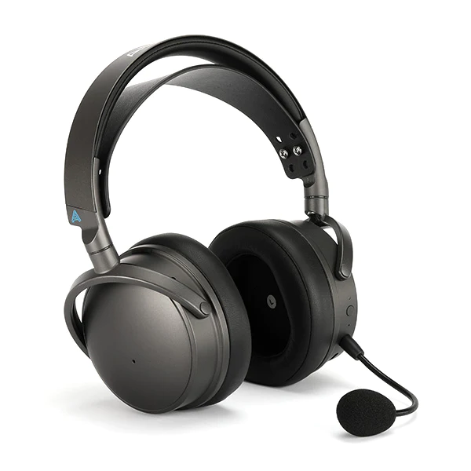
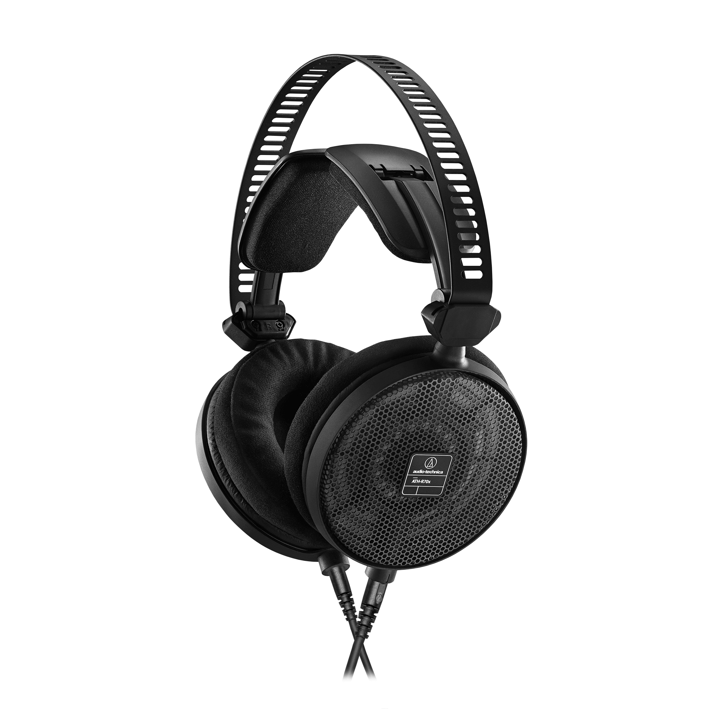
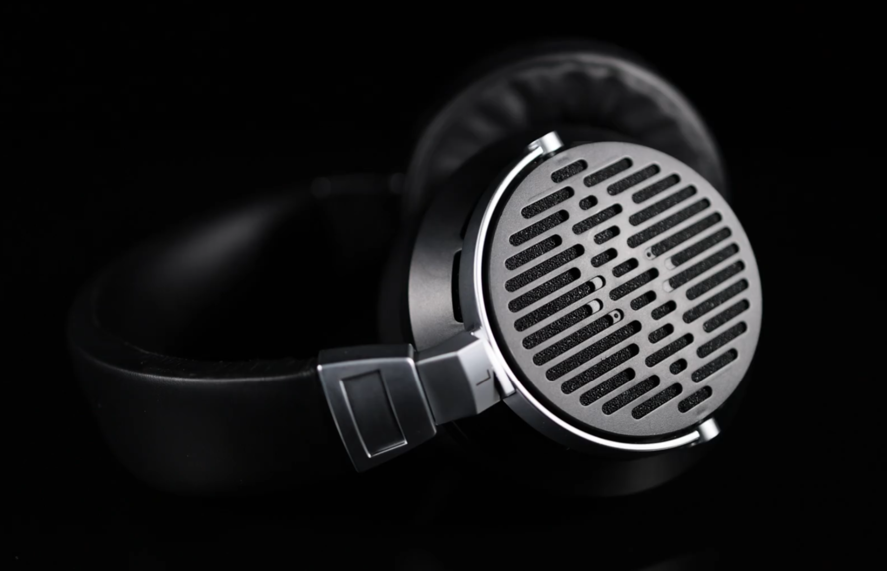

全网最专业的头戴式耳机选购攻略。本文不带一点恰饭（呵呵，我倒是想），所有耳机本人均自费购买仔细聆听过，评测会尽可能保持客观

本文脱胎于 GitHub 知识库 [Sha1rholder/Sound-Library](https://github.com/Sha1rholder/Sound-Library)，该库旨在帮助发烧友、音乐爱好者以及游戏玩家了解声学知识，优化声音环境，塑造正确科学的听音观，不至于被网上良莠不齐的信息误导。如果你想进一步了解、优化自己的听音环境，或单纯对声学知识感兴趣，欢迎给这个还在施工的知识库点个 Star

- [基础知识](#基础知识)
- [无线](#无线)
	- [Sony WH-1000XM5](#sony-wh-1000xm5)
	- [Audeze Maxwell](#audeze-maxwell)
- [有线](#有线)
	- [Philips SHP9500](#philips-shp9500)
	- [水月雨 Joker](#水月雨-joker)
	- [Audio-Technica ATH-M50x](#audio-technica-ath-m50x)
	- [Sony MDR-CD900ST](#sony-mdr-cd900st)
	- [AKG K701](#akg-k701)
	- [Byerdynamic DT 990](#byerdynamic-dt-990)
	- [Beyerdynamic DT 880](#beyerdynamic-dt-880)
	- [水月雨 Para](#水月雨-para)
	- [Sennheiser HD 600](#sennheiser-hd-600)
	- [飞傲 FT3](#飞傲-ft3)
	- [Audio-Technica ATH-R70x](#audio-technica-ath-r70x)
	- [VZR Model One](#vzr-model-one)
	- [HIFIMAN Edition XS](#hifiman-edition-xs)
	- [Shure SRH1840](#shure-srh1840)
	- [Audeze LCD-1](#audeze-lcd-1)
	- [UltraSone Edition 11](#ultrasone-edition-11)
	- [音乐精灵 PMH-1](#音乐精灵-pmh-1)
	- [Senheiser HD 800 S](#senheiser-hd-800-s)
- [Reference](#reference)

# 基础知识

  
https://detail.1688.com/offer/521792513665.html

> 产品图片，不标注链接则默认来源为产品官网

  
https://zhuanlan.zhihu.com/p/97706759

> 频响曲线图，不标注则默认来源为 [autoeq.app](https://autoeq.app) 网站。下图以 Senheiser HD 800 S 的频响为例介绍如何初步解读频响曲线
>
>   
> x 轴是频率，单位是 Hz；y 轴是特定频率下产生声音的相对强度，单位为 dBr
>
> - Raw，原始频响曲线。此结果为测试者测得的耳机原始频响曲线
> - Error，偏差曲线。此结果为原始曲线和目标曲线的偏差，Error 在某个频段越高则意味着相对于目标曲线，这款耳机更突出这一频段；反之则越削弱这一频段。Error 曲线越平直通常意味着这款耳机的频响越接近目标曲线
> - Target，目标频响曲线。因为人耳对各个频段声压的响应是不同的，“三频均衡”的频响并不是一条直线。不同的测试者可能会根据其研究成果设定不同的目标曲线，如 Rtings 测试团队可能会使用 _Rtings Harman Over-ear 2018_ 而 Ordinary1990 倾向于 _Harman Over-ear 2018_ 标准。本文均使用原测试者的默认目标曲线
> - Equalizer，EQ 曲线。此结果为使用均衡器软件对原始曲线进行的补偿，一般就是低频较少则补偿低频，高频较多就压制高频。本文均使用 EqualizerAPO GraphicEQ 方法
> - Equalized，EQ 后曲线。此结果为将 EQ 曲线和原始曲线叠加后的结果，这条曲线通常和目标曲线吻合度较高，但也因为耳机物理性质的问题无法完全吻合
>
> | Frequency Range | Frequency Values |
> | --------------- | ---------------- |
> | Sub-bass        | 20 - 60 Hz       |
> | Bass            | 60 - 250 Hz      |
> | Low midrange    | 250 - 500 Hz     |
> | Midrange        | 500 - 2000 Hz    |
> | Upper midrange  | 2000 - 4000 Hz   |
> | Presence        | 4000 - 6000 Hz   |
> | Brilliance      | 6000 - 20000 Hz  |
>
> 可闻声频段的划分 - [_Mixing Techniques > Audio Spectrum_ from Teach Me Audio](https://www.teachmeaudio.com/mixing/techniques/audio-spectrum)（非权威）

- 有线平头 hifi 耳塞

> 耳机的基本类型。监听耳机和 hifi 耳机并没有明确的界限，两者往往被音频从业者和发烧友混用。常有一个误区就是监听耳机通常频响平直音染较弱，其实不然，监听耳机分为录音监听和混音监听耳机，它们各有侧重和用处
>
> 其中，录音监听耳机又被称为耳返，顾名思义，就是将演奏者或演唱者的声音结合背景音乐返回到耳朵中辅助出好声。为了避免耳机漏音被录制进去劣化录音质量，录音监听耳机一定是封闭式的。这类耳机中用于人声监听的耳机在听众耳中常常触发“女毒”效果（即女声听起来好听），就是因为这类耳机通常相对削弱了其他频段而放大了要监听的频段
>
> 混音监听耳机大多数是开放式的，因为其声场通常更开阔，听感上限更高。混音监听主要可以被视为“挑刺型”和“均衡型”两类，这两类的界限更模糊，往往也可以通用。“挑刺型”监听耳机比较有代表性的比如 Beyerdynamic DT 990 Pro 等，它们往往会突出一些比较容易“出错”的频段（典型的比如加强高频齿音频段）来让混音师更容易发现录音和混音阶段的失误。“均衡性”监听耳机顾名思义，更适合作为最终阶段成品的试听，它们通常会尽可能还原并高质量地表达录音的原始声音，如 Focal Utopia 等，三频相对比较均衡；也有一些刻意模拟 low-end（与 hi-end 相对，对大多数听众的听音设备的戏称）声音表现的耳机如 ATH-M50x 等
>
> 相比于监听耳机，hifi 耳机更注重、追求对声音美感的表达，大多数监听耳机也可以作为 hifi 耳机使用

- 动圈

> 发声单元类型。动圈、动铁、圈铁是常见的耳塞发声单元类型，通常动圈单元低频下沉较好，动铁高频延展较好，结合了动圈和动铁单元的混合类型被称为圈铁，通过同时使用二者发声来试图结合两者的优点
>
> 在大耳中常见的发声单元有动圈、平面磁、静电，其中动圈单元应用最广，绝大部分大耳都是动圈耳机，阻抗和灵敏度天差地别，属于上限高下限低最花样繁多的成熟技术
>
> 由于动圈单元的进步已十分缓慢，部分新兴音频厂如 Audeze、Hifiman 等开辟了平面磁单元（也称为平板）的新赛道。平板耳机通常相当重，阻抗较低但对于功率要求较高（俗称需要大电流，不好推），手机甚至大部分播放器都不一定能推好，总体比较吃预算；但平板耳机通常解析力强（即在复杂的声音中的分辨率更高）、频响区间广（即能同时表达好 Sub-bass 和 Brilliance 频段），被认为有比动圈耳机更大的潜力
>
> 静电耳机不是这篇文章的受众需要了解的内容

- 32 Ω

> 阻抗，即发声单元内阻。通常阻抗大于 150 Ω 的耳机就不太可能适合搭配手机或小尾巴（即 USB-C/3.5 mm 接口转接器）直推而需要配合功放了，但低阻耳机也不意味着它就适合直推，许多低阻低敏耳机需要较大电流。阻抗不是绝对的，关于阻抗还有很多复杂的知识，不在这篇文章的篇幅内

- 113 dB/mW

> 灵敏度，指发声单元在单位功率或交流电压下产生的声压级大小。dB/mW 和 dB/Vrms 灵敏度有着根本的区别，不能相互比较，也不能通过阻抗简单换算。通常可以根据阻抗和灵敏度的大小粗略预测耳机需要多大的“推力”，适不适合直推

- xx g

> 裸机重量。头戴式耳机的重量直接影响佩戴舒适度，购买较重的耳机前请量力而行。珍爱颈椎健康，远离刑具

- 3.5 mm 不可换线

> 接口类型，如未标明可否换线则耳机可以换线，未标明耳机是单双接口则耳机为单接口。本文中提到的所有双端进线的耳机都支持平衡输入（VZR Model One 由于有麦克风比较特殊，换普通平衡线可能会失去麦克风输出）

- 京东 ￥ 20.9

> 这里注明了官方定价。如果官网有定价则采用官网定价，找不到定价则优先采用京东官方旗舰店的定价。通常因为优惠券以及折扣优惠的缘故，到手价都会低于这个价格，更不用说小黄鱼二手了

原道本是经典手机配塞森海塞尔 MX500 耳机的仿品，诞生于小作坊冒牌耳机中。MX500 是由日本丰达制造设计生产的红极一时的经典耳塞，其声音素质之高导致国内许多假货厂都不得不用高质量单元造假，否则连普通人都能一耳朵听出区别。国内假货厂通过 1:1 仿制这款耳机外壳（腔体）气动布局设计和耳机单元达到了非常惊艳且适合大众口味的声音效果（也可能和国内代工厂私自生产有一定关系）。在那个普通听众的音频码率和录音质量还没大幅提高的年代，这个高质量的仿品已经能超额满足绝大部分人的需求……

结论：所有人都需要一条原道来回味，告诉自己喜欢的不是乐曲而是旋律

> 本文中的耳机评测会尽可能多谈客观风格，减少主观评判，但是由于本人的主观感受和听音偏好的影响以及文笔功力，不可能不存在主观偏差，听感和文字描述的不一样很正常。

https://mall.jd.com/index-10262569.html

> 这里会留下官网地址，是数据权威来源

# 无线

## Sony WH-1000XM5

- 罩耳式主动降噪便携耳机
- 动圈
- 250 g
- 蓝牙 5.2、单 3.5 mm
- 京东 ￥ 2399

经典低音轰头的索尼调音味，非常符合我对现代 crap 耳机调音的想象，听录音质量差的口水歌还是挺不错的，如果想听点电音或者金属……为了保护自己的精神状态还是开 EQ 压一下低频吧。那声音只能用又闷又糊来形容，毫无声场可言，自然也不存在竞技游戏中的听声辨位能力了。另一方面，在这么轻的重量集成一个主动降噪耳麦的完整功能，要求它有多高的单元素质确实是奢求，音乐享受者慎选

实测降噪能力（除了在人声频段）还是很不错的，基本戴上后在无论多嘈杂的地方也能享受属于自己的小领域了。250g 的重量使它的佩戴感也十分轻巧，即使连着戴一整天也没感觉，虽然没法折叠但还是相当便携。另外，高度集成且统一的表面材质设计也使它在保证了完美的耳朵贴合度的同时也不会有 Bose 耳罩用半年就烂的臭毛病。虽然在关闭降噪功能时由于严重的听诊器效应（没错大耳也有听诊器效应）完 全 没 法 用；但是在开启主动降噪后，还是相对比较通透的，主观上感觉整个世界寂静了，而不是被屏蔽了。xm 系列的降噪能力被人夸赞不仅是因为频闭外界声音的能力，它还在用算法尽可能模拟开放式耳机的听觉体验

作为一个无线主动降噪耳机来说，它最大的缺点可能就是高得离谱的无线延迟了，而如果有线使用的话，麦克风是禁用的，直接踢出游戏玩家选项；另外，由于蓝牙的固有缺陷，在连接蓝牙使用麦克风时容易引发严重的音质下降（很恶心，用过蓝牙耳麦打游戏的人应该深有体会）。另外，Sony 的脑瘫无实体按键设计语言导致这个耳机操控起来贼麻烦。哦对了，还有一点——主动降噪耳机没有声场可言，which means 你得和你~~自称~~最爱的古典音乐和打游戏听声辨位说拜拜了

适合：佩戴耳机出勤需要强降噪的人，颈部肌无力，喜欢听口水歌的人，索尼大法信徒  
不适合：游戏玩家，想在有限预算内追求更佳音质的人，喜欢电音、金属以及古典的人

https://www.sony.com/lr/electronics/headband-headphones/wh-1000xm5

## Audeze Maxwell

- 封闭罩耳式游戏耳麦
- 平面磁
- 490 g
- 蓝牙 5.3、USB-C 无线接收器、3.5 mm、USB-C
- 京东 ￥ 2879

相信任何一个关注过声学外设的玩家都听说过 Maxwell 的鼎鼎大名，它就是当之无愧的世界最强无线游戏耳机，没有之一！五星上将麦克阿瑟曾说过：“我也曾相信‘用 hifi 耳机打游戏不是傻逼，但用游戏耳机听音乐绝对傻逼’，直到我使用 Audeze Maxwell”正如其名，如果忽视它有点吓人的重量，那 Maxwell 就是完美的，最优的无线游戏耳麦解决方案

我的 Maxwell 最近因为左右声道响度不一致送修了，因此暂时没法做 AB 主观听感测试，等返修到了再 AB :(

> 虽然知名评测网站 Rtings 将 Maxwell 评为“最佳无线游戏耳机”，但它在声场、延迟和定位上给 Maxwell 打了低分。Audeze 认为这是由于 Rtings 在测量延迟和相位失配的方法不严谨导致的，并为此写了一篇文章批评 Rtings 的测量技术落后导致系统误差 _[In Response to RTings.com's Maxwell Review](https://www.audeze.com/blogs/publication-reviews/in-response-to-rtings-coms-maxwell-review)_

适合：对无线耳麦有刚需的游戏玩家，对降噪需求不强的通勤用户  
不适合：颈部肌无力患者

https://www.audeze.com/products/maxwell-wireless-gaming-headset

# 有线

## Philips SHP9500

- 罩耳开放式 hifi 耳机
- 动圈
- 32 Ω
- 101 dB/mW
- 320 g
- 单 3.5 mm
- 京东 ￥ 299

无论从哪个方面讲，SHP9500 都是绝佳的入门 hifi 耳机。其高调的完全开放式设计提供了优秀的声场和定位，而且对功放推力要求不高，是预算紧张的发烧友以及严肃电竞玩家的首选。虽然单元素质的不足导致其有选择地减弱了不太擅长的低频，但在 EQ 后，它在声音上唯一的缺点也被减弱了

另外，其极轻的重量和透气的编织耳罩设计，使其即使戴一整天都不会让人感到任何不适（水月雨 Hifiman 好好看好好学，别往耳机里塞铁块了）。唯一的缺点可能就是它的漏音问题了……确实没法在图书馆、办公室或寝室等公共场所使用

适合：预算有限，听音环境较安静的游戏玩家，hifi 入门烧友  
不适合：在公共场合听音乐，懒得 EQ 但喜欢金属、电子乐的人

https://www.usa.philips.com/c-p/SHP9500_00/hifi-stereo-headphones

## 水月雨 Joker

  
https://moondroplab.com/cn/graph

- 罩耳封闭式监听耳机
- 动圈
- 68 Ω
- 106 dB/Vrms
- 289 g
- 双 3.5 mm
- 官网 ￥ 499

适合：🤡  
不适合：人

https://moondroplab.com/cn/products/joker

## Audio-Technica ATH-M50x

- 罩耳封闭式动圈耳机
- 动圈
- 38 Ω
- 99 dB/mW
- 285 g
- 单 3.5 mm
- 京东 ￥ 999

连一刻都没有为小丑的拉跨哀悼，立刻来到战场的是——国际知名专业音频大厂 **Audio-Technica 铁三角**

  
由黑咪漫画组翻译的《天色交响曲》 [#藤枝雅 fujiedamiyabi](https://www.pixiv.net/en/tags/%E8%97%A4%E6%9E%9D%E9%9B%85/artworks) [#ヘッドホン headphone](https://www.pixiv.net/en/tags/%E3%83%98%E3%83%83%E3%83%89%E3%83%9B%E3%83%B3/artworks) [#百合 yuri](https://www.pixiv.net/en/tags/%E7%99%BE%E5%90%88/artworks) [#漫画 manga](https://www.pixiv.net/en/tags/%E6%BC%AB%E7%94%BB/artworks) [#天色くろすおーばー](https://www.pixiv.net/en/tags/%E5%A4%A9%E8%89%B2%E3%81%8F%E3%82%8D%E3%81%99%E3%81%8A%E3%83%BC%E3%81%B0%E3%83%BC/artworks) [#CLIPSTUDIOPAINT](https://www.pixiv.net/en/tags/CLIPSTUDIOPAINT/artworks)

一款能干活但不好听的封闭式混音监听耳机，~~除了能拿来当个听自己心跳的听诊器，~~ 人声和混音监听师可以用它来挑高频刺。至于欣赏音乐的品质……

> ...my life would be complete if I could reliably mix with one of my hi-end headphones instead of crap like Beats or ATH M50's or even V-Moda...  
> [三十余年从业经验的专业混音师评价监听耳机和 hi-end 耳机](https://www.head-fi.org/threads/focal-utopia-vs-hd-800s.820234/post-12864469)

不过在本文中即使这款耳机的听诊器效应最强烈，它的佩戴舒适度还是可圈可点的，不夹头不压头重量轻。为隔音设计的耳罩包裹感好但不会压耳朵，让这款耳机的被动降噪性能达到了本文之最。不过……类似降噪大厂 Bose 的知名蓝牙降噪大耳 [Bose QuietComfort 35 II](https://www.bose.cn/zh_cn/products/headphones/over_ear_headphones/quietcomfort-35-wireless-ii.html)，它的耳罩一样容易破。What's worse，M50x 的耳罩是不可更换的

适合：预算不高的音乐制作者，环境较嘈杂，喜欢铁三角调音的人  
不适合：追求听声辨位的游戏玩家，喜欢大编制古典乐的人，喜欢通透声场的人

https://www.audio-technica.com/en-us/ath-m50x

## Sony MDR-CD900ST

- 压耳封闭式监听耳机
- 动圈
- 63 Ω
- 106 dB/mW
- 200 g
- 6.35 mm 不可换线
- 京东 ￥ 1199

MDR 是索尼的招牌监听耳机系列，其中最著名的 MDR-7506 —————— 的继任者 cd900st 被许多烧友认为是索尼史上最佳平价人声监听耳机。甚至连 Hifi 界知名伪科学大师 [鬼斧神工 119](https://space.bilibili.com/26059294) 在盲听测试综合评分中也给它打出了相当高的分数。然而我拿到后觉得……什么破地摊货我 20 买一筐，遂扔进耳机盒

然而在我写这篇文章时，我又把 cd900st 拿出来，准备好生骂两句，却突然有点被毒到了。于是又细细听了几曲，觉得还是有点好听在的，日本录音室文化极其推崇这个耳机相当有道理。先放张图

  
北村友香~~姐姐最喜欢你了 😍~~ 在为《只狼：影逝二度》创作配乐

总得来说就是一款素质在这个价位还过得去的女毒耳机，虽然声场和定位完全寄了……根据客观频响曲线和实际听感，这款耳机和 shp9500 一样在 sub-bass 频段削弱得厉害，看来听金属和一些前卫电子乐是会漏掉太多信息了

佩戴上，由于极低的重量，短时间佩戴还是挺轻松的，但其压耳式设计导致它久戴一小时以上必然导致耳廓生疼。不过作为一个封闭式耳机，压耳式的设计牺牲了部分隔音能力但也同时减轻了听诊器效应，让其听感还是比 ATH-M50x 这种重量级更自然通透一些

适合：预算不高的音乐制作者，环境不算嘈杂但是不能接受漏音（比如带到图书馆去用）的人，索尼大法信徒  
不适合：追求听声辨位的游戏玩家，喜欢大编制古典、金属或电子的人，喜欢通透声场的人

https://www.smci.jp/s/headp/page/cd900st_en?ima=5145&lang=en

## AKG K701

- 罩耳开放式监听耳机
- 动圈
- 62 Ω
- 105 dB/Vrms
- 235 g
- 6.35 mm 不可换线
- 京东 ￥ 1199

https://www.akg.com/Headphones/Professional%20Headphones/K701.html

## Byerdynamic DT 990

- 罩耳开放式监听耳机
- 动圈
- 32/250/600 Ω
- 96 dB/Vrms
- 290 g
- 3.5 mm 不可换线
- 京东 普通版 ￥ 1349
- 官网 Pro 版 ￥ 1249

https://global.beyerdynamic.com/dt-990-edition.html

## Beyerdynamic DT 880

- 罩耳半开放式监听耳机
- 动圈
- 32/250/600 Ω
- 96 dB/Vrms
- 290 g
- 3.5 mm 不可换线
- 京东 普通版 ￥ 1349
- 京东 Pro 版 ￥ 1599

https://global.beyerdynamic.com/dt-880-edition.html

## 水月雨 Para

  
https://moondroplab.com/cn/graph

- 罩耳开放式 hifi 耳机
- 平面磁
- 8 Ω
- 101 dB/Vrms
- 525 g
- 双 3.5 mm
- 京东 ￥ 1999

https://moondroplab.com/cn/products/para

## Sennheiser HD 600

- 罩耳开放式 hifi 耳机
- 动圈
- 300 Ω
- 97 dB/Vrms
- 260 g
- 3.5 mm 不可换线
- 官网 ￥ 1999

https://www.sennheiser-hearing.com/zh-CN/p/hd-600

## 飞傲 FT3

找不到频响曲线，已写信问候飞傲

- 罩耳开放式 hifi 耳机
- 动圈
- 350 Ω
- 105 dB/Vrms
- 391 g
- 双 3.5 mm
- 官网 ￥ 1999

https://www.fiio.com/ft3

## Audio-Technica ATH-R70x

- 罩耳开放式混音监听耳机
- 动圈
- 470 Ω
- 99 dB/mW
- 210 g（不含线缆）
- 3.5 mm 不可换线
- 京东 ￥ 2480

https://www.audio-technica.com/en-us/ath-r70x

## VZR Model One

找不到频响曲线，已写信问候 VZR

- 罩耳封闭式有线游戏耳麦
- 动圈
- 32 Ω
- 100 dB/mW
- 430（卸下麦克风后）
- 双 3.5 mm，原线带线控麦克风
- 京东 ￥ 2899

https://vzraudio.com/products/vzr-model-one

## HIFIMAN Edition XS

- 罩耳开放式 hifi 耳机
- 平面磁
- 18 Ω
- 92 dB/mW
- 405 g
- 双 3.5 mm
- 官网 ￥ 2999

https://hifiman.com/products/detail/315

## Shure SRH1840

- 罩耳开放式混音监听耳机
- 动圈
- 65 Ω
- 96 dB/mW
- 268 g
- 双 mmcx
- 京东 ￥ 3098

https://www.shure.com/en-US/products/headphones/srh1840?variant=SRH1840-BK

## Audeze LCD-1

- 罩耳开放式监听耳机
- 平面磁
- 16 Ω
- 99 dB/mW
- 250 g
- 双 3.5 mm
- 已停产

https://www.audeze.com/products/lcd-1

## UltraSone Edition 11

找不到频响曲线，已写信问候 UltraSone

- 罩耳开放式 hifi 耳机
- 动圈
- 32 Ω
- 未知灵敏度，已写信问候 UltraSone
- 318 g
- 双定制 2-pin IEM 插针
- 淘宝 ￥ 3499

https://ultrasone.com/product/ultrasone-eleven-high-end-headphones

## 音乐精灵 PMH-1

  
[【PMH-1】音乐精灵首款开放式平板耳机详细介绍及云试听对比 - bilibili](https://www.bilibili.com/video/BV1RU4y1b7q1/?share_source=copy_web&vd_source=0d156261fad807ac85d735b6ab0a64ed)

已联系周工，无频响图

- 罩耳开放式 hifi 耳机
- 平面磁
- 60 Ω
- 99 dB/mW
- 560 g
- 双 3.5 mm
- 淘宝 ￥ 3899

适合：仰慕周工为人，对发烧器材已经比较了解且预算比较充足的发烧友  
不适合：除此之外所有人

小厂子没官网

## Senheiser HD 800 S

- 罩耳开放式 hifi 耳机
- 动圈
- 300 Ω
- 102 dB/Vrms
- 330 g
- 双定制 2-pin 插针
- 官网 ￥ 9999

https://www.sennheiser-hearing.com/zh-CN/p/hd-800-s

# Reference

[从森海 MX500、原道耳机说起：丰达制造的前世今生](https://post.smzdm.com/p/a20wn46n)  
[autoeq.app](https://autoeq.app)  
[teachmeaudio.com](https://www.teachmeaudio.com)
