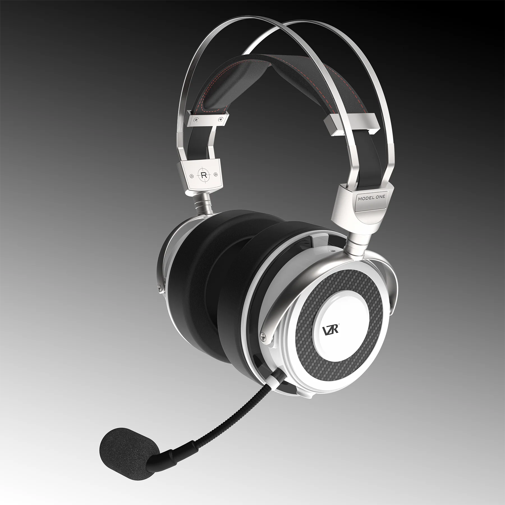
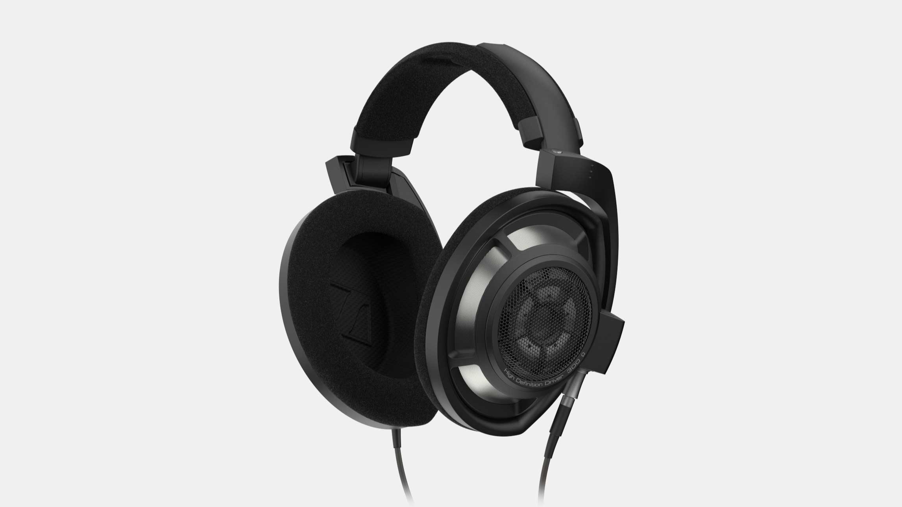

~~可能是~~全网最专业的头戴式耳机选购攻略。本文不带一点恰饭（呵呵，我倒是想有人给我喂），所有耳机均为本人自费购买，评测会尽可能保持客观

本文脱胎于 GitHub 知识库 [Sha1rholder/Sound-Library](https://github.com/Sha1rholder/Sound-Library)，该库旨在帮助发烧友、音乐爱好者以及游戏玩家了解声学知识，优化声音环境，塑造正确科学的听音观，不至于被网上良莠不齐的信息误导。如果你想进一步了解、优化自己的听音环境，或单纯对声学知识感兴趣，欢迎给这个知识库点个 Star

- [为什么要买头戴式耳机](#为什么要买头戴式耳机)
- [无线](#无线)
	- [Sony WH-1000XM5](#sony-wh-1000xm5)
	- [Audeze Maxwell](#audeze-maxwell)
- [有线](#有线)
	- [Philips SHP9500](#philips-shp9500)
	- [Audio-Technica ATH-M50x](#audio-technica-ath-m50x)
	- [Sony MDR-CD900ST](#sony-mdr-cd900st)
	- [AKG K701](#akg-k701)
	- [Byerdynamic DT 990](#byerdynamic-dt-990)
	- [Beyerdynamic DT 880](#beyerdynamic-dt-880)
	- [水月雨 Para](#水月雨-para)
	- [Sennheiser HD 600](#sennheiser-hd-600)
	- [飞傲 FT3](#飞傲-ft3)
	- [Audio-Technica ATH-R70x](#audio-technica-ath-r70x)
	- [VZR Model One](#vzr-model-one)
	- [HIFIMAN Edition XS](#hifiman-edition-xs)
	- [Shure SRH1840](#shure-srh1840)
	- [UltraSone Edition 11](#ultrasone-edition-11)
	- [Audeze LCD-1](#audeze-lcd-1)
	- [Senheiser HD 800 S](#senheiser-hd-800-s)
- [Reference](#reference)

# 为什么要买头戴式耳机

<!-- 在现代社会中，头戴式耳机已经成为了大多数人听音设备的首选。相比于耳塞，头戴式耳机可以避免"头中效应"，提供更自然、舒适的听音体验。而与音响相比，头戴式耳机不仅价格更为亲民，且可以在任何环境下使用，无需考虑空间和声学条件。因此，头戴式耳机是大多数现代人听音设备的最优解。 -->

# 无线

## Sony WH-1000XM5

- 主动降噪动圈耳机
- 250 g
- 蓝牙 5.2、3.5 mm 双模
- 京东 ￥ 2399

经典低音轰头的索尼调音味，非常符合我对现代 crap 耳机调音的想象，听录音质量差的口水歌还是挺不错的，如果想听点电音或者金属……为了保护自己的精神状态还是开 EQ 压一下低频吧。另一方面，在这么轻的重量集成一个主动降噪耳麦的完整功能，要求它有多高的单元素质确实是奢求，音乐享受者慎选

实测降噪能力（除了在人声频段）还是很不错的，基本戴上后在无论多嘈杂的地方也能享受属于自己的小领域了。250g 的重量使它的佩戴感也十分轻巧，即使连着戴一整天也没感觉，虽然没法折叠但还是相当便携。另外，高度集成且统一的表面材质设计也使它在保证了完美的耳朵贴合度的同时也不会有 Bose 耳罩用半年就烂的臭毛病，然而过度贴耳的设计导致其听诊器效应极其严重（没错大耳也有听诊器效应）在关闭降噪功能时 完 全 没 法 用（不知道这能不能算缺点）

作为一个无线主动降噪耳机来说，它最大的缺点可能就是高得离谱的无线延迟了，而如果有线使用的话，麦克风是禁用的，直接踢出游戏玩家选项；另外，Sony 的脑瘫无实体按键设计语言导致这个耳机操控起来贼麻烦。哦对了，还有一点——主动降噪耳机没有声场可言，which means 你得和你~~自称~~最爱的古典音乐和打游戏听声辨位说拜拜了

适合：降噪需求很大，经常出勤希望佩戴耳机，追求轻量化，喜欢听口水歌，信仰索尼大法的人

不适合：游戏玩家，追求音质的人，喜欢听电音、金属以及古典的人

https://www.sony.com/lr/electronics/headband-headphones/wh-1000xm5

## Audeze Maxwell

- 封闭式平板耳麦
- 490 g
- 蓝牙 5.3、USB-C 无线接收器、3.5 mm、USB-C 四模
- 京东 ￥ 2879

相信任何一个关注过声学外设的玩家都听说过 Maxwell 的鼎鼎大名，它就是当之无愧的世界最强无线游戏耳机，没有之一！五星上将麦克阿瑟曾说过：“我也曾相信‘用 hifi 耳机打游戏不是傻逼，但用游戏耳机听音乐绝对傻逼’，直到我使用 Audeze Maxwell”正如其名，如果忽视它有点吓人的重量，那 Maxwell 就是完美的，最优的无线游戏耳麦解决方案

我的 Maxwell 最近因为左右声道响度不一致送修了，因此暂时没法做主观听感测试 :(

> 虽然知名评测网站 Rtings 将 Maxwell 评为“最佳无线游戏耳机”，但它在声场、延迟和定位上给 Maxwell 打了低分。Audeze 认为这是由于 Rtings 在测量延迟和相位失配的方法不严谨导致的，并为此写了一篇文章批评 Rtings 的测量技术落后导致系统误差 _[In Response to RTings.com's Maxwell Review](https://www.audeze.com/blogs/publication-reviews/in-response-to-rtings-coms-maxwell-review)_

https://www.audeze.com/products/maxwell-wireless-gaming-headset

# 有线

## Philips SHP9500

- 开放式动圈
- 32 Ω
- 101 dB/mW
- 12 - 35000 Hz
- 320 g
- 可换线，3.5 mm
- 京东 ￥ 299

https://www.usa.philips.com/c-p/SHP9500_00/hifi-stereo-headphones

## Audio-Technica ATH-M50x

- 封闭式动圈
- 38 Ω
- 99 dB/mW
- 15 - 28000 Hz
- 285 g
- 可换线，3.5 mm
- 京东 ￥ 999

https://www.audio-technica.com/en-us/ath-m50x

## Sony MDR-CD900ST

- 封闭式动圈
- 63 Ω
- 106 dB/mW
- 5 - 30000 Hz
- 200 g
- 不可换线，6.35 mm
- 京东 ￥ 1199

https://www.smci.jp/s/headp/page/cd900st_en?ima=5145&lang=en

## AKG K701

- 开放式动圈
- 62 Ω
- 105 dB/Vrms
- 10 - 39800 Hz
- 235 g
- 不可换线，6.35 mm
- 京东 ￥ 1199

https://www.akg.com/Headphones/Professional%20Headphones/K701.html

## Byerdynamic DT 990

- 开放式动圈
- 32/250/600 Ω
- 96 dB/Vrms
- 5 - 35000 Hz
- 290 g
- 不可换线，3.5 mm
- 京东 普通版 ￥ 1349
- 官网 Pro 版 ￥ 1249

https://global.beyerdynamic.com/dt-990-edition.html

## Beyerdynamic DT 880

- 半开放式动圈
- 32/250/600 Ω
- 96 dB/Vrms
- 5 - 35000 Hz
- 290 g
- 不可换线，3.5 mm
- 京东 普通版 ￥ 1349
- 京东 Pro 版 ￥ 1599

https://global.beyerdynamic.com/dt-880-edition.html

## 水月雨 Para

  
数据来源：https://moondroplab.com/cn/graph

- 开放式平板
- 8 Ω
- 101 dB/Vrms
- 15 - 53000 Hz
- 525 g
- 可换线，双 3.5 mm
- 京东 ￥ 1999

https://moondroplab.com/cn/products/para

## Sennheiser HD 600

- 开放式动圈
- 300 Ω
- 97 dB/Vrms
- 12 - 40500 Hz
- 260 g
- 不可换线，3.5 mm
- 官网 ￥ 1999

https://www.sennheiser-hearing.com/zh-CN/p/hd-600

## 飞傲 FT3

找不到频响曲线，已写信问候飞傲

- 开放式动圈
- 350 Ω
- 105 dB/Vrms
- 7 - 40000 Hz
- 391 g
- 可换线，双 3.5 mm
- 官网 ￥ 1999

https://www.fiio.com/ft3

## Audio-Technica ATH-R70x

- 开放式动圈
- 470 Ω
- 99 dB/mW
- 5 - 40000 Hz
- 210 g（不含线缆）
- 不可换线，3.5 mm
- 京东 ￥ 2480

https://www.audio-technica.com/en-us/ath-r70x

## VZR Model One

找不到频响曲线，已写信问候 VZR

- 封闭式动圈有线耳麦
- 32 Ω
- 100 dB/mW
- 10 - 30000 Hz
- 430（卸下麦克风后）
- 可换线，双 3.5 mm，原线带线控麦克风
- 京东 ￥ 2899（需要预定，本人等了整整 2 个月）

https://vzraudio.com/products/vzr-model-one

## HIFIMAN Edition XS

- 开放式平板
- 18 Ω
- 92 dB/mW
- 8 - 50000 Hz
- 405 g
- 可换线，双 3.5 mm
- 官网 ￥ 2999

https://hifiman.com/products/detail/315

## Shure SRH1840

- 开放式动圈
- 65 Ω
- 96 dB/mW
- 10 - 30000 Hz
- 268 g
- 可换线，双 mmcx
- 京东 ￥ 3098

https://www.shure.com/en-US/products/headphones/srh1840?variant=SRH1840-BK

## UltraSone Edition 11

找不到频响曲线，已写信问候 UltraSone

- 开放式动圈
- 32 Ω
- 未知灵敏度，已写信问候 UltraSone
- 6 - 42000 Hz
- 318 g
- 可换线，双定制 2-pin IEM 插针母口，兼容平衡和单端输入
- 淘宝 ￥ 3499

https://ultrasone.com/product/ultrasone-eleven-high-end-headphones/

## Audeze LCD-1

- 开放式平板
- 16 Ω
- 99 dB/mW
- 10 - 50000 Hz
- 250 g
- 可换线，双 3.5 mm
- 已停产，绝版

https://www.audeze.com/products/lcd-1

## Senheiser HD 800 S

- 开放式动圈
- 300 Ω
- 102 dB/Vrms
- 4 - 51000 Hz
- 330 g
- 可换线，双定制 2-pin 插针母口，兼容平衡和单端输入
- 官网 ￥ 9999

旗舰耳机的传奇之作，森海塞尔 HD800s。

https://www.sennheiser-hearing.com/zh-CN/p/hd-800-s/

# Reference

https://www.autoeq.app
