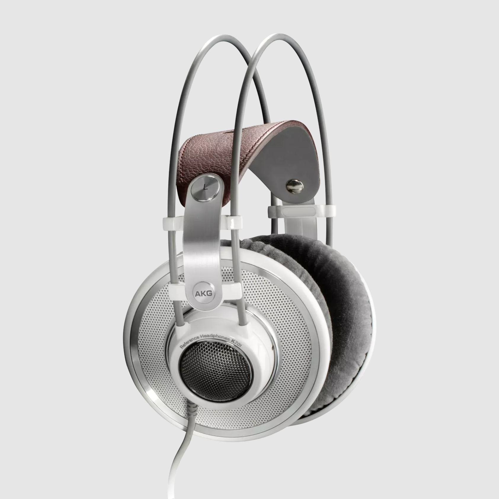

~~可能是~~全网最专业的头戴式耳机选购攻略。本文不带一点恰饭（呵呵，我倒是想有人给我喂），所有耳机均为本人自费购买，评测会尽可能保持客观

本文脱胎于 GitHub 知识库 [Sha1rholder/Sound-Library](https://github.com/Sha1rholder/Sound-Library)，该库旨在帮助发烧友、音乐爱好者以及游戏玩家了解声学知识，优化声音环境，塑造正确科学的听音观，不至于被网上良莠不齐的信息误导。如果你想进一步了解、优化自己的听音环境，或单纯对声学知识感兴趣，欢迎给这个知识库点个 Star

- [为什么要买头戴式耳机](#为什么要买头戴式耳机)
- [Sony WH-1000XM5](#sony-wh-1000xm5)
- [Sennheiser HD 600](#sennheiser-hd-600)
- [Beyerdynamic DT 880](#beyerdynamic-dt-880)
- [AKG K701](#akg-k701)
- [Senheiser HD 800 S](#senheiser-hd-800-s)
- [Byerdynamic DT 990](#byerdynamic-dt-990)
- [飞傲 FT3](#飞傲-ft3)
- [Sony MDR-CD900ST](#sony-mdr-cd900st)
- [Philips SHP9500](#philips-shp9500)
- [Audio-Technica ATH-M50x](#audio-technica-ath-m50x)
- [HIFIMAN Edition XS](#hifiman-edition-xs)
- [UltraSone Edition 11](#ultrasone-edition-11)
- [Reference](#reference)

# 为什么要买头戴式耳机

<!-- 在现代社会中，头戴式耳机已经成为了大多数人听音设备的首选。相比于耳塞，头戴式耳机可以避免"头中效应"，提供更自然、舒适的听音体验。而与音响相比，头戴式耳机不仅价格更为亲民，且可以在任何环境下使用，无需考虑空间和声学条件。因此，头戴式耳机是大多数现代人听音设备的最优解。 -->

# Sony WH-1000XM5

- 封闭式主动降噪动圈耳机
- 48 Ω（开机时有线连接）
- 16 Ω（关机时有线连接）
- 102 dB/mW（开机时有线连接）
- 100 dB/mW（关机时有线连接）
- 4- 40000 Hz（开机时有线连接）
- 250 g
- 蓝牙、单 3.5 mm 母口双模输入
- ￥ 2399

https://www.sony.com/lr/electronics/headband-headphones/wh-1000xm5

# Sennheiser HD 600

- 开放式动圈耳机
- 300 Ω
- 97 dB/V
- 12 - 40500 Hz
- 260 g
- 换线较困难，单 3.5 转 6.35 mm 公口输入
- ￥ 1999

https://www.sennheiser-hearing.com/zh-CN/p/hd-600

# Beyerdynamic DT 880

- 半开放式动圈耳机
- 32/250/600 Ω
- 96 dB/V
- 5 - 35000 Hz
- 290 g
- 不可换线，单 3.5 转 6.35 mm 公口输入，Pro 后缀为卷曲电话线
- 普通版 ￥ 1349
- Pro 版 ￥ 1599

https://global.beyerdynamic.com/dt-880-edition.html

# AKG K701

- 开放式动圈耳机
- 62 Ω
- 105 dB/V
- 10 - 39800 Hz
- 235 g
- 不可换线，单 6.35 mm 公口输入
- ￥ 1199

https://www.akg.com/Headphones/Professional%20Headphones/K701.html

# Senheiser HD 800 S

- 开放式动圈耳机
- 300 Ω
- 102 dB/V
- 4 - 51000 Hz
- 330 g
- 可换线，双 ODU 母口平衡输入
- ￥ 9999

https://www.sennheiser-hearing.com/zh-CN/p/hd-800-s/

# Byerdynamic DT 990

- 开放式动圈耳机
- 32/250/600 Ω
- 96 dB/V
- 5 - 35000 Hz
- 290 g
- 不可换线，单 3.5 转 6.35 mm 公口输入，Pro 后缀为卷曲电话线
- 普通版 ￥ 1349
- Pro 版 ￥ 1249

https://global.beyerdynamic.com/dt-990-edition.html

# 飞傲 FT3

找不到频响曲线，已写信问候飞傲

- 开放式动圈耳机
- 350 Ω
- 105 dB/V
- 7 - 40000 Hz
- 391 g
- 可换线，双 3.5 mm 母口输入
- ￥ 1999

https://www.fiio.com/ft3

# Sony MDR-CD900ST

- 封闭式动圈耳机
- 63 Ω
- 106 dB/mW
- 5 - 30000 Hz
- 200 g
- 不可换线，单 6.35 mm 转 3.5 mm 公口输入
- ￥ 1199

https://www.smci.jp/s/headp/page/cd900st_en?ima=5145&lang=en

# Philips SHP9500

- 开放式
- 32 Ω
- 101 dB/mW
- 12 - 35000 Hz
- 320 g
- 可换线，单 3.5 mm 母口输入

https://www.usa.philips.com/c-p/SHP9500_00/hifi-stereo-headphones

# Audio-Technica ATH-M50x

- 封闭式
- 38 Ω
- 99 dB/mW
- 15 - 28000 Hz
- 285 g
- 可换线，单 3.5 mm 母口输入

https://www.audio-technica.com/en-us/ath-m50x

# HIFIMAN Edition XS

- 开放式
- 18 Ω
- 92 dB/mW
- 8 - 50000 Hz
- 405 g
- 可换线，双 3.5 mm 母口输入

https://hifiman.com/products/detail/315

# UltraSone Edition 11

找不到频响曲线，已写信问候 UltraSone

https://ultrasone.com/product/ultrasone-eleven-high-end-headphones/

# Reference

https://www.autoeq.app
