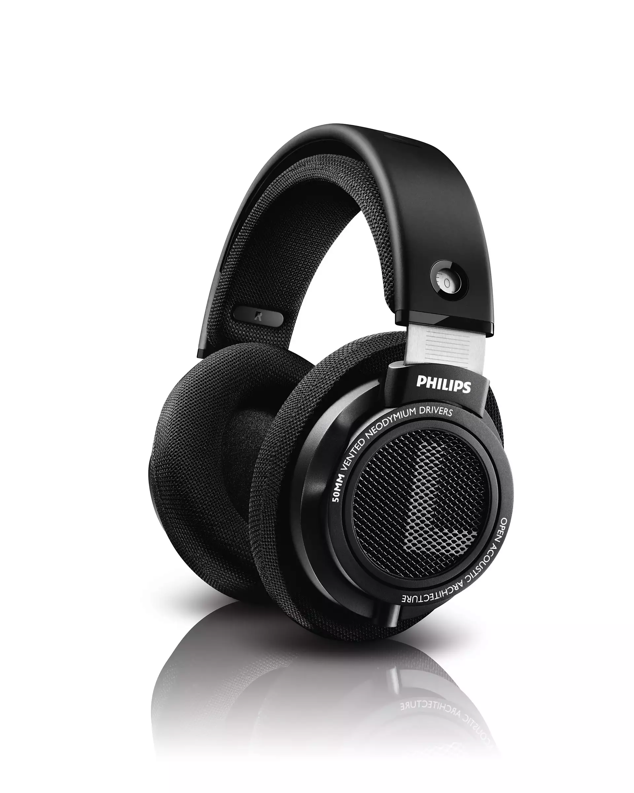
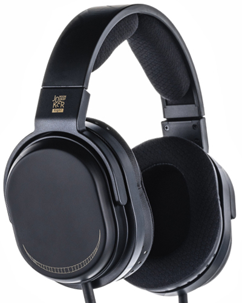
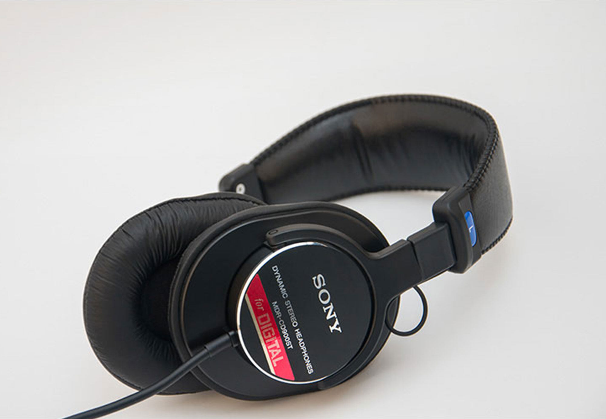

~~可能是~~全网最专业的头戴式耳机选购攻略。本文不带一点恰饭（呵呵，我倒是想有人给我喂），所有耳机均为本人自费购买，评测会尽可能保持客观

本文脱胎于 GitHub 知识库 [Sha1rholder/Sound-Library](https://github.com/Sha1rholder/Sound-Library)，该库旨在帮助发烧友、音乐爱好者以及游戏玩家了解声学知识，优化声音环境，塑造正确科学的听音观，不至于被网上良莠不齐的信息误导。如果你想进一步了解、优化自己的听音环境，或单纯对声学知识感兴趣，欢迎给这个知识库点个 Star

- [基础知识](#基础知识)
- [无线](#无线)
	- [Sony WH-1000XM5](#sony-wh-1000xm5)
	- [Audeze Maxwell](#audeze-maxwell)
- [有线](#有线)
	- [Philips SHP9500](#philips-shp9500)
	- [水月雨 Joker](#水月雨-joker)
	- [Audio-Technica ATH-M50x](#audio-technica-ath-m50x)
	- [Sony MDR-CD900ST](#sony-mdr-cd900st)
	- [AKG K701](#akg-k701)
	- [Byerdynamic DT 990](#byerdynamic-dt-990)
	- [Beyerdynamic DT 880](#beyerdynamic-dt-880)
	- [水月雨 Para](#水月雨-para)
	- [Sennheiser HD 600](#sennheiser-hd-600)
	- [飞傲 FT3](#飞傲-ft3)
	- [Audio-Technica ATH-R70x](#audio-technica-ath-r70x)
	- [VZR Model One](#vzr-model-one)
	- [HIFIMAN Edition XS](#hifiman-edition-xs)
	- [Shure SRH1840](#shure-srh1840)
	- [UltraSone Edition 11](#ultrasone-edition-11)
	- [Audeze LCD-1](#audeze-lcd-1)
	- [Senheiser HD 800 S](#senheiser-hd-800-s)
- [Reference](#reference)
<!--

# 为什么要买头戴式耳机

在现代社会中，头戴式耳机已经成为了大多数人听音设备的首选。相比于耳塞，头戴式耳机可以避免"头中效应"，提供更自然、舒适的听音体验。而与音响相比，头戴式耳机不仅价格更为亲民，且可以在任何环境下使用，无需考虑空间和声学条件。因此，头戴式耳机是大多数现代人听音设备的最优解。 -->

# 基础知识

这部分以原道为例解释文章的结构并讲解一些基础知识

  
https://detail.1688.com/offer/521792513665.html

> 产品图片，不标注链接则默认来源为产品官网

  
https://zhuanlan.zhihu.com/p/97706759

> 频响曲线图，不标注则默认来源为 [autoeq.app](https://autoeq.app) 网站。下图以 HD800s 为例介绍如何初步解读频响曲线
>
>   
> x 轴是频率，单位是 Hz；y 轴是振幅，单位为 dBr（振幅对应响度，简单理解为每 +3 dB 声能翻倍）
>
> 1. 目标频响曲线。因为人耳对各个频段声压的响应是不同的，“三频均衡”的频响并不是一条直线。不同的测试者可能会根据其研究成果设定不同的目标曲线，如 Rtings 测的耳机可能会使用 _Rtings Harman Over-ear 2018_ 而 Ordinary1990 可能会使用 _Harman Over-ear 2018_ 标准。以下结果均使用测试者的默认目标曲线
> 2. 原始频响曲线。此结果为测试者测得的耳机原始频响曲线，通常我们认为原始曲线越贴合目标曲线则越“三频均衡”
> 3. EQ 曲线。此结果为使用均衡器软件对原始曲线进行的补偿，一般就是低频较少则补偿低频，高频较多就压制高频
> 4. EQ 后曲线。此结果为将 EQ 曲线和原始曲线叠加后的结果，这条曲线通常和目标曲线吻合度较高，但也因为耳机物理性质的问题无法完全吻合
> 5. 均衡器。本文均使用 EqualizerAPO GraphicEQ 进行 EQ，这是目前 Windows 系统最好的 EQ 方式

- 动圈平头塞

> 动圈、动铁、圈铁是常见的耳塞发声单元类型，通常动圈单元低频下沉较好，动铁高频延展较好，结合了动圈和动铁单元的混合类型被称为圈铁，通过同时使用二者发声来试图结合两者的优点
>
> 在大耳中常见的发声单元有动圈、平板/平面磁、静电，其中动圈单元应用最广，绝大部分大耳都是动圈耳机，阻抗和灵敏度天差地别，属于上限高下限低最花样繁多的成熟技术
>
> 由于动圈单元的进步已十分缓慢，部分新兴音频厂如 Audeze、Hifiman 等开辟了平面磁单元（也称为平板）的新赛道。平板耳机通常相当重，阻抗较低但对于功率要求较高（俗称需要大电流，不好推），手机甚至大部分播放器都不一定能推好，总体比较吃预算；但平板耳机通常解析力强（即在复杂的声音中的分辨率更高）、频响区间广（即能同时表达好低频和高频），被认为有比动圈耳机更高的上限和潜力
>
> 静电耳机代表性的厂商有 Stax 等，别的就不解释了，不是这篇文章的受众需要了解的

- 32 Ω

> 这里会标明耳机的阻抗，通常阻抗大于 200Ω 的耳机就不太适合用手机或小尾巴直推了，需要配合功放使用；而阻抗较低的耳机也不一定适合直推，因为可能低阻抗更需要大电流。关于阻抗还有很多复杂的知识，不在这篇文章的篇幅内

- 113 dB/mW

> 这里会标明耳机的灵敏度，灵敏度的单位可能是 dB/Vrms 也可能是 dB/mW，前者表示电压和声压级的关系，后者表示功率和声压级的关系，两者不是简单能通过阻抗换算的，但是通常可以根据阻抗和灵敏度的大小粗略预测耳机需要多大的“推力”

- xx g

> 头戴式耳机的重量直接影响佩戴舒适度，购买较重的耳机前请量力而行，避免 10 分钟退货。保护颈椎健康，远离一斤耳机

- 3.5 mm 不可换线

> 这里标明了接口类型，如未标明可否换线则耳机可以换线，未标明耳机是单双接口则耳机为单接口，在本文中提到的所有双端进线的耳机都支持平衡输入（VZR Model One 由于有麦克风比较特殊，换普通平衡线可能会失去麦克风输出）

- 京东 ￥ 20.9

> 这里注明了官方定价。如果官网有定价则采用官网定价，找不到定价则优先采用京东官方旗舰店的定价。通常因为优惠券以及折扣优惠的缘故，到手价都会低于这个价格，更不用说小黄鱼二手了

原道本是经典手机配塞森海塞尔 MX500 耳机的仿品，诞生于小作坊冒牌耳机中。MX500 是由日本丰达制造设计生产的红极一时的经典耳塞，其声音素质之高导致国内许多假货厂都不得不用高质量单元造假，否则连普通人都能一耳朵听出区别。国内假货厂通过 1:1 仿制这款耳机外壳（腔体）气动布局设计和耳机单元达到了非常惊艳且适合大众口味的声音效果（也可能和国内代工厂私自生产有一定关系）。在那个普通听众的音频码率和录音质量还没大幅提高的年代，这个高质量的仿品已经能超额满足绝大部分人的需求

资料来源：https://post.smzdm.com/p/a20wn46n

结论：所有人都需要一条原道来回味，告诉自己喜欢的不是乐曲而是旋律

> 本文中的耳机评测会尽可能多谈客观风格，减少主观评判，但是由于本人的主观感受和听音偏好的影响以及文笔功力，不可能不存在主观偏差，听感和文字描述的不一样很正常。

https://mall.jd.com/index-10262569.html

> 这里会留下官网地址，是数据权威来源

# 无线

## Sony WH-1000XM5

- 主动降噪动圈耳机
- 250 g
- 蓝牙 5.2、3.5 mm 双模
- 京东 ￥ 2399

经典低音轰头的索尼调音味，非常符合我对现代 crap 耳机调音的想象，听录音质量差的口水歌还是挺不错的，如果想听点电音或者金属……为了保护自己的精神状态还是开 EQ 压一下低频吧。那声音只能用又闷又糊来形容，毫无声场可言，自然也不存在竞技游戏中的听声辨位能力了。另一方面，在这么轻的重量集成一个主动降噪耳麦的完整功能，要求它有多高的单元素质确实是奢求，音乐享受者慎选

实测降噪能力（除了在人声频段）还是很不错的，基本戴上后在无论多嘈杂的地方也能享受属于自己的小领域了。250g 的重量使它的佩戴感也十分轻巧，即使连着戴一整天也没感觉，虽然没法折叠但还是相当便携。另外，高度集成且统一的表面材质设计也使它在保证了完美的耳朵贴合度的同时也不会有 Bose 耳罩用半年就烂的臭毛病。虽然在关闭降噪功能时由于严重的听诊器效应（没错大耳也有听诊器效应）完 全 没 法 用；但是在开启主动降噪后，还是相对比较通透的，主观上感觉整个世界寂静了，而不是被屏蔽了。xm 系列的降噪能力被人夸赞不仅是因为频闭外界声音的能力，它还在用算法尽可能模拟开放式耳机的听觉体验

作为一个无线主动降噪耳机来说，它最大的缺点可能就是高得离谱的无线延迟了，而如果有线使用的话，麦克风是禁用的，直接踢出游戏玩家选项；另外，由于蓝牙的固有缺陷，在连接蓝牙使用麦克风时容易引发严重的音质下降（很恶心，用过蓝牙耳麦打游戏的人应该深有体会）。另外，Sony 的脑瘫无实体按键设计语言导致这个耳机操控起来贼麻烦。哦对了，还有一点——主动降噪耳机没有声场可言，which means 你得和你~~自称~~最爱的古典音乐和打游戏听声辨位说拜拜了

适合：降噪需求很大，经常出勤希望佩戴耳机，追求轻量化，喜欢听口水歌，信仰索尼大法的人

不适合：游戏玩家，追求音质的人，喜欢听电音、金属以及古典的人

https://www.sony.com/lr/electronics/headband-headphones/wh-1000xm5

## Audeze Maxwell

- 封闭式平板耳麦
- 490 g
- 蓝牙 5.3、USB-C 无线接收器、3.5 mm、USB-C 四模
- 京东 ￥ 2879

相信任何一个关注过声学外设的玩家都听说过 Maxwell 的鼎鼎大名，它就是当之无愧的世界最强无线游戏耳机，没有之一！五星上将麦克阿瑟曾说过：“我也曾相信‘用 hifi 耳机打游戏不是傻逼，但用游戏耳机听音乐绝对傻逼’，直到我使用 Audeze Maxwell”正如其名，如果忽视它有点吓人的重量，那 Maxwell 就是完美的，最优的无线游戏耳麦解决方案

我的 Maxwell 最近因为左右声道响度不一致送修了，因此暂时没法做 AB 主观听感测试 :(

> 虽然知名评测网站 Rtings 将 Maxwell 评为“最佳无线游戏耳机”，但它在声场、延迟和定位上给 Maxwell 打了低分。Audeze 认为这是由于 Rtings 在测量延迟和相位失配的方法不严谨导致的，并为此写了一篇文章批评 Rtings 的测量技术落后导致系统误差 _[In Response to RTings.com's Maxwell Review](https://www.audeze.com/blogs/publication-reviews/in-response-to-rtings-coms-maxwell-review)_

https://www.audeze.com/products/maxwell-wireless-gaming-headset

# 有线

## Philips SHP9500

- 开放式动圈
- 32 Ω
- 101 dB/mW
- 320 g
- 3.5 mm
- 京东 ￥ 299

无论从哪个方面讲，SHP9500 都是绝佳的入门开放式耳机。其经典开放式设计提供了优秀的声场和定位，同时对功放推力要求不高，是预算紧张的严肃电竞玩家的首选。同时它佩戴舒适，重量轻，戴一整天都不会感到任何不适（水月雨飞傲 Hifiman 好好学学）

可以说它在声音上唯一的缺点就是被放弃的低频，从 EQ 曲线我们可以看出来

https://www.usa.philips.com/c-p/SHP9500_00/hifi-stereo-headphones

## 水月雨 Joker

  
https://moondroplab.com/cn/graph

- 封闭式动圈
- 68 Ω
- 106 dB/Vrms
- 289 g
- 双 3.5 mm
- 官网 ￥ 499

🤡

https://moondroplab.com/cn/products/joker

## Audio-Technica ATH-M50x

- 封闭式动圈
- 38 Ω
- 99 dB/mW
- 285 g
- 3.5 mm
- 京东 ￥ 999

能干活，不好听。拿来当个听自己心跳声的听诊器不错，另外可以高频引用 Head-fi 上一位 30 余年专业混音从业者对它的评价——crap

https://www.head-fi.org/threads/focal-utopia-vs-hd-800s.820234/post-12864469

https://www.audio-technica.com/en-us/ath-m50x

## Sony MDR-CD900ST

- 封闭式动圈
- 63 Ω
- 106 dB/mW
- 200 g
- 6.35mm 不可换线
- 京东 ￥ 1199

MDR 是索尼的招牌监听耳机系列，其中最著名的 MDR-7506 ——————的继任者 cd900st 被许多烧友认为是索尼史上最佳平价人声监听耳机。

https://www.smci.jp/s/headp/page/cd900st_en?ima=5145&lang=en

## AKG K701

- 开放式动圈
- 62 Ω
- 105 dB/Vrms
- 235 g
- 6.35mm 不可换线
- 京东 ￥ 1199

https://www.akg.com/Headphones/Professional%20Headphones/K701.html

## Byerdynamic DT 990

- 开放式动圈
- 32/250/600 Ω
- 96 dB/Vrms
- 290 g
- 3.5 mm 不可换线
- 京东 普通版 ￥ 1349
- 官网 Pro 版 ￥ 1249

https://global.beyerdynamic.com/dt-990-edition.html

## Beyerdynamic DT 880

- 半开放式动圈
- 32/250/600 Ω
- 96 dB/Vrms
- 290 g
- 3.5 mm 不可换线
- 京东 普通版 ￥ 1349
- 京东 Pro 版 ￥ 1599

https://global.beyerdynamic.com/dt-880-edition.html

## 水月雨 Para

  
https://moondroplab.com/cn/graph

- 开放式平板
- 8 Ω
- 101 dB/Vrms
- 525 g
- 双 3.5 mm
- 京东 ￥ 1999

https://moondroplab.com/cn/products/para

## Sennheiser HD 600

- 开放式动圈
- 300 Ω
- 97 dB/Vrms
- 260 g
- 3.5 mm 不可换线
- 官网 ￥ 1999

https://www.sennheiser-hearing.com/zh-CN/p/hd-600

## 飞傲 FT3

找不到频响曲线，已写信问候飞傲

- 开放式动圈
- 350 Ω
- 105 dB/Vrms
- 391 g
- 双 3.5 mm
- 官网 ￥ 1999

https://www.fiio.com/ft3

## Audio-Technica ATH-R70x

- 开放式动圈
- 470 Ω
- 99 dB/mW
- 210 g（不含线缆）
- 3.5 mm 不可换线
- 京东 ￥ 2480

https://www.audio-technica.com/en-us/ath-r70x

## VZR Model One

找不到频响曲线，已写信问候 VZR

- 封闭式动圈有线耳麦
- 32 Ω
- 100 dB/mW
- 430（卸下麦克风后）
- 双 3.5 mm，原线带线控麦克风
- 京东 ￥ 2899（需要预定，本人等了整整 2 个月）

https://vzraudio.com/products/vzr-model-one

## HIFIMAN Edition XS

- 开放式平板
- 18 Ω
- 92 dB/mW
- 405 g
- 双 3.5 mm
- 官网 ￥ 2999

https://hifiman.com/products/detail/315

## Shure SRH1840

- 开放式动圈
- 65 Ω
- 96 dB/mW
- 268 g
- 双 mmcx
- 京东 ￥ 3098

https://www.shure.com/en-US/products/headphones/srh1840?variant=SRH1840-BK

## UltraSone Edition 11

找不到频响曲线，已写信问候 UltraSone

- 开放式动圈
- 32 Ω
- 未知灵敏度，已写信问候 UltraSone
- 318 g
- 双定制 2-pin IEM 插针
- 淘宝 ￥ 3499

https://ultrasone.com/product/ultrasone-eleven-high-end-headphones/

## Audeze LCD-1

- 开放式平板
- 16 Ω
- 99 dB/mW
- 250 g
- 双 3.5 mm
- 已停产，绝版

https://www.audeze.com/products/lcd-1

## Senheiser HD 800 S

- 开放式动圈
- 300 Ω
- 102 dB/Vrms
- 330 g
- 双定制 2-pin 插针
- 官网 ￥ 9999

旗舰耳机的传奇之作，森海塞尔 HD800s。

https://www.sennheiser-hearing.com/zh-CN/p/hd-800-s/

# Reference

[autoeq.app](https://autoeq.app/)

[teachmeaudio.com](https://www.teachmeaudio.com/)
