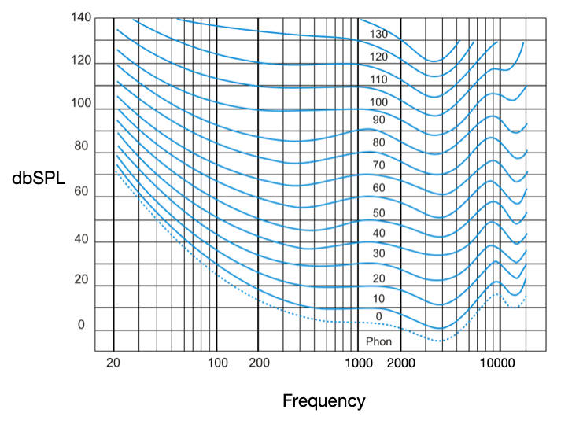

# 声的本质

声的本质是振动，振动的表现形式就是波。人能感受的声就叫声音

振动具有两个特征：幅度 amplitude 和频率 frequency

这张图的横轴是时间，纵轴是幅度。它反映了一个粒子最基本的振动状况，我们称之为正弦波 Sine Wave。该粒子在一秒钟内重复振动 50 次，所以频率为 50Hz，周期就是 1/50=0.02s=20ms

<!-- 理解波是理解频响曲线以及失真等指标的基础 -->

正弦波是最简单的波形，**任何周期信号都能够由不同频率的正弦波叠加而成**

完美的方波是直角转弯的，但现实中不存在这样的信号。现实中的方波常由一系列正弦波叠加而成，它自身的频率是 50Hz，但可以分解为多种不同频率的正弦波

**现实世界中任何的波都可以视为一系列的正弦波的叠加**，这就是傅里叶变换的基本思想

.png>)

这是 _Hotel California (Live on MTV, 1994)_ 第 30 秒开始 0.05 秒内的波形

# 声的分析

回到 50Hz 正弦波。假如我们想要用实际的音响去播放它，结果会怎样呢？

可见我们回放出来的波形（橙线）相比于期望的信号（蓝线）发生了一些畸变。现在我们来看看这个畸变的本质是什么

可见，信号的失真本质就是产生了一些本不需要的频率的信号。但是这样分析各种信号实在太过复杂，那我们还有什么别的办法吗？

**有的**

我们可以通过傅里叶变换把 幅度-时间波形图 转换为 幅度-频率频谱图，这样我们就可以很方便地看到一个信号的频率分布

这是 50Hz 正弦波的频谱图，非常简洁

我们对发生了畸变的 50Hz 正弦波进行分解，发现失真信号的频谱长这样。可以发现频谱图中出现了不该有的频率，这些频率整倍于原频率，我们称之为 **谐波 Harmonics**。橙色是原频率的偶数倍频率，我们称之为偶次谐波；绿色是原频率的奇数倍频率，我们称之为奇次谐波

这类失真是最常见的失真之一，我们称之为 **谐波失真**。这里以谐波失真为例举了一个声音分析的例子，实际上的失真比这个复杂但是也可以用类似的方法去分析

**所有失真的本质，就是在频谱图里出现了不该出现的频率**

> 奇次谐波和偶次谐波等失真我们后面会在听感的对应关系里讲到

# 人对声的感知（心理声学）

## 响度的感知

声压本质上就是气压的变化，人耳对声压的主观感受称为 **响度**。响度与声压之间的关系比较复杂，但总体上也是呈对数/指数关系的，所以衡量声音的强弱时我们通常不用常见的帕斯卡 Pa 来表示声压，而是用一种对数单位 **分贝 dB** 来表示 **声压级 Sound Pressure Level**

**分贝声压级 dBSPL** 是一个对数单位，**每增加 10dB，声压就翻十倍**。0 dBSPL 是人耳能感受到的最小声压级，被称为**听阈**；**dBSPL 的含义本质上就是“声压是听阈的 xx 倍”**

这张图被称为等响曲线，它以描述了人耳对不同频率声音的敏感程度。同一根曲线各点处人耳主观感受到的响度相同，而声压级不同。可以发现人耳对 4kHz 左右的频率最敏感，对极高频和极低频的敏感性则较低

**人类平时听音乐的响度通常在 60 到 90 宋左右，声压级通常在 60 到 90dB，峰值可能达到 110dB，最小可辨别的声压级变化为 1dB 左右**

## 频率的感知

**人耳最多只能听到 20-20kHz 内的声音**，但绝大部分人（尤其是音乐工作者）对 16kHz 以上的频率已经不存在什么音乐上的感受

.png>)  
_Hotel California Live on MTV 1994_ 的 **频率-能量分布图**

  
_Stygia_ 的 **频率-能量分布图**

红线处是 -10dB，即声强减少到 10%。可以发现其实音乐的能量在声音频带内分布非常不均匀，不同音乐的能量分布特征也不同

这两幅图以及我们常见的频响曲线图中，通常只列出了 20-20kHz 的**频率范围（频宽）**，而且频率坐标轴往往以对数尺度表示，这是因为人耳对频率差异的感知也是符合对数尺度的

**因此在音质的角度上，任何面向人耳聆听的音频回放系统，都只需要关注其 20-20kHz 范围的性能即可**

# 参考资料

[Human Hearing: Amplitude Sensitivity Part 1 by Mark Sanfilipo - April 4th, 2005](https://www.audioholics.com/room-acoustics/human-hearing-amplitude-sensitivity-part-1)

[Human Hearing - How We Hear and Perceive Audio Quality Part 4 by Mark Sanfilipo - May 1st, 2005](https://www.audioholics.com/room-acoustics/human-hearing-reprise-part-4)
