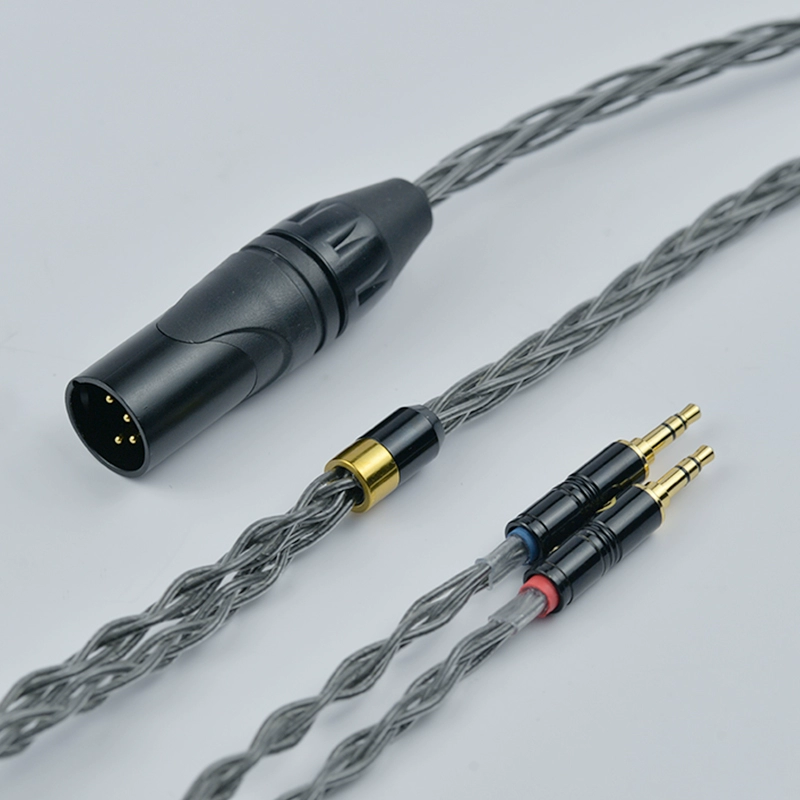
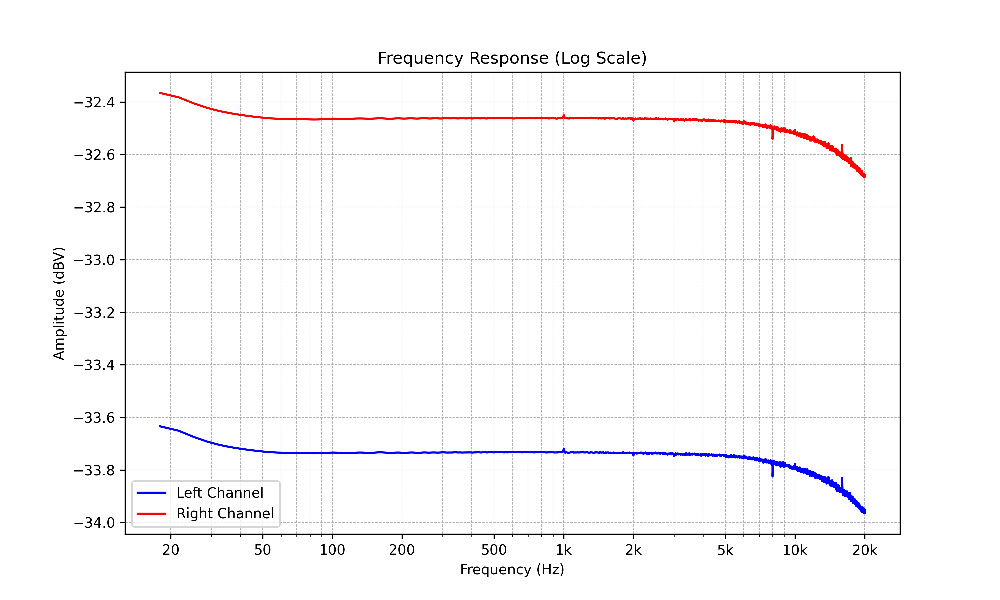

# 数字音频回放系统

播放音乐，严谨地讲叫做回放数字音频。音频信号分为 **模拟信号 analog signal** 和 **数字信号 digital signal**，模拟信号相当于用电波描述声波，而数字信号相当于用一个个采样点描述连续的波

回放数字音频的过程包括 **数字音频解编码**、**数字音频信号转换为模拟音频信号**、**模拟音频信号放大** 和 **模拟音频信号转换为物理声音信号** 四个步骤，其中数字音频解编码以及模拟音频信号放大可能在传输中发生多次

对应这几个步骤的，分别是：**音源 source**（如电脑、CD、数播等）--> **解码器 dac**（如 Fosi Q6）--> **放大器 amplifier**（如 Fosi V3 mono）--> **扬声器 speaker**（如 Fosi SP601、i5）。音源、解码器和放大器常被发烧友统称为“前端”

## 数字信号与接口

**数字信号就是一串可以被解释为振幅的 0 和 1**。我们在硬盘、光盘/CD 等介质上储存的数字音频信号就是上图中阶梯状的描述，在被 **数模转换器 Digital-to-Analog Converter, DAC** 转化成模拟信号并放大后，才可以输出给喇叭发出声音

> 数字音频与 DAC 章节中会详细介绍数字信号的性质

数字信号接口是音源和解码器之间传输数字音频信号的接口。不同的数字音频接口往往对应着不同的协议，不能简单地转接。不同的数字接口往往有各自适合的用途

如图是 SMSL VMV D3 高端解码的背部 IO，这是一个典型的解码器

USB（图例 12）是最常见、性能也很好的数字音频接口，它兼容多种协议，支持 DSD Native，而且有各种可以直接转接的形状。现在主流的 USB 音频协议有 UAC1.0 和 UAC2.0 两种，现在绝大部分音频设备以及操作系统都支持 UAC2.0 模式，只支持 UAC1.0 模式的设备基本就是 PS、XBOX、Switch 等游戏机了。**当客户问 xx 产品是否支持游戏机时，本质上就是在问设备是否支持 UAC1.0**

通常来说 USB-B 常见于台式解码器，USB-C 常见于便携解码器，但现在 USB-B 有被 USB-C 取代的趋势。USB 有时候还需要给低功耗的便携解码供电

光纤接口（图例 8）和同轴接口（图例 6）都基于 S/PDIF 协议，支持 DSD over PCM (DoP)，但最大码率支持不如 USB。由于光纤通过光信号传输，它的最大传输距离比同轴远得多

AES/EBU（图例 5）是常见于专业声卡的音频接口，它最常见的物理形态是三针 XLR（XLR-3）。**这种接口只能使用 AES 线材，不是所有 XLR-3 线材都能用**

I²S（图例 11）接口的物理形态和 HDMI 接口相同。I²S 接口本是用于机内传输信号的，它没有统一的标准，性能也不佳，且传输距离极短，常见于高端解码器中，可以用普通 HDMI 线材连接

如图是 SMSL PS100 解码的背部 IO。这个解码用 USB 供电，还有一个 HDMI ARC 接口。HDMI ARC 接口和 I²S 接口看着相似，可以用同一种线缆即通用 HDMI 线，但协议完全不同。HDMI ARC 本质上就是把 HDMI 中的音频信号回传给外置解码器，因此常用于电视、显示器外接音频解码器

如图是 FiiO K17 解码耳放一体机的背部 IO，这是一种集成了网络数字播放器和解码器的产品，其背后的 LAN 口，即 RJ45 网线接口也可以用于传输音频信号，且可以同时传输封面、歌词等元数据信息

## 模拟信号与接口

由于各种扬声器（包括音箱和耳机）的阻抗、灵敏度各不相同，它们需要的电压和功率也各不相同。DAC 输出的模拟信号常常无法为这些扬声器提供合适的电压和功率以及阻尼系数，因此还需要一个设备用于提供功率并优化阻尼系数，这种设备就是放大器

解码器与放大器之间的连接，前级放大器与后级放大器之间的连接，以及放大器与扬声器之间的连接都需要用模拟信号接口实现

如图是 SMSL VMV A1 Pro 氮化镓功放，其中 RCA 接口（图例 5）是单端线路输入 line input 专用的接口，用于输入 L 和 R 两个声道的单端信号。此时该功放工作在立体声状态下，即可以同时驱动左右两个音箱

XLR-3 母口（图例 6）是单声道线路输入 MONO IN 专用的接口，可以用来输入单个声道的平衡信号。此时该功放工作在单声道状态下，即只能用于驱动单个音箱。XLR-3 卡农口使用卡农线连接，这种用于传输模拟信号的卡农线和插头长得和 AES/EBU 线一模一样，但不可混用

上图左边是 RCA 线，右边是 XLR-3 线，即三针卡农线。RCA 线常用于传输单端信号，XLR-3 线常用于传输平衡信号

上图功放中的 Speaker output（图例 7、8）即喇叭接线柱 binding post，可以用裸露的电线或香蕉头直接连接音箱

---

如图是 Fosi DS2 小尾巴，较小的口是 3.5mm AUX 耳机接口，其中较大的口是 4.4mm AUX 耳机接口

如图是钰龙 DA11 解码耳放一体机，其中左侧为四针 XLR，即 XLR-4 平衡耳机接口，这种接口常用于台式耳机放大器，有些还带有锁止结构。中间是 6.35mm AUX 单端接口，这种接口与 3.5mm 接口没有什么本质区别，常见于台式放大器和专业声卡中

---

如图是拓品 EHA5 静电耳机放大器，这种接口是静电耳机专用的接口，俗称“STAX 口”

（平衡与非平衡信号的概念以及 AUX 接口的线序定义问题会在前端设备工作原理章节中详述）

# 信号的畸变

任何音频回放系统都会对信号造成一定的畸变，这个畸变越符合我们的需求，我们就认为这个系统越好，这就要求系统中包括解码器、放大器和扬声器在内的各组件都具有优秀的信号传输性质

任何音频回放系统都只有两个特性：线性特性 Linearity 和非线性特性 Nonlinearity。线性特性即 **频率响应 frequency reponse**，非线性特性即失真。理想的音频回放系统是无失真的

单声道回放在音质方面只有两个问题：**频响和非线性失真**；多声道回放除此之外还有两个问题：**偏音和串扰**

## 频率响应

频响曲线通常指幅频响应曲线，它和 幅度-频率频谱图 非常类似，横坐标是对数尺度的频率，纵坐标是对数尺度的增益（通常以 dB 为单位）

如图是 Fosi K7 的幅频响应曲线，简称**频响曲线**或**频响**。该频响曲线说明在 20Hz 处的增益比 1kHz 处低约 0.5dB。这意味着假设音频中 1kHz 处的幅度是 mdB，20Hz 处的幅度是 ndB，经过该系统后 1kHz 处的幅度变成 xdB，则 20Hz 处的幅度就会变成 (n-m+x-0.5)dB

对于解码器和放大器来说，我们希望频响曲线在 20-20kHz 内尽可能平直，评价这个平直度可以通过 ±XdB (20-20kHz) 这个指标来衡量。在不同工况（比如不同电压、电流负载下），X 会有所变化。一般来说，对于高保真解码/放大器 X 应该小于 0.5

**频响曲线的极低频部分越平直，越能延申到 20Hz 不发生衰减，则“低频下潜”越好；反之，频响曲线的极高频部分越符合目标曲线，越能延申到 20kHz 不发生远低于目标曲线的衰减，则“高频延展”越好。解码器、放大器和监听音箱的目标曲线一般是在可闻频段内保持平直或略有斜率，耳机的目标曲线则各异，通常近似于哈曼曲线**

---

频率响应其实还包括 **相位-频率响应**，简称 **相频响应**，可以通过 **群延迟** 描述。现代解码器/放大器中的相频响应通常都非常好，一般无需担心

## 失真

失真的成因非常复杂，了解和分析每一种失真的成因是研发人员的事，我们知道一些最基本的即可

### 最大不失真功率

放大器有其功率的极限，当它试图输出超过这个极限的功率时，就会发生**削波**，导致失真剧增或触发保护电路

放大器的**最大不失真功率**指的就是它在特定负载下能输出的最大功率，这项指标被发烧友称为**推力**。通常来说，最大不失真功率指的是放大器在 1kHz 处 THD+N<1% 时的最大功率

放大器的最大不失真功率和耳机/音箱所需的峰值功率的差值被称为**功率储备 headroom**

**推不动**指的实际上是功率储备不够造成削波的情况，但发烧友说推不动大多数情况下只是他们觉得放大器“配不上”耳机/音箱而已

### 失真和 THD+N/SINAD

**总谐波失真加噪声 Total Harmonic Distortion + Noise (THD+N)** 表示有多少失真和噪声污染了信号

检测 THD+N 的方法如下图所示，输入一个测试信号然后检查输出信号

把 20-20kHz 的信号轮流用作测试信号，就叫**扫频**。扫频得到的 THD+N 结果如下图所示

THD+N 可以用 dB 或百分比表示，假设 THD+N 为 XdB，Y%，则 X 和 Y 的数量关系符合 X=20lg(Y)-40

| 百分比  | 分贝   |
| ------- | ------ |
| 1%      | -40dB  |
| 0.1%    | -60dB  |
| 0.01%   | -80dB  |
| 0.001%  | -100dB |
| 0.0001% | -120dB |

**信纳比 Signal-to-Noise And Distortion ratio (SINAD)** 是 THD+N 的倒数，表达**信号比污染强多少倍**，是一种概念的两种解读方式

### 动态范围 DR 和信噪比 SNR

**动态范围 Dynamic Range (DR)** 是指信号的最大幅度和**本底噪声 Noise Floor** 的比例。噪声在全频段内均匀分布，几乎不随着音量调节而改变，但通常会随着硬件增益提高而提高

**信噪比 Signal-to-Noise Ratio (SNR)** 即信号与噪声的比例。音量越低，底噪在信号中占比越大，信噪比就越低。因此，由于实际聆听中不可能把音量打满，信噪比往往远低于动态范围；而且在动态范围相同时，最大不失真功率越大，底噪就越大，因此在相同功率下的信噪比就越小，这解释了为什么使用用于驱动音箱的功放驱动耳机时会产生较大的底噪

如图，有两款动态范围均为 110dB 的放大器，左边低功率放大器的峰值功率 90dB，底噪 -20dB；右边高功率放大器的峰值功率 100dB，底噪 -10dB；当我们只需要 70dB 的输出时，左边的放大器的信噪比就只剩 70-(-20)=90dB，而右边的放大器的信噪比就只剩 70-(-10)=80dB 了

实际情况通常复杂得多，但 **“推力”不是越大越好，用于驱动对应耳机/音箱的放大器如果功率过高就容易导致听到底噪，烧友口中的“力大声粗”就是这个含义**。用于驱动无源音箱的功放不适合驱动耳机就是这个道理

## 串扰和偏音

**串扰 Crosstalk** 就是声道互相干扰的现象，通常用 dB 衡量其程度

**偏音 Channel Imbalance** 就是不同声道的增益不一致，通常也用 dB 衡量其程度。电位器在低音量下容易造成可闻偏音，而数字音量调节方式不会产生这种问题。这个后面讲

上图是钰龙金丝雀 2 的频响曲线，可以发现左右声道的红蓝两条线增益不一致，这是由电位器导致的

---

以后我们还会了解别的失真
