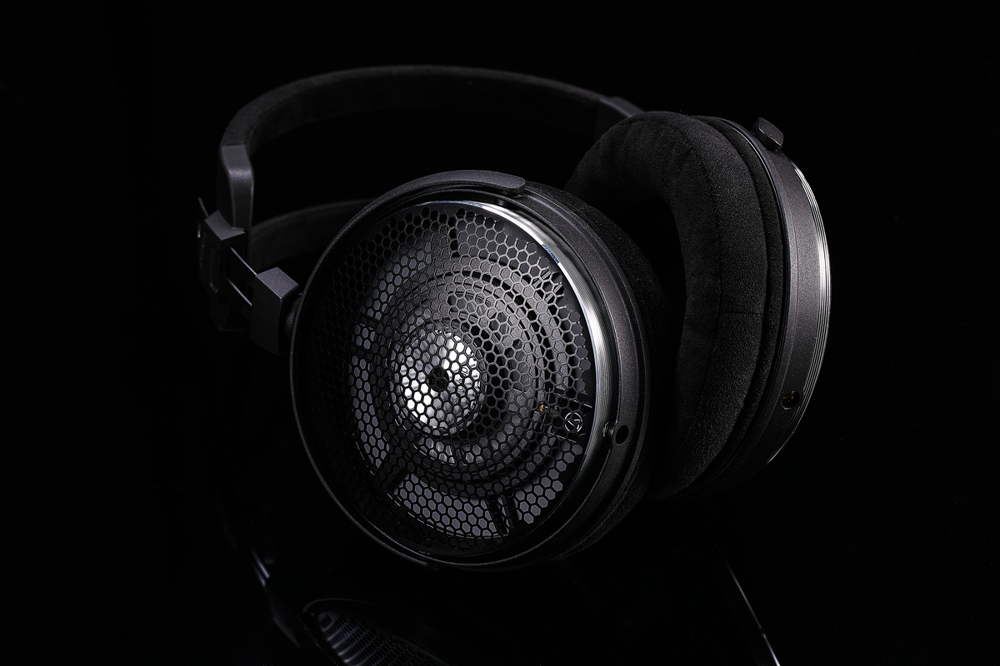
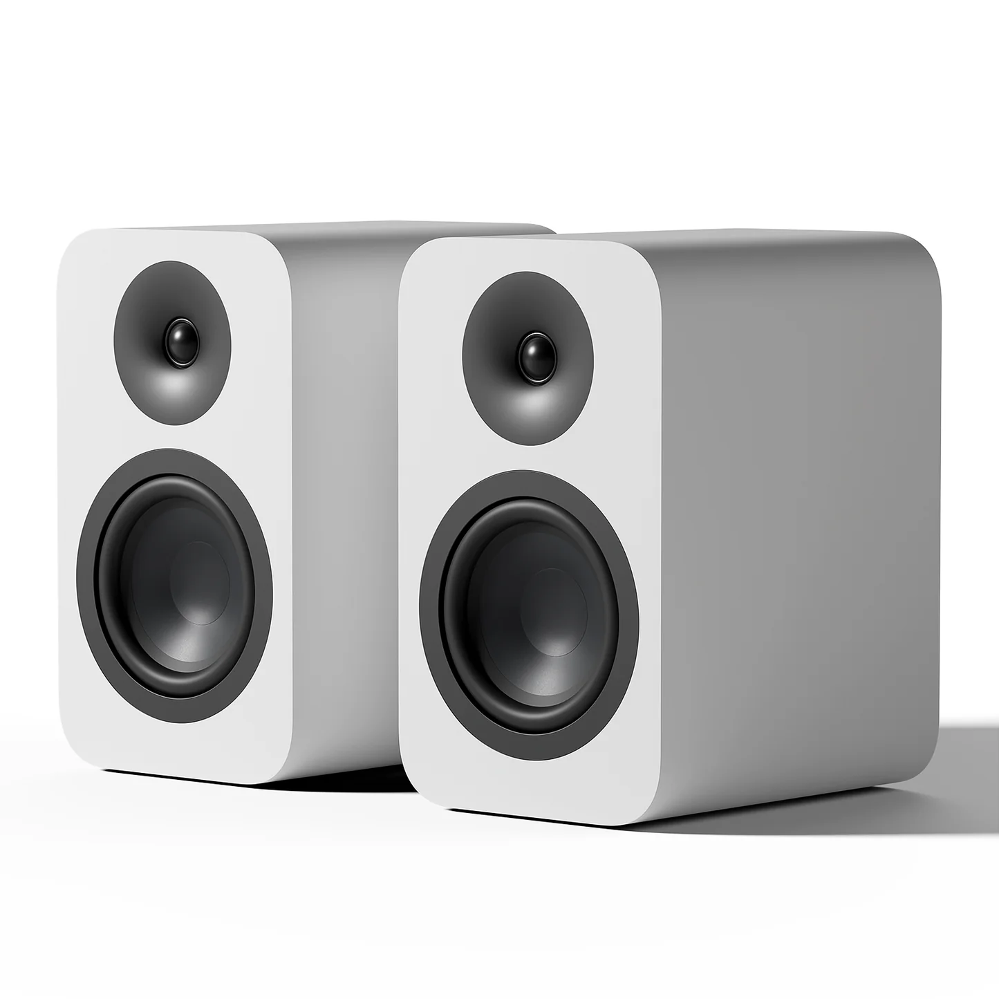
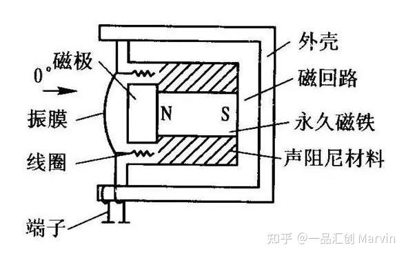
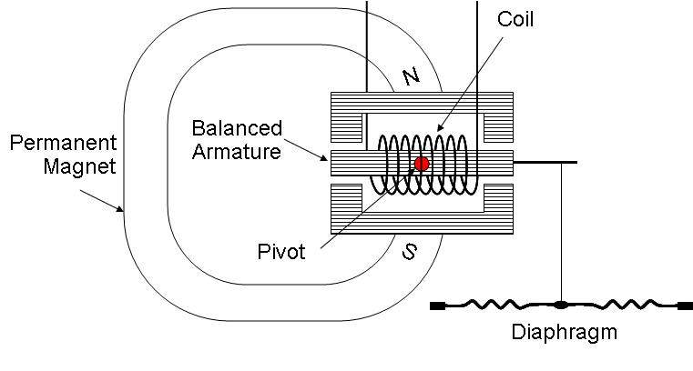

**任何能发出声音的电子产品都需要电声换能器 electroacoustic transducer**，麦克风中的电声换能器把声能转化成电能，扬声器中的电声换能器把电能转化成声能。扬声器中的电声换能器俗称扬声器**单元 driver**

换能器具有阻抗 impedance、灵敏度 sensitivity、换能效率 efficiency、频响 frequency response、失真 distortion 等性质。常见的电声换能器有动圈、平面磁、静电、动铁、气动、铝带、压电等

# 动圈 Dynamic Coil

动圈是最常见的电声换能器，它主要由振膜、音圈、磁铁三部分组成。原理是当音频电流信号通过永磁铁产生的恒定磁场中的音圈时，音圈会受安倍力带动振膜驱动空气发出声音

以下是动圈的一些常见术语——

- **振膜 diaphragm** 是扬声器直接推动空气的部分，振膜面积、材质、结构直接影响声音表现
- **音圈 voice coil** 是磁场中的导电线圈，通电时会受到安倍力
- **磁铁 magnet** 产生永磁场
- **悬边 suspension** 是振膜边缘的一个柔软结构，它让振膜本身有足够大的冲程 stroke，即活塞运动的容许距离，来推动空气
- **弹波/定心支片 spider** 是位于音圈下方，保持音圈在磁隙中的居中位置，防止偏移或擦圈的一个弹性结构
- **防尘帽 dust cap** 是振膜中间的结构，除了防尘以外也有声学作用
- **球顶 dome** 是一种振膜类型，常见于音箱的高音单元。Fosi SP601 的高音小球就是球顶，记得别用手去按
- **框架 basket** 用于固定刚性结构

其他类型的换能器有时候共用术语，但描述的形态各异

# 平面磁 Planar Magnetic

平面磁换能器的一种典型结构如上图所示，这类换能器也由振膜、音圈、磁铁三部分组成，但这类换能器的音圈更像是振膜上的一个附着物，因此常将音圈视作平面磁换能器振膜的一部分

这种典型的平面磁换能器结构中，磁感线会水平穿过附着在振膜基材表面的音圈/导线，音圈受力振动时会带动振膜一起振动。平面磁耳机的振膜基材通常为非常轻薄的塑料，音圈由于通常是延展性较好的金属，可能比振膜基材更薄但反而重得多

平面磁换能器由于运动部件（振膜）的质量非常轻，惯性小，所以失真通常极低，缺点是灵敏度/换能效率极低。另外，由于平面磁换能器需要大量磁铁产生大面积永磁场，自身重量往往很高

# 静电 Electrostatic

静电换能器与以上两种换能器有本质的不同。静电换能器的发声原理是将极薄的导电材料夹在两个带静电荷的电极板之间，这两个极板构成了一个电容，当音频信号改变电容的状态时，电容就会对夹在中间的带电振膜施加变化的库仑力使其振动发声

静电换能器成本极高，振膜极其轻薄，稳定性非常糟糕，失真极低，整机不需要磁铁，可以非常轻，是高端的象征。传统静电耳机通常无法通过普通的耳放驱动，必须要用能产生几百上千伏电压的静电放大器驱动（电流极小，电不死人）。森海塞尔的大奥就是静电耳机

静电换能器主要分为驻极体和传统两种，其区别在于驻极体静电换能器的振膜自带永久电荷，而传统静电换能器需要外接一个极化电压。所有耳塞上的静电换能器都是驻极体类型的，而且通常只用作高频单元

**静电耳塞单元是高技术产品，不在我们能力范围内，通常直接采购并设计分频器即可。静电头戴式耳机的工程难度也很高**

> 平面磁和静电换能器由于振膜都是一张平面，都被称为平面式换能器；其中平面磁常被简称为 planar，静电被简称为 estat。平面磁换能器是人们结合了动圈的发声原理和静电的结构设计做出来的中间产物

# 动铁 Balanced Armature

动铁是一类只用在耳塞中的小体积换能器，优势和静电类似，高频失真和频响表现比较出色，灵敏度/换能效率也非常高

**动铁耳塞单元是高技术产品，不在我们能力范围内，通常直接采购并设计分频器即可**

# 其他

铝带 Ribbon 和气动 Pneumatic 换能器可以用作音箱的高音单元以及头戴式耳机

压电 piezoelectric 换能器常见于耳塞中，功能和使用场景类似动铁

# 电声换能器的共性

任何一种电声换能器，都依赖 **电压和电流** 信号使其振膜在磁场或电场中受力来发出声音；但不同的换能器对电压和电流的敏感程度不同，因此具有不同的 **灵敏度** 和 **阻抗**，需要不同的放大器来驱动
