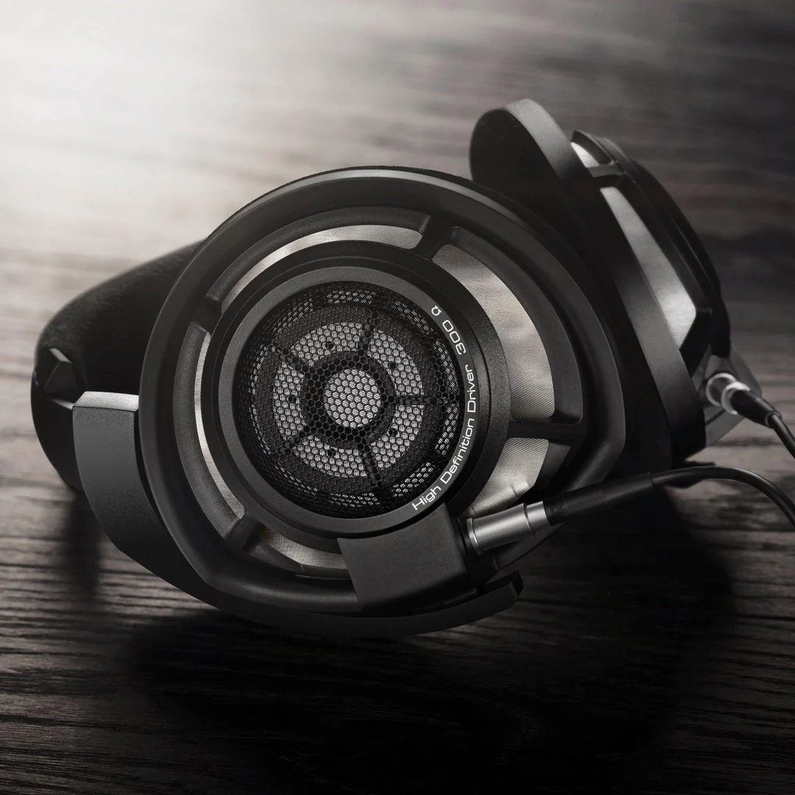

# 头戴式耳机 Over-Ear Headphones

头戴式耳机被发烧友称为“大耳”，分为耳罩式耳机和压耳式耳机。初步认识一款有线头戴耳机可以从 **单元类型、声学结构、佩戴和做工、灵敏度和阻抗、音色** 几个方面切入，根据以上信息可以判断出该耳机适合与不适合的 **使用场景**。在一款耳机立项时，设计者一般需要先确定使用场景，再设计其具体的形态，但一款成品耳机的营销策略则依赖于这款耳机发售时营销人员对该产品以及市场需求的认识

**根据营销材料判断某款耳机适合的使用场景是毫无意义的，也不能只根据耳机本身不考虑市场就锁定营销面向的人群。** 一款标榜自己是“HiFi 耳机”、“监听耳机”或“游戏耳机”的产品很可能完全不适合用于听音乐、监听或打游戏，而很多调音以及形态符合特定场景需求的耳机也往往并不以“HiFi 耳机”、“监听耳机”或“游戏耳机”自居；这是因为绝大多数消费者对耳机产品缺乏认识，而营销把产品卖给更多的人比把产品卖给对的人更重要

## 耳机单元

头戴式耳机的单元主要采用动圈、平面磁和静电三种，也有个别使用气动和铝带单元做头戴式耳机的，这里不做详述

动圈是最常见、最通用、综合表现最好的头戴式耳机单元。头戴式耳机的动圈单元的尺寸（直径）通常在 30mm 到 60mm，蓝牙耳机为了便携和降低重量尺寸通常较小，而用于发烧友耳机的动圈的尺寸通常会大一些。动圈的尺寸越大，推动相同量的空气需要往复的距离越短，因此低频失真往往就越小，下潜也更深（详见下文中的频响曲线讲解）

动圈头戴式耳机的阻抗通常在 32Ω 到 600Ω 以内，早期动圈耳机如 HD600 由于需要搭配高输出阻抗的放大器，阻抗通常比较高；大多数现代动圈耳机的阻抗不会 32Ω 左右，因此最好搭配低输出阻抗的放大器使用

在近十年内，平面磁耳机（又称平板耳机 planar headphones、平面静磁耳机 planar magnetostatic headphones，英文简称 planar。其中“平板耳机”是一个不太严谨的，但国内最常用的搜索词和称呼）异军突起，迅速挤占了动圈耳机的市场。平面磁耳机的阻抗普遍较低，普遍在 8Ω 到 64Ω 以内。由于平面磁换能器效率普遍低于动圈，发烧友通常认为平面磁耳机更“难推”，必须使用优质放大器才能驱动

---

大多数平板和动圈耳机的电抗在 1kHz 左右不大，因此我们可以假设耳机的阻抗等于电阻，此时该耳机的电压灵敏度为 $S_{V}(dB/V)$，功率灵敏度为 $S_{mW}(dB/mW)$，阻抗为 $|Z|(Ω)$。则它们满足以下关系

$$S_{mW}\approx S_{V}+10lg|Z|-30$$

要将一个耳机推到 $I(dB)$ 的声压级，需要的等效电压 $U(V)$ 和实际功率 $P(mW)$ 分别为

$$
U=10^\frac{I-S_{V}}{20}\\
P=10^\frac{I-S_{mW}}{10}
$$

[在线耳机灵敏度、阻抗和推力需求计算器 -headphonesty.com](https://www.headphonesty.com/headphone-power-calculator)

---

  
  

以上是市面上几乎所有我能找到相关信息的动圈和平面磁耳机的灵敏度和阻抗分布，可见 **灵敏度低于 106 dB/Vrms 和 94 dB/mW 的头戴式耳机就算相对比较“难推”的耳机**

作为营销人员，需要 **结合产品定价、灵敏度及宣称的用途来决定是否建议用户搭配独立耳放 以及搭配怎样的耳放**。如果客户使用动圈耳机，那么主要根据定价、dB/Vrms 灵敏度和阻抗推荐搭配耳放的价格；如果客户使用平面磁耳机，那么主要根据定价、dB/mW 效率来推荐搭配耳放的价格；如果客户使用的平面磁耳机的效率低于 90dB/mW 且用在前端的预算并不充足，则也可以推荐他搭配用于音箱的功放去驱动耳机

**注意：以上是完全出于统计发烧友的消费习惯和经验做出的，以销售为目的的判断。事实上，在 32Ω 下具有 500mW 最大不失真功率的放大器就足以良好驱动地球上几乎所有平面磁以及动圈耳机**

---

动圈耳机的阻抗是会随频率变化的，其在低频的隆起往往意味着该耳机在这个频率附近发生共振，会产生较大的失真。这个频率被称为 **谐振频率 F0**。为了追求更深的低频下潜，耳机设计者通常会尽可能降低 F0 的值。下图是 铁三角 ATH-R70x 的阻抗曲线，可见其 F0 在 90Hz 附近

也有一些动圈耳机的 F0 难以从阻抗曲线中看出来，比如 Aune AR5000

一般来说平面磁耳机具有不随频率变化的恒定阻抗，但同一款平面磁耳机的不同个体之间阻抗可能会有高达 ±10% 的区别；这是因为平面磁耳机的音圈镀层极薄，厚度很难控制，导致阻抗产生区别；所以平面磁耳机的制作流程包括筛选阻抗、频响相近的一对对耳机单元进行匹配，以不让用户感知到耳机偏音

下图是一个 Hifiman Susvara 的阻抗曲线

美国 HiFi 厂商 Dan Clark Audio (DCA, Mr. Speakers) 在平面磁耳机中加入了无源器件以调节耳机的频响，因此 DCA 的许多平面磁耳机的阻抗也会随频率改变而变化。这种操作能使他们的耳机产品频响更加贴合目标频响曲线

所有耳机包括平面磁耳机都有谐振频率，且常常不止一个，但谐振最显著的频段一般在 80Hz 左右

---

静电耳机 electrostatic headphones，简称 estat。这类耳机的 QC 和稳定性优化极其困难，有能力设计并量产的厂家极少。目前世界上做 HiFi 静电耳机品牌只有 Stax、Hifiman、Warwick Acoustics、森海塞尔（消费者）、Audeze、DCA 等寥寥几家

Stax 是日本高端静电耳机品牌，是漫步者的全资子公司。由于其在静电耳机领域的领导地位，各静电耳机厂商普遍使用其规定的五针接口作为静电耳机的通用接口，称为“Stax 口”

---

铝带耳机的主要品牌目前只有金平面 Goldplanar 和 RAAL 两家，这类耳机阻抗极低，必须使用专用放大器或在普通耳放后接阻抗适配器驱动

气动耳机的主要品牌目前只有金平面和 HEDDphone 两家，这类耳机可以使用普通耳放驱动

## 音质评价

头戴式耳机的声学设计分为封闭式和开放式两种。开放式耳机的隔音性能较弱，还会向外产生漏音，但由于腔体设计比较自由，更易于调整声音，通常认为音质总体上优于封闭式耳机；因此 HiFi 耳机大多是开放式的，而主流头戴式蓝牙耳机都是封闭式的。发烧友常朴素地认为**开放式耳机比封闭式耳机更“通透”**

评价一款耳机的客观音质，主要从频率响应和失真两个方面考虑，相频比较复杂先不管

上图是一种哈曼曲线，这是符合大多数人类听音偏好的“三频均衡”的频响曲线，也恰好是在一个混响良好的房间内一对频响平直的理想音箱对人耳产生的传递函数。我们通常将一副耳机的频响叠加到哈曼曲线上以查看这副耳机的频响平直度以及三频分布（三频即低频、中频、高频）

如图是 Fosi Audio i5 的频响曲线，具体如何解读频响曲线会在 主客观音质评价 章节中详细讲解

HiFi 领域的绝大部分底噪都是有源设备产生的。无源耳机本身并不储存能量，它不可能主动发出任何底噪，因此衡量耳机失真情况常用总谐波失真（THD）而非总谐波失真+噪声（THD+N）

通常来说，设计良好的静电耳机的 THD 小于平面磁耳机，平面磁耳机又小于动圈耳机。但随着材料学和结构设计的发展，这种差异已经不再显著。上图是开放式动圈耳机奥莱尔 AR5000 的 THD，可见它的 THD 也极小

# 入耳式耳机 In-Ear Monitor, IEM

入耳式耳机被发烧友称为“塞子”

<!-- 这部分需要求助罗锦芸经理 -->

# 立体声音箱 Speakers

<!-- 这部分需要求助晏细猫经理 -->
