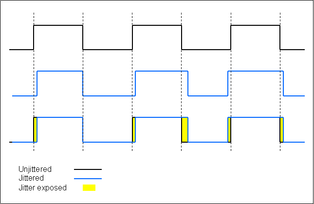

# 数字信号

现代音乐从录制到回放的过程类似于用甘蔗制糖再用糖泡糖水的过程：

- 录音师将现实世界中的声音记录成模拟信号（采集甘蔗并榨汁）
- Analog-to-Digital Converter, ADC 将采集到的模拟信号转换为数字信号（把甘蔗汁制成蔗糖）
- 混音师和母带师将这段数字信号制成成品数字音乐比如流媒体或 CD（将蔗糖调味好打包装进罐子里）
- 用户获取数字音乐（购买打包好的蔗糖罐头商品）
- Digital-to-Analog Converter, DAC 将输入的数字信号转换为模拟信号（把蔗糖泡成糖水）
- 用户将模拟信号输出给喇叭，收听音乐（喝糖水）

之所以要把甘蔗汁制成蔗糖是为了方便调味、储存和运输，食用时还是得把蔗糖泡水才好喝；把模拟信号转化为数字信号储存，再转化为模拟信号来收听的意义也是一个道理

信号是有质量优劣之分的。把甘蔗（声音）榨成甘蔗汁（模拟信号）再提炼出蔗糖（数字信号）的过程会引入一定的损耗（失真），把这堆蔗糖泡成水并不能完全还原甘蔗汁的味道，甘蔗汁更没法代表甘蔗的味道

要使蔗糖达到泡起来没什么异味的地步，需要达到多少纯度呢？这取决于蔗糖中杂质的成分以及人舌头的敏感度。类似的，要让数字音频信号对人类来说能够“还原”整个可听范围的频谱，也取决于信号的失真状况、人耳的可闻频率上下限（20-20kHz）、可分辨的最小声压（即听阀）以及可忍耐的最大声压等

# 信号的采样与混叠失真

根据 **奈奎斯特采样定律**，为了不失真地恢复模拟信号，数字信号的 **采样频率** 应该大于等于模拟信号频谱中最高频率的 2 倍。因此，要足够还原高达 20kHz 的声音，采样率至少得超过 40kHz。由于消费级数字音频的开创者 CD 的采样率规格是 44.1kHz，目前音乐的主流规格仍是 44.1kHz；后来 Intel 牵头制定的 HD Audio 规范则规定 48kHz 作为标准音频采样率，于是 48kHz 又在影音游戏等非音乐的音效上普及开来，因此，Windows 和安卓手机的默认采样率一般都是 48kHz

不过，音源设备经常需要同时播放不同采样率的音频，比如在听一首 44.1kHz 的音乐同时手机播放一段 48kHz 的提示音，这就需要音源用 CPU 执行 **采样率转换 Sample Rate Conversion, SRC**，把声音统一重采样到 48kHz 等 DAC 兼容的频率再输出

不过，SRC 在非整倍频率互相转换时会导致**混叠 aliasing**，混叠失真的严重性与操作系统的音频算法有关；因此，发烧友会通过播放软件独占音频输出、使用专用播放器取代手机听音乐等办法竭力绕过 SRC，唯恐避之不及。然而 SRC 是非常必要的，假如没有它，任何两段音频都不可能同时输出

现代 SRC 算法下混叠已经轻微到人类不可闻的程度，我们通常不需要主动建议独立 DAC 的用户开启独占输出来主动绕过它，以减少兼容性和售后问题；如果用户就是想体验音乐“源码直出”的感觉，或发现 DAC 显示的采样率与音乐不符，我们就需要建议 Ta 使用 Foobar2000（Windows）、海贝音乐（安卓手机）等专业播放软件开启独占输出，或建议开启 QQ 音乐等流媒体的独占模式

有些操作系统还带有自适应采样率功能，能够避免听音乐时 SRC 对音质的影响

# 信号的量化和量化噪声

在采样后，模拟信号的振幅还需要被量化才能够被硬盘、CD 等离散数据储存媒介记录

采样率确定了信号在时间尺度上的精度，而 **位深**，即 **量化位数** 则确定了信号在振幅尺度上的精度

最常见的位深是 16bit，即 CD 规格的位深。16bit 意味着这种位深能够记录 $2^{16}=65536$ 个振幅，因此能够表达的最大 **动态范围**，即最大声压级和最小声压级的差值是 $20*lg65536\approx 96dB$

！注意，**动态范围** 以及 **动态** 这两个词在不同语境下有不同含义，它们的含义互有相似之处，但是在不同领域不能混用，否则会造成误导或被质疑专业性

- **数字音频编解码**（计算机科学）：  
  最大动态范围由 **位深** 决定。16bit 音频理论动态 96dB，24bit 可达 144dB，但实际受噪声整形和抖动技术影响

- **音乐制作行业**（混音/母带制作）：  
  动态范围指 **音频信号中最大峰值与最小可闻噪声之间的电平比值（dB）**。混音时常需要通过 **动态范围压缩** 以兼容大多数音乐回放环境，母带阶段需平衡动态保留与整体响度的矛盾。高动态作品层次感强，但需优质回放系统才能展现细节

- **电声工程**（声卡/解码/功放）：  
  动态范围指 **设备可输出的最大不失真信号与本底噪声的比值（dB）**，是衡量信噪比与线性度的核心指标。高端设备动态范围可达 120dB 以上，能更精准还原微弱信号与突发强音

- **发烧友术语**：  
  “动态”被感性描述为 **声音强弱对比的戏剧性表现**，包含“瞬态/瞬间感”、“力量感”与“微动态细节”等主观描述。常以“动态凌厉”“收放自如”等主观评价，反映系统表达音乐的情感张力。发烧友所说的“动态”和以上几种毫无关系

由于量化的精度是有限的，数字信号在量化过程中就会引入一些失真，由于这种失真的能量均匀地分布在整个奈奎斯特频率（即采样率的一半）范围内，非常类似于常见的噪声，我们称之为 **量化噪声**

**量化噪声的总量只取决于量化精度而非采样率，不过，更高的采样率可以将量化噪声更多地分布在超声波频段，也相当于降低了人耳可闻频段内的的量化噪声**

# 信号的编码与方波

对信号进行量化后，我们就可以将其幅度表示为一个二进制数，比如 3412 -> 110101010100、-123 -> 10000101、22014 -> 101010111111110……这些二进制 0 和 1 可以用 **方波** 来传输。我们把方波的高电平定义为 1，低电平定义为 0，通过高频切换电压来传输数字信号

我们在 [1. 声和声的感知](./1.%20声和声的感知.md) 中了解到方波是由无穷多个高频高频信号组成的，因此完美还原一个方波需要无穷大的频宽，这显然是不现实的。实际的方波随着信号传输链路的频宽增大而更贴近理想中的方波，这种现象被称为吉布斯现象

导致数字信号失真的不止有吉布斯现象。各种干扰都很容易导致数字信号的 0 和 1 电平变成-0.01 和 0.99 电平，但是，数字信号的接收设备仍然会将 -0.01 视作 0，将 0.99 视作 1；因此，即使数字信号发生了一定畸变，只要不过于严重，接收端仍然能够对信号进行完美的重整。这就是数字信号可以完美复制和传输的原因之一

# 信号的时序与时基误差

数字信号连续的高电平和低电平之间并没有什么“标记”来表明它表明连续的几个 1 或者 0，这就需要一个信号发射端和接收端都认可的 **时钟信号** 来确认一段数字信号的频率和采样点

没有走时绝对准的时钟，也没有时间绝对均匀的数字信号。数字信号传输链路中的 **时基误差 jitter** 也会导致方波的畸变

时基误差导致的信号畸变类似于转速不够稳定的黑胶唱机，黑胶唱机转速不稳会导致输出信号频率畸变，而数字信号的时基误差则可能直接造成爆音。不过，时基误差并不会在数字信号的传输中被保存下来，数字信号的每一次重整都会清除其所积累的所有时基误差，因此对于整个回放链路我们只需要关注 DAC 环节的时基误差即可

# 解码器与 DAC

DAC 即 Digital-to-Analog Converter，数模转换器，用于将数字信号转换为模拟信号。以 DAC 为核心的设备被称为“解码器”

以上是 Fosi Audio ZD3 解码器的外观和芯片配置。音源设备可以通过 USB、S/PDIF、HDMI ARC 以及蓝牙等方式将音频信号传输给 ZD3 的 XMOS XU316 或高通 QCC3031 蓝牙接收芯片进行解编码，再通过它的 DAC，即 ESS 的 ES9039Q2M 转换成模拟信号输出

现代 DAC 普遍是 Σ-Δ 架构的 DAC，用于 HiFi 的 DAC 芯片的主要设计商有美国凌云逻辑 Cirrus Logic, CS、亿世科技 ESS Technology, ESS、德州仪器 Texas Instruments, TI、日本旭化成 Asahi Kasei Microdevices, AKM 以及罗姆半导体 ROHM Semiconductor, ROHM。其中，最具性价比优势的是 CS 的 31993 和 43131/43198，性能指标最好的旗舰 DAC 是 ESS 的 9039pro

除了 Σ-Δ 架构以外，应用于 HiFi 领域的 DAC 还有一种叫 R-2R 的架构。R-2R DAC 和 Σ-Δ DAC 的关系类似于电子管和晶体管，R-2R 更复古、成本更高、性能更差，但近期也受到一些喜欢“模拟味”的发烧友热捧。Σ-Δ DAC 往往是集成芯片，流片成本极高；而 R-2R DAC 通常是一块 fpga，普通品牌也有能力研发

# 解码器的优化

**升频 over-sampling, OS** 是 DAC 前置非常重要的步骤，可以极大提高信噪比和频响平直度；不升频 non-oversampling, NOS 的典型表现就是高频发生衰减

数字信号的传输有 **同步** 和 **异步** 两种方式，这两种方式的区别在于锚定的时钟信号，现代音频设备间进行数字信号传输大多数是异步的。异步传输时，传输过程不带时间信号，只依赖接收端通过高精度时钟来对数字信号的时域信息进行重整。因此，一些发烧友通过给 DAC 外接更高精度时钟的方式来降低对音质有害的 jitter

数字信号的出错率极低，但也是客观存在的。因此，在长距离传输中，发射和接收端可能需要进行**数据校验**。**数字信号如果出错，导致的结果是通常是直接爆音或引发软件故障，而非损害音质。** 由于 USB Audio 的出错率极低，通常并不需要校验

# 数字信号的无线传输

数字信号的无线和有线传输没有什么本质上的不同，它们的区别在于误码率的大小。数字信号很容易在有线传输下实现**比特级精确**（即无损），有时不需要校验，有时需要通过校验确保极低概率的错误能被检测或纠正；而无线传输因信道环境复杂，存在更高误码风险，需要更强的纠错机制，因此发烧友常认为无线传输音质较低。然而，“音频是否通过无线传输”在目前已非主观音质差异的瓶颈

蓝牙音频协议需在编解码复杂度、码率、延迟、稳定性和兼容性等多方面权衡取舍，不存在各方面都最优的方案，因此多种协议互相竞争并各有适用场景。主流蓝牙音频编解码器包括：

- **SBC** 蓝牙强制基础协议，兼容性最强、成本最低，但音质在低码率下一般。**许多电脑内置蓝牙仅支持此协议**
- **AAC** 在苹果设备中广泛使用，通常音质优于低码率 SBC，但编解码更复杂
- **LC3** 核心优势为**低功耗、低延迟**，在较低码率下音质优于 SBC，是**蓝牙 LE Audio 的核心编解码器**，因此常用于“带 2.4G 头子的游戏耳机”
- **aptX** 由高通主导，综合性能较突出，在安卓中高端设备普及度高
- **LDAC** 由索尼主导，主打高码率传输，但高码率模式下稳定性欠佳
- **LHDC** 由华为/盛微主导，支持高码率并注重低延迟高音质，主要在华为/荣耀等安卓生态推广
- **手机厂商私有优化** 通常基于或兼容以上某个标准协议进行深度优化以提升稳定性和生态集成度等

以上协议都是基于蓝牙标准本身历史包袱比较重，已经成为了物联网的瓶颈之一，因此头部科技公司如华为推出了星闪技术来超越这个标准，而小米则在 Xiaomi Buds 5 Pro 上另辟蹊径使用 wifi 技术来传输音频，但目前以上技术尚未广泛应用于消费音频领域（华为为下游公司提供的技术支持太少）

# 数字音量

数字音量调节就是对数字信号的采样点的幅度值进行乘法运算。把一段音频中所有采样点的幅度乘 0.5，就是将它的声压级降低了 6dB；反之，把一段音频中所有采样点的幅度乘 2，就是将它的声压级提高 6dB。
