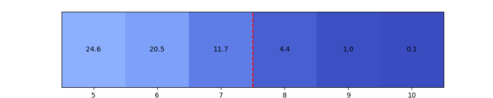
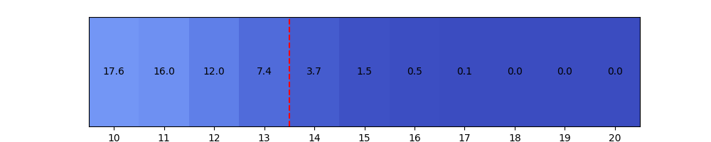
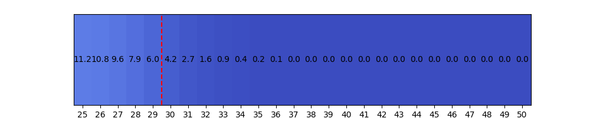

**“我能听出电源线的区别”**，一位发烧友如此坚称

---

w 博士对此表示怀疑，于是提出：“让我们检验这个命题吧！”并设计了一个 ABX 盲听实验

首先假设该发烧友确实能够听出电源线的区别，以最宽松的标准看，该命题可以翻译成“该发烧友盲听判断电源线的正确率大于 50%”。统计学上，这可以作为一个备择假设，以便我们稍后证实

相应的，其负命题“该发烧友盲听判断电源线的正确率不高于 50%”就是这个实验中待证伪的虚无假设

然后，w 博士协助该发烧友做盲听测试，发现在 m 次测试中，发烧友共判断正确了 n 次。如果上述虚无假设成立，判断正确 $n(n\geqslant0.5m)$ 次的概率 p 就应该不高于 $\frac{m!}{n!(m-n)!}0.5^m$，此时若 p 小于显著性水平 $\alpha=0.05$，就可以拒绝虚无假设，从而接受备择假设

---

有点抽象不是吗。于是 w 博士举了几个具体的例子：

当发烧友做了 4 次盲测，其中正确次数与置信度（%）的关系如图（图中数字为置信度，底部为盲测结果正确次数）

可见就算他全做对，这个数据也没有足够的统计学显著性（5%）

直到发烧友做了 5 次测试，如果全做对，这才能说他“盲听判断电源线的正确率很可能大于 50%”！那么进行 10 次盲测、20 次、50 次呢？

  
  

从上图可以看出，随着测试次数的增加，该发烧友证明自己需要的正确判断的次数比例显著减少了。如果该发烧友做 20 次 ABX 测试能对 14 次及以上，“更换电源线就很可能对他的盲听结果产生了影响”

---

当然，正确率仅仅稍微比 50% 高一点算个 p。我个人建议 **盲听判断电源线正确率低于 90% 的，就别谈什么线材的冷暖粗细了**，那么要证明自己的“盲听正确率很可能不低于 90%”至少需要多少次测试呢？

  

非常遗憾，至少得 29 次盲听全对，或者 44 次盲听至少对 43 次，你才能自称自己的盲听正确率 **很可能** 高于 90%。有同学可能会觉得这个难度太高了，但是 **统计学告诉我们不能拿偶然当规律，就像你不能 ABX 猜对一次就说自己盲听正确率 100% 一样**

要想知道发烧友所谓的“我能听出”到底有几分真实，不妨让他有空做一下统计学证明加持下的 ABX 盲听测试吧。要是连听个电源线都连蒙带猜，那还有什么声场、什么线条感、什么解析力好说的呢？

---

本文所用图表均由 [Python 脚本](../../analysis%20tools/abx.py) 生成
