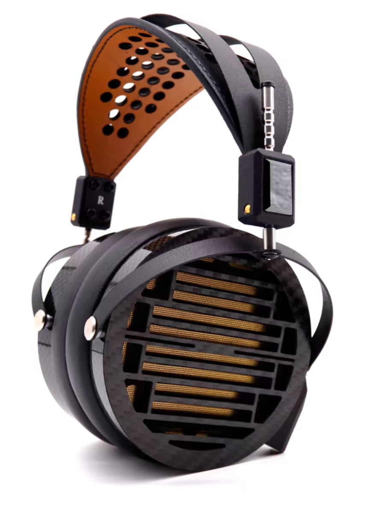
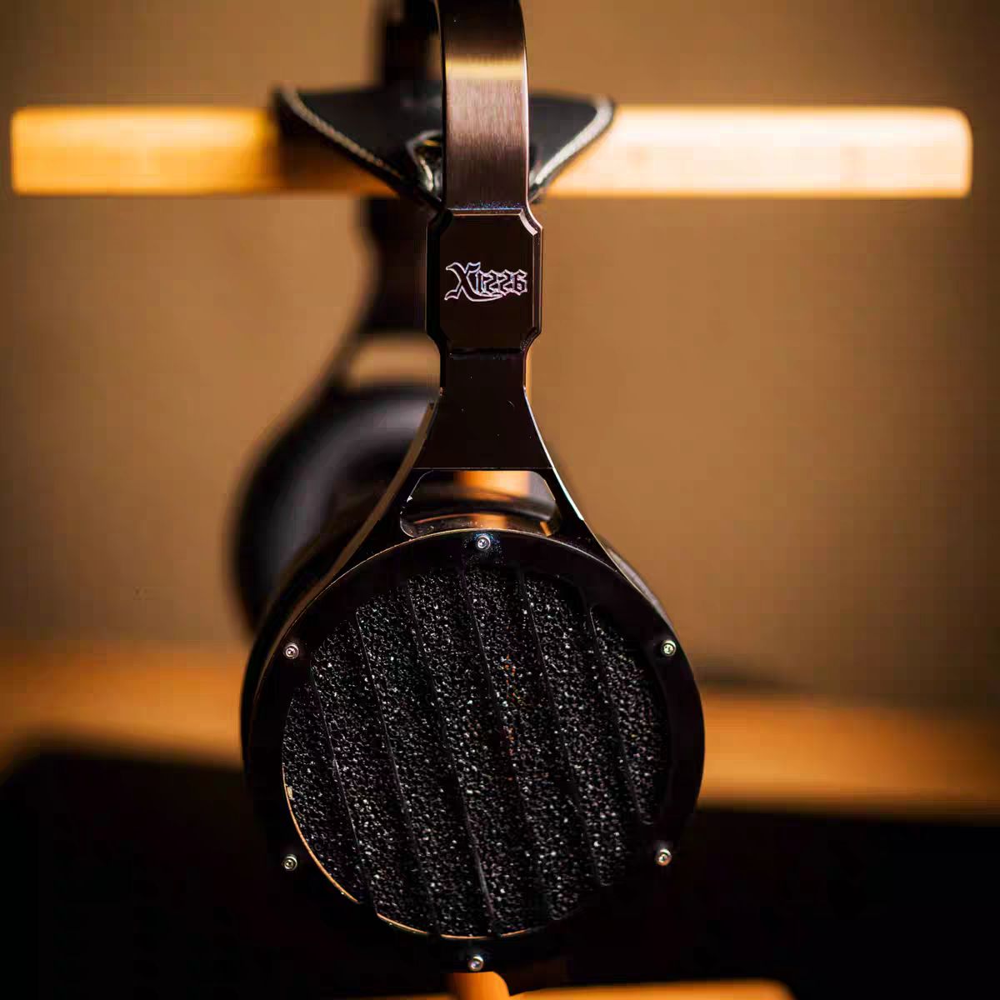
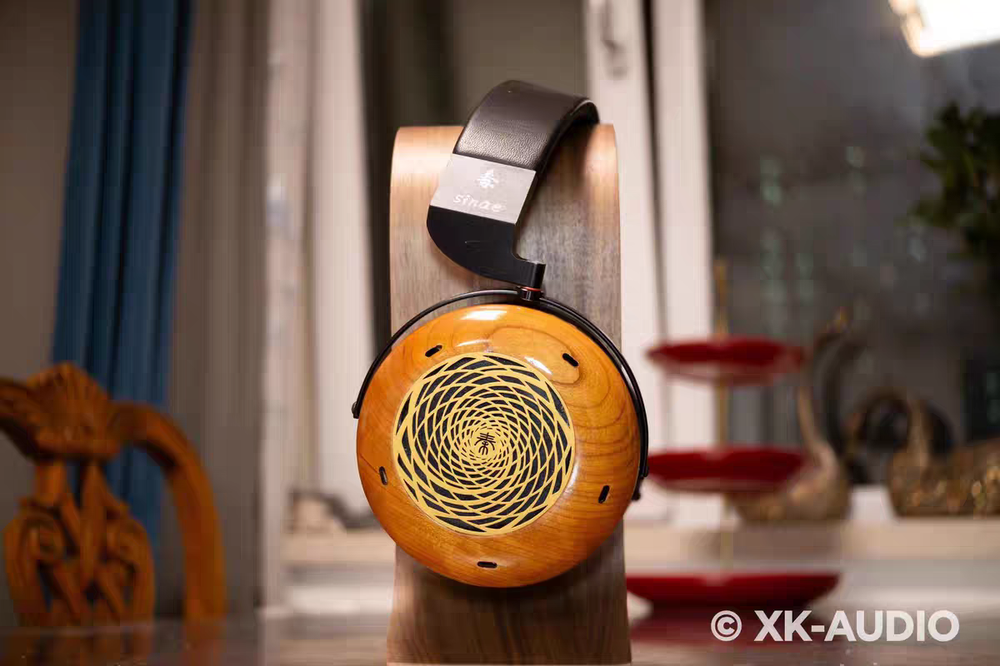
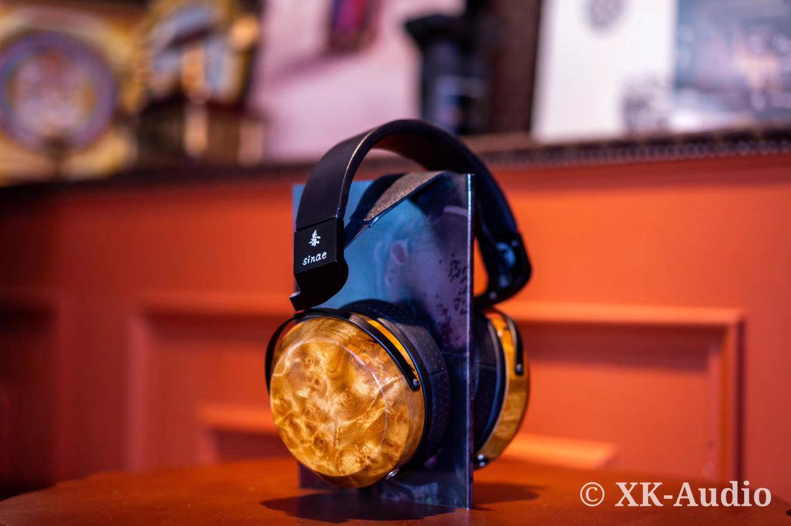
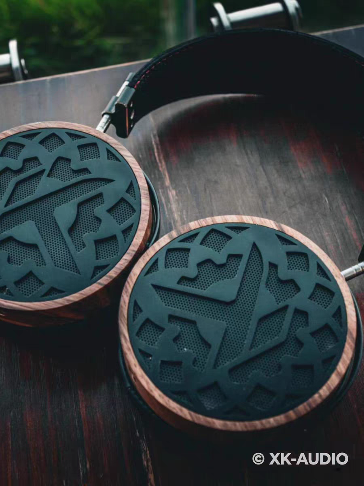
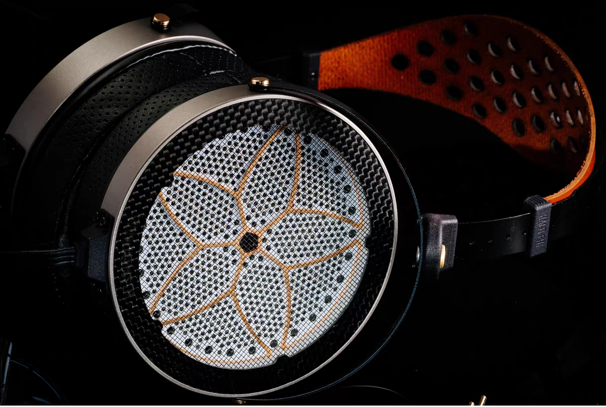

中国四家最著名的 diy 头戴式耳机作坊，按名气和名声降序排列，分别是 NAN、XK Audio、汤老师平板和虹曙音响。这里仅简述一下这些 diy 耳机作坊和产品的客观情况，避免提及主观听感

NAN 老板是中国范围内手艺一流的平板耳机维修师，作为 diy 厂商专攻黄金振膜平板耳机，正式推出过 NAN-6 和 NAN-7 两款耳机

NAN-6 是他推出的第一款正式发售的 diy 耳机，本质上是 Hifiman HE-6 的复刻，是一款黄金振膜平面磁耳机，灵敏度和 HE-6 一样相当低（根据 ASR 测试数据，约为 94 dB/Vrms | 41 Ω），现在已经停产

NAN-7 是 NAN-6 的继任者，在提高灵敏度的同时极大减轻了重量，**是世界上佩戴最舒适、重量最轻的平板耳机之一**。值得一提的是 NAN-7 有非常多耳罩可以替换，不同耳罩音色各异，玩法丰富。NAN-7 在中国 mid-fi 圈子里有极高的声誉以及二手保值率，甚至曾被著名前端生产商拓品的工作人员拿到慕尼黑耳机展当过展品样机，当场就有好几个老外想买下这个样机。NAN-7 配碳纤维头梁和布斜面耳罩是笔者现在的主力耳机

  
NAN-7 基础版售价 ¥5099，可加钱升级头梁到碳纤维，购买官方线材以及额外耳罩

XK Audio 的老板徐工是物理学专业出身，对待耳机的生产和研发有非常严谨的科学态度和扎实的理论基础，可能是这四家 diy 作坊中最“科学”的一家

XK Audio 的产线比较广，目前在产动圈和平板旗舰分别是阿瓦隆 2 和幽韵。阿瓦隆 2 是一款全开放空气动圈耳机，搭载一个巨大的 70 mm 生物动圈单元和 n56 双面磁铁。不过它对头小的人不是很友好，过于宽大的头带没法调节到适合小头，过大的圆形耳罩完全没法封闭整个耳朵，会导致极为严重的低频泄露劣化音质

截至 2024 年 6 月 28 日，平面旗舰幽韵已经完成了其研发阶段，刚刚进入生产。徐工称，即使是耳机中使用的胶水也是为了最佳的声音性能而定制的。这种对声的极致追求让人对它的表现非常期待

XK 还有一款 Abyss1266 的复刻品 X1266，可能是最成功的 1266 复刻。动圈次旗舰“秦”系列是与 ZMF 类似的木碗，以非常优惠的价格提供了非常漂亮的外观。入门动圈耳机 Ken 则进一步在性价比上深耕

  
  
  
  
  
X1266 售价 ¥6500；阿瓦隆 2 代售价 ¥3199；秦 O 售价 ¥2700；秦 C 售价 ¥2199；Ken 售价 ¥1998

汤老师是浙大城院的教授，专注研发平板耳机，依次推出过筑基、大师、不朽、化神系列耳机

汤老师耳机最大的特点是“难推”和“多圈”—— 他的耳机搭载极强的 n55 磁铁，但同时选择了电声转换效率极低的技术路线，如果搭配强劲的耳放，理论上耳机的性能上限很高；“多圈”即在振膜上蚀刻更长的线路以增加磁场线圈的长度，这种设计在极大程度上提高阻抗的同时，极大降低了电流需求，使得耳机利用磁场的效率更高

目前汤老师的铝振膜旗舰“不朽 16 圈”和“不朽 80 圈”，分别是夸张的 600 Ω 和 2500 Ω。一些听众和汤老师本人认为这是世界上解析最强的平板耳机

黄金振膜旗舰“化神 1”“化神 1 pro”“化神 2 pro”则采用了和 Hifiman Susvara 相似的黄金振膜，但更薄更透光。据汤老师本人介绍，这种振膜的性能会更优异

然而，汤老师实在不吝于对自己产品的赞美，有到处碰瓷大厂之嫌。请读者对这些耳机的官方介绍以及听众的主观评价持怀疑态度

  
不朽 16 圈售价 ¥5120；不朽 80 圈售价 ¥4320；化神 1 售价 ¥4500；化神 1 pro 售价 ¥5500；化神 2 pro 售价 ¥6800

虹曙音响是一家只做静电耳机的作坊，而且常年处于缺货断货状态，以期货的方式售卖，因此非常小众，被圈内人空耳为“红薯”。据我所知，虹曙目前只有一款静电产品 EH1 和一个配套耳放

静电耳机的研发和品控出了名的难，Hifiman 的老总边仿博士曾在公共场合表示他家超旗舰静电耳机系统 Shangri-La 的研发是一场“Pain”，还有流言称研发了很久的水月雨静电已经由于品控和成本问题难产。因此，一个小作坊推出 EH1 实在难能可贵，甚至让我怀疑他们究竟是否能借此盈利

EH1 作为一款静电耳机故障率非常高，频繁偏音、发出“吱吱”声，但支持终身质保，属于品控问题售后兜底。还值得一提的是，EH1 的颜值非常之高，审美可谓是耳机圈内的一股清流。我本人没听过 EH1，因此无法对其音质做出评价，不过作为世界上最便宜的静电耳机，它的声价比评价在国内非常之高，甚至在圈内产生了一句玩笑：“我的三千耳机是红薯，你拿什么跟我比”

  
EH1 包括耳放售价是惊人的 ¥3000！（下一批将会涨价）

这些 diy 耳机制造商在国内都具有任何品牌无与伦比的售后服务，因为任何产品问题都可以直接找到老板，而完全依赖于口碑销售的作坊完全负担不起没服务好客户而产生的对口碑的负面影响。但由于这些作坊的售后大都由身在国内的老板本人负责，很难保证在国外的用户能得到同样的服务，海外售后往往比国内售后要麻烦得多，因此国外用户购买这些作坊的产品时请务必先咨询商家的海外售后政策。目前似乎只有 NAN 在发展欧洲经销商，其他作坊都没有海外代理商
