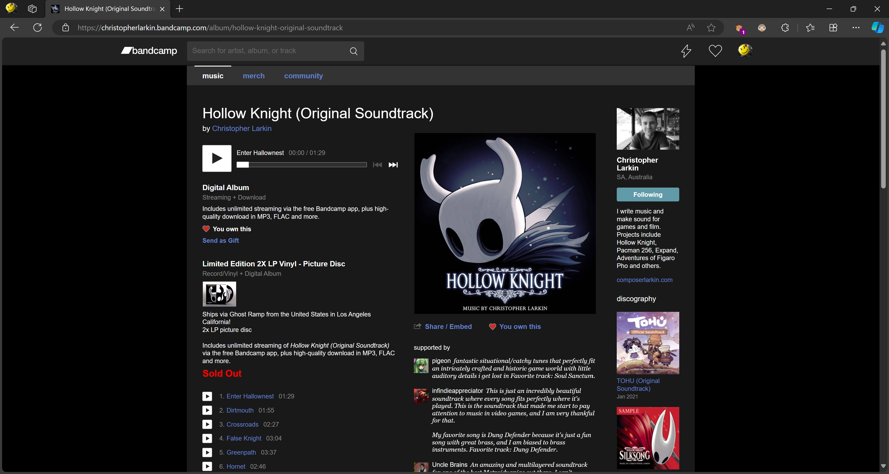
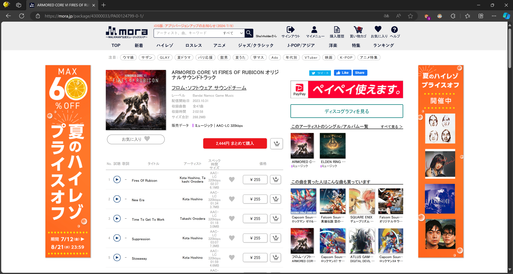
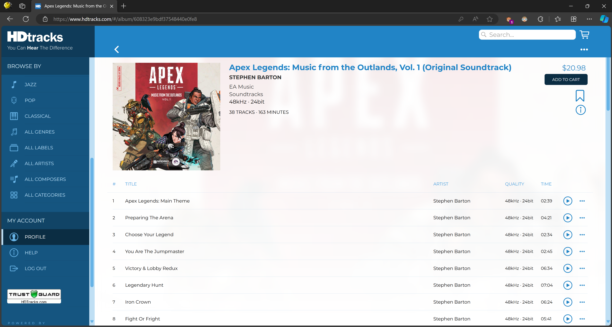
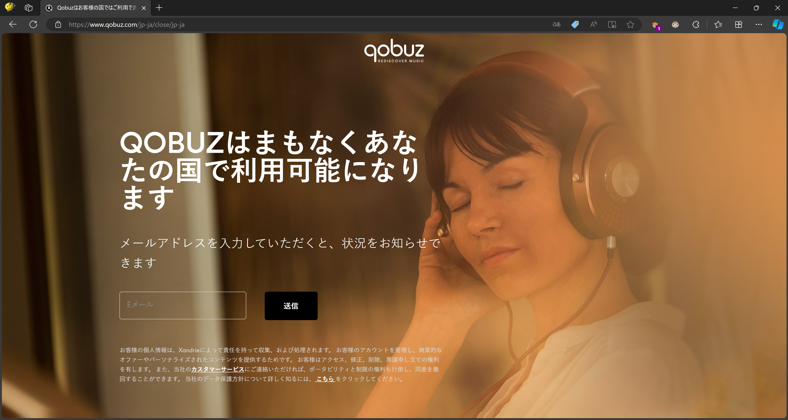
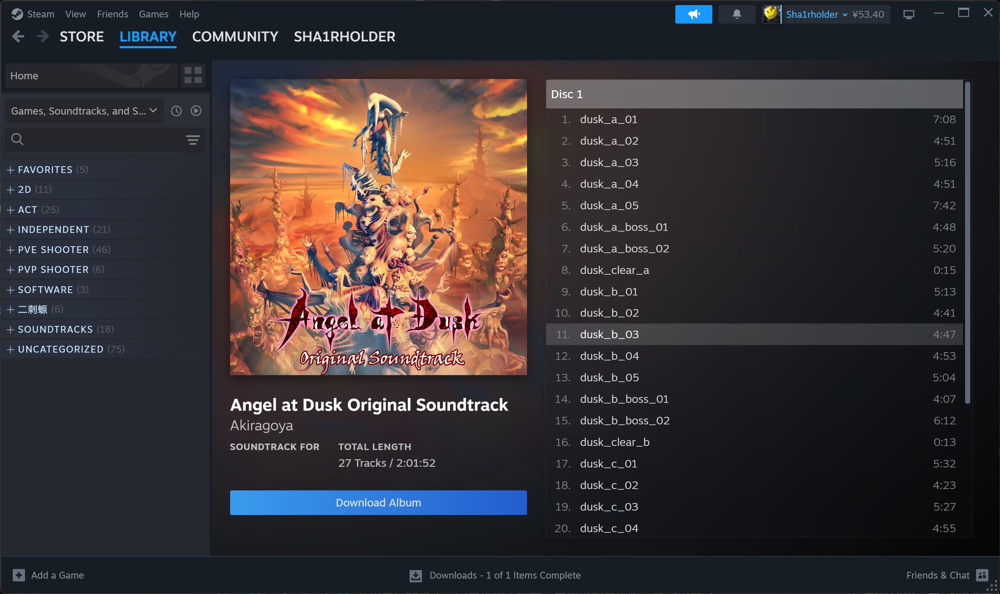
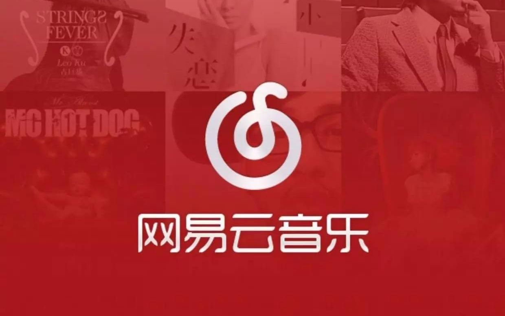
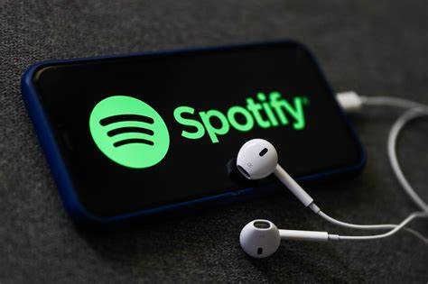
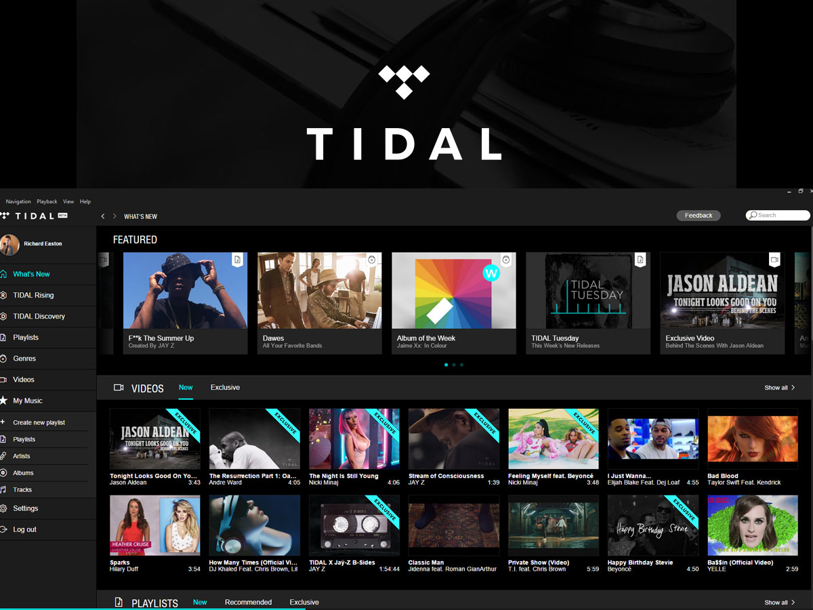
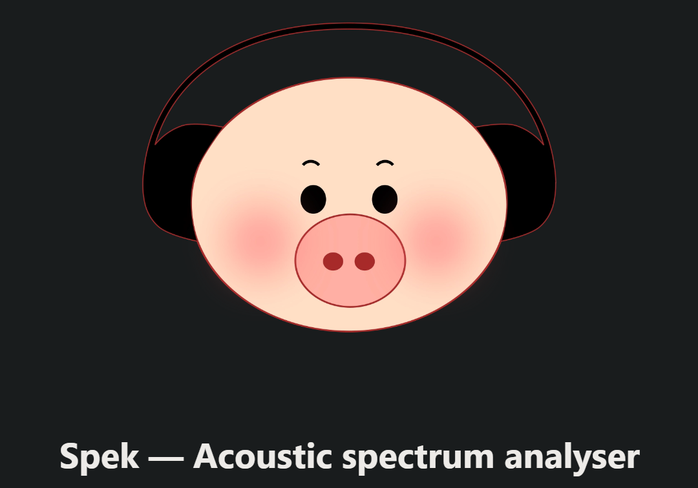

<!-- 虽说是标题是“Mid-Fi 烧友必看”，但其实 -->只要不是玩cd、黑胶、磁带、网播的老烧，这篇文章对蓝牙党和初烧也多少都有点参考价值。而且，本文不止能帮助烧友追求到更好的音质，更重要的是实现了在不依赖流媒体的情况下多端同步音源的方便性，真正实现私人定制、随时可调出、永不炸音源的方便的 Hi-Fi 终端

开个贴讲讲个人 PC Hi-Fi 系统搭建与 Foobar2000 调教。主要内容是如何构建一个多端同步、不怕丢失数据、方便管理的音源系统。网播和升频玩法不在本文讨论范围内

省流：  
PC：本地曲库 + OneDrive + 调教后的 Foobar2000 v2  
手机：飞傲音乐 + OneSync

# 为什么用本地音源

**因为多数流媒体的随机播放压根不随机** 对，就那么简单。QQ 音乐和网易云音乐的所谓“随机播放”压根就不随机，经常出现翻来覆去播放“我喜欢”的歌单中某几首曲子导致听腻，也经常很久不放一些曲子

**国内流媒体的音质不敢保证** QQ 和网易云音乐很大一部分曲库来自于盗传，这些曲库的音质不敢保证（频谱图事实也证明一大堆音源就是拉跨）

**流媒体难以实现跨曲库播放** 同时开俩流媒体会员就够抽象的了，另外有些曲子在 QQ 音乐有，但网易云音乐没有；有些反之。而且它们各有自家的加密格式，互相之间不能播放对方加密后的曲子

**不想看广告** 😊

# 音源收集

**只听华流、术曲、Rap 的烧友可以跳过这段，QQ + 网易云够了**

创建个人曲库的基础就是有足够数量的音源，买专辑就是根本解决方案。以笔者用过的音源平台举例，数字专辑的首选购买平台是 [Bandcamp](https://bandcamp.com/)，其次 [Mora](https://mora.jp/)，再次 [索尼精选](https://music.sonyselect.net/)，再再次是 [HDTracks](https://www.hdtracks.com/)，最后是 [Qobuz](https://www.qobuz.com/)。在此之外，Steam 也是非常不错的音源购买平台。如果某些专辑没有在线发售数字版，也可以尝试流媒体和 CD、SACD 抓轨

## 数字专辑

**Bandcamp** 需要魔法和 PayPal。专辑数量适中，元数据支持到位，价格适中（一张专 70 块左右），所有音源都是无损

**Ototoy** 需要魔法和 Paypal。专辑数量很多，元数据支持到位，价格很贵（一张专 100 多块），很多 Mora 上没有无损的资源它有

**Mora** 需要日本魔法和日元结算方式（如 VISA）。专辑数量最多，元数据支持到位，价格很贵但可以买单曲（一张专 100 多块，一首歌大概 20 块），部分专辑只有 aac 有损格式或音质低人一等（部分发行商为了卖 CD 真是无恶不作！）

**索尼精选** 不需要魔法。专辑数量适中，元数据支持尚可，只比 Mora 便宜一点，可以买单曲，所有音源都是无损

**HDTracks** 需要魔法。专辑数量适中，元数据支持到位，价格很贵，所有音源都是无损。这个平台最畜牲的是所有音源只提供一次性下载，账号木有卵用，所以你必须自己做好备份

**Qobuz** 需要高级魔法，国人非常难用。本身作为流媒体，专辑数量很多，元数据支持到位，要充会员才能打折买音源导致单买音源贵得夸张，所有音源都是无损

  
傻了吧，不给你用

**Steam** 不太需要魔法。都是游戏原声带，元数据支持随缘，价格相对来说非常便宜，音质良莠不齐，有 Dying Light 的 16khz 垃圾削波 mp3，也有 Ghost Runner 的 32bit float 44.1khz 超级无损。Steam 最良心的是原声带购买两周内可以随时退款，发烧友可以把想听的音源下载下来备份然后退款当畜牲

以上如果不想折腾魔法或者外币卡，可以闲鱼找代购（比如我）

## 流媒体

**QQ 音乐** 没办法，国内人家是一号。虽然音质不敢保证，但大多数 SQ 还是没问题的。非正版音源反正都是不知道有损压过几次的盗传，所以也别在乎什么元数据了。**下载一首不加密的 VIP 音乐一首歌才两块钱**，会员说实话也不贵，相当良心

**网易云音乐** 国内流媒体二哥。情况和 QQ 音乐差不多，差别在曲库，网易云术曲和二次元多一点，QQ 音乐其他曲库基本都大于网易云音乐。定价也差不多

**不好意思放错图了**

**Spotify** 国际流媒体一哥。除非你真心爱欧美音乐而且追星，否则没必要为它花钱

**Tidal** 方便性和性价比不如国内流媒体，发烧不如直接买数字专辑

**Apple Music** 苹果最后的良心，国内价格太美，曲库也都是正版，除了果孝子太多真的没啥好喷的了（还可以当抓轨源用）

**Qobuz** 给这玩意开会员的唯一意义就是便宜买专辑和抓轨

## 抓轨

**CD** 买二手性价比很高，而且多少是有点情绪价值在里面的。随便拿个光驱都能真正意义上的完全无损抓轨，还可以联网补充元数据，就是过程稍微麻烦一点

**SACD** 抓 SACD 的轨比 CD 麻烦多了，需要买特定型号的 PS3……这里不展开讲

**流媒体** 流媒体抓轨首先得确保流媒体本身音源是无损的，少量音源搞起来还行，大量就真的太麻烦了

背景图是黑胶，抓不了的

## 核验音源品质

如果实在没有财力所有曲子都支持正版专辑，也可以通过一些第三方软件核验流媒体音源的品质，遇到实在太差的再去买正版

这里推荐 [Spek](http://spek.cc/)，它是一个超级轻量化的开源频谱分析软件，可以直观地看到音频文件的频谱、位深和采样率等信息，以下是一些典型的频谱和含义：

  
一眼 Hi-Res，看到这种频谱音源基本上稳了

  
正常 CD 级标准无损音源，大多数数字专辑的无损都是这个水平

  
坏了，16 khz 以上全削没了，纯垃圾垃圾音源，多半出现在国内流媒体的“标准”音质上

  
这种频谱明明是标准 cd flac，但频谱却在 20khz 直直地削了一刀，不免让人怀疑是不是假无损

  
这种频谱更是纯畜牲，装作 hires 实则垃圾！你会发现这个频谱在 44.1k/2khz 的位置砍了一刀，明明原曲是 44.1khz 却强行硬转成 48khz，关键它还是正版要卖钱！。可能是为了统一游戏内 48khz 采样率而转码的，但这种行为严重损害了音质！混音或母带制作师应该挨打！

# 音源管理

我们要实现的是在电脑上增删修改音源，手机上甚至安卓播放器上也能同步自动修改

Windows 电脑上最方便的同步工具是 OneDrive，这东西真不用我教，Microsoft Office 365 送的空间顶够了，是真正能做到无感同步的完美工具。一股脑把音源全丢里面就行

QQ 和网易云的音乐其实元数据大多都还行，下载的时候为了简化文件夹结构其实可以不用分文件夹，其他曲库推荐根据专辑分一下文件夹

由于安卓系统的 OneDrive 不 root 没法直接把文件同步在特定文件夹下，于是得用第三方同步工具。试了一圈后觉得手机上比较推荐的同步软件是 OneSync，它本身不提供云储存服务器，但可以登录 OneDrive 和 Google Drive 账号。我是设置的单向同步，即只通过电脑向手机同步，避免手机上的音源被误修改导致电脑音源库被改

然后找一个你喜欢的安卓本地播放器，我试了一圈最后用的是飞傲音乐，UI 美观简洁功能完善度够用，bug 数量和恶心程度不高可以接受。还内置 VU 表和歌词搜索功能，虽然对我来说没啥卵用。看不起飞傲的可以试试海贝音乐和 Viper 啥的，Foobar 手机版纯垃圾不用下

# 调教 Foobar2000

Foobar2000 是 Windows 上最好用的本地音乐播放器，没有之一，在折腾 ROON、Daphile、HQPlayer 等之前，先把 Foobar2000 调教好再说

  

可以直接抄作业，下载我的 Foobar2000 配置文件并按附件教程导入，如果只想抄我的 UI 的话可以下载我的 Foobar2000 UI（discarded）

以上配置文件内置了 ESlyric 歌词插件、SACD 解码以及 DSD 处理器插件，涵盖了 99% 的使用情况。下面介绍一些用法：

**打开设置** 按 `F5`，没啥好说的

**应用回放增益** 这个操作会将曲目之间根据专辑或单曲的响度进行校准，避免某些歌曲音量过大而某些过小，只需要对你的歌单 `Ctrl+A` 然后按照下图操作即可

**打开正在播放的文件位置** `Ctrl+Shift+O`，可以配合 SPEK 方便地查看频谱，核验音源品质

**切换独占/共享模式** Foobar2000 的默认输出是 Wasapi，它具有独占和共享两个模式。开共享模式时，音乐会和电脑中其他的声音一起经过 SRC，适用于需要同时听 foobar 以外的声音比如看 B 站打游戏时使用；开独占模式适用于只听音乐时，可以接受更高的采样率和位深甚至 dsd。我定义了 `Alt+A` 和 `Alt+S` 两个全局快捷键分别切换共享和独占模式，不需要开面板就能切，十分的方便。由于我们使用的 dac 不同，这个快捷键需要自己做个修改

**显示/隐藏桌面歌词** `Ctrl+Shift+O`即可开关 ESlyric 的桌面歌词

其他用法和设置就不展开了，有问题可以在评论区问我

# Windows 音频设置

当 Foobar 等软件开启 WASAPI 独占后，它的音频输出就不会收到任何 src 以及 Windows 音量控制的影响，只能使用你外置声卡的硬件音量控制。因此，我们不需要担心 Windows 音频输出设置的位深和采样率。为了在共享情况下获得尽可能低的延迟和不错的音频性能，Windows 输出位深和采样率在大多数情况下应该设置为 16bit 48000hz 即 DVD quality，这是由于绝大部分游戏、影视等的声音都是 16bit 48000hz 输出的，设置成这个值可以避免不必要的 SRC 并降低延迟
