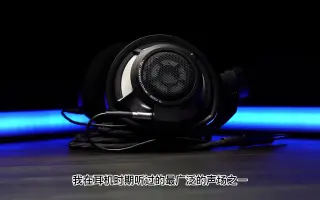
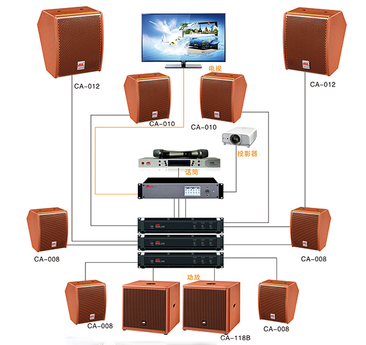
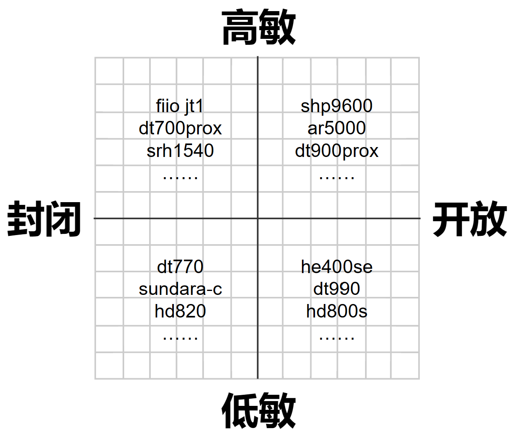

<!-- # 为什么是 QA？

普通文章花几个小时精心构建的架构往往在读者匮乏的注意力下显得脆弱不堪。本期文章信息量相对较低，理解不难，我希望小白读者按顺序读也能吸收得轻松愉快 -->

# 这篇文章主要写什么？

根据自己的潜在听音环境和需求以及知识储备等条件，进行 **需求分析**，以在合理的预算内（本文只讨论 30 元到 30000 元区间的）搭配出一套最适合你的耳机系统

**这篇文章一点也不 HiFi ！**

# 我为什么需要一个好耳机？

回答这个问题之前，先讲讲 **你为什么不需要一个好耳机**

绝大部分受众听的流媒体音乐，除了部分电影原声带以及小部分面向发烧友的专辑，在混音过程中就考虑了大部分受众的垃圾听音环境，极少会有垃圾耳机听不清而只有 Hi-End 耳机能听清的

好耳机不能使你四六级得分更高。人声是人耳极其敏感的频段，再廉价的耳机比如原道都能使人耳 **准确分辨一段录制良好的人声的信息**。好的耳机或许能让你听清更多音乐细节，但再差的耳机也绝不会让你听不清人讲话

好耳机能提高你的听声辨位准度，但几乎不能让你在 FPS 竞技游戏中获得任何优势。下文会详细说明这个问题

**那什么人在什么情况下需要一个好耳机呢？**

你是一名听音环境不算吵的音乐爱好者，尤其是古典、爵士、实验音乐以及电影原声带爱好者。虽然一般的耳机就能让你听到音乐，但是更好的耳机能让你更快乐地欣赏音乐，而以上几种音乐类型对耳机的要求相对最高（解释具体原因的话，篇幅就太长了）

你的环境很嘈杂而且你需要安静，或许要听音乐。这种情况下，主动降噪耳机是你的好选择

你是一名音乐相关工作者。这个不解释

# 耳机有什么分类？

从用途上：HiFi 耳机、监听耳机、降噪耳机、游戏耳机…  
从佩戴方式上：入耳式耳塞、平头耳塞、头戴式罩耳耳机、头戴式压耳耳机…  
从发声原理上：动圈、动铁、平面磁、~~静电~~…

根据用途分类的耳机之间的关系可以概括为上图

# 打游戏用什么耳机好？

## 游戏耳机的选择

玩家选购打游戏用的耳机的主流选择。游戏耳机肯定最适合打游戏……吗？  

买只降噪耳机顺便打游戏也是一种主流，然而目前绝大部分主动降噪耳机比如索尼的头戴 XM5 并不具备足够的听声辨位能力，**只有极端嘈杂的情况下你才应该考虑用降噪耳机打游戏**  

网上好多人说什么监听耳机听声辨位准适合打游戏，然而这纯扯淡。纯监听耳机根本不适合任何非音乐工作者，很多小白却上了“监听”二字的当  

事实上，在有限的预算内，追求最佳游戏体验/听声辨位应该这样选（可能需要自购一个麦克风或买根带麦的耳机线）  

## 游戏耳机的骗局

先对硬核 FPS 竞技玩家泼一瓢冷水——好耳机能提高你的听声辨位准度，但几乎不能让你在 FPS 竞技游戏中获得任何优势

[  
没有耳机能让你玩得更好【空降 10:40】- bilibili](https://www.bilibili.com/video/BV1SP411N74m/?share_source=copy_web&vd_source=0d156261fad807ac85d735b6ab0a64ed&t=640)

> 《彩虹六号》是一款对听声辨位要求极高的 FPS 竞技游戏，然而即使在这个游戏中，大多数职业玩家仍选择使用游戏耳机，而非诸如 dt1990 以及 dt990 这种结像精度（俗称听声辨位）非常优秀的监听耳机。这并不是因为某些游戏耳机的结像精度超越了 dt1990 或 dt990，而是因为尽管高质量的耳机能提高你的听声辨位准度，但在 FPS 竞技游戏中，这微弱的优势小到完全可以忽略

**生产游戏耳机的外设厂商成功地营造了一种假象——游戏耳机适合打游戏**

[  
游戏耳机与 HiFi 耳机，区别在哪 - bilibili](https://www.bilibili.com/video/BV1JN411u7kK/?share_source=copy_web&vd_source=0d156261fad807ac85d735b6ab0a64ed)

相比于同价位的 HiFi 耳机，游戏耳机往往更注重功能性和营销噱头，而非声音本身的质量。换句话说，游戏耳机除了可能无线方便点，和 HiFi 耳机比起来没有任何优点

[  
游戏耳机和音乐耳机的音质要求有差别么 - bilibili](https://www.bilibili.com/video/BV1pu4y1A7V6/?share_source=copy_web&vd_source=0d156261fad807ac85d735b6ab0a64ed)

“游戏耳机通常听声辨位好”完全是扯淡。对于 HiFi 耳机来说，结像精度是一项基本素质。换句话说，HiFi 耳机的听声辨位降维打击游戏耳机

## 需求分析和选购建议

作为一名玩家，而且很可能是一名硬核 FPS 竞技玩家，那么你至少需要一个 **够用的** 耳机来做到

1. 听到自然还原的声音
2. 足够准确的听声辨位
3. （对于环境嘈杂的玩家）降低环境噪音的干扰

选购游戏耳机的要求和选购 HiFi 耳机的需求本质上是一样的，只是有一些侧重——适合竞技游戏的耳机要求高结像精度（听声辨位）；用于影音娱乐以及非竞技游戏，尤其是大型单机游戏的耳机则应该确保低频更足，因为低频量对营造氛围感和沉浸感非常重要

# 耳机有哪些“坑”？

## 虚拟/物理多声道

[  
游戏耳机虚拟 7.1 和物理 7.1 - bilibili](https://www.bilibili.com/video/BV1Lu4y1b7eh/?share_source=copy_web&vd_source=0d156261fad807ac85d735b6ab0a64ed)

要说耳机的坑，~~首当其冲的~~ 首恶绝对是所谓“虚拟 5.1/7.1 声道”以及“物理 5.1/7.1 声道”

声道数即发声单元的数量，绝大部分耳机除了华硕创世 7.1 耳机等物理多声道耳机确实具有多个发声单元外，其他耳机每边都只有一个发声单元，因此都是双声道。真正意义上的多声道系统只有使用多个音箱的家庭影院以及电影院才能实现

  
5.1/7.1 多声道家庭影院系统是通过摆放多个音箱实现的

虚拟多声道即“下混”，指将多声道的音频转为双声道播放。有些院线电影的资源的音轨是多声道的，而许多观影者只有双声道系统，因此有了将多声道音频转为双声道播放的需求，这就是虚拟多声道的由来

首先，目前所有音频的主要受众都使用双声道系统，只有电影以及部分游戏才会有对多声道系统比如 5.1、7.1 声道的音频优化，因此普通耳机是完全够用的。而虚拟多声道的算法并不完美，是对原始音频的一种重塑，必然会导致增加一定失真，因此除非是欣赏院线电影资源，否则使用虚拟多声道是没有任何正面意义的

其次，虚拟多声道是不挑耳机的。虚拟多声道的算法是由 cpu 完成的，只有输出是通过声卡的，任何耳机都可以兼容虚拟多声道，并不存在某些耳机“适合虚拟多声道”或“不适合虚拟多声道”的问题。某些外设耳机的“虚拟多声道”宣传完全是混淆视听

另外，物理多声道耳机如华硕创世 7.1 以及雷蛇迪亚海魔 7.1 之类的，恕我直言——就是 trash。先不说 cs 等 FPS 竞技游戏的音频本来就是为双声道优化的，即使是多声道音频，也是为音箱系统优化的，而不是为耳机优化的。很多情况下，你还会经历“上混”，即双声道提升到多声道，可以参考上文中的“下混”的负面效果。与商家宣传的相反，物理多声道不仅客观上无法提高你的听音体验，在竞技游戏中还会 **降低你的听声辨位准度**

**结论：纯噱头**

## 杜比/DTS 音效

杜比和 DTS 本身并不是噱头，本质上是一种 3D 音频算法，我们可以称之为 HRTF，即头相关函数

  
Windows 设置 > 系统 > 声音 > 选择声音输出 > 空间音效

目前主流 3D 音频算法只有 Windows Sonic、Dolby Atmos 和 DTS 三种，而后两者是需要付费的（买断制，绑定在微软账号上，闲鱼渠道打包买也就 30 多块），Windows Sonic 是微软自家的 3D 音频算法，免费，但是效果不如后两者

目前，绝大部分大型单机游戏以及部分网游都需要配合 3D 音频算法使用，只有一些竞技 FPS 游戏如 CS2、PUBG、彩虹六号、卡拉比丘等内置了 HRTF（Apex 没有）

那么，杜比/DTS 和耳机有什么关系呢？  
答案是 —— **没有**

当一款耳机声称支持杜比/DTS 音效，那么它通常只是在软件里加了一层杜比/DTS, which 你的电脑也完全能做到，而且还得担心下会不会和内置 HRTF 的游戏相冲突；要么就是干脆给你附赠一份杜比/DTS 激活码，成本三十多块，你自己也能买

和虚拟多声道类似，HRTF 也是不挑耳机的，并不存在某些耳机“支持杜比/DTS”。某些外设耳机宣传支持杜比音效什么的，完全是混淆视听

结论：**纯噱头**

# 耳机系统是什么？

一个典型的耳机系统包括 **音源、DAC、功放、耳机** 四部分，**缺一不可**。通常 **音源** 就是我们的手机、电脑等，**DAC 和功放** 常作为一个整体被称为 **声卡**（不考虑录音时）或 **解码耳放**

无线耳机拥有更高的集成度，但也包含以上全部元件，且更复杂——在以上所有部件外还需要额外的无线通信和编码模块

台式的解码耳放和“小尾巴”（即 USB-AUX 接口转接器，取缔了 3.5 mm 接口的手机接有线耳机用的东西）本质上是一种东西，只是体积和功率不同而已。电脑主板、手机集成的声卡通常只是勉强够用，因此有线耳机通常需要搭配外置声卡使用

小尾巴的主流价格是从 30 块包邮到小几百元左右，而台式解码耳放通常需要至少大几百，主流是千元左右。随着现在手机删除 3.5mm 接口的趋势，推荐用有线耳机的大家都买一个小尾巴

# “好”的耳机系统需要多少钱？

好的耳机系统并不奢侈，下至 5 块钱包邮的原道配 30 块钱的扬仕小尾巴也可以 HiFi，而上至 10000 元的 hd800s 配大几万的惊雷 430 也不够 HiFi。对于大多数人而言，一套耳机系统全新 2500，二手 1500 左右就达到边际效应了（再加钱获得的提升对绝大多数人而言非常小）

就头戴式耳机而言，1200 多的高阻版 dt770/880/990 搭配 1000 左右的台式解码耳放一体机就是一种典型的家用聆听最优声价比方案，而 1700 多的 dt700prox 搭配一条“小尾巴”（便携解码耳放一体机）则是兼顾便携和家用的最优声价比方案之一。如果接受二手的话，以上两个方案还都可以优化到 1400 以内，甚至哪天玩腻了还能接近原价卖出去

还有一些国产厂商如 HIFIMAN、飞傲、水月雨等等提供了更具声价比的解决方案，不一定要外国货。在 HiFi 大耳领域，目前国产比较受认可的除了 HIFIMAN 的系列产品外暂时只有水月雨 Para 乐园、飞傲 JT1、FT3、奥莱尔 AR5000 琉璃以及绯乐 Feature（非广告）

# 说到底，各价位什么耳机我无脑入？

1. 根据环境嘈杂程度以及是否需要控制漏音选择开放、半开放或封闭式（通常开放式耳机声场更自然，封闭式耳机隔音和漏音控制更好）
2. 根据预算和是否有便携需求限定一款高敏或低敏耳机（预算几百或需要便携则倾向高敏耳机，预算上千且不需要便携则倾向低敏耳机，需要搭配台式耳放使用）
3. 根据听音偏好、需求以及头型选择适合的耳机调音以及侧重一些特性

