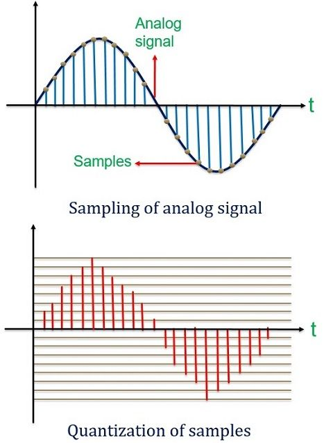
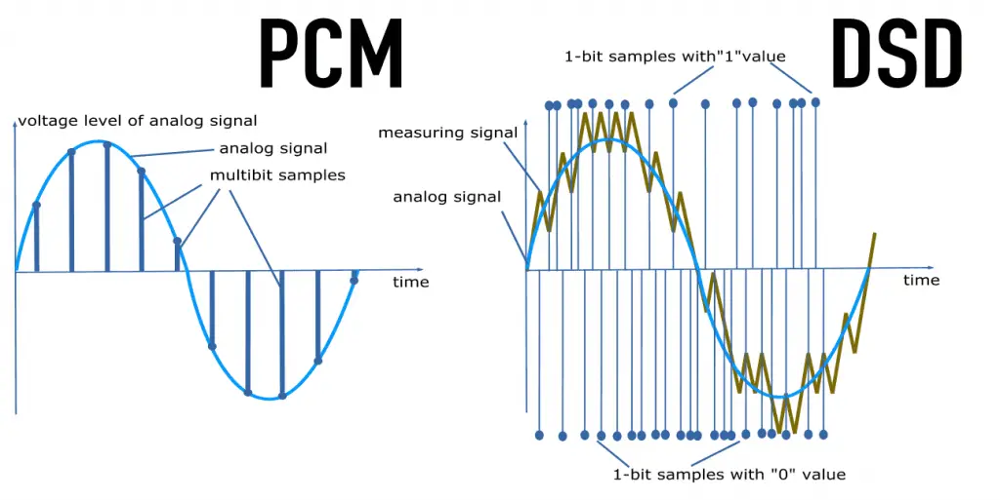
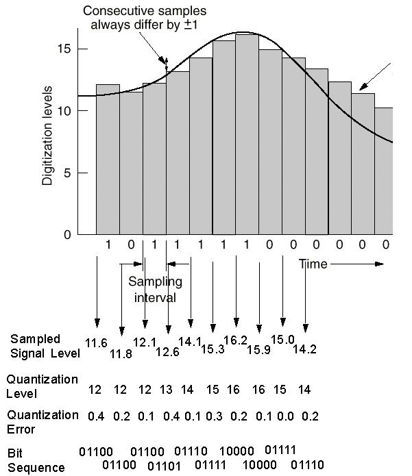
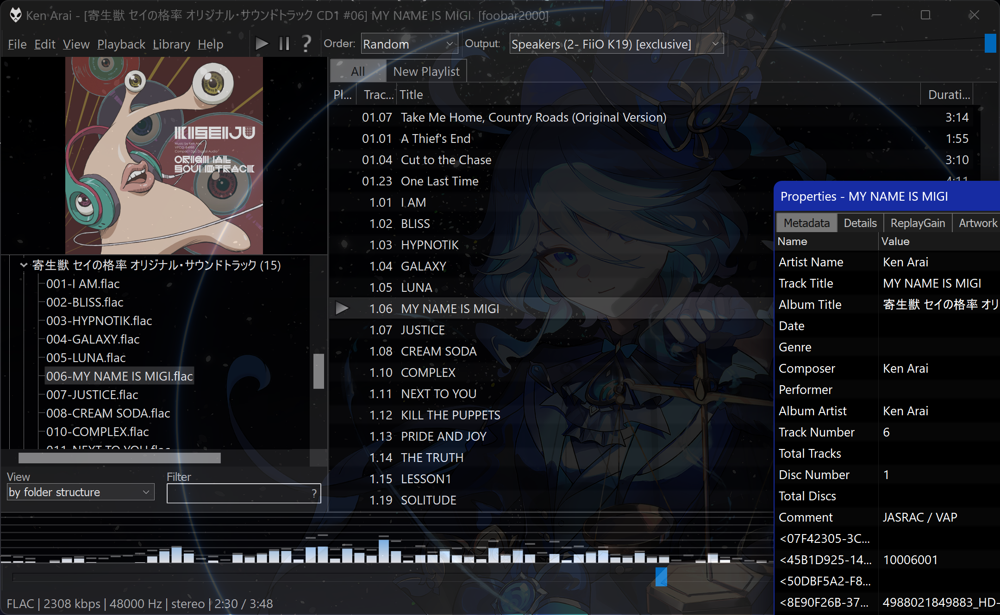

# 数字音频的编码

声的本质是物体的振动。现代数字音频的储存，无论其形式如何，本质上就是以离散的采样点记录连续的波。将连续的模拟信号记录为数字信号的过程需要对其进行 **采样**、**量化** 和 **编码**，这个过程由 ADC 即 Analog-to-Digital Converter 实现

> 回放数字音频必须将数字信号转换为模拟信号，这个过程是编码过程的逆向，被称为 **解码**，由 DAC 即 Digital-to-Analog Converter 实现。现代 ADC 和 DAC 性能已经非常优秀，通常不是音乐制作和回放系统的瓶颈

数字音频有脉冲编码调制（Pulse Code Modulation, **PCM**）与直接数字流（Direct Stream Digital, **DSD**）两种编码方式。**PCM 和 DSD 的本质区别在于记录采样点位置的方法不同**

绝大部分数字音频以 PCM 的形式编码。PCM 编码通过 **以恒定频率记录采样点相对于一个基准位置的偏离幅度** 来描述振动，它的精度取决于 **位深** 和 **采样率**。音频元数据中的 16bit/44.1kHz、24bit/96kHz、32bit float/48kHz 就是位深/采样率

位深是振动幅度的精度，即图中 y 轴的尺度。位深决定了数字音频能表示的最小信号和最大信号的比例，即 **动态范围**。16bit 位深可以描述 $2^{16}$ 个幅度，即拥有 96dB 动态范围；24bit 位深可以描述 $2^{24}$ 个幅度，即拥有 144dB 动态范围……

> 我们使用的绝大多数音频的位深都是整数 bit，还有一种使用浮点数位深的 PCM 音频编码规格。这种音频的位深和动态范围几乎不受限，但由于计算和储存成本巨大，基本只用于音频制作和信号处理过程中

采样率是时间尺度的精度，即图中采样点在 x 轴的密度。采样率决定了能不失真恢复的最高频率，即频宽的上限。根据奈奎斯特采样定理，能不失真地还原的最高频率为 PCM 采样率的一半，因此 44.1kHz 的音频能还原最高 22.05kHz 的频率，48kHz 的音频能还原最高 24kHz 的频率……都超过了人类可闻频率的上限 —— 20kHz

> 44.1kHz 这个奇怪的数字是早期数字录音制作格式的历史遗留问题，CD 成功更是让这个采样率标准至今仍未淘汰。目前影音游戏音频采样率普遍为 48kHz，而音乐制作厂牌至今仍主要采用 44.1kHz 的原因主要就是卖实体 CD 赚钱

DSD 是一种高规格数字音频编码格式，它通过 **以极高频率记录采样点相对于上一个采样点的偏离方向** 来描述振动。由于 DSD 中每一个采样点包含的信息只有 + 或 -，它的精度只取决于采样率。因此，DSD 也被称为 1bit 音频，但它与 PCM 有本质的不同。DSD 的采样率和信息密度通常远高于 PCM，动态范围几乎不受限，但由于体积比较庞大，dsp 支持太弱，至今仍只是发烧友的小众玩具

# 数字音频的储存和传输

数字音频文件经常需要压缩以平衡体积、质量和解码开销。压缩分为无损压缩和有损压缩两种，**区分压缩是否有损的根据是压缩过程是否可逆**

数字音频文件的不压缩格式有 **wav**、**aiff**、**dsf** (DSD)、**dff** (DSD) 等，这类文件体积较大，但播放时没有解压缩的性能开销；无损压缩格式有 **flac**、**alac**、**dst** (DSD) 等，这些格式通过可逆地压缩音频数据来减小文件体积，不会损失音质；有损压缩格式有 **mp3**、**aac**、**ogg**、**MQA** 等，这类文件基于心理声学模型不可逆地大幅压缩音频数据以减小文件体积，好的算法在码率足够高时能实现听觉无损。某些音频文件格式如 **flac** 还可以储存歌曲封面、歌词、专辑信息等元数据

流式传输音频数据比本地播放的编解码更为复杂，需要在音质、无线稳定性和延迟上做取舍，这是蓝牙设备回放音频的局限之一。随着 TWS 市场爆燃，高通、索尼等公司相继开发并迭代了 **aptX**、**LDAC** 等可用于音频的传输协议，力求做大无线音频的蛋糕

数字音频还可以使用物理载体如 CD、SACD 或 DVD 的形式储存。CD 是一种专用于储存 16bit/44.1kHz 双声道音频的光盘，是现在最常见的物理音频载体。SACD 即 Super Audio CD 是一种更高规格的数字音频载体，它向下兼容普通 CD 的同时刻录了更高质量的 DSD，而且支持最多六声道。SACD 还具有版权保护机制，通常只能在经过认证的设备上完整播放。CD 和 SACD 可以被 **完全无损地** “抓轨”，即转录、复制

# 量化噪声
