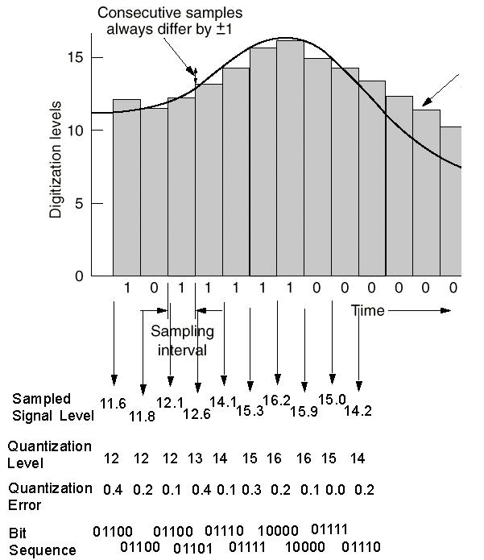
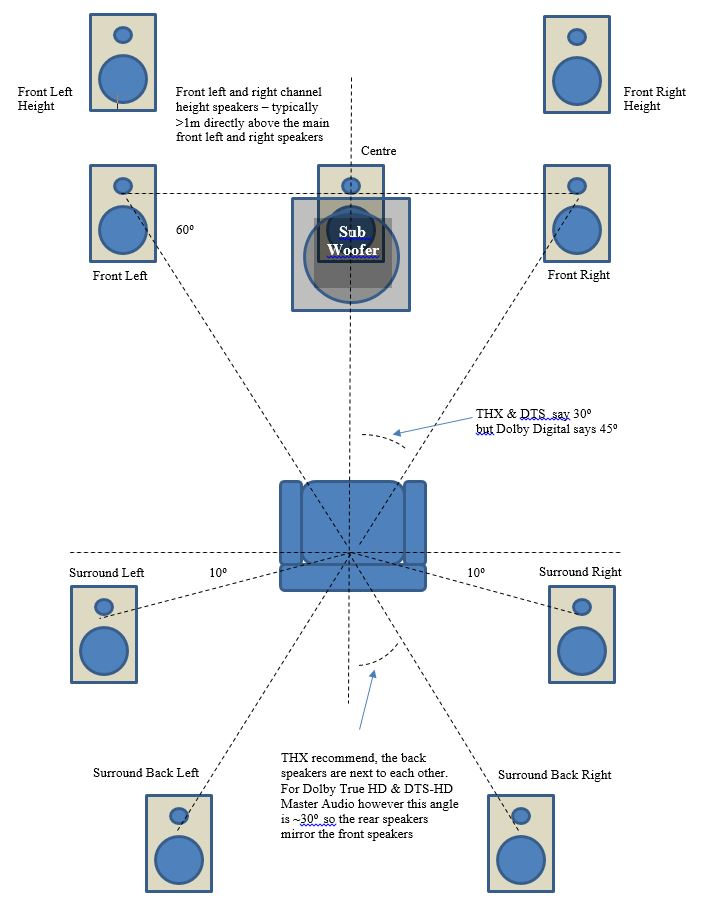
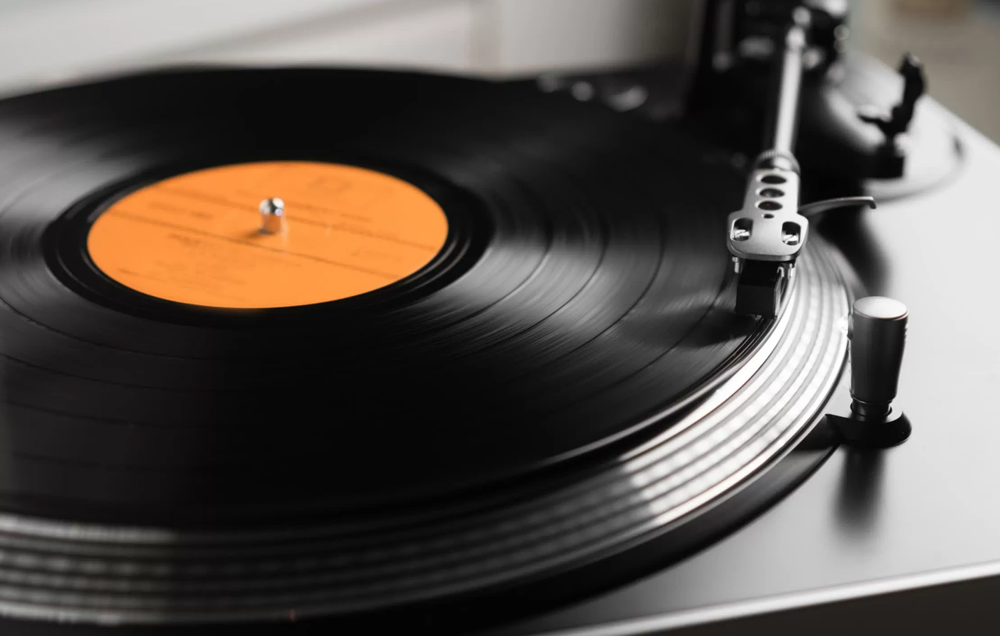

# 声的数字化

声的本质是物体的振动。在现代数字媒介上储存的声音，无论其形式和格式如何，本质上都是以离散的采样点模拟的波形信号。真实的声信号是连续的，而数字音频信号是离散的，因此在记录声的过程中，会有不可避免的信息损失

绝大部分数字音频以 **脉冲编码调制（Pulse Code Modulation, PCM）** 的形式储存。PCM 的本质是高频采样相对于一个基准位置的振动情况，每一个采样点可以取从 0 到 $2^{位深}-1$ 之间的整数值。PCM 音频具有两个性质：位深和采样率。位深是振幅尺度的精度，即图中 y 轴的密度，决定动态范围；采样率是时间尺度的精度，即图中 x 轴的密度，决定频宽。PCM 的采样率和位深越高，音质越好

**直接数字流（Direct Stream Digital, DSD）** 是比 PCM 音质更好的数字音频储存格式，只有采样率和声道数两个性质，可以以远高于 PCM 的采样率把原始的的模拟音频信号量化为 1 bit 的数字音频信号。DSD 的本质是高频采样相对于上一个位置的振动情况，每一个采样点只取 `+` 和 `-` 两个值，含义是现在的振动位置相对于上一个振动位置在“前进”还是“后退”。DSD 的采样率越高，音质越好

类似于一只眼睛没法准确地判断物体位置，单个声道无法产生声音的空间感，用耳机系统回放时还容易诱发“头中效应”导致眩晕，因此许多音频具有两个及以上数量的声道。声道数表示数字音频记录了来自几个位置的声音，理论上声道数越多，用相应数量摆位合理的音箱系统回放时能产生的空间感就越好。产生空间音频效果至少需要双声道，绝大多数音乐作品都是双声道的，而所有正常耳机都是双声道系统，更多声道数的音频制作更多应用于电影和游戏等对空间感要求更高的多媒体作品。PCM 和 DSD 都可以多个独立音轨的形式储存多声道音频

将模拟信号转换为数字信号需要经过 **模数转换（Analog-to-Digital Conversion, ADC）**，将数字信号转换为模拟信号需要经过 **数模转换（Digital-to-Analog Conversion, DAC）**。其中，DAC 在声的回放系统中被称为“解码”，是播放数字音频不可或缺的部分

# 数字音频的储存

PCM 和 DSD 是数字音频的类型，并不是文件格式。在实际使用中，经常需要将数字音频以特定编码方案压缩成特定文件格式以实现音频文件大小和质量之间的平衡。压缩分为无损压缩和有损压缩两种，区分压缩是否有损的根据是压缩过程是否可逆，即压缩是否会丢失任何数据。通常来说，在音质上：不压缩=无损压缩>有损压缩。在文件大小上：不压缩>无损压缩>有损压缩

PCM 音频文件的常见格式有 **wav**、**aiff** 等，这些格式不压缩音频数据，因此文件体积较大。PCM 的无损压缩格式有 **flac**、**alac** 等，这些格式通过压缩音频数据来减小文件体积的同时不会损失音质。PCM 的有损压缩格式有 **mp3**、**aac**、**ogg** 等，这些格式能更进一步减小文件体积，但会损失音质。某些音频文件格式比如 **flac** 可以同时储存封面、歌词、专辑信息等元数据

关于 MQA：随着 DAC 芯片性能的提高和廉价化，网络带宽和流量成为流媒体的重要成本和音质瓶颈之一，以及音乐版权保护问题收到更多的重视，一种兼容 CD 格式的高压缩率音频编码格式 Master Quality Authenticated（MQA）应运而生。MQA 通过“折叠”原始 PCM **有损** 地压缩 flac 文件，试图使其在更低的码率下储存相对更高质量的音频，且具有一些的机制保护文件版权，因此曾受到 Tidal 等流媒体的青睐。然而，只有使用受支持的 MQA 解码器才能对 MQA 文件进行完整的三次展开，否则将进一步损失音质。值得一提的是，在音质上：无压缩=无损压缩>有损压缩的规律在 MQA 上依然存在，因此 MQA 自诞生以来就受到不少质疑。目前随着 MQA 母公司的倒闭，各音乐平台和制作商也在逐步放弃 MQA

DSD 音频文件的常见格式有 **dsf**、**dff** 等。DSD 音源的体积通常远大于 PCM，对制作规格和播放设备也有较高的要求，因此远没有 PCM 那样普遍，但 DSD 理论上可以提供极高的音质表现

数字音频还可以使用物理载体如 CD 和 SACD 等形式直接储存和播放。CD 是一种常储存于光盘的音频格式，以 16 bit/44100 Hz/Stereo 的 PCM 格式储存音频，是最常见的物理音频载体。SACD（Super Audio CD）是一种更高质量的数字音频载体，支持最多六声道，向下兼容普通 CD 的同时刻录了更高质量的 DSD。SACD 具有版权保护特性，只能在支持 SACD 的机器上播放完整的 DSD，用普通 CD 机播放 SACD 只能解码 CD 层，但 SACD 机通常也支持播放普通 CD。通过“抓轨”，CD 和 SACD 可以被无损地转化为 PCM 或 DSD 文件（就是完全无损，这是已经有定论的了）

# 模拟音频

通过模拟信号的形式储存声音被称为模拟音频，它避免了对声的离散采样，理论上具有无穷大的信息量和频宽，是一种十分古老的储存形式。黑胶和磁带是模拟音频的两种常见载体，它们长期保存的稳定性都比较差，且底噪比较高，但在发烧友中仍有一定市场

黑胶唱片利用机械刻痕记录声音，声音信号被转化为刻刀在唱片表面刻出的螺旋形槽纹，播放时唱针沿槽纹行走，将机械振动转化为电信号，再通过音响系统还原为声音

磁带利用磁性材料记录声音信号，分为开盘带和盒式磁带两种形式。开盘带通常用于专业录音和制作领域，具有较高的音质和较长的使用寿命。盒式磁带则广泛应用于消费电子市场，因其便携性在上世纪 70 到 90 年代风靡一时

模拟音频不需要解码，但需要对应的模拟音频设备，如黑胶唱片机、磁带机等才能播放
