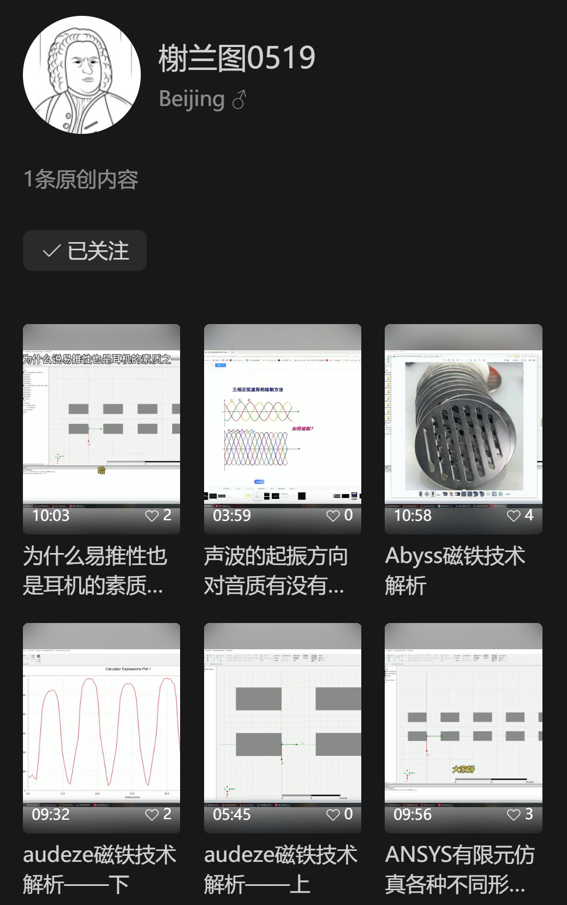

平面磁耳机的设计是一门系统工程，主要包括发声单元、腔体和其他部件三个方面。发声单元是耳机的核心部件，它直接决定了耳机的音质上限。腔体是调音的重要手段，但设计不当也可能会劣化音质表现甚至耐用性。耳机的其他部件如头梁、耳罩的连接件等，也会对耳机的重量、质感、佩戴舒适度乃至声音都有一定影响

本文将从发烧友的视角介绍平面磁耳机的一些设计逻辑

# 振膜

平面磁耳机的发声原理可以简述为：当电信号在附着在振膜上的音圈中通过时，磁铁对音圈产生安倍力，进而驱动振膜上振膜振动发出声音。**因此，振膜是平面磁耳机的核心技术，振膜的性能对平面磁耳机的音质起决定性作用**

为了优化振膜对高频信号的响应，降低安倍力克服惯性的阻碍以优化“瞬态”，降低失真，平面磁耳机的振膜往往非常轻薄。比如水月雨的大都会、Audeze LCD5 的振膜只有 0.5μm，按 Hifiman 的标准可以称为纳米振膜了。**更轻的振膜** 是平面磁耳机最核心的追求之一，但这依赖的本质上是材料学和供应链的进步，并不是声学的发展。目前有能力自研高性能振膜的 HiFi 厂商屈指可数，其他的说白了都是上游供应商给的技术罢了。Hifiman 的创始人边仿是南开赴美留学的化学博士，这为他的团队研究振膜材料和工艺奠定了基础

  
Hifiman Susvara 的纳米振膜（几百纳米也是“纳米级”）

音圈在振膜工艺中也至关重要。传奇平板耳机 HE6 及其后继者 Susvara 采用了黄金音圈，这种金属的延展性非常优秀，在振膜上可以很薄，是一种不错的音圈材料。使用黄金音圈的振膜被称为金膜，这种振膜良率低，成本高，因此几乎只有昂贵的旗舰大耳才会应用，飞傲即将上市的 FT7 以及国内一些小作坊产品比如阿南的 NAN-6、NAN-7、XK 的幽韵还有初心的 CS97G 都在此之列

然而，**材料只是个噱头**。金膜确实是一类昂贵的振膜，但并不是“最好的振膜”。黄金的导电率没多高，再加上延展得太开太薄横截面非常小，金膜往往就变得非常难推。黄金高密度的特征也与振膜“轻”的要求相悖。于是 Susvara Unveiled、水月雨的三款平面磁耳机、Fosi I5 等就采用了银/银合金音圈，而 Audeze LCD 系列、飞傲 FT1 Pro 等则采用了铝/铝合金音圈。各种导体的电阻率、延展性等理化性质各异，造就了以它们为材料的音圈各异的音色（**本文说的音色就是耳机的线性和非线性特征**）

振膜工艺是平面磁耳机供应链水平高低的最本质体现。近十几年振膜工艺得到了极大的发展，平面磁耳机对品控、一致性和客观物理性能的要求也今非昔比，“胶水贴金箔”之类的方法已经过时了。据我所知，Hifiman、水月雨、飞傲等厂商已经玩起了光刻工艺，而初心之声的金膜则采用了独特的靶溅射，可以说是各显神通了。加工工艺的区别不仅会对振膜的音色产生影响，还极大程度决定了振膜的成本、一致性、稳定性和寿命

  
初心之声 CS97G 的靶溅射黄金振膜

振膜的张力也是平面磁耳机设计中需要考虑的重要因素。大多数平面磁耳机的振膜都是绷紧的，但也有少数比如初心之声的一款石墨烯振膜就是褶皱的。振膜绷紧或褶皱的程度不同，以及振膜张力的分布不同，都会产生不同的音色。振膜张力不仅对音色的影响非常显著，一旦设计不当还会导致较高的损坏率或使用后变皱，这在大功率大声压下尤其明显。平面磁耳机“煲机”后的声音变化，很大一部分就来源于振膜长时间使用后张力的变化

  
初心之声的褶皱石墨烯振膜

# 磁铁

磁铁是平面磁耳机除振膜外最重要的部件，如今平面磁耳机通常用钕铁硼磁铁，但也有些耳机比如 HE400se 为了省成本用了磁性相对较弱的铁氧体磁铁。据说 Susvara Unveiled 也有用铁氧体，这个应该和成本没啥关系

安倍力的大小等于电流与磁感应强度垂直分量的积，因此，用更强的磁铁就可以减少驱动平面磁耳机所需的电流大小并提高效率，减少的发热对振膜也有一定好处。强磁铁栅格之间的吸力/斥力非常巨大，因此固定磁铁的结构件必须要用足够高强度的材料。结构件不仅需要长时间固定一组密集排列的强磁铁不变形，还得能具备基本的抗摔能力，还得足够轻，形状也不能乱来不然声学上会出问题，这就很考验厂商的能力了

  
水月雨乐园和大都会的单元/腔体一体化设计降低了成本和重量

磁铁的排布也大有讲究，这跟振膜上音圈的布局是相辅相成的。用条形磁铁平行排布组成一块圆形、椭圆或方形的振动区域是最典型的设计，当然，HiFi 界最不缺的就是特立独行的厂商，Meze Elite 的“奇形怪状布线”和雅马哈的螺旋走线都属于比较花哨的玩法。但无论如何，他们的追求都离不开 **增大有效驱动面积** 和 **驱动力均匀化**

  
Meze Elite 的磁铁排布很独特，但是结构件有点抽象，不知道有没有经过谨慎的声学方面考量

平面磁耳机的固有缺陷之一就是磁铁会反射和衍射声波而失真，**如何减少磁铁对声波的影响** 就成了平面磁耳机最重要的声学设计难题之一。Hifiman 的“隐形磁铁”、Audeze Fazor™ 波导、水月雨的名字很长的波导等等，其本质目的都是 **通过改变磁铁的剖面形状减少磁铁对声波的影响**

  
水月雨启明星的磁铁形状设计明显有声学意图

平面磁耳机最广为人知的优势之一就是比动圈更低的分割振动，但也不是完全没有，磁场在音圈处的分布不均匀导致振膜受力不均匀也是劣化平面磁耳机音质的因素之一。**如何让磁场在音圈处分布得更均匀** 是平面磁耳机的设计难题之一，目前设计师们已经开发了改变磁铁形状、增加导磁板等办法来优化。然而，很多情况下更优的声学结构和更优的电力学结构是相悖的，设计师必须在磁场强度、磁场均匀度和磁铁对声波的影响三个方面做出取舍

# 单元的系统工程

耳机的设计是一个系统工程，不是拍拍屁股想出来的，也不是几个“好”的设计东拼西凑一下就成的。平面磁耳机单元的设计涉及多门学科，对设计师的经验和技术要求都很高，这也是为什么大多数 HiFi 厂商都没法全链路自研，而是向专业的方案商购买部分单元设计方案的原因

声学仿真是平面磁耳机设计中至关重要的一环。现代设计师们常用 COMSOL 或 ANSYS 有限元分析辅助耳机的电磁学和声学设计。水月雨大都会的英文名 Cosmo 就得名于 COMSOL

下面是对几款平面磁耳机单元的分析

## Hifiman “隐形磁铁”

为了降低磁铁对声波的影响，Hifiman 开发了号称“对声波几乎透明”的“隐形磁铁”，其本质就是用半圆形取代矩形磁铁

这种磁铁不仅降低了磁铁对声波的影响，还能使磁场分布比矩形磁铁更加均匀，但代价就是磁场强度远低于矩形磁铁。因此，Hifiman 平面磁耳机总显得十分“难推”

## Audeze Fluxor™ 磁铁和 Fazor™ 波导

平面磁耳机的另一巨头 Audeze 也在磁铁设计上下了很大工夫。为了提高磁场均匀度，他们创新地将两块倒圆角的磁铁拼在一起，产生了一个非常均匀而且场强极高的磁场，并称这种设计为 Fluxor™ 磁铁

如图可见 Fluxor™ 磁铁具有独特的充磁方向，因此产生了独特的磁场特性。这种设计虽然优化了磁场，但会导致音圈位于磁铁正下方，让磁铁对声波的影响更加显著

于是，Audeze 又在磁铁上安装了 Fazor™ 波导来缓解高频声波的衍射问题，这种设计本质上和 Hifiman 的“隐形磁铁”、水月雨启明星的奇特磁铁是同一回事

## 被 Hifiman 抛弃的导磁板

导磁板也被叫做定子板，能够提高磁场强度并优化磁场分布。但它不仅会增加耳机的重量，还和磁铁一样会影响声波。因此在稀土工业进步，高性能钕铁硼磁铁供应链发展的今天，导磁板在平板耳机中应用的就少多了

舍弃了导磁板的设计是 Hifiman 的旗舰耳机从 HE6 到 Susvara 的设计变化之一

## Abyss 一体化不等宽不等距磁铁

单面磁是一种只在振膜的一侧排列磁铁的技术路线，Abyss AB-1266 就采用了这种技术路线。不过，单面磁的磁铁如果按照常规的等宽等距排列会导致严重的磁场分布不均匀，但如果以不等宽不等距的磁铁排列，就仍能达到较好的磁场均匀度，但会产生极高的成本和无解的品控问题 —— 一旦磁铁的加工或排列偏差 1 mm 就可能极大影响磁场均匀度。于是 Abyss 设计了一种一体成型的磁铁，只要这一块磁铁的品控达标，就可以直接装配

  
仿制 AB-1266 的磁铁

这种大型磁铁带来的好处不仅是品控更优秀，还可以让线路在振膜边缘弯曲连接的部分也参与有效振动，减少了从动面积。（相关设计思路的更详细介绍在下文）然而，这种设计带来的缺陷也很明显。首先是重，这磁铁肉眼可见比别人体积大一圈；其次，在靠近振膜边缘的部分主动振动虽然理论上对声音有好处，但对振膜稳定性是一种极大的考验

  
AB-1266 的仿制品 X1226 的音圈

## 水月雨 FDT 全面驱动技术

足够大的振膜面积是决定耳机低频表现的最核心因素之一，更大的振膜面积通常意味着更好的下潜。然而，振膜面积越大，惯性越大，响应就越差，这不利于准确的高频表现。那么有没有办法既要又要呢？水月雨的方案是增大振膜的有效驱动面积

平面磁耳机的振膜本身并不受力，受力的是音圈能够被磁铁驱动的部分，这部分被称为振膜的“有效驱动面积”。下图是 Hifiman Edition X 的振膜，可见虽然振膜面积很大，但很大一部分都是从动而非主动的，边缘也有一部分音圈无法受磁铁作用，它的有效驱动面积其实只有中间方形的一块

水月雨的三款平面磁耳机的走线方式则是将音圈弯折区域藏在振膜的边缘，使得几乎整张振膜都能被磁铁有效驱动，这使得振膜的受力更为充分和均匀，成就了水平板的超低失真。不过，FDT 技术也导致磁铁尺寸增大，耳机重量增加，以及振膜边缘的受力增大可能导致的振膜寿命缩短等问题

  
水月雨 FDT 全面驱动技术的专利示意图

---

各式各样的平面磁耳机单元方案是设计师们水平和创造力的体现，它们之间不一定有优劣之分，更多的是取舍问题

# 腔体

平面磁耳机的振膜很薄，对声波的反射以及气压的变化比动圈耳机更敏感，因此平面磁耳机大多都采用了开放式设计，而且后腔的开放程度普遍远超动圈耳机。很多设计师和烧友还认为，高度开放的后腔设计能带来更宽广的声场，这在声学上或许与声阻抗有关

  
NAN-7 的后腔可以直接看到振膜和磁铁

当然也有特例，我个人主观认为最好听的封闭式平面磁耳机 DCA Stealth 和 ZMF Caldera Closed 都有精心设计的声学结构。开放式 Caldera 的后腔开放程度肉眼可见地不高，但声场表现也并不差

许多平面磁耳机比如 NAN-7 可以直接从侧面看到振膜，我们甚至可以说这压根就没有后腔。“最好的腔体设计就是没有腔体”（我瞎编的）平面磁耳机的腔体设计的重要性通常比动圈耳机低得多，耳机机身变薄，直接用耳罩作前腔，也是开放式平面磁耳机设计的典型特征

  
NAN-7 侧面摘掉耳罩后很薄

平面磁耳机的振膜很薄所以很娇贵，Audeze 臭名昭著的损坏率的来源之一就是其完全封闭不打孔的耳罩设计。这种耳罩或许有其声学上的考量，但不透气的特征很容易使得前腔发生气压失衡，最终导致振膜被压坏。现在大多数平面磁耳机的耳罩都有打孔或别的泄露方式来平衡前腔的气压，通常越薄的振膜对泄压要求越高

耳罩是平面磁耳机最重要的调音手段，换耳罩的影响可比换线大多了。“换罩如换机” 不同的耳罩材质、打孔、孔径、厚度、内外腔形状等等都会对声音产生 **非常显著** 的影响。对发烧友来说，音乐无价，只恨财力有限。换耳罩对于高端平面磁耳机来说可谓最具性价比的玩法之一了

# 其他结构

耳机的单元决定音色，腔体影响音色，别的结构比如外壳……和腔体一样也会影响音色，不过影响的量相对较小，也更玄学。根据心理声学专家的研究，耳机的质感和外观会显著影响听者对耳机音质的评价，或许壳子才是耳机设计中最重要的一环呢（

  
雅马哈 YH5000SE 拥有最优秀的 ID 设计、最舒适的佩戴以及我主观认为最难听的声音

耳罩和耳机机身之间的连接件也是非常令人头疼的一环。[Audeze 的研究](https://www.audeze.com/blogs/technology-and-innovation/why-we-use-adhesive-to-attach-earpads-on-our-upper-end-models) 非常有说服力，他们认为目前似乎无论哪种可替换耳罩（卡扣式、磁吸式等等）在声学方面就是不如胶粘耳罩，我个人也比较赞同此观点。水月雨的磁吸耳罩、Hifiman 的侧入式卡扣、飞傲的按压式卡扣、Audeze 的胶粘……各种耳罩连接方式都被沿用至今就证明了它们之间没有绝对的优劣之分，耳罩的连接件设计也是一种取舍

  
水平板的磁吸式耳罩非常方便更换且不易滑动和漏气

# 结语

建筑艺术被人称为“第七艺术”，但它更是一门科学。没有足够科学技术支撑的建筑设计再好看，也不过是一摊废墟而已。HiFi 耳机的设计也是如此，它本质上是一类对声学、电声学、心理声学、材料学和人体工学的综合应用。我无意给各位烧友灌输些什么观念，但多了解些玩具怎么做出来，总归是好的

就写到这里，大家去听、去测、去聊、去玩吧

# 特别鸣谢

炎栊轩主梼昧狂客的[《平板耳机电声科普杂谈（一）—— 是什么与为什么》](https://www.bilibili.com/opus/951667351549378580) 旁征博引，文采飞扬，给了我非常大的启发并提供了很多图片素材

XK Audio 徐工的平面磁耳机磁铁设计系列视频深入浅出，为我解惑了许多设计思路上的疑问。相关视频可以在微信视频号“榭兰图 0519”找到

