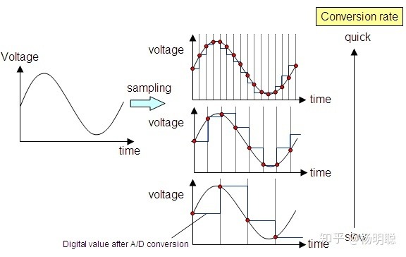
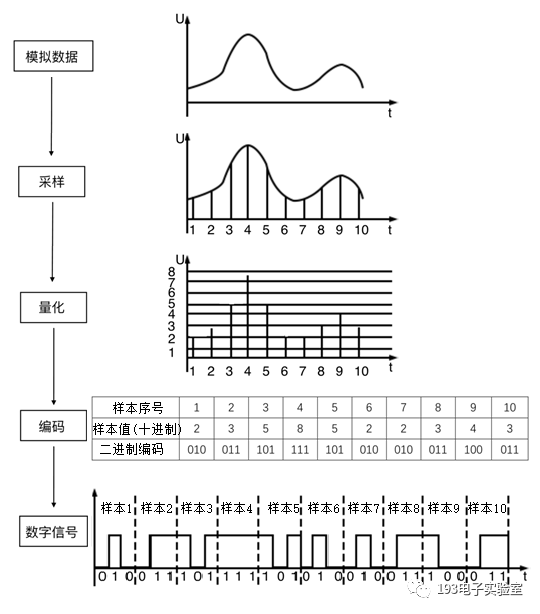

# 数字音频

声的本质是物体的振动。在现代媒介上储存的声音，无论其格式（.wav .mp3 .flac .dsf...）如何，本质都储存着以采样点模拟的波形信号。真实的声信号是连续的波，而数字音频信号是由离散的采样点构成的，因此在记录和还原声的过程中，会有不可避免的信息损失。HiFi 高保真的本质，就是复现声对原声或音乐制作人想表达的声的高度还原

## 声的储存

现代数字音频绝大部分基于 **脉冲编码调制（Pulse Code Modulation, PCM）**，绝大部分数字音频都以这种方式储存。PCM 是通过对声压进行高频采样 PCM 文件具有三个性质：采样率、位深和声道数。采样率是时间尺度的精度，即图中 x 轴的密度，决定频宽；位深是振幅大小的精度，即图中 y 轴理论上能达到的最大值和最小正值的比，决定动态范围；声道数则表示了一个数字音频记录了几个位置的声音，理论上声道数越多，声音的空间感就能更强，产生空间音频效果至少需要双声道。无损 PCM 的采样率和位深越大，音频的质量越高

**直接数字流（Direct Stream Digital, DSD）** 是比 CD 级 PCM 音质更好的数字音频储存格式，它的编码方式能储存数倍于 CD 级 PCM 的信息量，可以以高达 2.8224 MHz 甚至更高的采样率（为 CD 44.1 KHz 的 6 倍）把原始的的模拟音频信号量化为 1 bit 的数字音频信号。DSD 常见于 SACD 中，极少有流媒体提供 DSD 格式的音频，是发烧友的专属

# 数字音频的压缩

随着音频芯片性能的提高和廉价化，网络带宽和流量成为流媒体的主要瓶颈资源。为了在尽可能节省带宽的情况下播放提供高质量音频，一种兼容 CD 格式的高压缩率音频编码格式 **MQA（Master Quality Authenticated）** 应运而生。MQA 通过“折叠”原始 PCM **有损** 地压缩 flac 文件，试图使其在更低的码率下储存相对更高的音质，且兼容不支持 MQA 的芯片（只能展开 2 次，因此会损失音质）

# References

[知乎：数字音频基础 ­­­­­－从 PCM 说起](https://zhuanlan.zhihu.com/p/212318683)
