耳放即用于驱动耳机的功率放大器，负责将模拟信号的功率放大到足以驱动耳机的大小。本文将为对电声感兴趣的烧友介绍耳放的基本知识，帮助大家更好地选择适合自己的耳放

/15.jpg>)  
耳放不一定是一个盒子或者插着灯泡的盒子，它存在于一切用于驱动耳机的音频设备中

# 推力篇

耳放最重要的指标之一就是能量的输出能力，即所谓 **推力**。推力越大，耳放驱动耳机的最大不失真响度越高。本部分解读推力的具体影响和对发烧友选购耳放的意义，并解释增益的概念

## 推力是什么？

发烧友常用 **最大不失真功率**，即 THD+N < 1% 或 0.1% 时耳放的最大输出功率来衡量推力大小

  
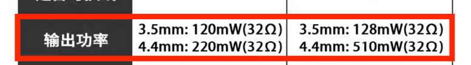

在 32Ω 负载以上，耳放的最大不失真功率通常随着阻抗的增大而减小，这是耳放最大输出电压受限的表现。在 32Ω 以下，耳放的最大不失真功率可能随着阻抗减小而减小，这是耳放最大输出电流受限的表现

**耳放的推力就是耳放输出电压、电流和功率的能力**

---

耳机的灵敏度越低，需要的功率和电压就越大，需要的推力就越大。当耳放的推力无法满足耳机达到某个响度的需求时，就会发生削波失真

  
图中蓝线为输入信号，橙线为发生了硬削波失真的信号，绿线为发生了软削波失真的信号

削波失真有硬削波和软削波两种情况。发生硬削波时，超过一定限度的振动就像被削了一刀一样；软削波则会在削波幅度过渡得更加平滑，对听感劣化程度较低。晶体管耳放（俗称石机）在电流或电压过载时容易发生硬削波，电子管耳放（俗称胆机）则更容易发生软削波

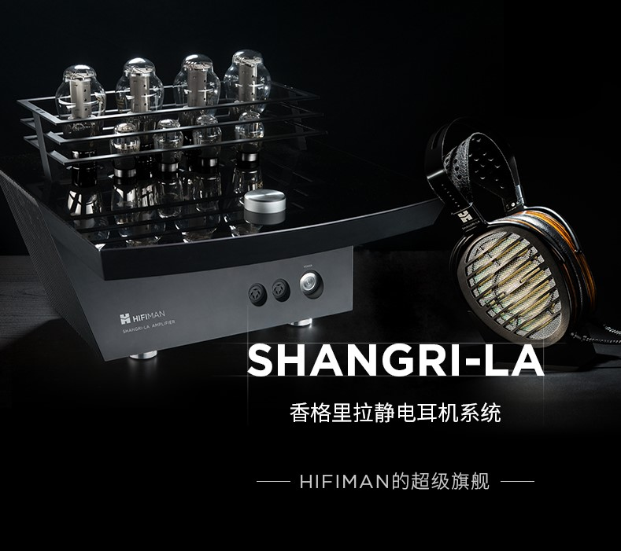

由于电子管具有比晶体管更低的原生失真以及更高的电压（你没看错），非常适合用在 Hi-End 系统中驱动高阻耳机。静电耳机本质上就是一种阻抗超高、功率很低、电压极高的耳机，因此也非常适合用胆机驱动，如大奥、大香

**值得注意的是，厂商标注的最大不失真功率通常在 1000hz 输入信号下测得，其他频段的功率会有所不同**

## 推力有什么用？

**要多大功率才能推好某个耳机？** 千人千耳，这个问题没有标准答案。  
**某个耳放能不能推某个耳机？** 只要是在正常音量下欣赏音乐，那么 99.9% 的情况下都能推。

---

**99% 的情况下削波失真都不是需要担心的问题**

地球上绝大部分用于人类聆听的数字音频都只有 16bit 位深，这意味着在听不到量化噪音的情况下音乐的最大响度只有 96dB。只要你听音乐的音量有一瞬间能到 96dB 以上，那么你就可能听到底噪

别跟我说大动态古典乐有 110dB 瞬时响度什么的，你用耳机听的音乐不会有任何一个瞬间能达到这个飞机起飞一般的响度。如果有，那么你需要的将不是森海塞尔而是森海塞尔它爹

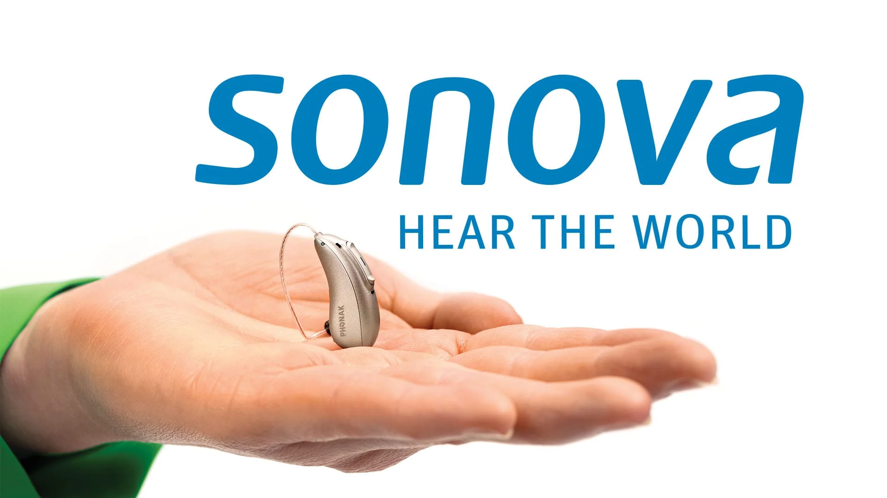

如今市面上成本低、体积小、失真低、推力大的耳放越来越多，即使入门级的小尾巴也能很轻易地把大部分耳机推到 96dB 以上。理论上，5 克重的小尾巴 JA11 能把 HD800s 推到 102dB

那么，追求大推力到底有什么意义？

---

**能推响 = 能推 ≠ 能推好**

**更大的推力不是为了达到更大的响度，而是为了在正常音量下失真表现更好。** 举个例子，差不多架构的 800mW@32Ω 的耳放和 400mW@32Ω 的耳放接同一个耳机输出同样的音量，虽然输出功率可能都是 1mW，前者的失真表现大概率比后者更好

这是因为功放的本质是一种基于晶体管的信号传输设备，而晶体三级管输入输出的线性关系往往随着信号的增大而变差，因此耳放的失真往往也会随着信号的增大而更显著

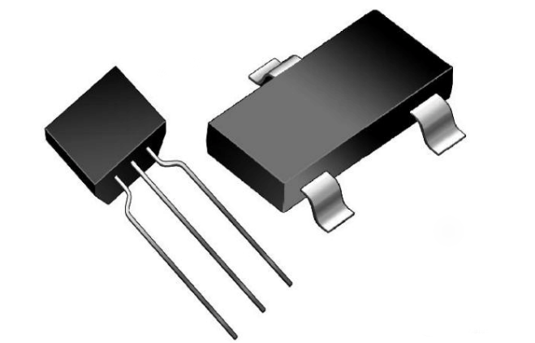

换句话说，耳放 **输出越猛，失真越大**。这也是习惯于大音量的老烧比普通烧友更易听出耳放区别的原因之一 —— 耳机越难推，音量开得越大，耳放的性能差异越明显

**本节内容不适用于胆机和 D 类放大器**

## 各种耳机负载的特征

耳机的灵敏度和阻抗特征差异巨大，具有大相径庭的负载特征。因此，耳放驱动不同耳机时会产生不同的失真特征，这就是“xx 耳放推不好平板但能推高阻动圈”等说法的来源。下表举例了一些典型耳机对耳放推力的需求特征

| 耳机          | 负载类型                             | 压摆需求   | 电流需求   |
| ------------- | ------------------------------------ | ---------- | ---------- |
| 空载          | 基本等同断路                         |            |            |
| HD800s、HD600 | 阻抗很高且阻抗曲线不平坦的动圈耳机   | ⭐⭐⭐⭐⭐ | ⭐         |
| Utopia        | 标称阻抗不高但阻抗峰值很高的动圈耳机 | ⭐⭐⭐⭐   | ⭐         |
| AR5000、FT1   | 阻抗较低且阻抗曲线比较平坦的动圈耳机 | ⭐         | ⭐⭐       |
| MM100         | 阻抗很低，功率灵敏度非常高的平板耳机 | ⭐         | ⭐⭐       |
| Edition XS    | 阻抗很低，功率灵敏度较低的平板耳机   | ⭐         | ⭐⭐⭐     |
| Susvara       | 阻抗较低，功率灵敏度极低的平板耳机   | ⭐⭐⭐     | ⭐⭐⭐⭐⭐ |

可以看出，不同类型的耳机对耳放各种能力的需求是不同的。其中，阻抗不平坦以及高阻动圈耳机的压摆需求尤其高。虽然 Susvara 等以难推闻名的平板耳机的电压灵敏度低于 HD800s 等传统高阻动圈耳机，但这类动圈耳机往往有显著的电感，会在被耳放驱动时产生反电动势，继而引发相位问题。这种相位问题在平板耳机中是不存在的，因为它们几乎是纯电阻负载。为了减轻这类相位问题，我们需要压摆更强的耳放驱动高阻动圈耳机以及阻抗不平坦的动圈耳机

## 怎样才算是推好？

怎样才算把耳机推好了众说纷纭，诞生了一个经典谣言：“耳机的低频更难推出来。没推好的大耳没低频”

其实，绝大多数前端都不会显著改变耳机的频响，低频量也不会因推力的大小而变化

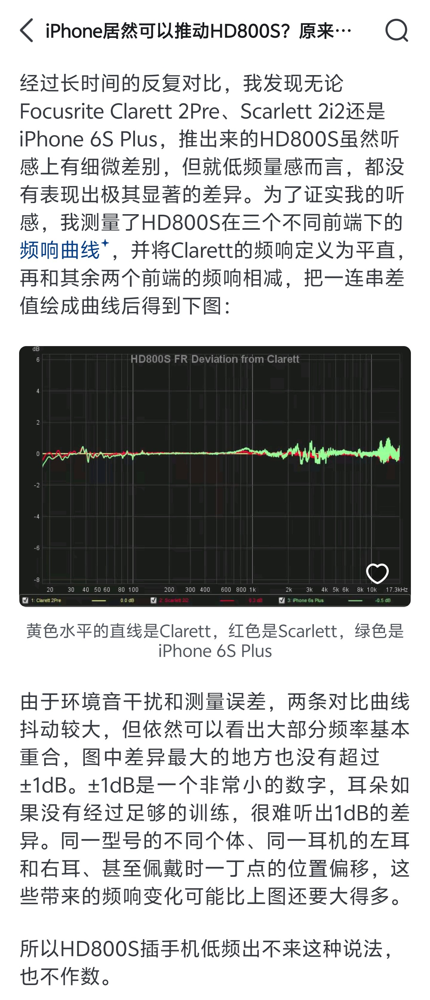  
[《iPhone 居然可以推动 HD800s？原来高阻抗的耳机反而更好推？》- 知乎 村姑阳子](https://zhuanlan.zhihu.com/p/51180207)

这个谣言由多种因素共同产生。首先音乐的能量主要集中在低频，因此低频的失真表现更容易被注意到

[.png>)  
.png>)](../../analysis%20tools/power%20analysis%20of%20music.py)  
加州招待所的声功率频域分布图足以佐证这一点

另一方面，动圈耳机容易在低频发生谐振，导致感抗急剧加大。这种现象表现为阻抗曲线的峰值（f0），会导致特定频段相位失真加剧。如果耳放对这种相位失真的控制力羸弱，就可能产生比较奇怪的听感，让人以为低频“出不来”

[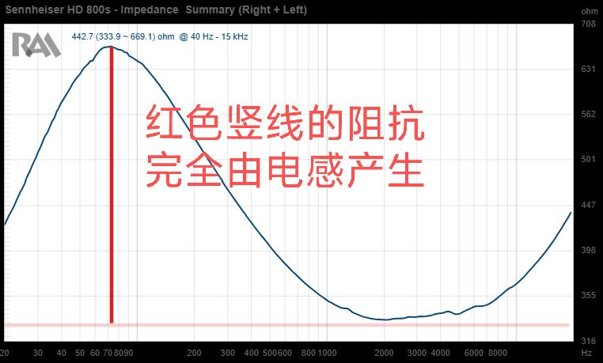  
HD800s 的阻抗曲线](https://reference-audio-analyzer.pro/en/param14.php?&tit_head=1&tit_graph=6&tit_channel=2&idr0=706&idmain=706&report_page=2&chanell=2&hdnx=0&tpdisp=st&idu=0&format=2&vstyle=0&n_canvas=1&lng=eng)

---

**“xx 耳放推不推得好 xx 耳机”** 本质上是发烧友对一套耳机系统声音的主观评价，以目前的心理声学发展状况来说，还没有任何客观标准。所谓“过推”和“推不好”的本质是一样的，只是某位烧友对某套设备不满意的说辞而已

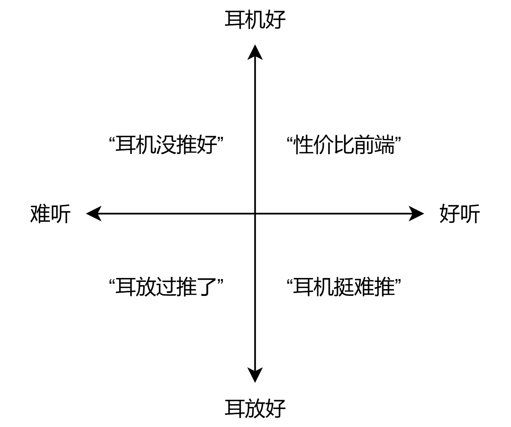

Again，**能推响 = 能推 ≠ 能推好**。如果说音频设备的搭配是一场木桶效应，那么 99% 的情况下，耳放都不是那块短板，耳机才是

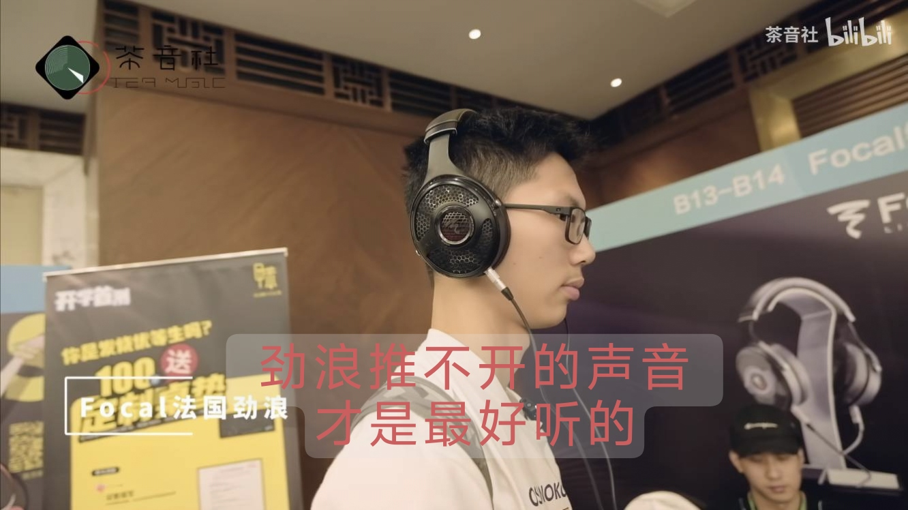  
[《【茶音社 HIFI 月报】北京耳机展特别作战记录！（上篇）》](https://www.bilibili.com/video/BV1HG411R7bb)

## 什么是增益？

不同的音箱和耳机灵敏度区别巨大，要使它们达到特定音量，音量旋钮经常会被拧到极端位置，不仅不方便，还容易引发电位器在低音量下的偏音等问题

因此，现代功放和耳放普遍同时具有增益和音量调节功能。**增益的用处是为各种灵敏度的音箱和耳机提供合适的音量区间**

下图为飞傲 K19 的部分推力参数，其中“超级大耳模式”和“大耳模式”是耳放的两档增益设置

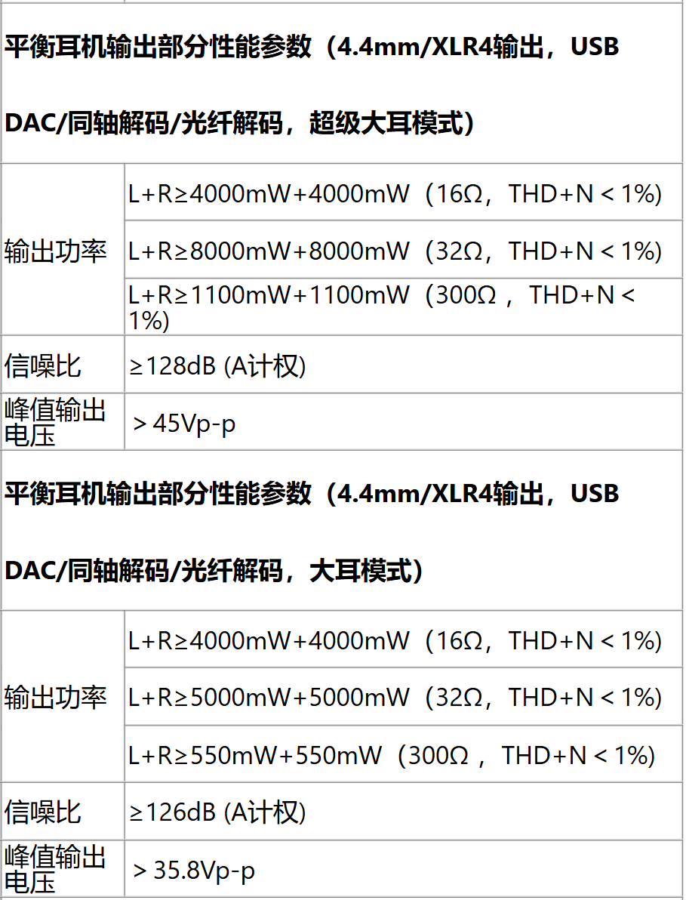

从这张表我们可以解读出：更高的增益会使该耳放的推力更大，因此在相同负载下，失真表现可能会更优秀。不过，在 16Ω 负载时，由于电流比电压先触及设计最大值，更高的增益不会提高推力

另外，我们还发现更高增益下信噪比更大。这非常具有误导性，因为信噪比是在最大输出下测得的，有用信号更大，信噪比自然也更大。然而在实际聆听音量下，更高的增益通常伴有更高的底噪。不过，现代优质耳放的底噪应该是不可闻的，因此这也不成问题

现代耳放的设计百花齐放，**增益的实现方式大相径庭，因此具体影响也各有不同**。由于现代耳放的底噪控制普遍非常优秀，没必要为高敏耳机单独做底噪抑制措施，因此 **很多时候调节增益只是单纯改变音量调节步长和上限而已，对音质没有任何影响**

就 K19 来说，前三档增益“低”“中”“高”是软件实现的，不会影响失真和底噪表现；而后两档增益“大耳模式”和“超级大耳模式”才是传统意义上的硬件增益，可能对音质产生实际影响

# 失真篇

失真又称畸变，指信号在传输过程中相比原信号发生的偏差。**失真是造成不同听感的本质**

耳放推力不够会导致失真，推力够了也有固有失真。失真从何而来？对听感又有何影响？本部分将带读者解读失真以及失真的测量指标

## 频响失真

频响失真又称幅频失真，是一种线性失真，即不产生原信号以外的频率的失真。频响失真指耳放对不同频率信号的增益不同，在测量中表现为频响曲线。频响曲线是耳放最基础的指标之一

  
图 ①：输入给耳放的信号  
图 ②：输入信号的分解  
图 ③：频响失真的信号  
图 ④：分解失真信号发现 100hz 和 1000hz 信号间出现了 1dB 增益差

[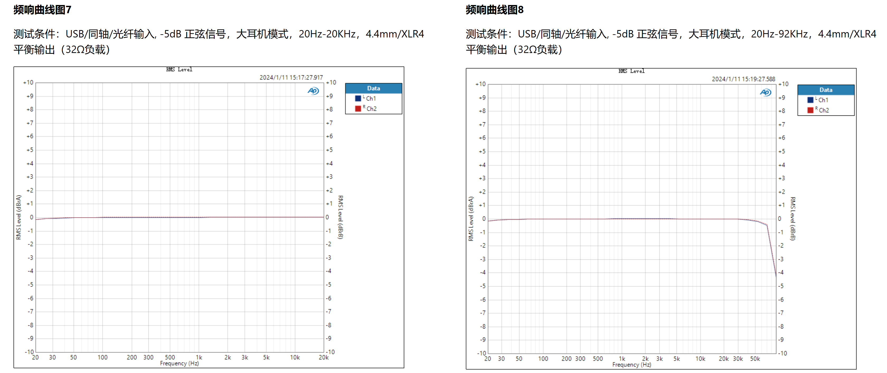](https://fiio.com/k19_parameters)

如图为 K19 的频响曲线，可以看到它在 20-20000Hz 的频率范围内是平坦的。如果 K19 带载频响不会变化，那么它驱动的耳机的频响也不会发生明显的变化。换句话说，耳机的声音会比较原汁原味

不是所有的耳放的频响都是平直的，**不给你看频响曲线的“味道机”，很可能在频响上做了手脚**

---

输出阻抗也会导致音频系统的整体频响发生变化，但输出阻抗造成的频响畸变不会反映在耳放自身的频响上。如果耳机在不同频率下具有不同阻抗（比如所有动圈耳机和极少数平板耳机），那么高输出阻抗的耳放就会在耳机阻抗较低的频率下给耳机分配更少的电压，导致整个耳机系统的频响发生变化

森海解码耳放一体机 HDV820 就是一款典型的频响平坦但可能由于高输出阻抗造成频响失真的耳放。下图摘自 ASR 论坛的 HDV820 评测

[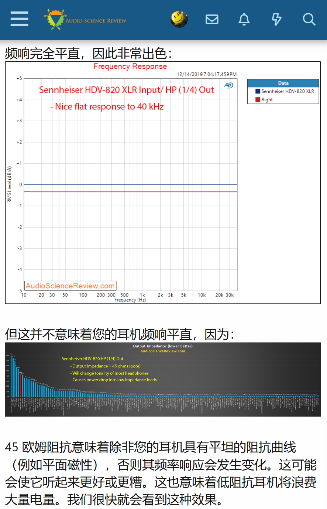](https://www.audiosciencereview.com/forum/index.php?threads/sennheiser-hdv-820-usb-dac-headphone-amp-review.10393)

胆机通常具有比较高的输出阻抗，高输出阻抗造成的频响失真是胆机独特音色的来源之一。现在也有一些厂商通过“前胆后石”、阻抗选择等方式来实现胆机的“现代声”

## 谐波失真

谐波失真是一种非线性失真，非线性失真即产生信号本没有的频率的失真，指耳放输出信号中出现了输入信号频率的整数倍频率成分的现象，是最常见的非线性失真。总谐波失真 (THD, Total Harmonic Distortion) 是现代耳放最受发烧友重视的指标之一

  
图 ①：发生奇次谐波失真的波形与原波形对比  
图 ②：奇次谐波失真的信号分解  
图 ③：发生偶次谐波失真的波形与原波形对比  
图 ④：偶次谐波失真的信号分解

由于谐波失真在听感上比较明显，测量方法非常成熟，发烧友对它的了解也比较多，现代科学机倾向于把谐波失真做得非常低

听说在国产科学机还未兴起的时候，前端厂商的宣传口号经常是“通过 xxx 手段降低了 xxx 的谐波失真”，以至当时的科 hi 把 THD 当成了衡量音质的金科玉律

---

谐波失真分为奇次谐波失真和偶次谐波失真。发烧友们普遍认为奇次谐波失真对听感的劣化比偶次谐波失真严重得多，甚至还有认为“偶次谐波失真是胆机温暖悦耳音色的来源”以至于舍本逐末、厚此薄彼的。然而，**声音和心理的映射关系是极其复杂的**，各种谐波失真都是构成音色的重要因素

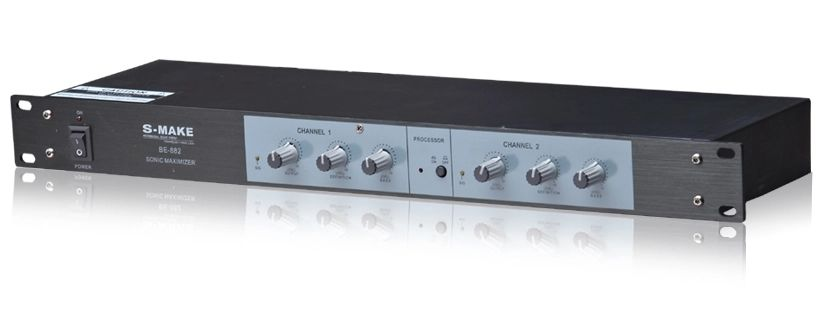  
激励器是一种利用谐波失真来调整音色的效果器，它通过奇次和偶次谐波的组合来产生各种主观听感

胆机没有被石机淘汰的本质原因是电子管的高线性，线性与任何失真都是相悖的，为了偶次谐波失真而买胆机好比买椟还珠。如果你真的喜欢偶次谐波丰富的音色，何不在价格更低、指标更优秀的石机前加个 dsp 来自己添加、定制谐波失真呢？

如果轻信武断的优劣高下之分，对石机嗤之以鼻，却对胆机的偶次谐波失真完全不加控制，美其名曰“胆味”，可谓是与 **Hi**gh-**Fi**delity 的初衷背道而驰了

## 交越失真和温漂

交越失真是一种非线性失真，常见于乙类（B 类）放中。这种功放为了提高效率，使用了推挽式的结构，使得输出信号在交叉点处出现失真，即输出信号的上升沿和下降沿不对称

甲乙类（AB 类）放大器是一种在低功率时工作在甲类（A 类）状态，在高功率时工作在乙类状态的放大器。它的交越失真只有在达到一定功率时才会显现

现在大多数用于驱动音箱的功放要么是 D 类要么是甲乙类，由于耳放功耗较低，纯甲耳放倒是不少。纯甲类放大器的效率很低，功耗很高，需要注意散热，小心温度对元件寿命和性能的影响。如果散热不良，晶体管等元件可能会损坏或发生温漂，即性能因温度变化而偏离理想情况的状况。不过，也有一些专门设计在高温下工作的纯甲耳放，比如 Burson Soloist Voyager

/51.jpg>)  
左上：飞傲 K19，设计在室温下工作的甲乙类耳放  
左下：Burson Soloist Voyager，设计在高温下工作的大甲放，达到最佳音质需要预热  
右上：奥莱尔 X1s GT，大甲  
右下：奥莱尔 S17pro，通过散热避免过热的大甲

人耳对交越失真的敏感性很高，因此高端耳放以纯甲居多。在用料差不多的情况下，乙类放的推力会比甲类大；由于乙类能效更高，受温漂的影响也较小。因此，甲类和乙类没有优劣之分，只有适合与否

## “多音失真”

“多音失真”是我生造的一个词，只是区分一下较为简单的单信号失真和涉及多个信号才能表现出来的失真问题，不必计较。这部分介绍谐波失真、削波失真和噪音以外的失真问题

---

相位失真是一种线性失真，指耳放对输入信号相位的畸变，换句话说就是输出各种频率的时间差

  
图 ①：输入给耳放的信号  
图 ②：输入信号的分解  
图 ③：相位失真的信号  
图 ④：分解失真信号发现 100hz 和 1000hz 信号间出现了相位差

---

互调失真是一种非线性失真，指不同频率信号互相影响，产生本不存在于输入信号中的频率而造成的失真

  
图 ①：输入给耳放的信号  
图 ②：输入信号的分解  
图 ③：互调失真的信号  
图 ④：分解失真信号发现在 800hz 和 1000hz 外多出了和频和差频信号

## 失真测量与心理声学

如何看待各种测量指标可能是区分科 hi 与玄学老烧的典型表征了。老烧批判科 hi 盲从测量指标而不信主观听感，科 hi 则批判老烧盲从主观听感而不信测量指标…… 多的我不好说 🙂

本节将教读者如何看待耳放的测量指标，并解释为什么测量指标和听感之间的关系并不是那么简单。以后看 rz 科 hi 和 rz 老烧打架的时候，就有一定分辨是非的能力了

---

SINAD（Signal to noise and distortion ratio，信纳比）是耳放最重要的指标，包括了所有构成噪声和失真的部分。一定负载下的 SINAD 可谓衡量耳放 **声学还原** 性能的最佳单一衡量标准

然而，SINAD 并不能代表耳放的 **心理声学还原** 性能。这是因为人耳对不同类型的失真敏感性不同，比如，人耳对瞬态互调失真和交越失真尤其敏感，而对相位失真敏感性较低。SINAD 相同的耳放也可能因为失真类型不同而产生截然不同的听感

---

**瞬态互调失真** 是一个在段位较高的科 hi 中非常流行的概念。这种失真通常是负反馈滞后导致的，在测量中表现为多音信号下的相位和非线性失真问题，能非常直观地体现在方波测试中

  
方波测试（时间-振幅）

然而，自然界中不存在方波那样瞬间飙升或骤降的信号，纯方波也不是直接测量瞬态互调失真的方法，因此并不能反映什么指标，也没法代表什么性能。方波测试更像是类似最大不失真功率一样用来秀肌肉、展示给消费者看的直观演示而已

有些烧友将瞬态互调失真奉为圭臬，拿个方波测试就将其等同于耳放的瞬态响应性能，把“高频乱”“动态虚”“瞬态差”的主观听感简单归咎于负反馈，甚至延申到“THD 指标好看的科学机都是瞬态差的阳痿声”这一结论，是极其不负责任的

---

瞬态互调失真只是一个例子，耳放的失真成因以及对主观听感的影响多种多样，它们互相影响、交融、依存，也同时反映在各种测量指标中。因此，辩证看待测量指标，不要盲目追求某项数据，不要为主观听感和测试指标强加因果，才是正确对待电声学的态度

**听声是声，听声不是声，听声还是声**  
**看测量指标是测量指标，看测量指标不是测量指标，看测量指标还是测量指标**

可能这就是许多走过弯路的发烧友们的心路历程吧

# 如何与发烧友聊耳放

发烧友之间的交流形成了 Hi-Fi 圈，这是一个充满了各种反智说法、强盗逻辑以及仇恨言论的圈子，充斥着伪科学、割韭菜、邪教信徒以及各种各样的奇葩。以下几条不仅是作为有道德有思想发烧友的操守，也是应对一些带火药味的交流的利器

0. ~~与发烧友聊天最重要的就是自己的设备比他贵~~

1. 负责任地交流，不要以为自己的耳朵是铍振膜，心理因素对听感的影响往往显著大于发烧友设备之间差异

2. 你的耳朵没有受训，将主观听感如“胆味”、“r2r 声”、“瞬态差”与客观情况如胆机、r2r 解码、瞬态响应性能建立联系十有八九是强加因果。聊听感就聊听感，不要拿科学来装逼；如果一定要，请加上程度副词

3. 耳放能产生的听觉影响比发烧友描述的小得多。听不出来区别不可耻，相反听出区别才更可能是心理作用

4. 不要鄙视他人的主观听感，不要因为他人的听感与你不同就认为他人是错的。主观听感受心理、环境、生理结构差异、客观声音等多种因素影响，你和他听到的是一样的不代表你和他听到的真的是一样的

5. 不要把“动态”和动态范围混为一谈，不要把“瞬态”和瞬态响应混为一谈，懂点电声的人会抓狂

6. 除非别人主动提起，不要劝人多花钱。Hi-Fi 圈的本质是个奢侈品圈子，无论是为了面子还是别的什么压榨自己的钱包都不值得

# Reference

Plomp R, Steeneken HJ. Effect of phase on the timbre of complex tones. J Acoust Soc Am. 1969 Aug;46(2):409-21. doi: 10.1121/1.1911705. PMID: 5804112.

J. Lohstroh and M. Otala, "An audio power amplifier for ultimate quality requirements," in IEEE Transactions on Audio and Electroacoustics, vol. 21, no. 6, pp. 545-551, December 1973, doi: 10.1109/TAU.1973.1162523.

Leinonen, Eero et al. “Method for Measuring Transient Intermodulation Distortion (TIM).” Journal of The Audio Engineering Society 25 (1976): 170-177.

J. Lohstroh and M. Otala, "An audio power amplifier for ultimate quality requirements," in IEEE Transactions on Audio and Electroacoustics, vol. 21, no. 6, pp. 545-551, December 1973, doi: 10.1109/TAU.1973.1162523.

Herzog, Stephan; Investigations of the Effects of Nonlinear Distortions on Psychoacoustical Measures [PDF]; TU Kaiserslautern, Kaiserslautern, Germany; Paper 7751; 2009 Available: https://aes2.org/publications/elibrary-page/?id=14947
