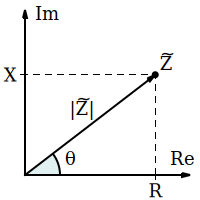
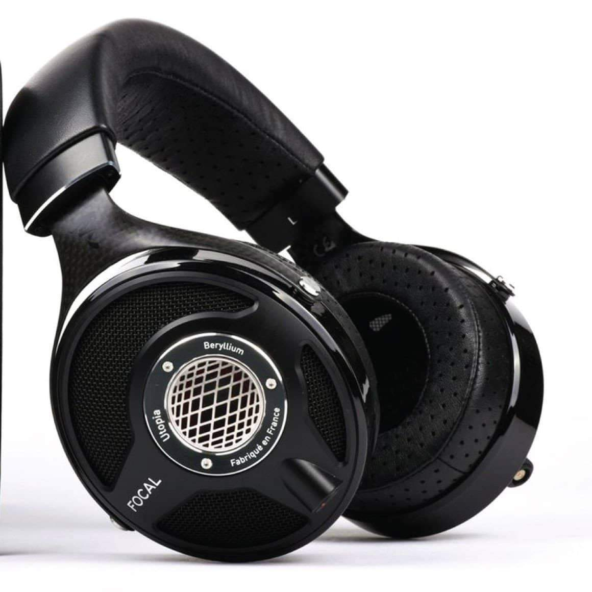

感谢 XK-Audio 徐工的耐心指导和 ASR 论坛授权提供的数据，让拙文得以写成。本文假设读者至少掌握高中电力学知识

耳机发声单元本质上就是一个电路元件，而一整个耳机系统就是一个复杂的电路。为了分析耳机发声单元的声学性能，我们可以把最后一级放大器开始到耳机单元的所有元件看作一个有源局部电路。本文将……

# 阻抗与阻抗曲线

**阻抗 impedance** 描述了一个电子元件对电流的阻碍作用，是发声单元最重要的参数之一。阻抗由 **电阻 resistance** 和 **电抗 reactance** 组成，电抗又由 **感抗 inductive reactance** 和 **容抗 capacitive reactance** 组成。用数形结合的方式来描述阻抗即

$$
Z=R+jX=R+j(X_L+X_c)\\
|Z|=\sqrt{R^2+X^2}
$$

其中，Z 为阻抗，R 为电阻，X 为电抗，$X_L$ 为感抗，$X_c$ 为容抗，j 为虚数单位即 $\sqrt{-1}$，以上所有量的单位都是欧姆（Ω）。阻抗是一个复数，它的实部是电阻，虚部是电抗。阻抗的绝对值反映了一个元件对电流阻碍作用的大小。**下文以“阻抗”代称阻抗的绝对值，用 Z 表示阻抗的绝对值**

由于动圈和平面磁耳机单元的容抗通常远小于感抗和电阻，即 $X\approx X_L$，因此可以近似地认为耳机的阻抗只由电阻和感抗组成，即认为

$$Z=\sqrt{R^2+X_L^2}$$

感抗是电感现象对电流阻碍作用的大小，它与电流变化的速率正相关，因此信号的频率会影响感抗，进而影响阻抗。信号频率和阻抗大小的关系被称为 **阻抗曲线**

>   
> **猜猜这是哪款耳机的阻抗曲线！** 答案将在文末揭晓

# 平面磁耳机的阻抗

平面磁耳机是一种在振膜上印导电线路，利用电磁感应驱动振膜的耳机。平面磁单元由磁铁和印有导电线路的振膜组成。其中，磁铁产生磁场，导电线路通过信号电流，在磁场中受力带动振膜振动，振膜推动空气发出声音。如图是一种典型的平面磁单元结构

  

图中，导电线路和磁感线相互垂直，电流按图示方向通过时会产生向下的力。由于平板耳机的振动部分很轻，转化为机械能的电能很小，因此感抗很小，所以大部分平面磁耳机的阻抗基本等于其电阻值。由于电阻不受信号电流频率的影响，大部分平面磁耳机的阻抗曲线几乎是平直的

Susvara 的阻抗曲线非常平直

但也不是所有平面磁耳机的阻抗曲线都是平直的，如 DCA Expanse

# 动圈耳机的阻抗

动圈耳机是一种将音圈绑定振膜，利用电磁感应驱动音圈，进而推动振膜的耳机。动圈单元由磁铁、音圈和振膜组成。其中，磁铁产生磁场，音圈通过信号电流，在磁场中受力推动振膜振动，振膜推动空气发出声音。如图是一种典型的动圈单元结构

  

如图可见，音圈类似一个线圈，会发生自感现象；同时，动圈单元的振动会更多地切割磁感线，因此感抗较大。由于感抗受电型号频率的影响，动圈耳机的阻抗曲线通常是不平直的

如图，现代低阻动圈耳机奥莱尔 AR5000 的阻抗会随频率波动

如图，拜亚动力 dt880 (600 Ω) 的阻抗会随频率显著波动

你可能会注意到，早期高端动圈耳机如 hd600、dt880 等的阻抗普遍较高。这是因为一方面早期耳放的输出阻抗普遍较高，难以驱动阻抗过低的耳机，因此一些耳机通过降低线径等方式来提高线性电阻进而提高阻抗；一方面早期动圈的振膜、音圈和磁铁的材料以及工艺不如现在，通过增加音圈匝数来增强对磁场的响应能力的同时，它的线性电阻和自感效应也大幅提高了

## 动圈耳机的谐振和自感

你可能已经注意到 dt880 的阻抗曲线在低频有一个明显的峰值，这是由于在一些特定频率附近，动圈单元容易发生共振，此时电磁能和非声波形式的机械能互相转化。这种现象被称为 **谐振**，发生谐振的频率即备受发烧友和声学工程师关注的谐振频率（resonant frequency, **f0**）

你还会注意到 dt880 的阻抗在高频极高频有提高趋势，这是由于频率越高，音圈的自感现象越明显，表现出的感抗越大

这两个效应会导致在评估动圈耳机“难推”程度时，电压灵敏度会比功率灵敏度更有意义，且根据阻抗和功率灵敏度计算出的电压灵敏度会比实际情况偏低。计算方法和推导过程可以参考 [灵敏度与阻抗的代数关系](./灵敏度与阻抗的代数关系.md)

动圈耳机频响的局部缺陷和特定频段的失真很可能来自于严重的谐振和高频自感现象，是导致的一个原因，但是这不是必然的

# 输出阻抗对频响曲线的影响

电子管功放（胆机）的独特音色由很多方面共同产生，其中最重要的方面之一便是输出阻抗对一些耳机频响的改变。

# 答案揭晓

>   
> **猜猜这是哪款耳机的阻抗曲线！**

**这是 Focal 于 2016 年推出的旗舰动圈耳机 Utopia 的阻抗曲线**

