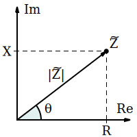
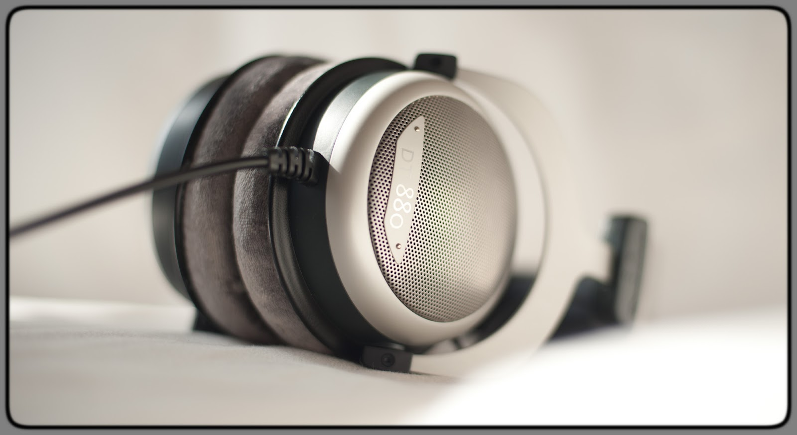
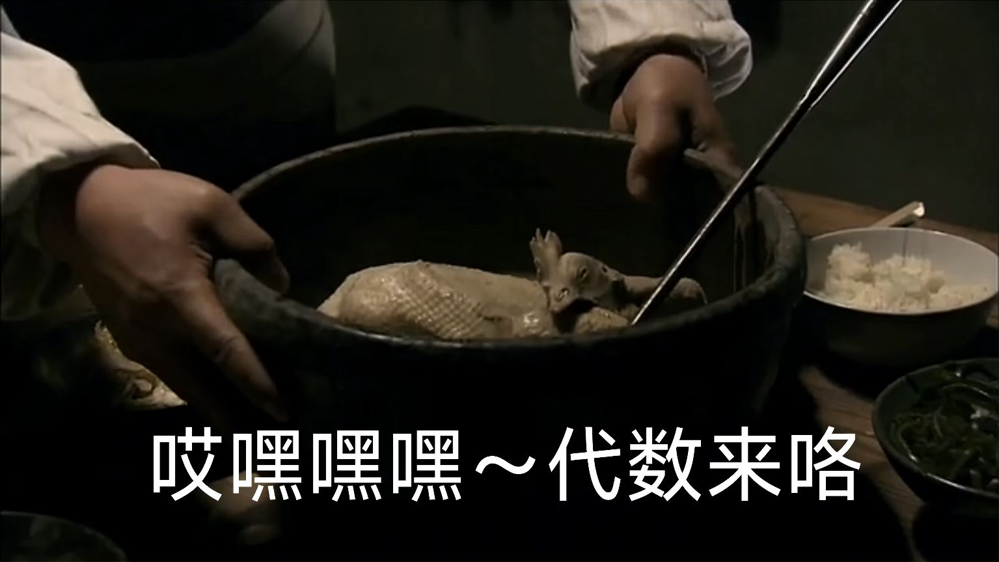

> 理解本文需要复数运算的基础知识和高中电力学知识

感谢 XK-Audio 徐工的耐心指导和 [AudioScienceReview 论坛](https://audiosciencereview.com) 版主 amirm 授权提供的数据，让拙文得以写成

耳机发声单元本质上就是一个电路元件，而一整个耳机系统就是一个复杂的电路。为了分析耳机发声单元的电声学性能，我们可以把最后一级放大器开始到耳机单元的所有元件看作一个有源局部电路。本文将带各位读者揭开耳机最重要的参数之一 —— **阻抗** 的面纱

# 阻抗与阻抗曲线

**阻抗 impedance** 描述了一个电子元件对电流的阻碍作用，它由 **电阻 resistance** 和 **电抗 reactance** 组成，电抗又由 **感抗 inductive reactance** 和 **容抗 capacitive reactance** 组成。用数形结合的方式来描述阻抗即

$$
Z=R+jX=R+j(X_L+X_c)\\
|Z|=\sqrt{R^2+X^2}
$$

其中，Z 为阻抗，R 为线性电阻，X 为电抗，$X_L$ 为感抗，$X_c$ 为容抗，j 为虚数单位即 $\sqrt{-1}$，以上所有量的单位都是欧姆（Ω）。阻抗是一个复数，它的实部是电阻，虚部是电抗。阻抗的绝对值反映了一个元件对电流阻碍作用的大小

由于动圈和平面磁耳机单元的容抗通常远小于线性电阻和感抗，即 $X\approx X_L$，因此可以近似地认为耳机的阻抗只由电阻和感抗组成，即认为

$$|Z|=\sqrt{R^2+X_L^2}$$

感抗是电感现象对电流阻碍作用的大小，它与电流的变化速率正相关，因此电信号的频率会影响感抗，进而影响阻抗。信号频率和阻抗大小的关系被称为 **阻抗曲线**

>   
> **猜猜这是哪款耳机的阻抗曲线！** 答案将在文末揭晓

# 平面磁耳机的阻抗

平面磁耳机是一种在振膜上印导电线路，利用电磁感应驱动振膜的耳机。平面磁单元由磁铁和印有导电线路的振膜组成。其中，磁铁产生磁场，导电线路通过信号电流，在磁场中受力带动振膜振动，振膜推动空气发出声音。如图是两种典型的平面磁单元结构

图中，导电线路和磁感线相互垂直，电流按图示方向通过时会产生向下的力。由于平板耳机的振动部分很轻，转化为机械能的电能很小，因此感抗很小，所以大部分平面磁耳机的阻抗基本等于其线性电阻。由于线性电阻不受信号电流频率的影响（线性电阻之所以为“线性”），大部分平面磁耳机的阻抗曲线几乎是平直的

  

Susvara 的阻抗曲线非常平直

  

但也不是所有平面磁耳机的阻抗曲线都是完全平的，如 Dan Clark Audio 的 Expanse

# 动圈耳机的阻抗

动圈耳机是一种将音圈绑定与振膜，利用电磁感应驱动音圈，进而推动振膜的耳机。动圈单元由磁铁、音圈和振膜组成。其中，磁铁产生磁场，音圈通过信号电流，在磁场中受力推动振膜振动，振膜推动空气发出声音。如图是一种典型的动圈单元结构

  

如图可见，音圈类似一个线圈，会发生自感现象；同时，动圈单元的振动会比平面磁耳机更多地切割磁感线；因此，动圈耳机的感抗比较明显。由于感抗受电信号频率的影响，动圈耳机的阻抗曲线不会是平直的

如图，拜亚动力 dt880 (600 Ω) 的阻抗非常显著地随频率波动

你可能会注意到，早期高端动圈耳机的阻抗普遍较高，如 hd600、dt880 等。这是因为一方面早期耳放的输出阻抗普遍较高，由于串联电路的分压原理，难以驱动阻抗过低的耳机，因此一些耳机通过缩小线径等方式来提高电阻进而提高阻抗；一方面早期动圈的振膜、音圈和磁铁的材料以及工艺不如现在，通过增加音圈匝数来增强对磁场的响应能力的同时，它的电阻和自感效应也大幅提高了

## 动圈耳机的谐振和自感

你可能已经注意到 dt880 的阻抗曲线在低频有一个明显的峰值，这是由于在一些特定频率附近，动圈单元容易发生共振，导致电磁能和机械能大量来回转化。这种现象被称为 **谐振**，发生谐振的频率即备受发烧友和声学工程师关注的谐振频率（resonant frequency, **f0**）

严重的谐振可能会导致频响上的缺陷和非线性失真，因此在耳机设计中，常通过增加阻尼、提高振膜硬度、增大振膜面积等办法来抑制谐振，也可以通过增加电阻的方式“稀释”谐振感抗的影响

据 XK-Audio 徐工介绍，阿瓦隆一代与 dt880 类似，低频谐振造成阻抗在局部频段内大幅升高，对音质产生了不利影响。阿瓦隆二代吸取一代的教训，通过增加电阻，使用超大振膜方式让阻抗曲线更加平直，使其成为了一款阻抗较高的动圈耳机

回到 dt880 的阻抗曲线，你可能还会注意到阻抗在极高频有提高趋势。这是由于（频率越高，匝数越多）->（音圈的自感现象越明显）->（表现出的感抗越大）->（阻抗曲线的高频上翘越明显）

这两个效应还会导致根据阻抗和功率灵敏度计算出的电压灵敏度比实际情况偏低，因此在评估动圈耳机“难推”程度时，电压灵敏度会比功率灵敏度更有意义。计算方法和推导过程可以参考 [灵敏度与阻抗的代数关系](./灵敏度与阻抗的代数关系.md)

部分现代动圈耳机的阻抗曲线已经比较平直，如奥莱尔的 AR5000

# 输出阻抗对频响曲线有影响吗？

**绝大多数情况下，没有。** 胆机的高输出阻抗造成的频响曲线畸变微乎其微！

> 以下部分一般读者可跳过，除非你不想仅仅“知其然”，更想“知其所以然”

## 代数关系

耳放的输出部分和耳机发声单元串联，会形成一个分压电路，导致在不同频率下耳机单元分得的电压发生差异。如果已知耳机和胆机的阻抗曲线、线性电阻以及频响曲线，我们就可以精确地算出该耳机在这个胆机上的频响曲线

如果某频率下，耳机的线性电阻为 $R$，电抗为 $X$；某胆机输出线性电阻为 $r$，电抗为 $x$；则在该频率下，胆机输出相同等效电压下，由胆机驱动的分贝声压级将

$$-10lg\frac{(R+r)^2+(X+x)^2}{R^2+X^2}$$

如果某耳机的线性电阻为 $R$，某胆机输出线性电阻为 $r$；在 1 khz 下，耳机的电抗为 $X_1$，胆机的输出电抗为 $x_1$；在频率 f 下，耳机的电抗为 $X_2$，胆机的输出电抗为 $x_2$；则让 1 khz 下胆机和低输出阻抗的普通耳放把该耳机驱动到相同响度时，在频率 $f$ 下，由胆机驱动的分贝声压级将

$$-10lg\frac{(R^2+X_1^2)((R+r)^2+(X_1+x_1)^2)}{(R^2+X_2^2)((R+r)^2+(X_2+x_2)^2)}$$

## 推导过程

> 理解以下推导过程需要理解 [灵敏度与阻抗的代数关系](./灵敏度与阻抗的代数关系.md)，并对交流电路知识有一定了解

已知某频率下，耳机的线性电阻为 $R$，电抗为 $X$；某胆机输出线性电阻为 $r$，电抗为 $x$

我们首先求得该局部电路总阻抗 $Z_总$（$j$ 是复数单位，即$\sqrt{-1}$）

$$Z_总=R+jX+r+jx=(R+r)+j(X+x)$$

则耳机上的等效电压 $U$ 和总电压 $U_总$ 的比值为

$$\frac{U}{U_总}=\frac{|R+jX|}{|Z_总|}=\frac{\sqrt{R^2+X^2}}{\sqrt{(R+r)^2+(X+x)^2}}$$

根据分贝声压级的定义式和声压和等效电压的正比关系，我们可以得到由胆机驱动的分贝声压级与给耳机施加电路全部电压时的分贝声压级差值 $I$

$$\Delta I=20lg\frac{\sqrt{R^2+X^2}}{\sqrt{(R+r)^2+(X+x)^2}}=-10lg\frac{(R+r)^2+(X+x)^2}{R^2+X^2}$$

这就是由胆机驱动和由低输出阻抗的普通耳放驱动的分贝声压级的差值

---

已知某耳机的线性电阻为 $R$，某胆机输出线性电阻为 $r$；在 1 khz 下，耳机的电抗为 $X_1$，胆机的输出电抗为 $x_1$；在频率 f 下，耳机的电抗为 $X_2$，胆机的输出电抗为 $x_2$

有上一题的经验，我们可以直接分别求得 1 khz 下和频率 f 下由胆机驱动和由低输出阻抗的普通耳放驱动的分贝声压级的差值 $I_1$ 和 $I_2$

$$
I_1=-10lg\frac{(R+r)^2+(X_1+x_1)^2}{R^2+X_1^2}\\
I_2=-10lg\frac{(R+r)^2+(X_2+x_2)^2}{R^2+X_2^2}
$$

由 $I_1-I_2$，得到

$$\Delta I=-10lg\frac{(R^2+X_1^2)((R+r)^2+(X_1+x_1)^2)}{(R^2+X_2^2)((R+r)^2+(X_2+x_2)^2)}$$

这就是让 1 khz 下胆机和低输出阻抗的普通耳放把该耳机驱动到相同响度时，在频率 $f$ 下，由胆机驱动和由普通耳放驱动的分贝声压级的差值

## 频响模拟

根据以上原理，我们可以用代码来模拟胆机的输出阻抗对耳机频响的影响。

  
[tube amp simulator.py](../../analysis%20tools/tube%20amp%20simulator.py)

在这个程序中，我用 ASR 测得的拜亚动力 dt1990 的频响曲线和阻抗曲线，并整体减少了整整 230 Ω 线性电阻假想出一个“低阻 dt1990”以 **放大输出阻抗对耳机频响的影响**。我还假设了一个输出阻抗满足 $Z=300+0.01*frequency+100/frequency$ 的胆机（实际上现在很少有输出阻抗这么高的胆机了）

于是我们得到以下输出，其中，蓝线是我们假想的“低阻 dt1990”的原本频响，而红线是高输出阻抗胆机“低阻 dt1990”的频响

什么？你问红线在哪里 😀

# 答案揭晓

感谢你读到这里，你是真正的发烧友！让我们揭晓开头问题的答案

>   
> **猜猜这是哪款耳机的阻抗曲线！**

**是拥有超高阻抗，超级波动阻抗曲线的 ATH-R70x！**
