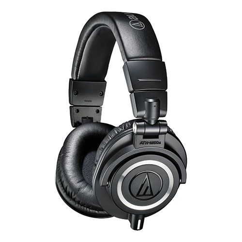

- 罩耳
- 封闭
- 动圈
- 38 Ω
- 99 dB/mW
- 285 g
- 单 3.5 mm AUX
- 京东 ￥ 999

随着水月雨从铁三角手中接过了“HiFi 界原神”的称号，曾经被黑麻了的铁三角的独特调音已经逐渐被主流听音观认可。~~连一刻都没有为水月的小丑哀悼，立刻来到战场的是~~ 被黑了十年又热销十年的 Audio-Technica ATH-M50x

> 对于 acg（包括 op、ed、角色曲，不含 ost），铁三角绝对是才貌双全的不二选择。对于欧美派和交响粉而言，这牌子（指铁三角）就是悲剧。这是由她骨子带着里准日系病态美的调音决定的
>
> [为什么很多耳机烧友总黑铁三角？- 知乎](https://www.zhihu.com/question/35383173/answer/319428075)

  
回收封面

整体听感上，m50x 是一副忠实于还原出有力的、轰鸣的、清晰的声音的全封闭式混音监听耳机。它中频的稍微凹陷使混音师得以方便地用它来挑高频刺，同时其常见于 DJ 耳机的全封闭设计“不漏气”的特点加强了低频，使其低频容易更快、更足，非常符合大多数现代听众的听音观。然而，这种设计也导致了其严重到已经干扰了正常欣赏音乐的听诊器效应，也使其在声场和定位上表现不佳，这导致了它不太适合用于欣赏音乐或听声辨位

  
别误会，m50x 即使听声辨位能力相对较弱，也比什么主流 crap 游戏耳机强

总结一下，m50x 其实根本不适合用来欣赏音乐或打游戏。它如此热销的原因其实是在于它在音乐制作领域的实用性和名气。作为一款全封闭不漏音的耳机，它可以用于人声录音；对于缺钱的个人音乐作者，它还可以用于混音监听（频响两头翘的 m50x 非常适合挑刺）；更值得一提的是它和主流 carp 耳机听感的契合程度（对于发烧友们来说，这可不是好事！！！）。让我们来看看混音师们对 m50x 到底是如何“又爱又恨”——

> ...my life would be complete if I could reliably mix with one of my Hi-End headphones instead of crap like Beats or ATH M50's...（大概内容就是虽然监听耳机很垃圾，但混音就是不能用 HiFi 耳机而必须要用监听耳机）
>
> [专业混音师评价为什么监听耳机比 Hi-End 耳机更适合混音 - Head-Fi](https://www.head-fi.org/threads/focal-utopia-vs-hd-800s.820234/post-12864469)

> 我会把 m50x 推荐给想自己录东西翻唱，或者初学入门混音的朋友，因为它的频响适合录音也适合混音，可折叠好携带，阻抗低颜色多，保有量大而且还不贵，集合这么多要素于一身的耳机，找不到第二款了
>
> [聊一聊为什么 ATH-M50x 适合作为第一款监听，它好在哪里？ - 知乎](https://zhuanlan.zhihu.com/p/339086256)

不过在本文中即使这款耳机的听诊器效应最强烈，它的佩戴舒适度还是可圈可点的，不夹头不压头重量轻。为隔音设计的耳罩包裹感非常好，使其被动降噪性能非常优秀，但对于大耳朵的人来说耳罩可能有点局促。不过……类似降噪大厂 Bose 的知名蓝牙降噪大耳 [Bose qc35II](https://www.bose.cn/zh_cn/products/headphones/over_ear_headphones/quietcomfort-35-wireless-ii.html)，它的塑料皮耳罩也相当容易破或者变油，这点蛮影响体验的（为了你耳罩的寿命，不建议让酒精等有机溶剂碰它。洁癖用户只能勤快换耳罩）

适合：小成本音乐制作，听音环境较嘈杂的人  
不适合：追求听声辨位的游戏玩家，需要通透声场的人  
推荐指数：⭐⭐ 完全不适合欣赏音乐，只适合小成本音乐制作

https://www.audio-technica.com/en-us/ath-M50x
