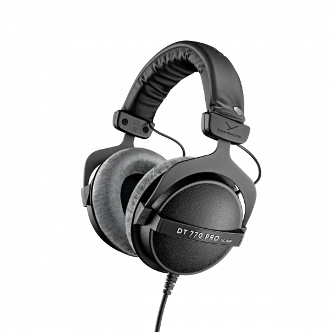

- 罩耳
- 封闭
- 动圈
- 32/80/250 Ω
- 96 dB
- 270 g
- 单 3.5 mm 不可换线
- 京东 ￥ 1099

dt770pro 是世界上最经典的还在产的封闭式监听耳机，可能没有之一，它的单元素质在当年可谓出类拔萃。dt770pro
发售至今已 20 年，单元素质仍没太落后

dt770pro 的耳罩和其他封闭式耳机不同，并没有采用常规的皮质，而是采用了天鹅绒，这导致了其隔音性能并不是很强，虽然是封闭式设计但只是没有漏音

dt770pro 的声音可谓典型的“两头翘”，表达非常直白（虽然不知道 4000 Hz 附近的那个谷是什么意思），是欧美入门音乐人监听制作音乐的首选。如果你喜欢或追求平直“正确”的声音，在低频不弱的同时追求高频清亮，那 dt770pro 想必绝对能满足你

在佩戴上，dt770pro 轻盈的重量使其成为了最接近“无感佩戴”的耳机之一，久戴也非常舒适。dt770pro 对于普通听众来说，可能唯一的缺点就是其过长的不可换线材用起来过于麻烦了。另一方面，现代大部分耳放都是强平衡输出而弱单端输出，只支持单端输入且由于磁路古老而不易驱动的 dt770pro 可能需要与其身价不太匹配的更好的耳放匹配，“单端且不易推”是一个显著的缺点

适合：家用聆听，音乐制作者  
不适合：便携  
推荐指数：⭐⭐⭐ 唯一的缺点就是不可环线且不易推

https://global.beyerdynamic.com/dt-770-pro.html
