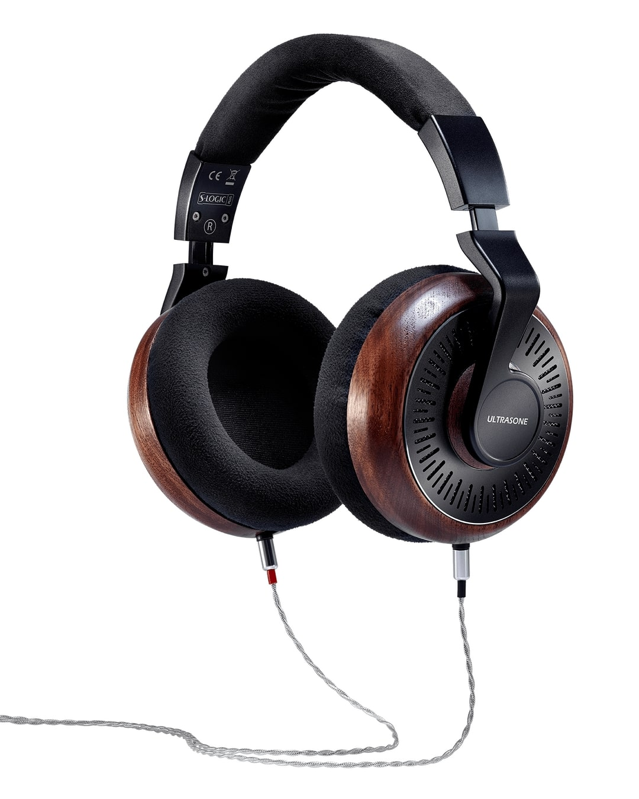

找不到频响曲线，已写信问候 UltraSone。逼养的不回复，你好歹像 VZR 那样给个解释啊

- 罩耳
- 半开放
- 动圈
- 32 Ω
- 未知灵敏度，已写信问候 UltraSone，不过听说能直推
- 318 g
- 双定制 2-pin IEM 插针
- 淘宝 ￥ 3499

**作为一款发售价一万元，全球限量 1111 台的耳机，由于营销不给力，现在国内 3200 就可以拿下，性价比相当高！！！**

> 国内的发烧友给德国 ULTRASONE 起了一个违反广告法的中文名字叫：极致。我想这跟 ULTRASONE 经常推出一些采用稀有金属来制作外壳且售价高到让人乍舌还限量销售的耳机作品不无关系。尤其是 Edition 系列，这个系列是最能诠释极致精神的，不管是早期钌金外壳的老版本 Edition 8，还是采用沼泽木材质外壳的 Edition 5，他们无不在选材、做工、声音甚至售价等各个方面在诠释着“极致”
>
> [HiFi 入门小知识连载——以最新的 Edition 11 为例聊聊德国 ULTRASONE 极致耳机 - 什么值得买](https://post.smzdm.com/p/a4w0lzow/)

极致 ed11 是一款三频非常均衡，单元素质非常优秀，声音非常温润，做工极其优良，技术非常先进，适用范围非常广的耳机。常有人拿它和拜亚的经典大耳 dt1990 比较，得出"ed11 是加强版的 dt1990"这一结论，不无道理。戴上 ed11 听音乐是一种纯粹的享受，它在能给你均衡声音体验的同时发挥其强大的单元素质，通过 S-Logic® Plus technology（一种通过引导声音在耳廓内反射而不是传统的直射到耳膜来改进听感的“自然感”的技术）清晰地将声音的结像和声场展现在聆听者脑中

> Here, the transducers are not placed in the middle of the headphone cup but offset forward and downward. As a result, the sound first hits the outer ear – the inclusion of the auricle anatomy in the hearing process creates a spatial perception for all common stereo sources, without any additional electronics.
>
> The result is an impressively natural sound, directions and distances are reproduced without distortion and authentically. With S-Logic® you don’t hear music in your head, but on a large stereo stage in front of you.
>
> [WHAT IS S-LOGIC®? - ultrasone.com](https://ultrasone.com/s-logic-ule)

有意思的是，由于它充分利用了耳廓的声音反射，佩戴方式对这款耳机声音的影响极大。当你把耳罩往前后挪挪的时候，或许能得到截然不同的体验！

在佩戴上，这款耳机采用了在降噪耳机中常见的无头带可调整头梁高度的设计，但其较低的重量和稍高的夹耳力使其毫不压头，体感上非常接近索尼 WH1000XM 系列以及 Bose QC 系列降噪大耳的体验，非常舒适。另外，这款耳机的阻抗较低，灵敏度也挺高，上海壹视听老板和网上众多烧友都评价其为“最适合直推的耳机”。广泛认可的易推性，不太漏音的半开放式声学设计，再加上古典优雅的外观（包括耳机线也很漂亮），让这款耳机成为了便携 ~~装逼~~ Hi-End 耳机的绝佳之选

适合：直推出街的人，颜值党  
不适合：没有人  
推荐指数：⭐⭐⭐⭐⭐ 价格跳水后最接近“完美”的耳机

https://ultrasone.com/product/ultrasone-eleven-high-end-headphones
