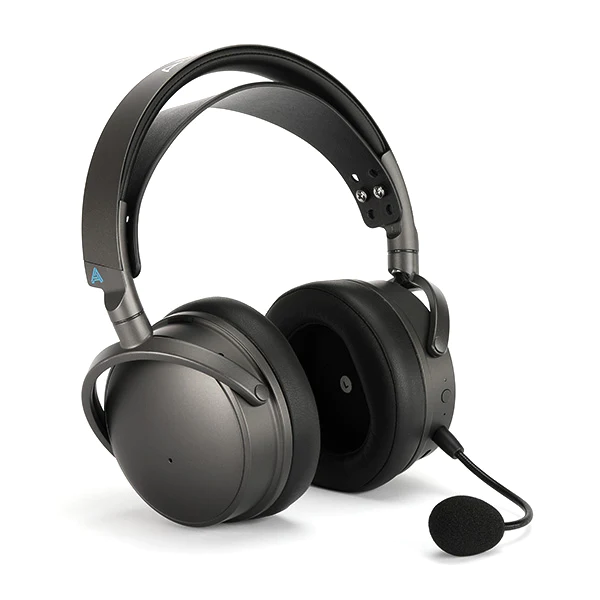

- 无线游戏耳机
- 罩耳
- 封闭
- 平面磁
- 490 g
- 蓝牙 5.3、USB-C 无线接收器、3.5 mm AUX、USB-C
- 京东 ￥ 2879

相信任何一个关注过声学外设的玩家都听说过 Maxwell 的鼎鼎大名（如果你没有说明你关注得不够），当之无愧的世界最强无线游戏耳机，没有之一！五星评论家麦克阿瑟曾说过：“我也曾相信‘用 HiFi 耳机打游戏不一定傻逼，但用游戏耳机听音乐绝对傻逼’，直到我使用 Audeze Maxwell”如果忽略那有点吓人的重量，那 Maxwell 就正如其名，是 Max-Well 的最佳无线游戏耳麦解决方案

我通常不会评价也不会在意一款无线耳机的声音，因为绝大多数无线耳机的 dac、功放模块以及振膜都是电子垃圾，直到 Maxwell 颠覆了这个印象。无线耳机是一众外设厂和索尼、Bose、苹果、Beats 等科技公司的主战场，传统音频大厂如森海拜亚的木馒头、lagoon 等无论从销量还是口碑都被 XM 和 Airpods 吊打，直到 Audeze 的搅局让音质这个词重新进入了游戏外设领域

> 考虑到绝大部分人对耳机价格的接受程度和无线需求，Audeze 于 2023 年初推出了一款一经发售就享誉世界，被冠以“世界第一游戏耳机”的“平价”（相对于 Audeze 其他产品来说算便宜了）无线游戏耳机 Maxwell。Maxwell 是其已停产的前辈 Hi-End 有线有源游戏大耳 Mobius 的继任者，在优化软件的同时彻底摒弃了有源有线设计，以 LCD-GX 作为 Mobius 的上位替代，而 Maxwell 则主打主流价格的无线耳机市场。不得不说 Audeze 的产品是真贵，将近 3000 的耳机在人家的产线里主打低端市场的……

**Maxwell 的声音相当自然**

等等，一个游戏耳机的声音“自然”？在我们的印象中，游戏耳机通常和“重低音”“突出脚步”等词语挂钩，好像这就能给竞技玩家带来优势一样。Maxwell 以其出色的单元素质（废话这可是高贵的次世代的平面磁振膜）和原始调音（驱动软件里有相当多种预设的 EQ 可选）将一款用于欣赏音乐和影视娱乐的耳机该有的样子重新表达给了听众和玩家们——最自然均衡的声音，最原教旨主义高保真的声音，就是最适合打游戏的声音。在无线耳机欺行霸市的今日，能让美的声音重现在无线这一领域，足以让 WH1000-XM5 等背离了“耳机是音频工程师的乐器”这一宗旨的电子产品们汗颜

Maxwell 的做工无可挑剔，但佩戴却有点一言难尽。虽然并不夹头，头部压力大小也分布地比较均衡，但这款耳机 **实 在 太 重 了**，which means 它几乎不允许你低头使用，而且长久佩戴对脖子压力相当大，或许这就是 80+ 小时续航大电池的代价吧。还值得一提的是这款耳机优秀的被动降噪性能，Maxwell 的被动降噪能力好得出奇，不是降噪耳机，胜似降噪耳机，这也是支持它在各种环境下畅快游戏的根基之一

另外，作为一款游戏耳机 Maxwell 的功能堆料也是相当厉害，它的软件几乎把所有玩家需要的功能都集成了，包括但不限于：EQ、虚拟 7.1、蓝牙 5.3（比 xm5 先进一代）、同步返听、内置麦克风降噪、双声信号输入比例控制（可方便调节游戏的音量和其他软件音量的比例等）。我甚至从代理商 Endgame 处了解到，Maxwell 的固件还在不断更新，它甚至还有头追功能（当你听到右侧有动静，你把头转向右侧，声音就好像从你正前方传来。本质上是头部动补和 hrtf 技术的结合，技术难度很高，cool 得一批）被封印在硬件中，等待着未来可能的固件更新解锁。更别提它的智能降噪麦克风了，这个功能可以让你拜托 Nvidia Broadcasting 的麦克风降噪，给你节省出宝贵的显存

> 虽然知名评测网站 Rtings 将 Maxwell 评为“最佳游戏耳机”，但它在声场、延迟和定位上给 Maxwell 打了不够高的分数。Audeze 认为这是由于 Rtings 在测量延迟和相位失配的方法不严谨导致的，并为此写了一篇文章 _[In Response to RTings.com's Maxwell Review](https://www.audeze.com/blogs/publication-reviews/in-response-to-rtings-coms-maxwell-review)_ 批评 Rtings 的测量技术落后导致严重系统误差

适合：对无线耳麦有刚需的游戏玩家  
不适合：颈部肌无力患者  
推荐指数：⭐⭐⭐⭐ 如果你只考虑无线耳机，那么选它

https://www.audeze.com/products/maxwell-wireless-gaming-headset
