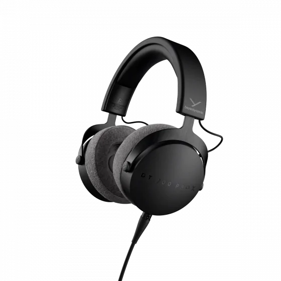

- 罩耳
- 封闭
- 动圈
- 48 Ω
- 100 dB/mW (at 500 Hz)
- 350 g
- 单端 mini-XLR
- 京东 ￥ 1899

dt700prox 是其前辈 dt770pro 的继任者，它升级了新单元并改善了头部压力，目前作为拜亚中端封闭式监听耳机的代表作供给民用市场。相比于其前辈 dt770pro，它更“易推”（即直插手机、小尾巴也容易出好声），质感、做工也更上一层楼，也用上了更优质的耳罩和更好的外壳做工

DT 系列的特点就是开放式和封闭式的声音区别不会过于显著，但也完美地保留了各自不可替代的优点（封闭式的不漏音、开放式的自然）。dt770pro 作为曾经 FPS 职业选手的主流选择，其定位能力和声场都是封闭式耳机中独一档的存在，即“让人耳判断发声物体位置的能力”非常优秀。不仅如此，dt770pro 作为封闭式耳机，其低频在 HiFi 耳机中也算相当优秀（比如比起 hd600 来说），因此非常合适听现代曲目，尤其是电子乐、金属乐、流行乐等

> dt700prox 小小的低音开孔，不知道有没有人注意到，这个孔大小决定了这个耳机的低频并没有超出以往 dt770pro 和 dt1770pro……单元上贴的这个棉垫，一定程度上可以衰减刺耳的高频，调节整体共振的效果……耳罩是影响声音的一大环节，这次 dt700prox 上的耳罩，相比经典 dt770pro 的天鹅绒……没有特别明显的区别，或许它衰减了高频刺耳的声音……（dt700prox）单元易推性超级好……
>
> [DT 三分毒! dt1770pro -> dt700prox - 贴吧](https://tieba.baidu.com/p/7810485072?share=9105&fr=sharewise&see_lz=0&share_from=post&sfc=copy&client_type=2&client_version=12.49.1.0&st=1698753297&is_video=false&unique=EEAC3E75E6D9C5A35750620513D4F811)

dt700prox 不算重，对我来说几乎没有压头感，但目前感觉到它的夹耳力相当大，找不到任何缺点（which means 一个人的头型得非常清奇才能不适合这款耳机）。或许唯一造成不适的可能原因就是那保温性能太好，夏天容易闷出汗的耳罩吧……小问题。易推的高性能单元+封闭式的设计，这难道不是一款完美的高性价比出街/图书馆/寝室/办公室用耳机吗？！

适合：追求听声辨位或游戏环境略嘈杂的玩家，出街用耳机的人  
不适合：没有人  
推荐指数：⭐⭐⭐⭐⭐ 它杀死了千元封闭式大耳的市场

https://global.beyerdynamic.com/dt-700-pro-x.html
