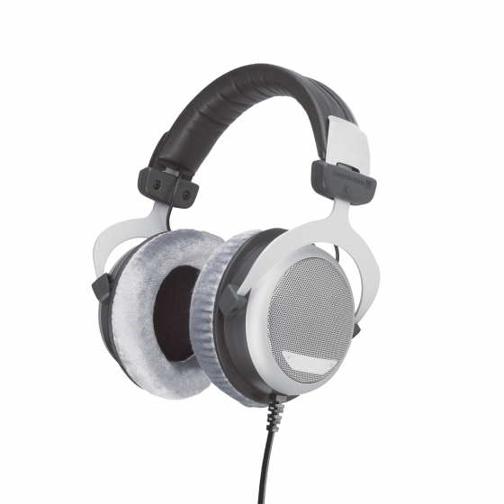

- 罩耳
- 半开放
- 动圈
- 32/250/600 Ω（本次测评使用 250 Ω）
- 96 dB/mW
- 290 g
- 3.5 mm AUX 不可换线
- 京东 ￥ 1349

容我隆重向您介绍，“HiFi 三剑客”的均衡之最——dt880。dt880 是一款三频均衡的全能杂食耳机，无论是 Bass-Head 还是大编制古典爱好者都会给他很棒的评价。它的存在和长久以来的热销就是“非烧烧低频，初烧烧三频，中烧烧中频，老烧烧高频”这句 ~~谬论~~ 的印证

不过值得一提的是，dt880 的做工实在不太讨喜，其铁质可调头带总给人一种下一秒就要断掉的感觉。在舒适性上，久戴 dt880 也有可能造成一些头顶的压迫感。另外，dt880 最好还是搭配功放使用（除了 32 Ω 版本），因此可能更适合预算相对较高且有意购买耳放，且有目的性地想感受所谓“正确听音观”的烧友

适合：所有人  
不适合：不愿意购买前端的人（除了 32 Ω 版本）  
推荐指数：⭐⭐⭐⭐⭐ 传说中“最正确”的声音，二手实在太便宜，初烧首选（dt900prox 要是能有 dt700prox 的水准应该也保底四星）

https://global.beyerdynamic.com/dt-880-edition.html