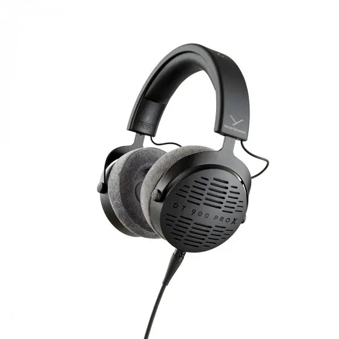

- 罩耳
- 半开放
- 动圈
- 48 Ω
- 100 dB/mW (at 500 Hz)
- 345 g
- 单端 mini-XLR
- 京东 ￥ 1729

dt700prox 和 dt900prox 都是拜亚动力目前最值得购买的两款耳机。dt 系列的声音素质以及调音有老牌大厂背书，

适合：  
不适合：  
推荐指数：⭐⭐⭐⭐⭐

https://global.beyerdynamic.com/dt-900-pro-x.html
