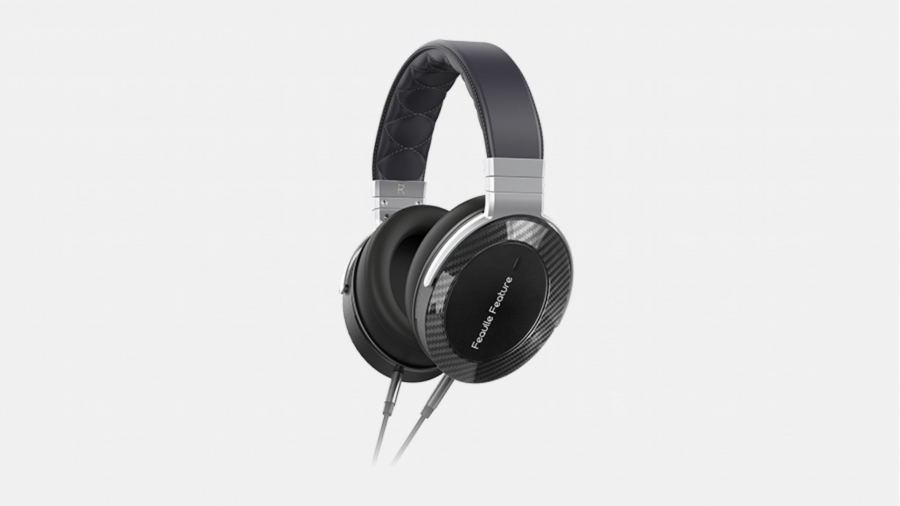

- 罩耳
- 封闭
- 动圈
- 32 Ω
- 105 dB/mW
- 330 g
- 双 3.5 mm AUX
- 京东 ￥ 1461

部分图片来源：https://zhuanlan.zhihu.com/p/602509466

许多 Chi-Fi 产品都有个特点，就是产品本身质量过关，但销量基本还是得靠铺天盖地的水军和毒文撑起来。继推出 Century 世纪 这款价格不菲的开放式耳机一年后，Chi-Fi 厂商绯乐沿用了其外观设计思路，推出了一款主打“女毒”（即优化女声表现）的封闭式大耳 —— Feature。即使中文论坛上对绯乐买大批水军的行径“颇有微词”，但这款耳机问世后总体还是比较受好评的

在经过长久的仔细聆听，并把它作为出街用耳机一段时日后，我个人认为，Feature 最大的三个特点就是 **女毒**、**隔音** 和 **直推**

Feature 的调音总体偏上盘，低频量不多，而相对突出中高频的部分，这使它听女声时非常舒服。不过，由于它的低频量不多，听金属乐时有些低频打击声会稍有点埋没在背景中，部分低频较多的电子乐表现得也有点欠缺力量感

与绝大部分媒体评测说的相反，我完全没感受出来 Feature 的声场大在哪里。相反，由于它精准的结像，我感觉它的声场还挺小巧精致的。非常遗憾的是，即使拥有如此精准的结像，我并不认为这款耳机适合打游戏，因为打游戏和看电影是非常需要足够的低频来营造氛围感，以及识别脚步声等信息的

拿飞傲 JT1、天龙 AH-D7200 以及拜亚 dt700prox 来横向对比，我认为 Feature 的女声表现好于 dt700prox 和 JT1，打平 AH-D7200；金属乐表现逊于以上三者；声场和古典乐表现大于 dt700prox，逊于 AH-D7200 和 JT1；隔音优于 JT1，打平 dt700prox 和 AH-D7200。另外值得一提的是，Feature 的听诊器效应控制得很好，没有大多数封闭式耳机都会犯的“空腔音”问题

还值得一提的是这款耳机低阻高敏，易于“直推”的属性。对功放的低要求加上圆滑而不容易产生风噪的外壳使 Feature 成为了一款非常全能的耳机，无论是在家聆听还是出街使用，搭配一条小尾巴即可，不需要台式耳放即可发挥出它的完整实力。在 1000 多元这个价位上，这是非常加分的一点

绯乐的这两款大耳都采用了天龙 AH-Dx200 的金属框架和头梁设计，因此有传闻说，这两个公司之间可能有代工之类的千丝万缕的联系。得益于这个构架，Feature 极其坚固，做工毫无瑕疵，佩戴也相当舒服，这也是我对绯乐好印象的来源之一。不过，这款耳机的耳罩实在是有点小，只能勉强罩住我的耳朵，对于耳朵更大的人，肯定会不太舒服

> 抽象公司绯乐，总共就俩大耳产品还搞不清楚自家二儿子叫啥名，难绷
>
>   
> 

适合：听音环境嘈杂的人，“女毒”爱好者  
不适合：耳朵大的人，Bass-Head  
推荐指数：⭐⭐⭐⭐ dt700prox 的“女毒”替代品

http://www.feaulle.com/c2436.html
