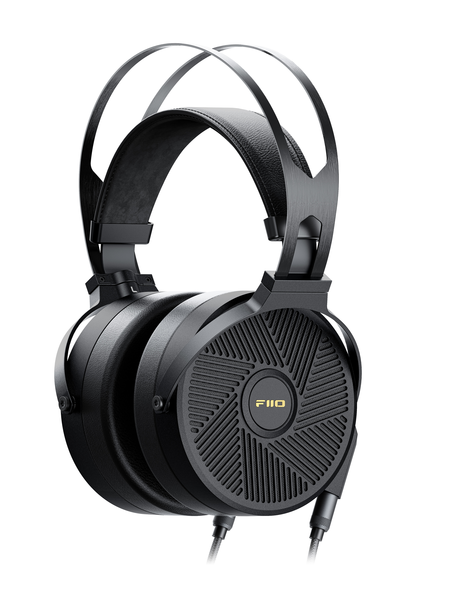

飞傲拒绝提供 ft5 的频响曲线，tmd 搞这一出有意思吗？我之前冒充洋鬼子发英文邮件给你们要 ft3 的频响，你们屁颠屁颠地就来联系我。我又在贴吧里发了篇热度挺高的 jt1 的毒文，里面提了一句我没频响，你们就屁颠屁颠地把频响发在下面。这次我写中文邮件要 ft5 的频响你们回都不回；微信上联系你们工作人员要 ft5 的频响，过了两天跟我说不能给？真是有病！

这一段骂厂商的话我就是最终拿到频响图了也不删，对频响讳莫如深藏着掖着我不懂飞傲怎么想的。你频响最终不还是要放到 AutoEq 上？

- 罩耳
- 开放
- 平面磁
- 36 Ω
- 110 dB/Vrms, 96 dB/mW
- 456 g
- 双 3.5 mm AUX
- 官网 ￥ 2999

> The build quality is strong, with no plastic parts on the FT5, which feels excellent. The earcups, grills, headband, and yokes are all aluminium and look and feel extra durable. The inner side of the headband and the suede earpads have a very soft and high-quality finish as well. Overall, this is a fantastic build quality for a $ 449 headphone.
>
> [FIIO FT5 REVIEW - headfonia.com](https://www.headfonia.com/fiio-ft5-review)

https://www.fiio.com/ft5
