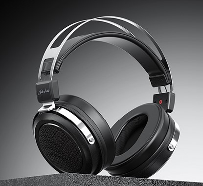

  
[飞傲官方在贴吧的回复](https://tieba.baidu.com/p/8702156414?share=9105&fr=share&post_id=148980151274&share_from=comment&post_sort=1)

- 罩耳
- 封闭
- 动圈
- 32 Ω
- 103 dB/Vrms
- 300 g
- 双 3.5 mm AUX
- 官网 ￥ 399

之前听了飞傲 FT3，对飞傲这个牌子好感度飙升，因此在闲鱼挂求购蹲了好几天，别说来丢我的，连个上架的都没。于是破天荒地买了个全新耳机 JT1 来评测（要知道我这种穷学生可是从来只买二手耳机的，肉疼）。本来对这种价位的大耳期待也不高，戴了下感觉

**香！**

**太香了！**

**怪不得闲鱼没人卖，这也太好了**

我不知道如何形容它的完美，特别是在这个极少有人涉足的价位，飞傲 JT1 以极低的利润给预算吃紧的用户们提供了一个真正的高品质封闭式 HiFi 耳机解决方案。JT1 的三频和其更高端更早诞生的前辈依旧哈曼（在老烧眼中这是偏低频），低频烈度相当猛（而不像索尼那样徒有低频响度却糊作一团的“轰头感”），高频也没有刺耳的齿音峰

另外，JT1 声场的宽阔好像让人忘记了这是款封闭式耳机（听一下 Hotel California 的前奏就知道了，真不是我乱说，这哪里是封闭式该有的声场啊）；另一方面，非常弱的听诊器效应使它的人体底噪反射非常低，佩戴耳机讲话时也不会将自己的声音放大 10 倍（点名批评 ATH-M50x）。总之，这款封闭式耳机的“自然感”已经逼近开放式了，这种感觉是 9300 块钱的 ZMF Atticus 也给不了的

国内 HiFi 品牌里，飞傲的售后、品控、做工说第二，可能没有牌子敢称第一。如果不提前告诉我这款耳机的价格，我会根据它的外观、做工和声音给它定价 1000 左右。但飞傲显然对自己的产品“不够自信”（笑），给它定在了相当低的价格。即使在关键结构上有不少金属元件，这款耳机还是把重量压制在了一个相当不错的水平，佩戴舒适度由于头带的设计也相当不错。综上，由于它优秀的声音素质，合乎我口味的调音以及低阻高敏的特性，它在我卖掉 dt700prox 后成为了我出街耳机的新宠

这款耳机唯一的缺点可能就是其容易脱落的耳罩——这款耳机的耳罩是快拆设计而且内表面是非圆形的，转动到一定角度即可卸下。然而这款耳机的耳罩转动阻力过小，有些耳罩恰好在转到适合耳朵的角度时就会松动脱落，虽然日常使用时是小问题但偶尔掉耳罩的设计缺陷确实让人烦

另外值得一提的是，这款耳机附赠的线材是一根带有麦克风的单端线材，非常轻便；另外在网上发布 JT1 的评论还可以获赠一条 4.4 mm 升级线

适合：所有人  
不适合：没有人  
推荐指数：⭐⭐⭐⭐⭐ 入门级封闭式耳机的新标杆

https://www.jadeaudio.com/J1
