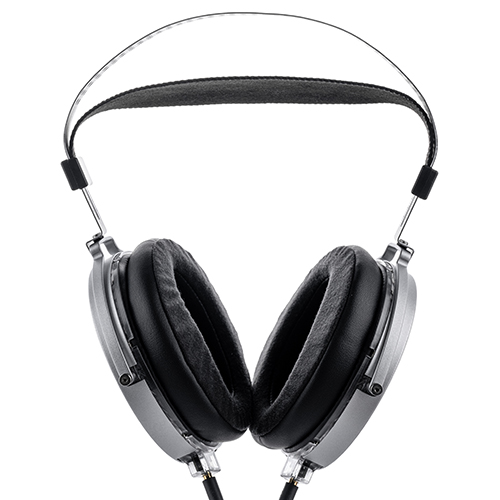

  
  
Para 标配两套耳罩，分别为椭圆和圆形（暂时不确定上图哪个对应圆形哪个对应椭圆）

- 罩耳
- 开放
- 平面磁
- 8 Ω
- 101 dB/Vrms
- 525 g
- 双 3.5 mm AUX
- 京东 ￥ 1999

虽然 Joker 小丑这款作品实在有点不思进取之嫌（可能是因为这个价位的 HiFi 耳机实在没啥人做），但水月雨毕竟是国内头部 HiFi 厂商之一，总得有一辆款能打的大耳的做排面的。继 Venus 启明星这款物理意义上的“重量级”平板耳机后，水月雨又推出了这款 Para 乐园。个人认为 Para 比 Venus 好听点

从水家官网提供的频响可知，Para 是相当“哈曼”的，which 意味着它可能比那些年代和调音都偏古典的经典耳机更适合听现代流行曲目，更杂食。本次评测我使用的都是默认椭圆耳罩，感受到了由于声场过于逼仄导致的严重的“头中效应”。根据网上的评测，大多认为用附赠的圆耳罩声场以及总体声音表现都会好很多，可惜在我了解到这点前我就把 para 出了，没能体验。不过另一方面，既然椭圆形耳罩是官方默认的耳罩类型，那就应该对它的声音有信心，而不是让用户自己更换耳罩达到它本应有的效果

> 在我们聆听耳机的时候，往往会觉得声源在人头内部，这就是头中效应。很多研究认为这是由于声重放在双耳产生错误的空间信息而引起的。听觉系统判断方位其实就是利用以前听音的经验和接收到的声音信号进行对比，而当声重放无法提供正确的信息的时候，听觉系统就会产生一种声音在头中的错觉。头中效应可以通过 HRTF 对原始信号进行处理解决，也可以使用添加虚拟的反射声进行处理。但是后者有时候会造成方向定位错误的问题。
>
> [“声”临其境的奥秘 | 空间音频简析 - 知乎](https://zhuanlan.zhihu.com/p/356238488)

引用一位烧友的评价

> 乐园我用的 3.5 mm 原线（编者使用的是 4.4 mm 平衡线材，理论上应该更好一点），圆耳罩，耳放 JDS Atom（16 Ω, 1 W）……先谈驱动问题，8 Ω 不难推（编者注：这个是错误的，平板耳机普遍阻抗低灵敏度也低，para 并不“好推”）……椭圆耳罩，声场缩小不少，低频增多，高频减少。这里要注意佩戴问题，耳罩跟耳朵的贴合程度会决定低频泄露量，低频泄露越多，听到的低频就越少。我个人不喜欢椭圆耳罩的声音，听感上声场不够宽松自然，没有利用好平板大振膜的优势……
>
> [评价下水月雨的新平板 乐园 Para - 贴吧](https://tieba.baidu.com/p/8610487983)

  
虽然耳机丑了点但盒子颜值还行

不过这款耳机虽然重，在佩戴体验上还是很不错的，出乎意料得舒服，这可能是得益于其松松软软的头带，值得表扬。然而这耳机的金属头梁做工和质感属实不太行……上手后感觉这薄薄的金属头梁很容易被耳罩的重量拧断（也可能是我多虑了吧）

适合：盒子颜值党  
不适合：游戏玩家，不愿购买功放的人  
推荐指数：⭐⭐ 一般

https://moondroplab.com/cn/products/para
