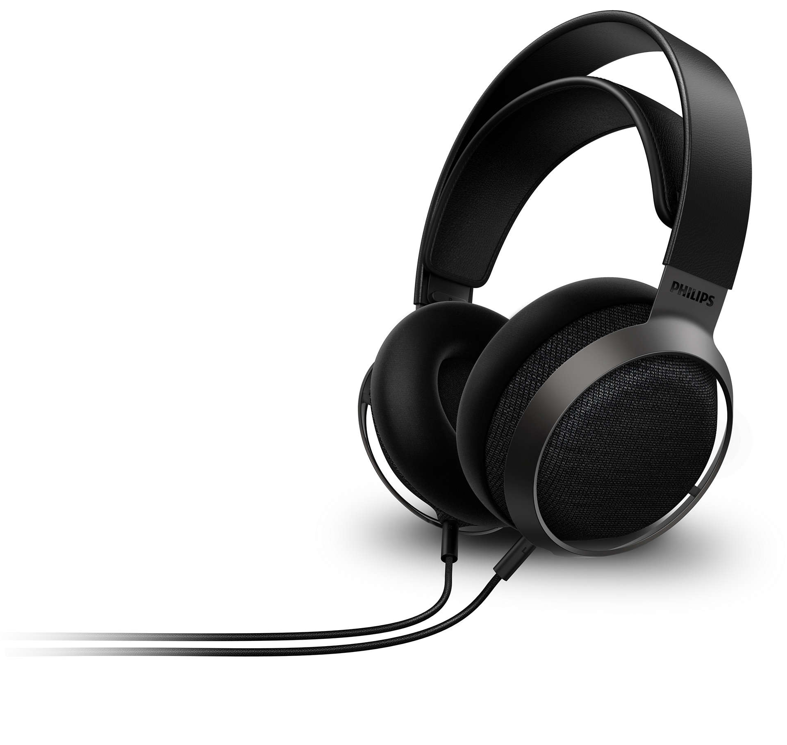

- 罩耳
- 开放
- 动圈
- 30 Ω
- 98 dB/mW
- 340 g
- 双 3.5 mm AUX（线序特殊）
- 京东 ￥ 1199

飞利浦耳机定价虚低的原因同上，x3 作为飞利浦旗舰大耳，原价 2000 多也没稳多久

20 年发售的 x3 与其前辈 x2hr 相比，声场和结像水平得到了，这可能是得益于其内倾斜振膜的设计

在以前，“三频均衡”是一种调音风格。而对于现代音乐，“三频均衡”似乎已经是基本需求。加之动圈和平面磁技术的发展，你可以注意到近年来新出的大耳调音普遍比较均衡，x3 也不例外

> （飞利浦 x3）采用了丹麦奢侈品牌 Kvadrat 布艺面料包裹的耳罩、苏格兰 Muirhead 纯手工进口皮革覆盖头梁，再配合金属框架，营造出轻盈、柔和、现代的感觉
>
> [古典人声皆相宜！浅析飞利浦“新王”Fidelio X3 音色 - Baidu](https://baijiahao.baidu.com/s?id=1695895941688425460)

X3 延续了飞利浦在织物面料上的老传统，但舍弃了在贴耳部分应用织物的传统，转而投向天鹅绒耳罩了。这可能是因为织物耳罩受天气等因素的影响较大，难以保证一致性，因此音质也无从谈起，而天鹅绒耳罩收环境影响相对较小，一致性较好

从佩戴舒适性上

适合：  
不适合：  
推荐指数：

https://www.philips.com.cn/c-p/X3_00/fidelio-x3-wired-over-ear-open-back-headphones
