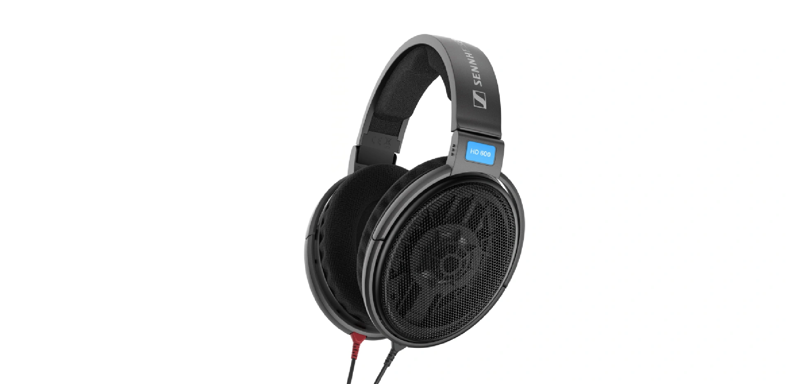

- 罩耳
- 开放
- 动圈
- 300 Ω
- 97 dB/Vrms
- 260 g
- 3.5 mm AUX 不可换线
- 官网 ￥ 1999

hd600 并不需要我的介绍，而我的文章需要 hd600 来证明它存在的意义……简单为它写几个关键词吧：高阻低敏，被认为非常吃耳放，低频比较匮乏，声场开阔，适合大编制古典。许多烧友用“堂音”（即厅堂感，如同亲临音乐厅一般的听感）来描述这款耳机最大的声音特点

hd600 是 1997 年上市的旗舰耳机，单元素质在今天已经非常落后了，但是其广受好评的调音以及在耳机史上难以撼动的地位使其经久不衰。即使森海推出了多款后继型号如 hd650、hd660s、hd660s2 等，这款耳机的销量仍遥遥领先，足以证明其经典。然而，hd600 的单元素质在客观上已经落后于时代了，因此如果你是一个追求“解析力”的人，hd600 暖糊的声音可能并不适合你。

> hd600 曾多次改变产地、产线甚至材质，这就导致了不同产地、编号的 hd600 可能有不同的调音。我购买的这款是罗马尼亚产的，其他产地的 hd600 的听感可能会稍有不同

hd600 在佩戴上无可挑剔，大多数人都会觉得比较舒服。绒耳罩加中规中矩的头梁使它的佩戴符合绝大多数人的头型。不过，这款耳机的做工（至少是罗产的做工）属实有点一般，拿在手上并没有什么质感可言。另外，300 Ω 的高阻抗和低灵敏度使其需要强劲的功放来驱动，并不适合手机、电脑声卡直推

适合：对森海家调音感兴趣的烧友，大编制古典爱好者  
不适合：追求“解析力”的人，不愿购买耳放的人，Bass-Head  
推荐指数：⭐⭐ 已经落后的单元素质，中端 HiFi 耳机的价格守门人

https://www.sennheiser-hearing.com/zh-CN/p/hd-600
