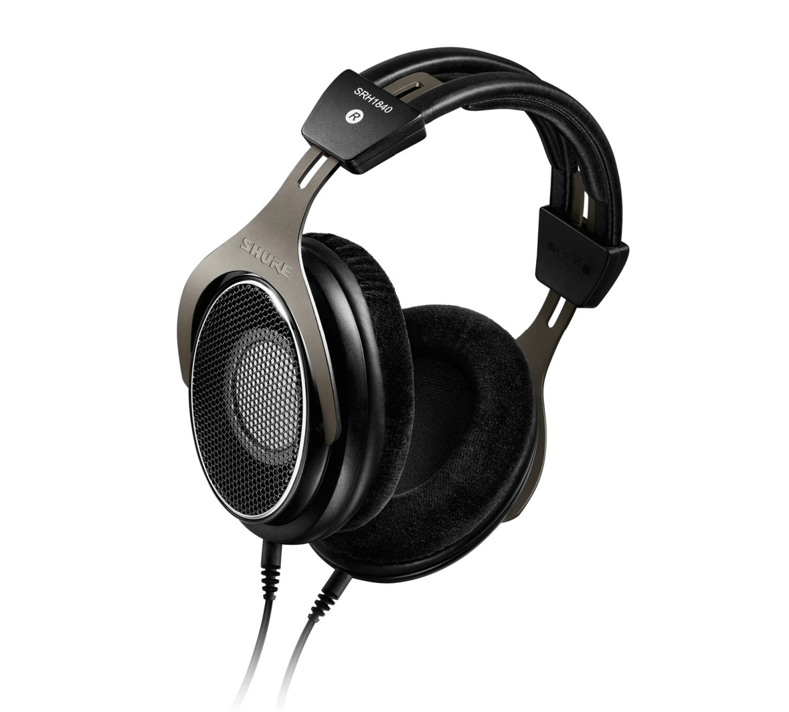

- 罩耳
- 开放
- 动圈
- 65 Ω
- 96 dB/mW
- 268 g
- 双 mmcx
- 京东 ￥ 3098

这款耳机自 2012 年发售至今，已历经 11 年，其监听的实用性和行业认可度已无须赘述。1840 那均衡而“没有音染”的声音至今是各种混音工作室的宠儿，它也因此成了少数盗版最猖獗的耳机之一。如今，虽然 1840 年代久远的发声单元素质已落后于时代，缺乏现代耳机的“解析力”，其一尘不染的纯洁音色还是吸引了无数音乐工作者和发烧友

虽然 1840 的漏音程度和它的外观一样都长得十分开阔，但非常遗憾的是，它的声场完全对不起自己全开放式耳机的类别，虽然不像水月雨 Para 椭圆耳罩那样拥挤，也完全说不上宽阔。同时，与 1840 那一尘不染的音色相反，从客观参数上看，1840 具有极高的 THD（总谐波失真），这使得有些人认为 1840 其实根本不适合用作监听耳机。这倒是说明 THD 完全代表不了听感

1840 的配戴倒是可圈可点，这款耳机相当轻盈，可伸缩头梁方便不同头型的混音工作者把耳机调整到最舒服的姿势。在做工和外观方面，1840 除了头梁垫部分都十分优秀——1840 的头梁垫出了名的容易烂

在使用环境方面考虑，这款耳机的阻抗偏低，但灵敏度也极低。这可能是根据其录音室专业混音监听耳机的定位，它必须搭配比较合格的功放使用才能达到最佳效果。1840 全开放的设计使其毫无隔音能力，无法用于人声返听或现场监听，且几乎没有漏音控制，不适合用于公共场合听音乐

**2022 年开始，舒尔已经逐步更新其监听耳机产线，如 srh840 更新到 srh840a。我们有理由相信，1840 作为舒尔的经典监听王牌，也会得到一次审慎而彻底的升级**

> Tips: 谨慎购买二手 srh1840，这款耳机的假货可能是耳机界最多的

适合：混音师  
不适合：除此之外所有人  
推荐指数：⭐⭐ 单元素质落后且价格偏高

https://www.shure.com/en-US/products/headphones/srh1840?variant=SRH1840-BK
