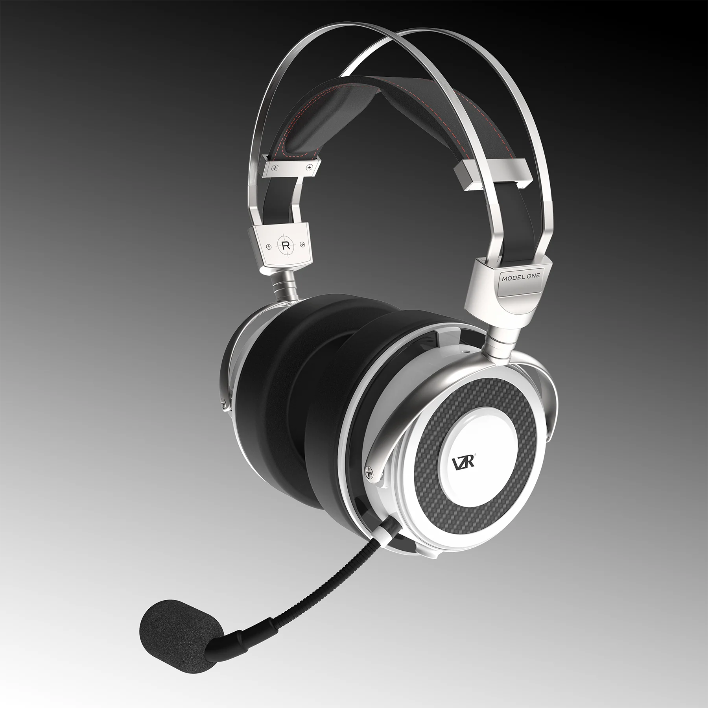

Victor Tiscareno（VZR 联合创始人、CEO、CTO）认为，频响图只能提供片面的信息且每次测量都会由于测试环境的差异导致不同结果，故拒绝提供官方频响曲线（[Victor 在 Reddit 上的回复](https://www.reddit.com/r/headphones/comments/pcr3be/comment/hal18ey/?utm_source=share&utm_medium=web2x&context=3)），但鼓励第三方发表测量结果。然而我并没有在 AutoEq 上找到 VZR Model One，希望未来有人发布

- 有线游戏耳麦
- 罩耳
- 封闭
- 动圈
- 32 Ω
- 100 dB/mW
- 430 g（卸下麦克风后）
- 双 3.5 mm AUX，但由于有麦克风，左侧 AUX 接口定义比较特殊。使用平衡线材或普通平衡线会导致麦克风失效
- 京东 ￥ 2799

VZR Model One 不是一个耳机，它是个头戴式杜比影厅。戴好它，打开你喜爱的游戏或大片，开始享受最为沉浸的影音体验吧

VZR Model One 于 2021 年在北美面世，以傲视群雄的姿态和领先的音频技术杀进了高端游戏耳机的市场，却在 2023 年 10 月初才终于进入了中国玩家们的视野。作为一款游戏耳麦，VZR Model One 提供了发烧友级别的游戏和影视体验和强大的听声辨位能力

苹果被很多人认为拥有目前最好的空间音频技术，这离不开苹果强大的声学工程师团队。苹果前领衔音频工程师，Victor Tiscareno 在创立 VZR 后发布了一项声音处理技术 —— CrossWave™。这项技术将声通过导管射入耳道，大幅改善了声音的空间感，也因此成就了 VZR Model One 这款被认为具有无与伦比的听声辨位能力的耳机。有些发烧友认为 CrossWave™ 技术和 [Ultrasone 的 S-LOGIC® 技术](https://ultrasone.com/s-logic-ule) 在重塑声音方面有异曲同工之妙，本质上都旨在优化耳机声场和结像精度，同时还能以更小声压级产生相同音量感知从而保护耳朵听力

> ...There's no other analog solution that I know...that works like crosswave. In other words, I don't know of anything that goes in front of the driver specifically to do what we just said earlier...spatializing audio...
>
> [Deep Dive into VZR Model One’s CrossWave Technology - YouTube](https://youtu.be/dBo3xxh8wnE?si=WjJ8xcGZHbhYeLZC)

然而，我并不觉得这款耳机适合用于欣赏大多数类型的音乐，它多得夸张的低频泛音并不是为原教旨主义 HiFi 设计的。VZR Model One 被设计为游戏耳机，为了营造场景的沉浸感，其调音相当突出 Bass，和 hd600、dt880 等“声音正确”的传统 HiFi 耳机简直是两个极端

受限于动圈技术的发展，许多传统发烧友耳机的发声单元低频延展较弱，难以媲美大发声单元音箱的低频表现；而 VZR Model One 则反之，不仅强调低频，还加入了大量的低频泛音，却在中高频上漏掉了不少声音细节。对于打游戏和看电影来说，这款耳机毫无疑问地极其出色；但是在欣赏音乐时，中高频的声音细节明显受到了掩蔽效应的影响，比如玩竞技游戏和队友交流时你很容易感受到这款耳机对人声的“独特”处理。总得来说，VZR Model One 前所未有地逼近了在电影院里看电影的临场感，拥有绝佳的听音辨位性能，非常适合游戏和影视发烧友使用，但我并不认为它适合用作一款原教旨主义高保真耳机

> ...there is a new option that achieves the end-game of the headphone quest: A speaker experience in headphones that brings you closer to "being there" with the artist.
>
> [VZR Model One is arguably a top 5 headphones ever released - Head-Fi.org](https://www.head-fi.org/threads/vzr-model-one.961125/post-17019205)

VZR Model One 采用了碳纤维加固的刚性外壳以及金属头梁，做工非常不错，看起来也足够坚固，但是这也导致了它的重量较高。不过 VZR Model One 的弹性头带可以极大分散头部压力，并不会让人觉得压头，我可以长时间佩戴它而不觉得累

低阻高敏的封闭式耳机通常比较适合戴出街，但这款耳机的便携性却受制于一个非常奇特的因素——风噪。虽然 Model One 没有主动降噪功能，但其棱角分明的外表面（不同于 dt700prox 的圆滑）在风中会产生极其严重的风噪。对于希望买到一款全能耳机的人来说，非常遗憾，较高的重量加上风噪使它并不适合带出户外使用

在功率需求方面，[根据 VZR 官方在 Reddit 上的回复](https://www.reddit.com/r/headphones/comments/pcr3be/comment/halnnlm/?utm_source=share&utm_medium=web2x&context=3)，VZR Model One 虽然“易推”，但更优质的功放仍能大幅提高这款耳机的瞬态及相位性能等。**但是**，亲爱的 VZR 团队，您知道 99% 的耳放不支持线控麦克风吗？或者你们就是想要我们放弃线控麦克风并另外买一根 4.4 mm 平衡线，就像我们音频发烧友对其他双 3.5 mm 接口的耳机做的事一样？老实说，我希望他们没有麦克风——麦克风不仅使其更重，还让换线变得极为麻烦。截至我写这篇文章时，从 VZR 唯一的国行代理商 Endgame 处购买 VZR Model One 可以免费获赠一个支持麦克风小尾巴 Atmos 3，可能就是为了方便一些不懂 AUX 音频接口及其触点定义的玩家

适合：追求最极致影视游戏声学体验的玩家，听音辨位的极致追求者，Bass-Head  
不适合：HiFi，颈部肌无力患者，出街  
推荐指数：⭐⭐⭐ 头戴式杜比影厅

https://vzraudio.com/products/vzr-model-one
