斥资 7w 写成的全网最专业的头戴式耳机选购攻略。本文将随着本人的耳机阅历和空闲时间和摸鱼时间持续更新。本期攻略相当硬核，酌情跳着看，哪一部分看不明白再翻翻前面的。本文基本按照价格升序毫不客气地评测 25 款耳机，我会尽可能少写一些主观的东西，多谈客观风格，减少主观评判。但是由于本人的主观感受和听音偏好的影响以及文笔功力，不可能不存在一些偏差，你的听感和文字描述的不一样很正常

以上所有耳机均为本人自费购买/送测后返还，与任何厂商/经销商不存在任何利益关系。欢迎以任意方式联系我提问声学优化相关问题，我会尽力帮助你，希望你能给这个施工中的知识库点个 Star

[点我下载用于本文的主要试听曲目 (347 MB)](https://sha1rholder.blob.core.windows.net/headphonescc98/resource/track.7z)

- [以原道为例的基础知识](#以原道为例的基础知识)
- [HiFi 大耳第一价格屠夫 · Philips SHP9500](#hifi-大耳第一价格屠夫--philips-shp9500)
- [侮辱耳朵 · 微翼超新星](#侮辱耳朵--微翼超新星)
- [百元全能手 · 飞傲 JT1](#百元全能手--飞傲-jt1)
- [物如其名 · 水月雨 Joker](#物如其名--水月雨-joker)
- [HIFIMAN HE Series](#hifiman-he-series)
	- [HIFIMAN HE400se](#hifiman-he400se)
	- [HIFIMAN HE-R9](#hifiman-he-r9)
- [混音师“又爱又恨”的伴侣 · Audio-Technica ATH-M50x](#混音师又爱又恨的伴侣--audio-technica-ath-m50x)
- [Sony MDR Series](#sony-mdr-series)
	- [索狗最有厨力的一集 · Sony MDR-CD900ST](#索狗最有厨力的一集--sony-mdr-cd900st)
- [AKG K7xx Series](#akg-k7xx-series)
	- [“HiFi 三剑客” 大手办 · AKG K701](#hifi-三剑客-大手办--akg-k701)
- [Beyerdynamic DT Series](#beyerdynamic-dt-series)
	- [千元全能手 · Byerdynamic DT 700 Pro X](#千元全能手--byerdynamic-dt-700-pro-x)
	- [“HiFi 三剑客” 均衡之最 · Beyerdynamic DT 880 (250 Ω)](#hifi-三剑客-均衡之最--beyerdynamic-dt-880-250-ω)
	- [“哪个傻逼用 HiFi 耳机打游戏？” · Byerdynamic DT 990 Pro (250 Ω)](#哪个傻逼用-hifi-耳机打游戏--byerdynamic-dt-990-pro-250-ω)
- [Sennheiser HD 6xx Series](#sennheiser-hd-6xx-series)
	- [“HiFi 三剑客”之首 · Sennheiser HD 600（罗产）](#hifi-三剑客之首--sennheiser-hd-600罗产)
- [最爱之声 · 飞傲 FT3 (350 Ω)](#最爱之声--飞傲-ft3-350-ω)
- [水平板的成熟之作 · 水月雨 Para](#水平板的成熟之作--水月雨-para)
- [Sony WH-1000XM Series](#sony-wh-1000xm-series)
	- [新一代降噪大耳代名词 · Sony WH-1000XM5](#新一代降噪大耳代名词--sony-wh-1000xm5)
- [铁三角“小风扇” · Audio-Technica ATH-R70x](#铁三角小风扇--audio-technica-ath-r70x)
- [地表最强游戏耳机 · Audeze Maxwell](#地表最强游戏耳机--audeze-maxwell)
- [头戴式杜比影厅 · VZR Model One](#头戴式杜比影厅--vzr-model-one)
- [国产平板巅峰之作 · HIFIMAN Edition XS](#国产平板巅峰之作--hifiman-edition-xs)
- [飞傲 FT5](#飞傲-ft5)
- [Shure SRH Series](#shure-srh-series)
	- [混音十二载 · Shure SRH1840](#混音十二载--shure-srh1840)
- [Audeze LCD Series](#audeze-lcd-series)
	- [重塑经典 · Audeze LCD-1](#重塑经典--audeze-lcd-1)
- [Ultrasone Edition Series](#ultrasone-edition-series)
	- [直推之王 · UltraSone Edition 11](#直推之王--ultrasone-edition-11)
- [音乐精灵 PMH-1](#音乐精灵-pmh-1)
- [Hi-End DIY 耳机的完美诠释 · ZMF Atticus](#hi-end-diy-耳机的完美诠释--zmf-atticus)
- [Sennheiser HD 8xx Series](#sennheiser-hd-8xx-series)
	- [动圈耳机的桂冠 · Sennheiser HD 800 S](#动圈耳机的桂冠--sennheiser-hd-800-s)
- [鸣谢](#鸣谢)

# 以原道为例的基础知识

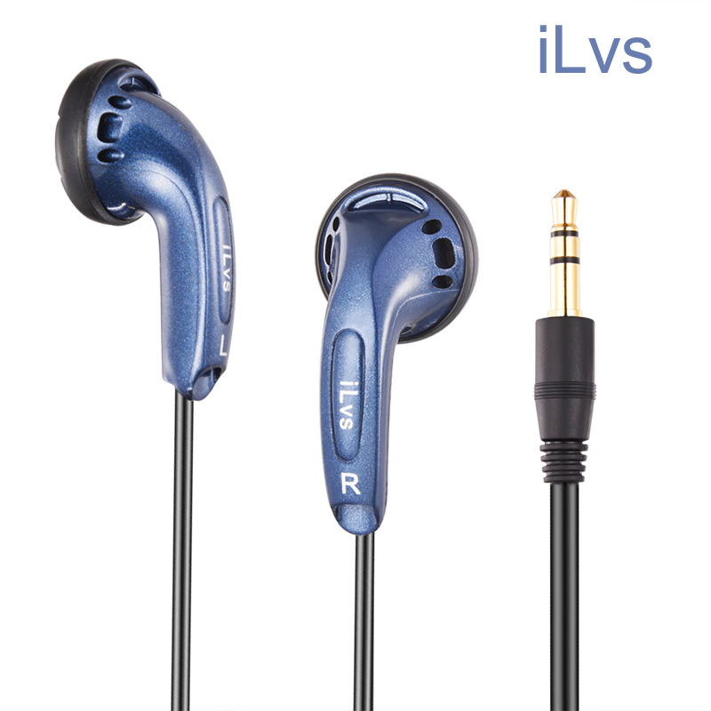  
https://detail.1688.com/offer/521792513665.html

  
https://zhuanlan.zhihu.com/p/97706759

> 频响曲线（Frequency-Response Curve, 简称 RC），默认来源为 [AutoEq](https://autoeq.app) 网站。下图以 Senheiser HD 800 S 为例介绍如何初步解读 RC
>
>   
> x 轴是频率，单位是 Hz；y 轴是特定频率下产生声音的相对强度，单位为 dBr
>
> - Raw，原始频响曲线。同一款耳机在不同的测试环境下，RC 也可能会有较大差别
> - Error，偏差曲线。此结果为原始曲线和目标曲线的偏差，Error 在某个频段越高则意味着相对于目标曲线，这款耳机更突出这一频段；反之则越削弱这一频段。Error 曲线越平直通常意味着这款耳机的频响越接近目标曲线
> - Target，目标频响曲线。其实这个更适合翻译为“参考曲线”，因为这个曲线并不是耳机的目标调音曲线，而且不同的测试者可能会参考不同的目标曲线，如 Rtings 测试团队可能会使用 _Rtings Harman Over-ear 2018_ 而 Ordinary1990 倾向于 _Harman Over-ear 2018_，本文均使用原测试者的默认参考曲线。关于什么是目标曲线可以参考这篇文章：[什么是哈曼曲线 _Harman Target Curve_ - 知乎](https://zhuanlan.zhihu.com/p/65228980)
> - Equalizer，EQ 曲线。此结果为使用均衡器软件对原始曲线进行的补偿，一般就是低频较少则补偿低频，高频较多就压制高频。本文均使用 EqualizerAPO GraphicEQ 方法
> - Equalized，EQ 后曲线。此结果为将 EQ 曲线和原始曲线叠加后的结果，这条曲线通常和目标曲线吻合度较高，但也因为耳机物理性质的问题无法完全吻合
>
> 以下是 [Mixing Techniques > Audio Spectrum - Teach Me Audio](https://www.teachmeaudio.com/mixing/techniques/audio-spectrum) 提供的非权威的频段划分表
>
> | Frequency Range | Frequency Values |
> | --------------- | ---------------- |
> | Sub-bass        | 20 - 60 Hz       |
> | Bass            | 60 - 250 Hz      |
> | Low midrange    | 250 - 500 Hz     |
> | Midrange        | 500 - 2000 Hz    |
> | Upper midrange  | 2000 - 4000 Hz   |
> | Presence        | 4000 - 6000 Hz   |
> | Brilliance      | 6000 - 20000 Hz  |
>
> 注意，RC **完全不能** 反映一款耳机的好坏，只能 **在一定程度上** 反映一款耳机的调音取向。调出一个“好看”的 RC 容易得很，许多半步烧友往往看了 RC 就对一些耳机下论断，不要犯这种错误

- 有线平头 HiFi 耳塞

> 耳机的基本类型。监听耳机和 HiFi 耳机并没有明确的界限，两者往往被音频从业者和发烧友混用。常有一个误区就是监听耳机通常频响平直音染较弱，其实不然，监听耳机分为录音监听和混音监听耳机，它们各有侧重和用处
>
> 其中，录音监听耳机又被称为耳返，顾名思义，就是将演奏者或演唱者的声音结合背景音乐返回到耳朵中辅助出好声。为了避免耳机漏音被录制进去劣化录音质量，录音监听耳机一定是封闭式的。这类耳机中用于人声监听的耳机在听众耳中常常触发“女毒”效果（即女声听起来好听），就是因为这类耳机通常相对削弱了其他频段而放大了要监听的频段
>
> 混音监听耳机大多数是开放式的，因为其声场通常更开阔，听感更自热，也有一些刻意模拟 Low-End（与 Hi-End 相对，对大多数听众的听音设备的戏称）声音表现的封闭式耳机如 ATH-M50x 等。许多混音监听耳机会突出一些比较容易“出错”的频段（典型的比如加强高频齿音频段）来让混音师更容易发现录音和混音阶段的失误
>
> 相比于监听耳机，HiFi 耳机更注重、追求对声音美感的表达，大多数监听耳机也可以作为 HiFi 耳机使用

- 动圈

> 发声单元类型。动圈、动铁、圈铁以及平面磁是常见的耳塞发声单元类型，通常动圈单元低频下沉较好，动铁高频延展较好，结合了动圈和动铁单元的混合类型被称为圈铁，平面磁则是最近刚从大耳下放到耳塞的新技术
>
> 在大耳中常见的发声单元有动圈、平面磁和静电，其中动圈单元应用最广，绝大部分大耳都是动圈耳机，阻抗和灵敏度天差地别，属于上限高下限低最花样繁多的成熟技术
>
> 由于动圈单元的进步已十分缓慢，部分新兴音频厂如 Audeze、HIFIMAN 等开辟了平面磁单元（也称为平板）的新赛道。平板耳机通常相当重，阻抗较低但对于功率要求较高（俗称需要大电流，不好推），手机甚至大部分播放器都不一定能推好，总体比较吃预算；但平板耳机通常解析力强（即在复杂的声音中的分辨率更高）、频响区间广（即能同时表达好 Sub-bass 和 Brilliance 频段），被认为有比动圈耳机更大的潜力
>
> 静电耳机不是这篇文章的受众需要了解的内容

- 32 Ω

> 阻抗。通常阻抗大于 150 Ω 的耳机就不太可能适合搭配手机或小尾巴（即 USB-C/3.5 mm 接口转接器）直推而需要配合功放了，但低阻耳机也不意味着它就适合直推，许多低阻低敏耳机（尤其是平面磁振膜耳机，即平板耳机）需要较大电流。阻抗不是绝对的，关于阻抗还有很多复杂的知识，不在这篇文章的篇幅内

- 113 dB/mW

> 灵敏度，通常就是 1 kHz 下发声单元在单位功率（dB/mW）或等效交流电压（dB/Vrms）下产生的声压级大小。dB/mW 和 dB/Vrms 灵敏度有着根本的区别，不能相互比较，也不能通过阻抗简单换算。通常可以根据阻抗和灵敏度的大小粗略预测耳机需要多大的“推力”，适不适合直推。如果实在无法确认灵敏度的单位，我会写 dB 而不是 dB/mW 或 dB/Vrms。某些厂家（比如拜亚）测得的灵敏度可能不是 1 kHz 下的，如果能确认的话我也会标出，但不可避免地会有些疏漏

- xx g

> 裸机重量。头戴式耳机的重量会分布在头顶的压力和耳朵附近头皮的摩擦力上，直接影响佩戴舒适度。因此相同重量下，通常越夹头的耳机越不压头，越压头的耳机越不夹头；而更重的耳机总会在某个地方对头部施力更大，因此通常更不舒服。耳机的舒适度很大程度上也取决于头型的适配性，比如像笔者这样吴彦祖头型的人通常更受压头的困扰而不担心夹头

- 3.5 mm 不可换线

> 接口类型，如未标明可否换线则耳机可以换线，未标明耳机是单双接口则耳机为单接口。3.5 mm 和 6.35 mm 都是单端接口，而 4.4 mm 是平衡接口，理论上抗干扰能力和功率承载能力都会更好一点。本文提到的所有双端 3.5 mm 接口的耳机都支持 4.4 mm 一分二平衡输入，单端 3.5 mm 或 6.35 mm 接口的耳机都不支持平衡输入

- 京东 ￥ 20.9

> 定价。如果官网有定价则采用官网定价，找不到定价则优先采用京东官方旗舰店的定价。**全新到手价通常会远低于这个价格**，小黄鱼二手更便宜，不推荐大家盲狙任何全新耳机，不同人的听音偏好和头型相差很大

原道本是经典手机配塞森海塞尔 mx500 耳机的仿品，诞生于小作坊冒牌耳机中。mx500 是由日本丰达制造设计生产的红极一时的经典耳塞，其声音素质之高导致不用高质量单元的仿品能被普通人一耳朵听出区别。后来，丰达设计的应用于 mx500 上的优秀公模外壳搭载廉价国产单元成就了原道耳机。耳塞声音素质是耳机外壳（腔体）气动布局设计和耳机单元两者的共同作用，因此原道耳机的声音素质其实部分来自丰达的技术（[从森海 MX500、原道耳机说起：丰达制造的前世今生 - 什么值得买](https://post.smzdm.com/p/a20wn46n/)）

> 如果这款耳机的文化比较有意思，我通常会介绍下这款耳机的文化背景

~~这款耳机 EQ 后秒杀大奥~~ 5 块钱包邮的原道在人声频段至少发出了 50 块钱的声音，比市场上一众抽象廉价无线耳机好得多。即使单元素质的上限摆在这里，失真是不可避免的，但它讨巧地突出了大部分听众主要关注的频段，把人身表现得很近，搭配扬仕 30 多块钱的小尾巴简直是天籁 p😭q（当然是在两位数价位内）

> 这款耳机的声音素质。我会尽可能少写一些主观的东西，多谈客观风格，减少主观评判。但是由于本人的主观感受和听音偏好的影响以及文笔功力，不可能不存在一些偏差，你的听感和文字描述的不一样很正常

佩戴舒适度方面，公模平头塞肯定没法做得十全十美，对某些人来说可能会比较胀耳朵（我感觉还好）。这个没啥好说的，毕竟是大众货不可能做一些适配特定人群的私模。另外这款耳机在发烧友圈子里也是极有牌面，如果跟别人说你主力塞是一条 [水月雨竹](https://moondroplab.com/cn/products/chu)（￥ 99 平价入耳塞子），国内众多水家黑子可能要讥讽你，哈哈；但是倘若你要说你是原道的拥趸，那么恭喜你成为了一名有品位懂消费的 HiFi 入门烧友。顺带一提，如果你的手机没有 3.5 mm 接口，可以去买条扬仕的 39 块钱包邮小尾巴，你可以暂且理解为 USB-C 到 3.5 mm 转接器

> 佩戴舒适度和其他方面的一些综合表现。耳放等相关内容我仅在这款耳机公认“难推”的情况下才会提及。虽然搭配耳放使用可能会对耳机声音表现有一定提升，但是通常不值这个钱——发声结构永远是影响声音最重要的因素，得明白 HiFi 器材水桶的短板究竟在哪里

适合：所有人  
不适合：没有人  
推荐指数：⭐⭐⭐⭐⭐⭐ 所有人都应该拥有一条原道，它是音乐最初的美好

> 最后会总结耳机适合和不适合人群并给出最终得分，⭐ 为垃圾，⭐⭐ 为不推荐，⭐⭐⭐ 为挺不错，⭐⭐⭐⭐ 为非常推荐，⭐⭐⭐⭐⭐ 为绝世神作。打分主要面向预算刚够得上这款耳机价格的烧友，比如 shp9500 拿五星不代表它能打 hd800s；封闭式耳机主要考虑学生、白领等佩戴耳机的环境比较多变的烧友，打分会比较多地考虑隔音、便携以及漏音等方面；而开放式耳机基本只考虑上台后的音质和佩戴，因此不会把外出便携需求以及手机直推等考虑在内，基本只谈声音和佩戴

# HiFi 大耳第一价格屠夫 · Philips SHP9500

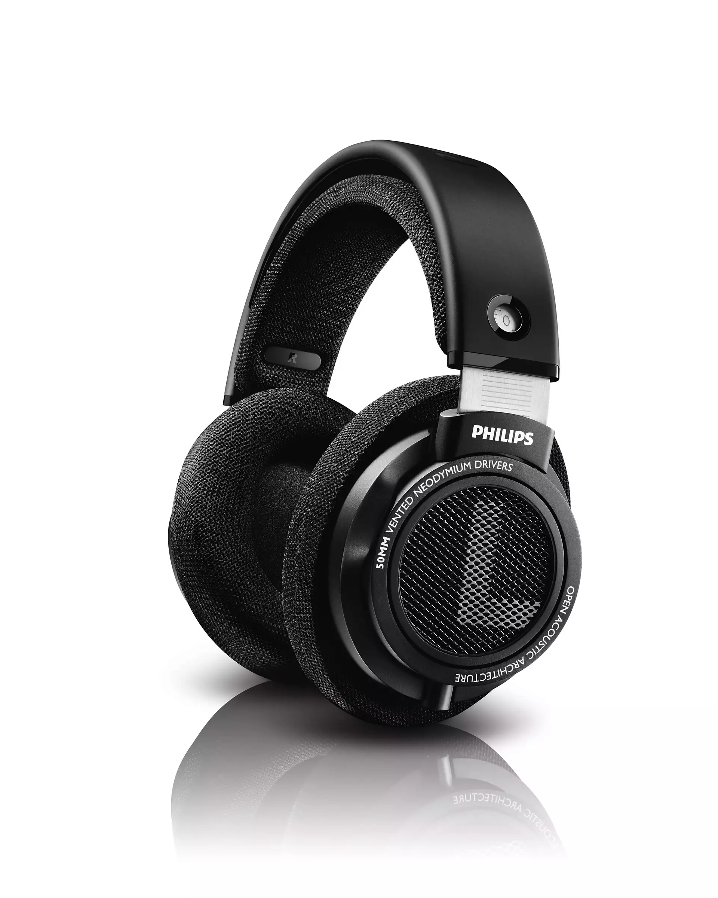

- 罩耳式 HiFi 耳机
- 开放
- 动圈
- 32 Ω
- 101 dB/mW
- 320 g
- 单 3.5 mm
- 京东 ￥ 299

> 9500 刚发布的时候售价为 1680 元左右，经过飞利浦多年坚持不懈的跳水，稳定到如今 399 元的售价（最低达到过 299 左右）
>
> [「趣听」跳水之王：飞利浦 SHP9500 头戴式耳机体验测评 - 百度](https://baijiahao.baidu.com/s?id=1616113415942121440)

无论从哪个方面讲，shp9500 都是绝佳的入门 HiFi 耳机。其高调的全开放式设计提供了宽广的声场，而且对功放推力要求不高，是入门烧友的首选之一。虽然单元素质的局限导致其低频下潜（指极低频的表达能力）难以做得够好，但也足以应对绝大多数聆听场景

另外，其极轻的重量和透气的编织耳罩设计，使其即使戴一整天都不会让人感到任何不适（水月雨 HIFIMAN 好好看好好学，你做的是头戴式耳机不是钢盔）。唯一的缺点可能就是它的漏音问题了……确实没法在图书馆、办公室或寝室等公共场所使用

**织物耳罩是创造舒适佩戴的神**

> 9500 是织物头梁，织物耳罩。虽然你实际佩戴会发现织物比蛋白皮和天鹅绒佩戴更舒适，久戴不闷。但是高端一点的耳机基本不太可能用织物，比如飞机自家的 x1s x2 用的就是天鹅绒
>
> [为什么 shp9500 能够降价这么大幅度？- 知乎](https://www.zhihu.com/question/379860823/answer/1284367758)

适合：预算有限，听音环境较安静的竞技游戏玩家，HiFi 入门烧友  
不适合：在公共场合听音乐的人，Bass-head  
推荐指数：⭐⭐⭐⭐ 这价格一刀砍在了 HiFi 大耳价格的劲动脉上

https://www.usa.philips.com/c-p/SHP9500_00/HiFi-stereo-headphones

# 侮辱耳朵 · 微翼超新星

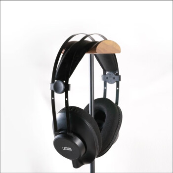

- 罩耳式监听耳机
- 封闭
- 动圈
- 32 Ω
- 103 dB/mW
- 190 g
- 单 3.5 mm
- 京东 ￥ 299

给我一双没听过这逼东西的耳朵

适合：无人  
不适合：人  
推荐指数：⭐

https://item.jd.com/10089181623572.html

# 百元全能手 · 飞傲 JT1

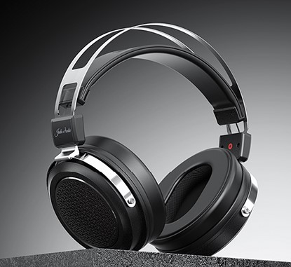

- 罩耳式 HiFi 耳机
- 封闭
- 动圈
- 32 Ω
- 103 dB/Vrms
- 300 g
- 双 3.5 mm
- 官网 ￥ 399

之前听了飞傲 FT3，对飞傲这个牌子好感度飙升，因此在闲鱼挂求购蹲了好几天，别说来丢我的，连个上架的都没。于是破天荒地买了个全新耳机 JT1 来评测（要知道我这种穷学生可是从来只买二手耳机的，肉疼）。本来对这种价位的大耳期待也不高，戴了下感觉

**香！**

**太香了！**

**怪不得闲鱼没人卖，这也太好了**

我不知道如何形容它的完美，特别是在这个极少有人涉足的价位，飞傲 JT1 以极低的利润给预算吃紧的用户们提供了一个真正的高品质封闭式 HiFi 耳机解决方案。JT1 的三频和其更高端更早诞生的前辈依旧哈曼（在老烧眼中这是偏低频），低频烈度相当猛（而不像索尼那样徒有低频响度却糊作一团的“轰头感”），高频也没有刺耳的齿音峰

另外，JT1 声场的宽阔好像让人忘记了这是款封闭式耳机（听一下 Hotel California 的前奏就知道了，真不是我乱说，这哪里是封闭式该有的声场啊）；另一方面，非常弱的听诊器效应使它的人体底噪反射非常低，佩戴耳机讲话时也不会将自己的声音放大 10 倍（点名批评 ATH-M50x）。总之，这款封闭式耳机的“自然感”已经逼近开放式了，这种感觉是 9300 块钱的 ZMF Atticus 也给不了的

如果不提前告诉我这款耳机的价格，我会根据它的外观、做工和声音给它定价 1000 以上。但飞傲显然对自己的产品“不够自信”（笑），给它定在了相当低的价格。即使在关键结构上有不少金属元件，这款耳机还是把重量压制在了一个相当不错的水平，佩戴舒适度由于头带的设计也相当不错。综上，它在我卖掉 dt700prox 后成为了我出街耳机的新宠

适合：所有人  
不适合：没有人  
推荐指数：⭐⭐⭐⭐⭐ 入门级封闭式耳机的新标杆

https://www.jadeaudio.com/J1

# 物如其名 · 水月雨 Joker

  
https://moondroplab.com/cn/graph

- 罩耳式监听耳机
- 封闭
- 动圈
- 68 Ω
- 106 dB/Vrms
- 289 g
- 双 3.5 mm
- 官网 ￥ 499

适合：🤡  
不适合：人  
推荐指数：⭐

https://moondroplab.com/cn/products/joker

# HIFIMAN HE Series

主打一个跳水的系列

## HIFIMAN HE400se

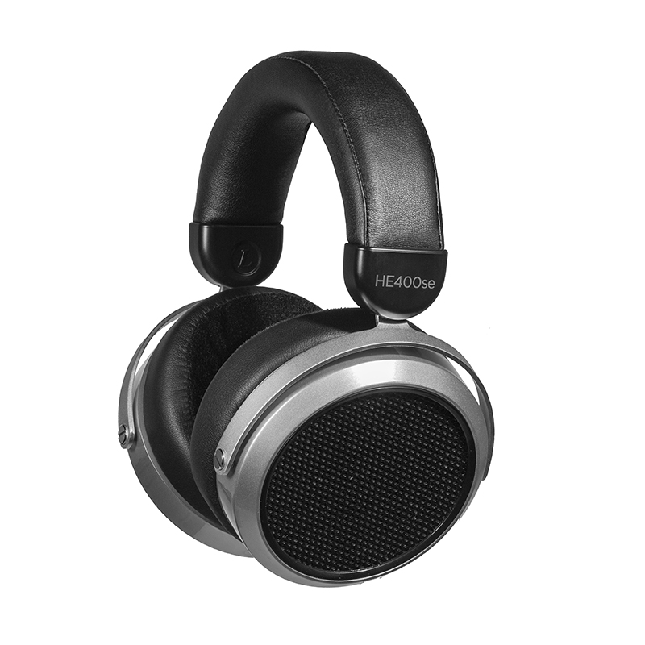

  
不确定该频响图测试的是哪个版本

双边磁体版

- 罩耳式 HiFi 耳机
- 开放
- 平面磁
- 25 Ω
- 91 dB
- 390 g
- 双 3.5 mm
- 官网 ￥ 679 实价 ￥ 359

---

隐形磁体版

- 罩耳式 HiFi 耳机
- 开放
- 平面磁
- 32 Ω
- 91 dB
- 385 g
- 双 3.5 mm
- 官网 ￥ 679 实价 ￥ 539

https://hifiman.cn/products/detail/283

## HIFIMAN HE-R9

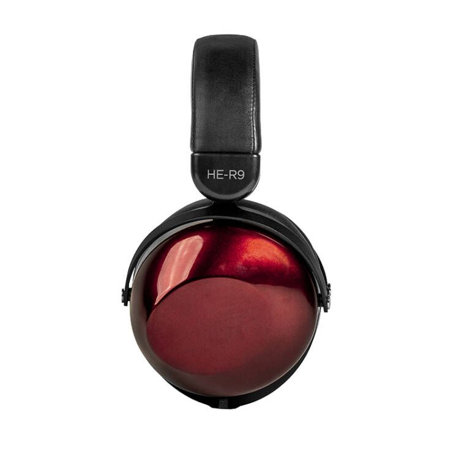

找不到频响

- 罩耳式 HiFi 耳机
- 封闭
- 60 Ω
- 100 dB
- 328 g
- 双 3.5 mm，左侧兼容 HIFIMAN 3.5 mm Pro 接口
- 官网 ￥ 3999 实价 ￥ 699

https://hifiman.cn/products/detail/290

# 混音师“又爱又恨”的伴侣 · Audio-Technica ATH-M50x

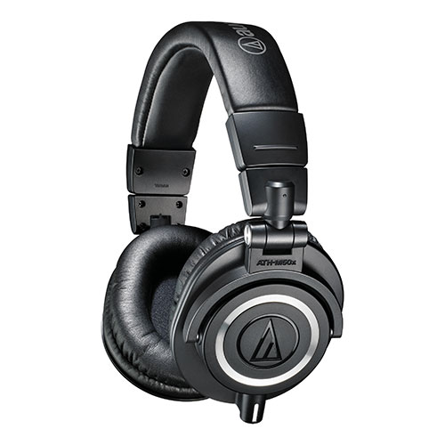

- 罩耳式监听耳机
- 封闭
- 动圈
- 38 Ω
- 99 dB/mW
- 285 g
- 单 3.5 mm
- 京东 ￥ 999

听说 Joker 挺适合 acg 和看番的，我反正听不下去 😅 真是谁买谁小丑。随着水月雨从铁三角手中接过了“HiFi 界原神”的称号，曾经被黑麻了的铁三角的独特调音已经逐渐被主流听音观认可。~~连一刻都没有为水月的小丑哀悼，立刻来到战场的是~~ 被黑了十年又热销十年的 Audio-Technica ATH-M50x

> 对于 acg（包括 op、ed、角色曲，不含 ost），铁三角绝对是才貌双全的不二选择。对于欧美派和交响粉而言，这牌子（指铁三角）就是悲剧。这是由她骨子带着里准日系病态美的调音决定的
>
> [为什么很多耳机烧友总黑铁三角？- 知乎](https://www.zhihu.com/question/35383173/answer/319428075)

  
回收封面

整体听感上，M50x 是一副忠实于还原出有力的、轰鸣的、清晰的声音的全封闭式混音监听耳机。它中频的稍微凹陷使混音师得以方便地用它来挑高频刺，同时其常见于 DJ 耳机的全封闭设计“不漏气”的特点加强了低频，使其低频容易更快、更足，非常符合大多数现代听众的听音观。然而，这种设计也导致了其严重到已经干扰了正常欣赏音乐的听诊器效应，也使其在声场和定位上表现不佳，这导致了它不太适合用于欣赏音乐或听声辨位

  
别误会，M50x 即使听声辨位能力相对较弱，也比什么主流 crap 游戏耳机强

总结一下，M50x 其实根本不适合用来欣赏音乐或打游戏。它如此热销的原因其实是在于它在音乐制作领域的实用性和名气。作为一款全封闭不漏音的耳机，它可以用于人声录音；对于缺钱的个人音乐作者，它还可以用于混音监听（频响两头翘的 M50x 非常适合挑刺）；更值得一提的是它和主流 carp 耳机听感的契合程度（对于发烧友们来说，这可不是好事！！！）。让我们来看看混音师们对 M50x 到底是如何“又爱又恨”——

> ...my life would be complete if I could reliably mix with one of my Hi-End headphones instead of crap like Beats or ATH M50's...（大概内容就是虽然监听耳机很垃圾，但混音就是不能用 HiFi 耳机而必须要用监听耳机）
>
> [专业混音师评价为什么监听耳机比 Hi-End 耳机更适合混音 - Head-Fi](https://www.head-fi.org/threads/focal-utopia-vs-hd-800s.820234/post-12864469)

> 我会把 M50x 推荐给想自己录东西翻唱，或者初学入门混音的朋友，因为它的频响适合录音也适合混音，可折叠好携带，阻抗低颜色多，保有量大而且还不贵，集合这么多要素于一身的耳机，找不到第二款了
>
> [聊一聊为什么 ATH-M50x 适合作为第一款监听，它好在哪里？ - 知乎](https://zhuanlan.zhihu.com/p/339086256)

不过在本文中即使这款耳机的听诊器效应最强烈，它的佩戴舒适度还是可圈可点的，不夹头不压头重量轻。为隔音设计的耳罩包裹感好但不会压耳朵，让这款耳机的被动降噪性能达到了本文之最。不过……类似降噪大厂 Bose 的知名蓝牙降噪大耳 [Bose QuietComfort 35 II](https://www.bose.cn/zh_cn/products/headphones/over_ear_headphones/quietcomfort-35-wireless-ii.html)，它的耳罩也相当容易破或者变油，这点蛮影响体验的（为了你耳罩的寿命，不建议让酒精等有机溶剂碰它。洁癖必须勤快换耳罩）

适合：小成本音乐制作，听音环境较嘈杂的人  
不适合：追求听声辨位的游戏玩家，需要通透声场的人  
推荐指数：⭐⭐ 完全不适合欣赏音乐，只适合小成本音乐制作

https://www.audio-technica.com/en-us/ath-M50x

# Sony MDR Series

## 索狗最有厨力的一集 · Sony MDR-CD900ST

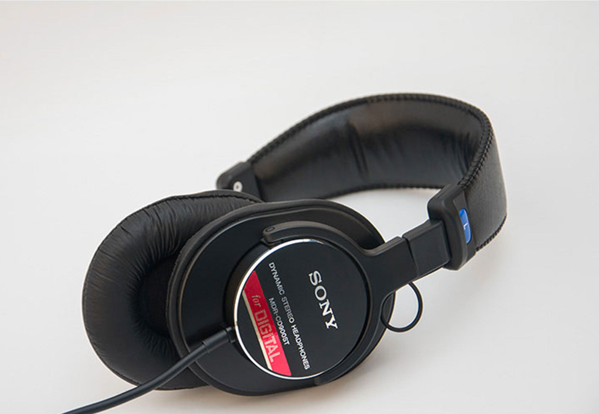

- 压耳式监听耳机
- 封闭
- 动圈
- 63 Ω
- 106 dB/mW
- 200 g
- 6.35 mm 不可换线
- 京东 ￥ 1199

> 就如同跟着电竞职业哥选外设一样，跟着专业音乐制作人选耳机准没错……吗？

MDR 是索尼的招牌监听耳机系列，其中最著名的 MDR-7506  
……  
的继任者 cd900st 被许多烧友认为是索尼史上最佳平价人声监听耳机，也是无数亚洲歌手和录音室的必备工作用机（只要你叫得上名的影视工作者都应该听说过这款耳机或 7506 的大名），堪称“最有厨力的耳机”

  
北村友香 ~~我是你的狗啊 😍~~ 在为《只狼：影逝二度》创作配乐

虽然 HiFi 界知名伪科学大师鬼斧神工 119 给 cd900st 的主观听感打出了相当高的分数（[头戴式耳机终极对比测评与音质排名 - 理性派 HiFi](https://mp.weixin.qq.com/s/wFLpg0yLq7OREaB7eqqMKQ)），但我听一耳朵后觉得……什么破地摊货我 20 买一筐！遂扔进耳机盒。结果在写这篇文章时，刚准备好生骂两句，却又有点被毒到了……可能是它过于塑料的质感和轻巧的设计影响了我的主观听感吧

> **外观和佩戴质感会极大影响人的主观听感评价**
>
> ……耳机的重量能够带来一种不太好形容的「贵重感」，简单来说就是「摸上去就感觉很贵」……Beats 里面完全用于配重的金属物料就占据了 30% 的重量——这些配重对于音质、佩戴舒适度来说没有任何提升作用
>
> [为什么说 Beats 耳机是世界最烂的耳机？ - 知乎](https://zhuanlan.zhihu.com/p/341176005)

总得来说，虽然 cd900st 的声场和定位完全寄了，但它仍是同价位中素质在线的女毒耳机。根据客观频响曲线和主观听感，这款耳机和 shp9500 一样在 sub-bass 频段削弱得厉害，看来听金属和一些前卫电子乐是会漏掉太多信息了。另外，MDR-7506 是以暴露混音问题为创作者服务为第一责任的混音监听耳机，而 cd900st 以让歌手/主持人听见自己的声音为第一责任。因此，cd900st 相比于其前辈 7506 中低频不刺，高频量感略少，不会刻意加强齿音等混音问题，而更适合用来听歌而不是挑刺（[非录音类工作者可以用 MDR-7506 或 cd900st 来日常听歌嘛？ - 知乎](https://www.zhihu.com/question/487990108/answer/2134604827)）

在佩戴舒适性上，由于它极低的重量，短时间佩戴还是挺轻松的，但压耳式设计导致它久戴一小时以上必然导致耳廓生疼。作为一个封闭式耳机，压耳式的设计牺牲了部分隔音能力但也同时减轻了听诊器效应，让其听感还是比 ATH-M50x 这种重量级沉闷封闭耳机显得自然通透一些

适合：影音制作者，摄影师，索狗  
不适合：欣赏音乐或打游戏的人  
推荐指数：⭐⭐ 除非你是电影导演或 Volg 创作者，不然我不知道你买这个干嘛；反过来如果你真是，那你应该早就买了

https://www.smci.jp/s/headp/page/cd900st

# AKG K7xx Series

## “HiFi 三剑客” 大手办 · AKG K701

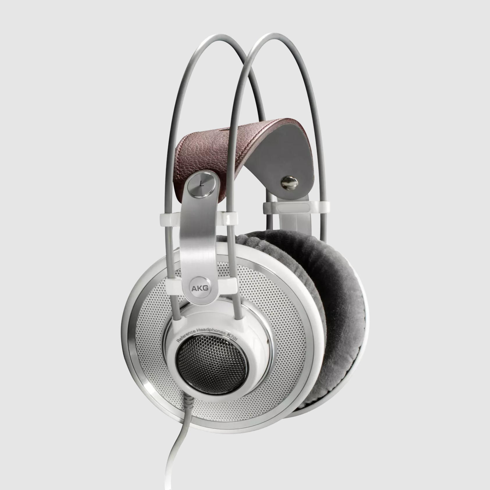

- 罩耳式监听耳机
- 半开放式
- 动圈
- 62 Ω
- 105 dB/Vrms
- 235 g
- 6.35 mm 不可换线
- 京东 ￥ 1199

AKG 爱科技 曾经与森海、拜亚并列为 HiFi 三巨头之一，但自从 2016 年其母公司哈曼被三星收购后，老 AKG 人走楼空……然而，如今这款传奇资本集团旗下的传奇音频公司旗下的传奇 HiFi 耳机厂的传奇 ~~手办~~ 耳机仍然稳据“HiFi 经典三剑客”（hd600/650、dt880、k701），在广大发烧友心中保持着难以撼动的地位

k701 的单元素质和 hd6xx 系列以及 dtxx0 系列相比并不算优秀，但是其偏高频的调音是日系 ACG 曲目的绝佳搭配，低频稍弱的缺陷也可以由大音量加合理的功放稍微弥补。另外，k701 的半开放式设计和偏高频的调音使其具有不错的声场，打游戏不会成问题。这就使得 ~~傻逼二刺螈死宅~~ 热爱 ACG 和玩游戏的音乐爱好者们对 k701 有极高的好感

在声音之外，“即使是森海拜亚最忠实的拥趸，一想到 k701 的颜值，便会不由自主地低下脑袋”。k701 不仅颜值高，还贴心地给买家准备了底座 ~~，方便以 HiFi 之名行手办之实~~，部分商家也借此将 k701 包装成了二次元潮玩

在佩戴上，k701 采用了轻巧的塑料机身+松紧绳+额外皮带头梁+毛绒耳罩的经典设计，如果要在这篇帖子里评出佩戴最舒适耳机，k701 可能仅次于 shp9500。然而，塑料机身可能会给人廉价感，不过这价格的耳机还要什么质感和做工呢？（不是谁都有飞傲那么夸张的做工的）

不过，k701 在 HiFi 界可谓出了名地“难推”（对耳放需求高，手机、电脑不容易出好声），加之其质感贼差的又长又不可换的 6.35 mm 塑料线，使得它极其依赖功放。因此，如果你在耳机之外还愿意出等量的预算购买耳放再考虑它吧……

适合：游戏玩家，颜值党  
不适合：金属、电子乐爱好者，Bass-head，不愿购买耳放的人  
推荐指数：⭐⭐⭐ 声价比两星，颜值和二次元属性加成一星

> AKG 的涅槃——[奥世声 Austrian.Audio](https://austrian.audio)
>
> 2017 年，AKG 在奥地利的研发部门和工厂正式宣布解散，一大批 AKG 死忠粉高呼“AKG 不再是 AKG 了”但在同年 10 月，原 AKG 奥地利工厂的 22 位核心成员于维也纳成立了 Austrian.Audio 奥世声。这个名字意味着团队的全部成员来源、设计、研发和制造都完全在奥地利。时隔 3 年，Austrian.Audio 带着首款产品 Hi-X55，低调地杀回来了……
>
> [真·AKG 继任者，Austrian Audio Hi-X55 低调回归 - 知乎](https://zhuanlan.zhihu.com/p/142291876)

https://www.akg.com/Headphones/Professional%20Headphones/K701.html

# Beyerdynamic DT Series

Beyerdynamic 拜亚动力是一家历史悠久的德国音频设备厂商，也是动圈耳机的鼻祖，其经典监听耳机系列 DT 系列的历史可以追溯到上世纪初（Beyer 是创始人的名字，而 Dynamic 就是动圈的英文名）。可以说，拜亚和 dt48 的诞生就标志着高质量音频设备时代的开始

  
dt48 是纳粹德国制式装备，是最早的监听耳机

如今，拜亚动力最活跃的中端监听耳机产线 dt7xx/8xx/9xx 系列仍在 HiFi 市场中占据举足轻重的地位。可以说现在要上市的任何一款大耳定价想超过 1000，就得先掂量掂量自己有没有碰瓷 dt 系列的本事。本篇将介绍每个系列中各一款极具代表性的耳机

## 千元全能手 · Byerdynamic DT 700 Pro X

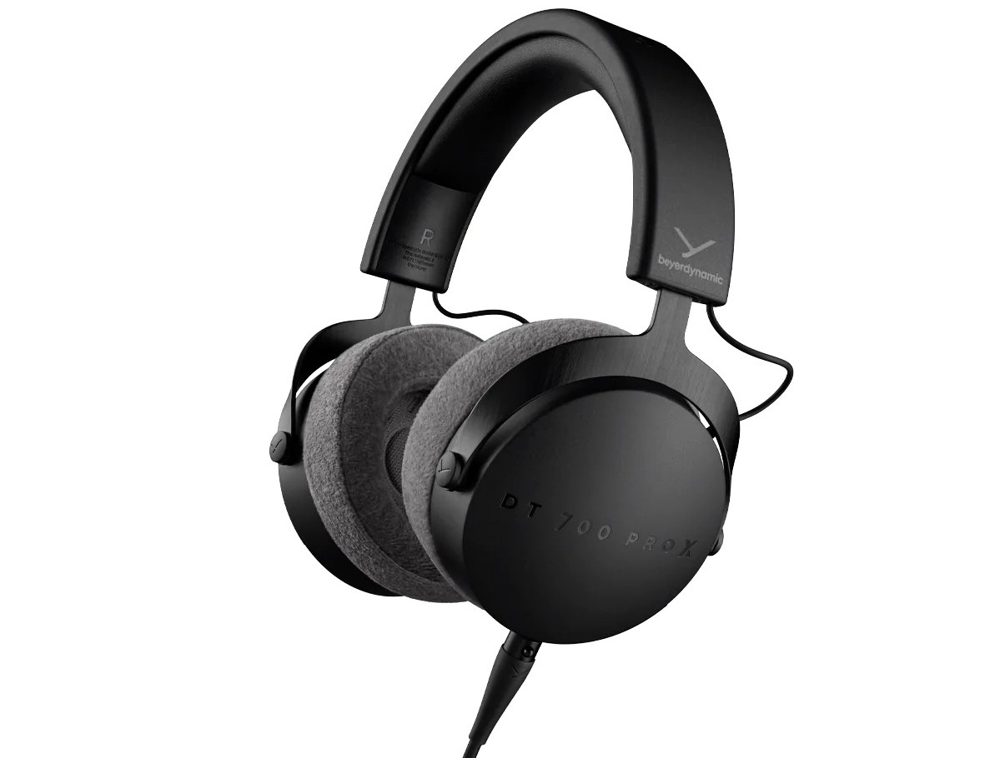

- 罩耳式监听耳机
- 封闭式
- 动圈
- 48 Ω
- 100 dB/mW
- 350 g
- mini-XLR，单端
- 京东 ￥ 1899

> dt7xx 系列的定位是封闭式监听耳机，其最经典的产品 dt770pro 有 32/80/250 Ω 三种阻抗可选，低阻抗版本更适合手机、平板、电脑等设备直接驱动，而高阻版本适合配合功放发挥更好的性能。其高端升级款的型号为 dt1770pro，它们通常都需要独立功放来更好地驱动。而 dt700prox 作为最新发售的单元升级款在 dt770pro 的基础上优化了单元的易驱动性，使其在手机等移动设备上也能发挥出更佳水平

dt700prox 是其前辈 dt770pro 的继任者，它升级了新单元并改善了头部压力，目前作为拜亚中端封闭式监听耳机的代表作供给民用市场。相比于其前辈 dt770pro，它更“易推”（即直插手机、小尾巴也容易出好声），质感、做工也更上一层楼，也用上了更优质的耳罩和更好的外壳做工

DT 系列的特点就是开放式和封闭式的声音区别不会过于显著，但也完美地保留了各自不可替代的优点（封闭式的不漏音、开放式的自然）。dt770pro 作为曾经 FPS 职业选手的主流选择，其定位能力和声场都是封闭式耳机中独一档的存在，即“让人耳判断发声物体位置的能力”非常优秀。不仅如此，dt770pro 作为封闭式耳机，其低频在 HiFi 耳机中也算相当优秀（比如比起 hd600 来说），因此非常合适听现代曲目，尤其是电子乐、金属乐、流行乐等

> dt700prox 小小的低音开孔，不知道有没有人注意到，这个孔大小决定了这个耳机的低频并没有超出以往 dt770pro 和 dt1770pro……单元上贴的这个棉垫，一定程度上可以衰减刺耳的高频，调节整体共振的效果……耳罩是影响声音的一大环节，这次 dt700prox 上的耳罩，相比经典 dt770pro 的天鹅绒……没有特别明显的区别，或许它衰减了高频刺耳的声音……（dt700prox）单元易推性超级好……
>
> [DT 三分毒! dt1770pro -> dt700prox - 贴吧](https://tieba.baidu.com/p/7810485072?share=9105&fr=sharewise&see_lz=0&share_from=post&sfc=copy&client_type=2&client_version=12.49.1.0&st=1698753297&is_video=false&unique=EEAC3E75E6D9C5A35750620513D4F811)

dt700prox 的舒适度非常好，压头和夹耳力比较适中，找不到任何缺点（which means 一个人的头型得非常清奇才能不适合这款耳机）。或许唯一造成不适的可能原因就是那保温性能太好，夏天容易闷出汗的耳罩吧……小问题。易推的高性能单元+封闭式的设计，这难道不是一款完美的高性价比出街/图书馆/寝室/办公室用耳机吗？！

适合：追求听声辨位且游戏环境不算特别安静的玩家，出街用耳机的人  
不适合：没有人  
推荐指数：⭐⭐⭐⭐⭐ 它杀死了千元封闭式大耳的市场

https://global.beyerdynamic.com/dt-700-pro-x.html

## “HiFi 三剑客” 均衡之最 · Beyerdynamic DT 880 (250 Ω)

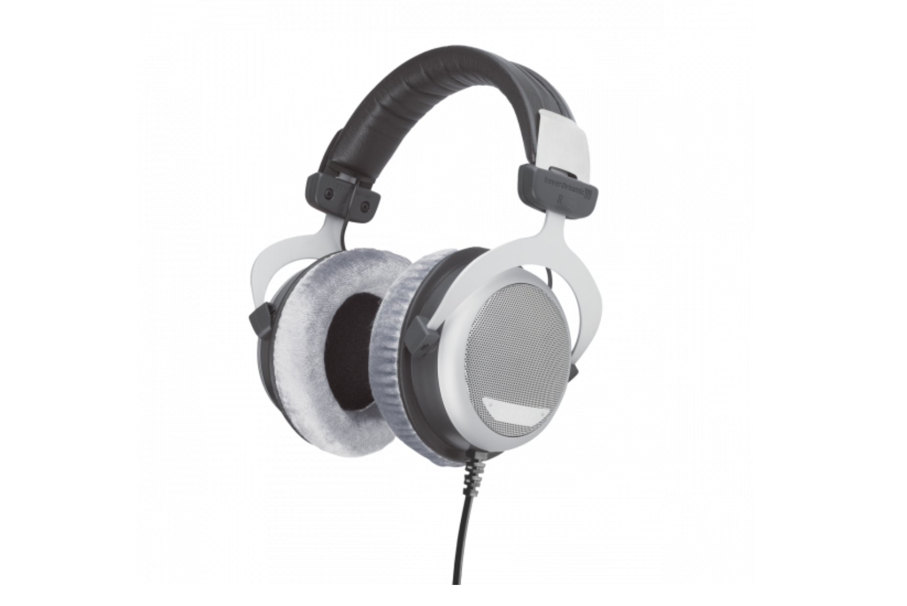

- 罩耳式监听耳机
- 半开放
- 动圈
- 250 Ω
- 96 dB/Vrms
- 290 g
- 3.5 mm 不可换线
- 京东 ￥ 1349

> dt8xx 系列的定位是半开放式 HiFi 监听耳机。dt880 有 32/250/600 Ω 三种阻抗可选，适合家庭欣赏音乐，低阻抗版本更适合手机、平板、电脑等设备直接驱动，而高阻版本适合配合功放发挥更好的性能。dt880pro 则固定 250 Ω 阻抗，且具有更紧的头带，方便音频制作人在录音室中走动而不用频繁调整头带。dt900prox 作为最新发售的单元升级款在 dt880 的基础上优化了单元的易驱动性，使其在手机等移动设备上也能发挥出更佳水平（没错，dt900prox 是 dt880 的继任者，是半开放式）

容我隆重向您介绍，“HiFi 三剑客”的均衡之最——dt880。dt880 是一款三频均衡的全能杂食耳机，无论是 Bass-head 还是大编制古典爱好者都会给他很棒的评价。它的存在和长久以来的热销就是“非烧烧低频，初烧烧三频，中烧烧中频，老烧烧高频”这句 ~~谬论~~ 的印证

不过值得一提的是，dt880 的做工实在不太讨喜，其铁质可调头带总给人一种下一秒就要断掉的感觉。在舒适性上，久戴 dt880 也有可能造成一些头顶的压迫感。另外，dt880 最好还是搭配功放使用（除了评价不是很好的 32 Ω 版本），因此可能更适合预算相对较高且有意购买耳放，且有目的性地想感受所谓“正确听音观”的烧友

适合：所有人  
不适合：不愿意购买前端的人（除了 32 Ω 版本）  
推荐指数：⭐⭐⭐⭐⭐ 传说中“最正确”的声音，二手实在太便宜，初烧首选（dt900prox 要是能有 dt700prox 的水准应该也保底四星）

https://global.beyerdynamic.com/dt-880-edition.html

## “哪个傻逼用 HiFi 耳机打游戏？” · Byerdynamic DT 990 Pro (250 Ω)

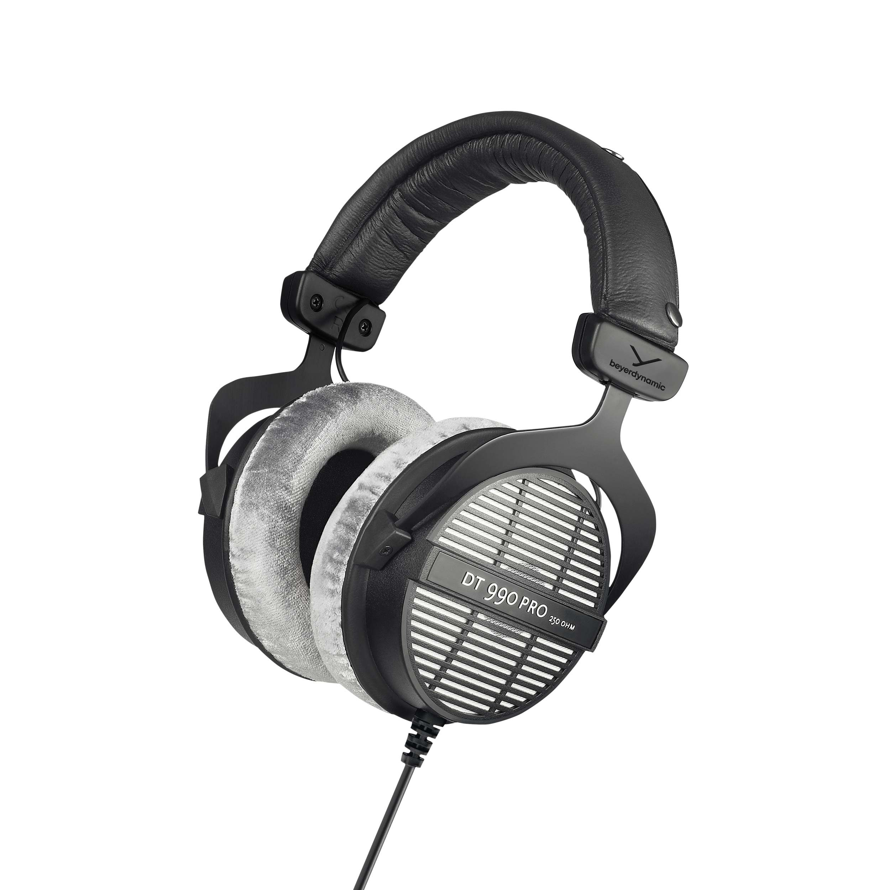

- 罩耳开放式监听耳机
- 动圈
- 250 Ω
- 96 dB
- 290 g
- 3.5 mm 不可换线
- 京东 ￥ 1249

> dt9xx 系列的定位是开放式监听耳机，其最经典的产品 dt990 有 32/80/250 Ω 三种阻抗可选，适合家庭欣赏音乐。低阻抗版本更适合手机、平板、电脑等设备直接驱动，而高阻版本适合配合功放发挥更好的性能。dt990pro 则有固定 250 Ω 阻抗（根据拜亚的 dt990pro 手册，曾经似乎有过 80 Ω 版本的？），且具有更紧的头带，方便音频制作人在录音室中走动而不用频繁调整头带。其高端升级款的型号为 dt1990pro，它们通常都需要独立功放来更好地驱动

是哪个傻逼呢？**是我。** dt990pro 是我第一款真正的 HiFi 耳机。由于当时戴索尼 xm5 大耳打游戏的时候经常被开黑队友喷是聋子，我买这款耳机其实是为了打游戏听声辨位用的

由于 dt990 全开放式的设计，它声场开阔，定位准确，早年被许多电竞玩家用于听脚步，直到后来盛行外设厂如罗技、雷蛇等赞助职业战队的商业模式，用专业音频厂耳机的职业哥逐渐少了（几乎仅有一些《彩虹六号》的职业哥仍在使用 dt1990pro 等 HiFi 耳机打游戏，这是由于这个游戏对听声辨位的要求非常大）。这是一次非常可悲的品质降级，在新兴外设厂的冲击下，传统 HiFi 厂商在消费级游戏音频领域溃不成军……

  
拜亚的 HiFi 产品在一众“电竞”外设中显得格格不入

然而，作为一款到手即可退坑的 HiFi 耳机，dt9xx 至今不仅仅是开放式大耳入烧首选，其听声辨位能力仍远强于大多数现役职业选手使用的 crap 游戏耳机如罗技 GPX2、赛睿寒冰新星等，且在理论上声场大于 dt770pro。欣赏音乐方面，这同样是一款三频比较均衡的全能杂食耳机，尤其适用于有外置耳放，预算不多，追求低延迟和精准定位的独居玩家听音乐打游戏，也适用于独立音频制作人做 critical listening ~~和核潜艇声纳兵日常使用~~

在佩戴舒适性上，虽然天鹅绒耳罩戴起来感觉还挺舒服……但是这个耳机对头比较长的人（比如我）极不友好，压头到了每戴两个小时左右就能引发严重疼痛的地步！另外，dt990pro 的全开放设计对外界声音的隔离之弱已经到了令人发指的底部，打游戏时机箱噪音很容易吸引玩家的注意，虽然评价一个开放式耳机的隔音能力实在有点勉强，但它的开放式程度实在有些夸张

适合：有非常安静游戏环境的玩家，开放式入烧，高质量音乐如大编制古典乐爱好者，愿意购买耳放的人  
不适合：头型细长的人，环境嘈杂或需要在公共场合听音乐的人，不愿购买耳放的人  
推荐指数：⭐⭐ 四星的声音，倒扣两星的佩戴（但 dt990 非 pro 要是佩戴和 dt880 差不多阳间的话应该能拿全四星）

https://global.beyerdynamic.com/dt-990-pro.html

# Sennheiser HD 6xx Series

> 森海三兄弟（hd600、hd650、hd660s）稳稳地站在中高端市场的交界线上，以致于新晋厂商进入高端头戴式耳机市场就遇到桥头堡，想要把头戴式耳机定价在 2000 以上，hd6xx 系列是一道不可不逾越的鸿沟，如果做出来的声音没有 hd6xx 系列好，就只能退市或者落涯式降价
>
> [真·不止听个响，浅谈耳机界传奇三剑客，相关搭配与见解 - bilibili](https://www.bilibili.com/read/cv1464921)

## “HiFi 三剑客”之首 · Sennheiser HD 600（罗产）

> “HiFi 三剑客”之首也有一种说法是 hd650，不过这俩耳机各方面还是比较相似的，倒也没有必要特别纠结一个名分。另外，不同产地、批次、外壳材质的 hd600 被认为互相之间声音有差异，因此本人特标出“罗产”一词

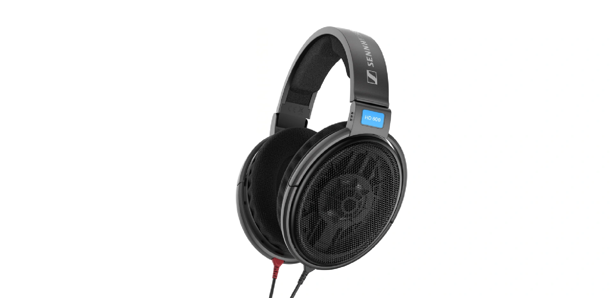

- 罩耳式 HiFi 耳机
- 开放
- 动圈
- 300 Ω
- 97 dB/Vrms
- 260 g
- 3.5 mm 不可换线
- 官网 ￥ 1999

hd600 并不需要我的介绍，而我的文章需要 hd600 来证明它存在的意义……简单为它的听感写几个关键词吧：高阻低敏，被认为非常吃耳放，低频比较匮乏，声场开阔，适合大编制古典

在佩戴上无可挑剔，大多数人都会觉得比较舒服

适合：对森海家调音感兴趣的烧友，大编制古典爱好者  
不适合：追求“解析力”的人，不愿购买耳放的人，Bass-head  
推荐指数：⭐⭐⭐ 已经落后的单元素质，中端 HiFi 耳机的价格守门人

https://www.sennheiser-hearing.com/zh-CN/p/hd-600

# 最爱之声 · 飞傲 FT3 (350 Ω)

- 罩耳式 HiFi 耳机
- 半开放
- 动圈
- 350 Ω
- 105 dB/Vrms
- 391 g
- 双 3.5 mm
- 官网 ￥ 1999

> 飞傲一到店，所有发烧友便都看着他笑，有的叫道，“飞傲，你台机销量要被拓品打了!”他不回答，在店里说，“卖个动圈大耳，装 60 mm 单元。”便标上 1999 块钱。他们又故意的高声嚷道，“你一定又调出‘数码声’了！”飞傲睁大眼睛说，“你怎么这样凭空污人清白……”“什么清白？我前天亲眼见你改了 k9 pro 的芯片，ESS 科学声。”飞傲便涨红了脸，额上的青筋条条绽出，争辩道，“‘科学声’不能算调音不好……素质！……高素质的调音，能说差么？”接连便是难懂的话，什么“born for music”，什么“一切只为音质”之类，引得众人都哄笑起来：店内外充满了快活的空气……

从技术层面上，飞傲 FT3 的发声单元素质绝对是目前动圈大耳 T0 级别。它的“解析力”、信噪比和失真都极其优秀，但是相应地，对功放的驱动能力要求也极高。本篇将向你解释，为什么 FT3 是飞傲初涉 HiFi 大耳领域献给发烧友的绝对诚意和优秀之作

> 飞傲的 Slogan 是“音乐，乐无限”，这里借用（音乐，快乐）的多音字乐来包含了两个意思，也就是，即要好听，也要好用好玩体验好……换句话来说，飞傲的设计理念里，用户体验和音质是一样重要的。如果一个产品只有音质，但是质量不好，天天要返修，或者用起来极其麻烦，都不是飞傲的风格……在 FT3 上，这个理念也得到了继承
>
> [飞傲 60 mm 动圈大耳 FT3 研发故事 - 贴吧](https://tieba.baidu.com/p/8330685964)

作为一家打出国门的老牌国产解码耳放厂，飞傲的调音常遭国内烧友讪笑，说什么“数码音”“科学音”之类的。飞傲好像自己也知道这点，所以这次初涉 HiFi 大耳领域，即使用了这么好的单元和做工，也要把定价压到 1999，可以说是对自家产品相当不自信了（笑）

可能是由于本身调音积淀不深，FT3 似乎是完全照着哈曼曲线来调的三频，并不突出人声或任何乐器的频段，给人一种非常中正的聆听。FT3 的整体设计思路可以说是哈曼版 hd600 和 hd800——用高阻抗单元换取高“解析度”和低失真，但目标向哈曼而非德系老厂喜欢的扩散场调音。这使得 FT3 即使是半开放式耳机，低频量也非常到位（欣赏现代曲目，hd600、hd800 以及 dt990 的低频客观上就是瘸腿的，不要盲目推崇）。在总体听感上，FT3 给人一种非常“明亮”“清晰”的感觉，如果这就是老烧们所谓的“科学音”，那我还挺喜欢的。或许是得益于其大单元，FT3 的声场虽不大但非常自然（让我想起隔壁劲浪卖 30000 的大乌），而非 hd800s 那样宽广到几乎“不自然”的地步，其听音辨位的准度，即结像是完全能表现好大编制古典乐的，故而也非常适合严肃电竞玩家使用

在佩戴方面，FT3 可谓相当优秀！它的耳罩支持前后旋转，上下扭曲需要的力度也很低，这使得 FT3 能够在丝毫不夹头的情况下让耳罩完美贴合不同头型，减少低频泄露等对音质产生影响的问题。而且，这款耳机的头带能均匀地将重量分布于头顶，把压头和夹头的力度做得非常均衡，头带是好文明。这款耳机的做工也延续了飞傲一贯的作风——在任何价位都把做工拉满，FT3 虽然只卖 2000，但绝对是我用过所有耳机中质感最顶级的。另外值得一提的是，这款耳机标配两套耳罩和配件也是相当良心，飞傲还是那么喜欢堆料 🤣

> The build quality side is strong though. There are no plastic parts on the FT3, which feels excellent in hand. The earcups, the grills, the headband and the yokes are all aluminium and they look and feel extra durable. The inner side of the headband and the suede earpads have a very soft and high-quality finish as well. Overall this is a fantastic build quality for a $ 299 USD headphone.
>
> [FIIO FT3 REVIEW - headfonia.com](https://www.headfonia.com/fiio-ft3-review)

适合：音乐品味杂食的人，“亮声”爱好者，追求听音辨位准度的玩家  
不适合：不愿意购买耳放的人  
推荐指数：⭐⭐⭐⭐⭐ 完美（不排除有些人对颜值有意见）

https://www.fiio.com/ft3

# 水平板的成熟之作 · 水月雨 Para

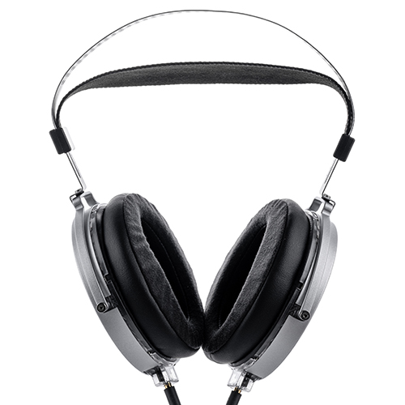

  
https://moondroplab.com/cn/graph

- 罩耳式 HiFi 耳机
- 开放
- 平面磁
- 8 Ω
- 101 dB/Vrms
- 525 g
- 双 3.5 mm
- 京东 ￥ 1999

虽然 Joker 小丑这款作品实在有点不思进取之嫌（可能是因为这个价位的 HiFi 耳机实在没啥人做），但水月雨毕竟是国内头部 HiFi 厂商之一，总得有一辆款能打的大耳的做排面的。继 Venus 启明星这款物理意义上的“重量级”平板耳机后，水月雨又推出了这款 Para 乐园。个人认为 Para 比 Venus 好听点

从水家官网提供的频响可知，Para 是相当“哈曼”的，which 意味着它可能比那些年代和调音都偏古典的经典耳机更适合听现代流行曲目，更杂食。从我的主观听感上，Para 的“头中效应”极为显著，虽然不至于到我眩晕的地步，但……实在不是很喜欢

> 在我们聆听耳机的时候，往往会觉得声源在人头内部，这就是头中效应。很多研究认为这是由于声重放在双耳产生错误的空间信息而引起的。听觉系统判断方位其实就是利用以前听音的经验和接收到的声音信号进行对比，而当声重放无法提供正确的信息的时候，听觉系统就会产生一种声音在头中的错觉。头中效应可以通过 HRTF 对原始信号进行处理解决，也可以使用添加虚拟的反射声进行处理。但是后者有时候会造成方向定位错误的问题。
>
> [“声”临其境的奥秘 | 空间音频简析 - 知乎](https://zhuanlan.zhihu.com/p/356238488)

我使用的是椭圆耳罩，声场烂了，导致严重的头中效应；听别人说用附赠的圆耳罩声场会好很多，我懒得拆装耳罩了；既然椭圆形耳罩是官方默认的耳罩类型，那就应该对它的声音有信心，而不是让用户自己更换耳罩达到它本应有的效果。我对下面这位用户对 Para 的评价非常认同

> 乐园我用的 3.5 mm 原线，圆耳罩，耳放 JDS Atom（16 Ω, 1 W）……先谈驱动问题，8 Ω 不难推（编者注：这可不好说，平板耳机低阻可不一定好推）……椭圆耳罩，声场缩小不少，低频增多，高频减少。这里要注意佩戴问题，耳罩跟耳朵的贴合程度会决定低频泄露量，低频泄露越多，听到的低频就越少。我个人不喜欢椭圆耳罩的声音，听感上声场不够宽松自然，没有利用好平板大振膜的优势……
>
> [评价下水月雨的新平板 乐园 Para - 贴吧](https://tieba.baidu.com/p/8610487983)

  
虽然耳机丑了点但盒子颜值还行

不过这款耳机虽然重，在佩戴体验上还是很不错的，出乎意料得舒服，这可能是得益于其松松软软的头带，值得表扬。然而这耳机的金属头梁做工和质感属实不太行……上手后感觉这薄薄的金属头梁很容易被拧断……

适合：颜值党  
不适合：追求听声辨位准度的玩家，不愿购买功放的人  
推荐指数：⭐⭐ 一般

https://moondroplab.com/cn/products/para

# Sony WH-1000XM Series

## 新一代降噪大耳代名词 · Sony WH-1000XM5

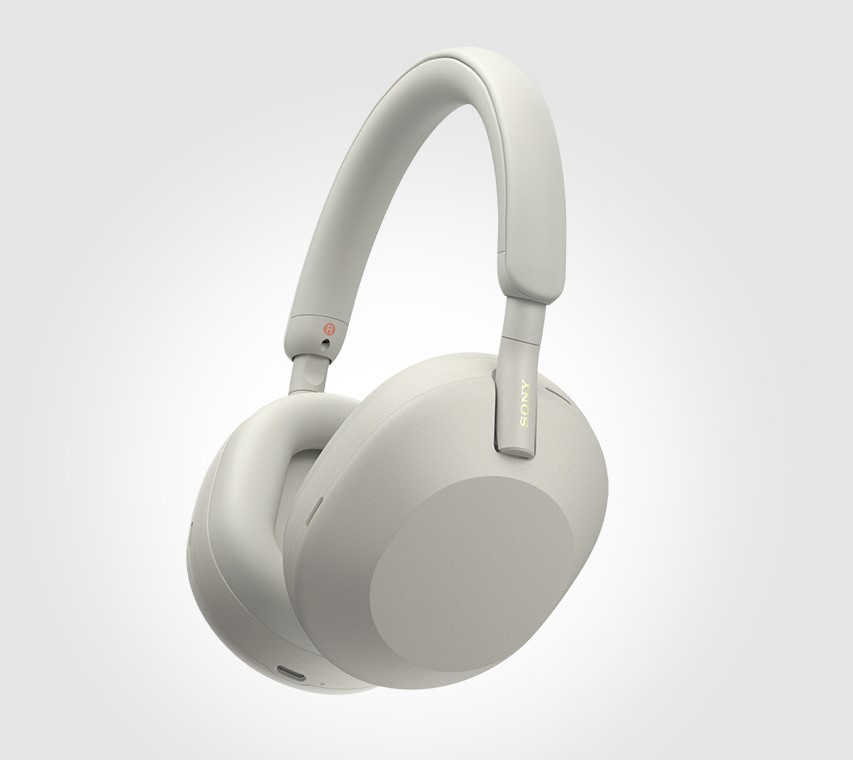

- 罩耳式主动降噪耳机
- 封闭
- 动圈
- 250 g
- 蓝牙 5.2、单 3.5 mm
- 京东 ￥ 2399

经典低音轰头的索尼调音味，非常符合我对现代 crap 耳机调音的想象，听录音质量差的口水歌还是挺不错的，如果想听点电音或者金属……为了保护自己的精神状态还是开 EQ 压一下低频吧。那声音只能用又闷又糊来形容，毫无声场可言，自然也不存在竞技游戏中的听声辨位能力了。另一方面，在这么轻的重量集成一个主动降噪耳麦的完整功能，要求它有多高的单元素质确实是奢求，音乐享受者慎选

实测降噪能力（除了在人声频段）还是很不错的，基本戴上后在无论多嘈杂的地方也能享受属于自己的小领域了。250g 的重量使它的佩戴感也十分轻巧，即使连着戴一整天也没感觉，虽然没法折叠但还是相当便携。另外，高度集成且统一的表面材质设计也使它在保证了完美的耳朵贴合度的同时也不会有 Bose 耳罩用半年就烂的臭毛病。虽然在关闭降噪功能时由于严重的听诊器效应 完 全 没 法 用；但是在开启主动降噪后，还是相对比较通透的，主观上感觉整个世界寂静了，而不是被屏蔽了。xm 系列的降噪能力被人夸赞不仅是因为频闭外界声音的能力，它还在用算法尽可能模拟开放式耳机的听觉体验

作为一个无线主动降噪耳机来说，它最大的缺点可能就是高得离谱的无线延迟了，而如果有线使用的话，麦克风是禁用的，直接踢出游戏玩家选项；另外，由于蓝牙的固有缺陷，在连接蓝牙使用麦克风时容易引发严重的音质下降（很恶心，用过蓝牙耳麦打游戏的人应该深有体会）。另外，Sony 的脑瘫无实体按键设计语言导致这个耳机操控起来贼麻烦。哦对了，还有一点——主动降噪耳机没有声场可言，which means 你得和你 ~~自称~~ 最爱的古典音乐和打游戏听声辨位说拜拜了

适合：佩戴耳机出勤需要强降噪的人，颈部肌无力，喜欢听口水歌的人，索尼大法信徒  
不适合：游戏玩家，想在有限预算内追求更佳音质的人，喜欢电音、金属以及古典的人  
推荐指数：⭐⭐⭐ 索尼的无线降噪耳机作为一种主流文化有它的道理

https://www.sony.com/lr/electronics/headband-headphones/wh-1000xm5

# 铁三角“小风扇” · Audio-Technica ATH-R70x

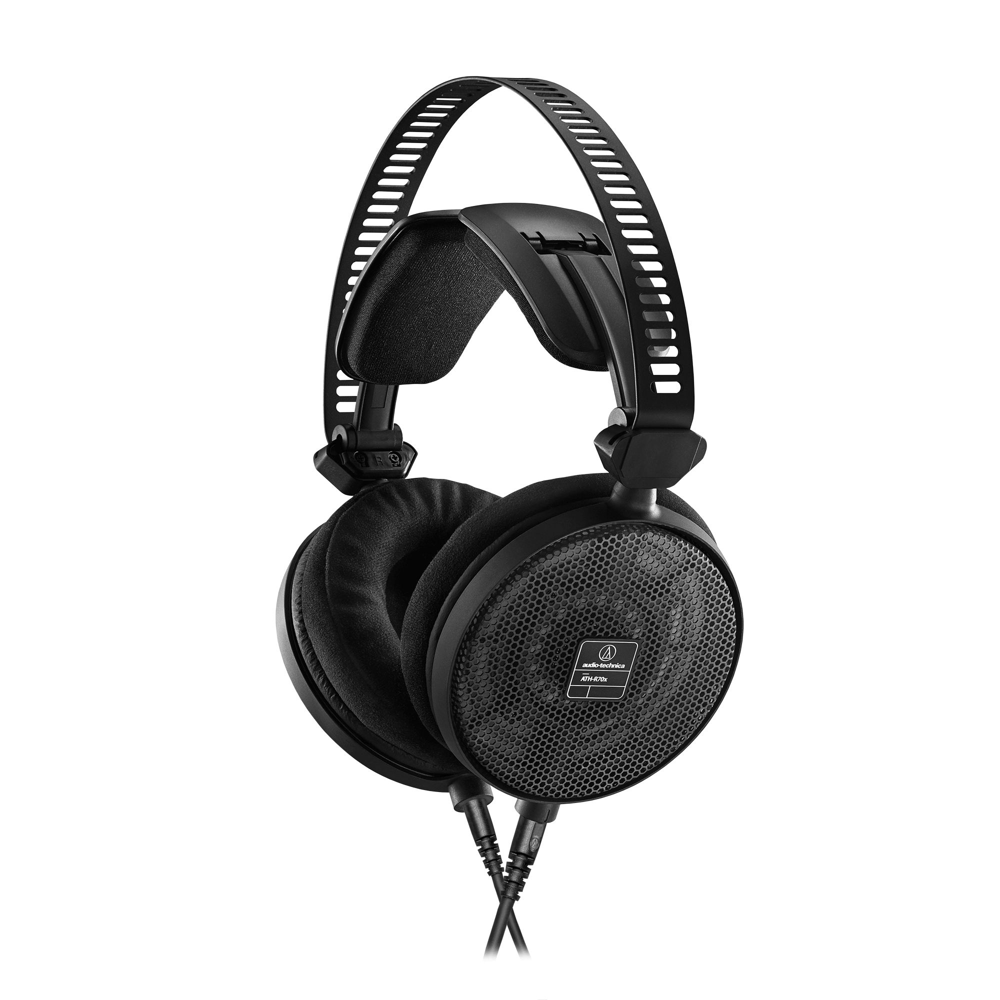

- 罩耳式混音监听耳机
- 开放
- 动圈
- 470 Ω
- 99 dB/mW
- 210 g（不含线缆）
- 3.5 mm 不可换线
- 京东 ￥ 2480

铁三角的两款开放式耳机 ADX5000 和 R70x 以其酷似风扇的造型分别得外号“大风扇”“小风扇”，其中被称为“小风扇”的 R70x 是铁三角唯一的专业级开放式参考级监听耳机，which means 这款耳机的所谓“音染”相对较低，更符合大多数听众对于“声音不偏不倚，追求真实”的需求，R 这个字母就是 Reference 的含义。这款耳机的阻抗极高，目标受众就是拥有专业功放的混音师和发烧友

这款耳机的听感可以用“铁三角的 hd600”来比喻（因为听说就是由欧洲团队调的音）。三频分布非常“正确”，听感非常自然，虽然少了 hd600 的所谓“堂音”，但是听上去又有些拜亚 dt9xx 系列去掉了高频峰一般的舒适感。同时，全开放式的设计使其声场开阔，听上去完全没有“头中效应”的不适感，听流行也非常舒服，这点比构造类似的水月雨 para 好多了

值得一提的是，这款耳机的质量相当之轻，它舍弃了一切金属部件，取而代之的是轻盈的塑料。这种设计虽然使它看上去有些“塑料感”，但 戴 起 来 是 真 的 轻 松 😍 轻薄塑料是好文明（水月雨 HIFIMAN 学着点）。另外，这款耳机的阻抗高得吓人，灵敏度也相当低，要“推好”这款耳机不上台式功放是绝对不行的；加之其全开放的设计，这耳机虽然达到了“久戴完全感知不到”的舒适程度，但它就只能家用，完全不适合外出携带

适合：有专业耳放的人，混音师  
不适合：不愿买耳放的人  
推荐指数：⭐⭐⭐⭐ 从佩戴和听感上都非常舒适

https://www.audio-technica.com/en-us/ath-r70x

# 地表最强游戏耳机 · Audeze Maxwell

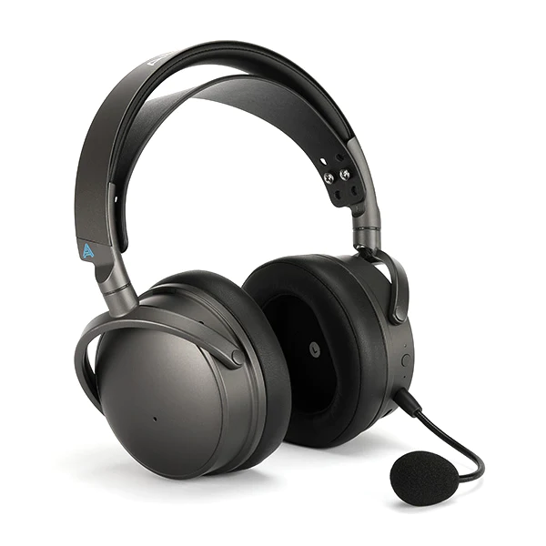

- 罩耳式无线游戏耳麦
- 封闭
- 平面磁
- 490 g
- 蓝牙 5.3、USB-C 无线接收器、3.5 mm、USB-C
- 京东 ￥ 2879

相信任何一个关注过声学外设的玩家都听说过 Maxwell 的鼎鼎大名（如果你没有说明你关注得不够），当之无愧的世界最强无线游戏耳机，没有之一！五星评论家麦克阿瑟曾说过：“我也曾相信‘用 HiFi 耳机打游戏不一定傻逼，但用游戏耳机听音乐绝对傻逼’，直到我使用 Audeze Maxwell”如果忽略那有点吓人的重量，那 Maxwell 就正如其名，是 Max-Well 的最佳无线游戏耳麦解决方案

我通常不会评价也不会在意一款无线耳机的声音，因为绝大多数无线耳机的 dac、功放模块以及振膜都是电子垃圾，直到 Maxwell 颠覆了这个印象。无线耳机是一众外设厂和索尼、Bose、苹果、Beats 等科技公司的主战场，传统音频大厂如森海拜亚的木馒头、lagoon 等无论从销量还是口碑都被 XM 和 Airpods 吊打，直到 Audeze 的搅局让音质这个词重新进入了游戏外设领域

> 考虑到绝大部分人对耳机价格的接受程度和无线需求，Audeze 于 2023 年初推出了一款一经发售就享誉世界，被冠以“世界第一游戏耳机”的“平价”（相对于 Audeze 其他产品来说算便宜了）无线游戏耳机 Maxwell。Maxwell 是其已停产的前辈 Hi-End 有线有源游戏大耳 Mobius 的继任者，在优化软件的同时彻底摒弃了有源有线设计，以 LCD-GX 作为 Mobius 的上位替代，而 Maxwell 则主打主流价格的无线耳机市场。不得不说 Audeze 的产品是真贵，将近 3000 的耳机在人家的产线里主打低端市场的……

Maxwell 的声音相当自然。

等等，一个游戏耳机的声音“自然”？在我们的印象中，游戏耳机通常和“重低音”“突出脚步”等词语挂钩，好像这就能给竞技玩家带来优势一样。Maxwell 以其出色的单元素质（废话这可是高贵的次世代的平面磁振膜）和原始调音（驱动软件里有相当多种预设的 EQ 可选）将一款用于欣赏音乐和影视娱乐的耳机该有的样子重新表达给了听众和玩家们——最自然均衡的声音，最原教旨主义高保真的声音，就是最适合打游戏的声音。在无线耳机欺行霸市的今日，能让美的声音重现在无线这一领域，足以让 WH1000-XM5 等背离了“耳机是音频工程师的乐器”这一宗旨的电子产品们汗颜

Maxwell 的做工无可挑剔，但佩戴却有点一言难尽。虽然并不夹头，头部压力大小也分布地比较均衡，但这款耳机 **实 在 太 重 了**，which means 它几乎不允许你低头使用，而且长久佩戴对脖子压力相当大，或许这就是 80+ 小时续航大电池的代价吧。还值得一提的是这款耳机优秀的被动降噪性能，Maxwell 的被动降噪能力好得出奇，不是降噪耳机，胜似降噪耳机，这也是支持它在各种环境下畅快游戏的根基之一

另外，作为一款游戏耳机 Maxwell 的功能堆料也是相当厉害，它的软件几乎把所有玩家需要的功能都集成了，包括但不限于：EQ、虚拟 7.1、蓝牙 5.3（比 xm5 先进一代）、同步返听、内置麦克风降噪、双声信号输入比例控制（可方便调节游戏的音量和其他软件音量的比例等）。我甚至从代理商 Endgame 处了解到，Maxwell 的固件还在不断更新，它甚至还有头追功能（当你听到右侧有动静，你把头转向右侧，声音就好像从你正前方传来。本质上是头部动补和 hrtf 技术的结合，技术难度很高，cool 得一批）被封印在硬件中，等待着未来可能的固件更新解锁

> 虽然知名评测网站 Rtings 将 Maxwell 评为“最佳游戏耳机”，但它在声场、延迟和定位上给 Maxwell 打了不够高的分数。Audeze 认为这是由于 Rtings 在测量延迟和相位失配的方法不严谨导致的，并为此写了一篇文章 _[In Response to RTings.com's Maxwell Review](https://www.audeze.com/blogs/publication-reviews/in-response-to-rtings-coms-maxwell-review)_ 批评 Rtings 的测量技术落后导致严重系统误差

适合：对无线耳麦有刚需的游戏玩家  
不适合：颈部肌无力患者  
推荐指数：⭐⭐⭐⭐ 如果你只考虑无线耳机，那么选它

https://www.audeze.com/products/maxwell-wireless-gaming-headset

# 头戴式杜比影厅 · VZR Model One

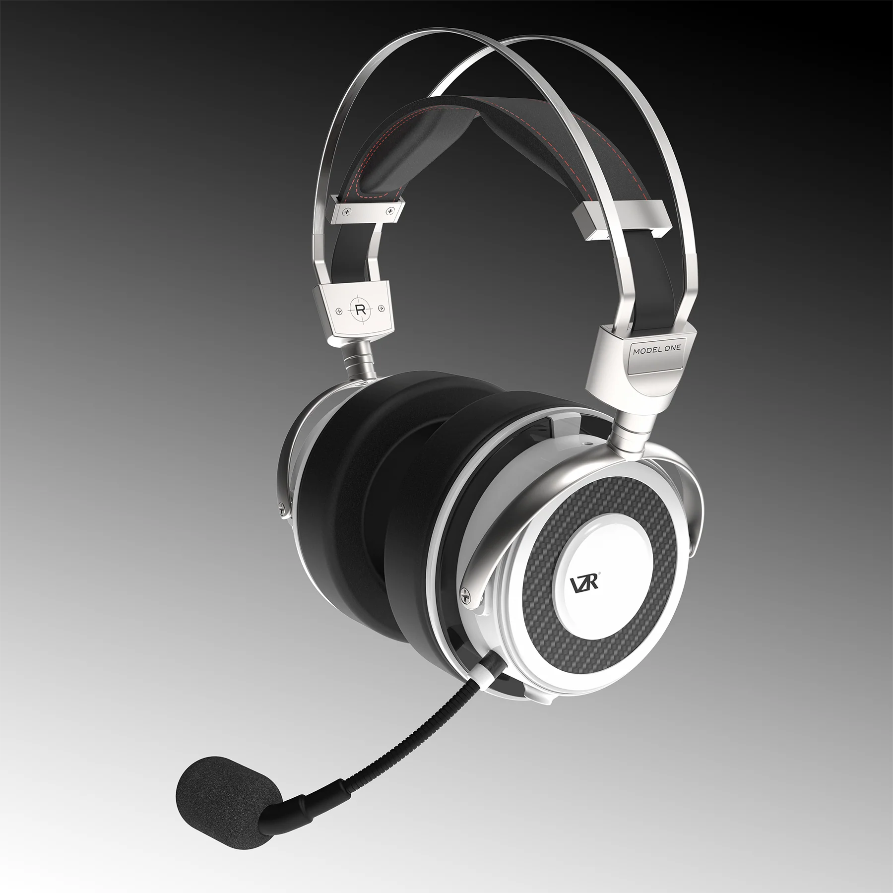

VZR 官方拒绝提供官方频响曲线，但鼓励第三方测量。原因可以参考前文 [以原道为例的基础知识](#以原道为例的基础知识) 中解读频响曲线的部分

- 罩耳式有线游戏耳麦
- 封闭
- 动圈
- 32 Ω
- 100 dB/mW
- 430 g（卸下麦克风后）
- 双 3.5 mm，原线带线控麦克风
- 京东 ￥ 2899

什么？这不是耳机，这是个头戴式杜比影厅。戴好耳机，_Apex Legends_，启动！

这款耳机从 21 年起在北美发售至今，于 23 年 10 月初终于进入了中国玩家的视野。如今，VZR Model One 以傲视群雄的姿态，用绝对领先的声音技术上彻底干烂了目前所有高端游戏耳机。纯粹的 AUX 模拟音频输入配合合理配置的 dsp 和前端，这款耳机将产生完美的游戏和影视体验

苹果的空间音频被很多人认为是目前最好的空间音频技术，这离不开苹果强大的声学工程师团队。苹果前领衔音频工程师，VZR 的联合创始人兼 CEO，Victor Tiscareno 在创立 VZR 后发布了一项物理声音处理技术——CrossWave™。这项技术理论上可以大幅改善声音的空间感，也因此成就了 VZR Model One 这款被誉为“头戴式杜比影厅”的耳机。有些烧友认为 CrossWave 技术和 Ultrasone 的 [S-LOGIC®](#直推之王--ultrasone-edition-11) 技术有异曲同工之妙

> ...There's no other analog solution that I know...that works like crosswave. In other words, I don't know of anything that goes in front of the driver specifically to do what we just said earlier...spatializing audio...
>
> [Deep Dive into VZR Model One’s CrossWave Technology - YouTube](https://youtu.be/dBo3xxh8wnE?si=WjJ8xcGZHbhYeLZC)

老实说，这款耳机欣赏音乐的品质并不算很好，它的调音取向和 hd600、dt880 等“声音正确”的传统发烧友耳机简直是两个极端——传统 HiFi 耳机仿佛要让人置身金色大厅中享受音乐之美，而戴上 VZR 就如同被丢进了惨烈的战场——VZR 的调音相当 Bass-Head，强调场景的沉浸感，在高频上也会漏掉不少信息（对于打游戏来说没啥影响但是听音乐会有问题）而绝不会受老烧的好评。但是在影视体验上，这款耳机毫无疑问地达到了目前世界最佳水平（至少是在这个价位上），它整个调音都在说明它的声学设计就是对音箱和影院声学系统的一个模拟。综上几点，它前所未有地逼近了在电影院里看电影的临场感，也因此产生了绝佳的听音辨位性能，非常适合游戏和影视发烧友使用

> ...there is a new option that achieves the end-game of the headphone quest: A speaker experience in headphones that brings you closer to "being there" with the artist.
>
> [VZR Model One is arguably a top 5 headphones ever released - Head-fi.org](https://www.head-fi.org/threads/vzr-model-one.961125/post-17019205)

在佩戴设计上，它的重量较高，但采用了较弹性的头带设计，因此并不会显得压头。另外，根据 VZR 官方在 reddit 上的回复，VZR Model One 很“易推”，即使是手机也能产生不错的声音，但是它仍能获益于优质的功放。理论上包括线控麦克风以及“易推”属性都会让这款耳机成为不错的出街选择，但这款耳机的便携性却受制于一个非常奇特的因素——风噪。虽然它没有主动降噪功能，但由于其外表面棱角分明的设计（不同于 dt700prox 的圆滑），它在风中会产生极其严重的风噪，这点非常影响它的出街体验

适合：最纯粹、追求最极致影视游戏声学体验的玩家，听音辨位的极致追求者，Super Bass-head  
不适合：单纯的音乐爱好者，颈部肌无力患者，出街  
推荐指数：⭐⭐⭐⭐ 头戴式音箱系统，世一游戏耳机

https://vzraudio.com/products/vzr-model-one

# 国产平板巅峰之作 · HIFIMAN Edition XS

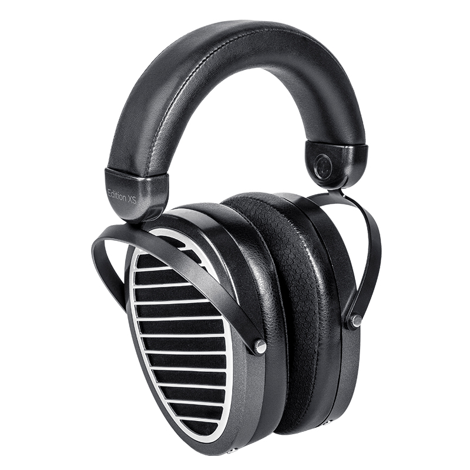

- 罩耳式 HiFi 耳机
- 开放
- 平面磁
- 18 Ω
- 92 dB
- 405 g
- 双 3.5 mm
- 官网 ￥ 2999

适合：对平板磁耳机感兴趣的烧友，

https://hifiman.cn/products/detail/289

# 飞傲 FT5

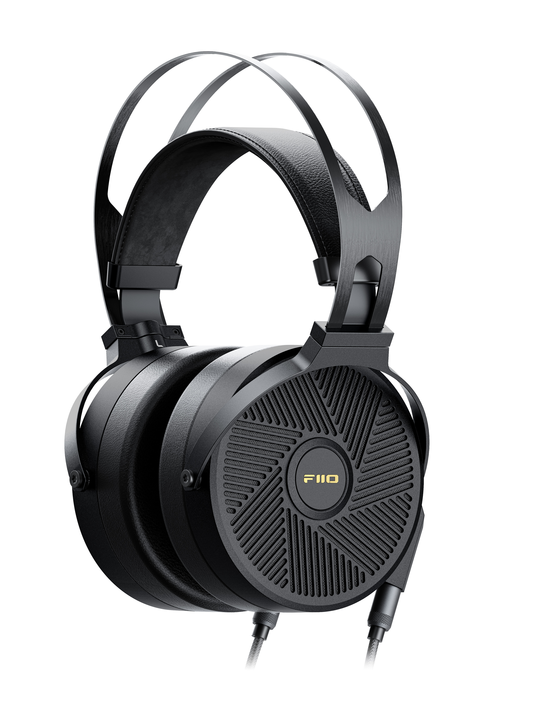

已联系飞傲索要 FT5 频响曲线

- 罩耳式 HiFi 耳机
- 开放
- 平面磁
- 36 Ω
- 110 dB/Vrms or 96 dB/mW
- 456 g
- 双 3.5 mm
- 官网 ￥ 2999

> The build quality is strong, with no plastic parts on the FT5, which feels excellent. The earcups, grills, headband, and yokes are all aluminium and look and feel extra durable. The inner side of the headband and the suede earpads have a very soft and high-quality finish as well. Overall, this is a fantastic build quality for a $ 449 headphone.
>
> [FIIO FT5 REVIEW - headfonia.com](https://www.headfonia.com/fiio-ft5-review)

https://www.fiio.com/ft5

# Shure SRH Series

## 混音十二载 · Shure SRH1840

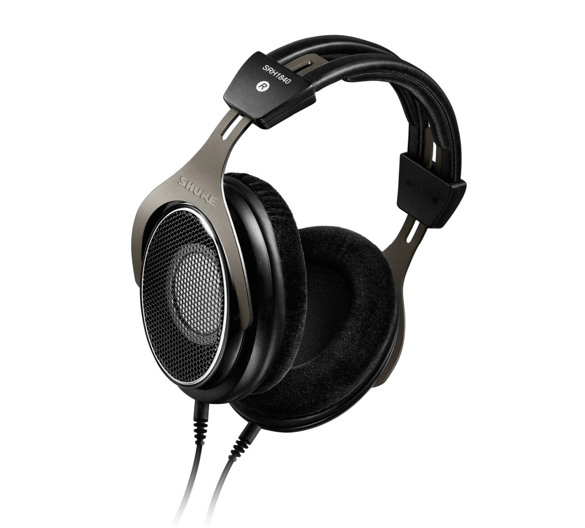

- 罩耳式混音监听耳机
- 开放
- 动圈
- 65 Ω
- 96 dB/mW
- 268 g
- 双 mmcx
- 京东 ￥ 3098

这款耳机自 2012 年发售至今，已历经 11 年，其监听的实用性和行业认可度已无须赘述。1840 那均衡的声音至今是各种混音工作室的宠儿，它也因此成了少数盗版最猖獗的耳机之一。如今，1840 年代久远的发声单元素质已严重落后于时代，虽然均衡，却缺乏现代耳机的“解析力”，这使得它在现代发烧友中的地位已大不如前了

**SRH1840 的声音风格简直像老式对讲机一样！**

虽然 1840 的声场和它的外观以及漏音程度一样十分开阔，但非常遗憾的是，它的声音和现代单元的差距，就像 1k 和 4k 分辨率的区别一样显著……

> 2022 年开始舒尔已经逐渐更新产线（如 840 更新到 840a），我们有理由相信，1840 作为舒尔的经典王牌，会得到一次审慎而彻底的升级

佩戴上，这款耳机十分轻盈，无功无过。可伸缩头梁方便不同头型的混音工作者把耳机调整到最舒服的姿势，然而，头梁在长久佩戴后仍稍有些压头感。这款耳机的做工除了头梁垫部分都十分优秀，然而这个头梁垫……戴一年必烂掉，真得自己去买个头梁套，不然没法用

在使用环境方面考虑，这款耳机的阻抗适中，但灵敏度极低，这是因为其录音室专业监听的定位，它必须搭配比较强劲的功放使用才能达到最佳效果。全开放的设计也使其毫无隔音效果，无法用于人声返听或现场监听，且漏音量相当大，完全不可用于公共场合听音乐

> Tips: 谨慎购买二手 SRH1840，这款耳机的假货可能是耳机界最多的

适合：工作室级混音师  
不适合：除此之外所有人  
推荐指数：⭐⭐ 参考上文 cd900st 不被推荐的原因

https://www.shure.com/en-US/products/headphones/srh1840?variant=SRH1840-BK

# Audeze LCD Series

2008 年在美国成立的 Audeze 奥帝兹 是最有代表性的平面磁大耳厂商之一，以其创新的平板磁技术闻名。可以说，Audeze 的发展历史就是半部平面磁单元的发展历史。LCD 系列作为 Audeze 的招牌平面磁耳机系列，以其卓越的音质和精湛的工艺而闻名

## 重塑经典 · Audeze LCD-1

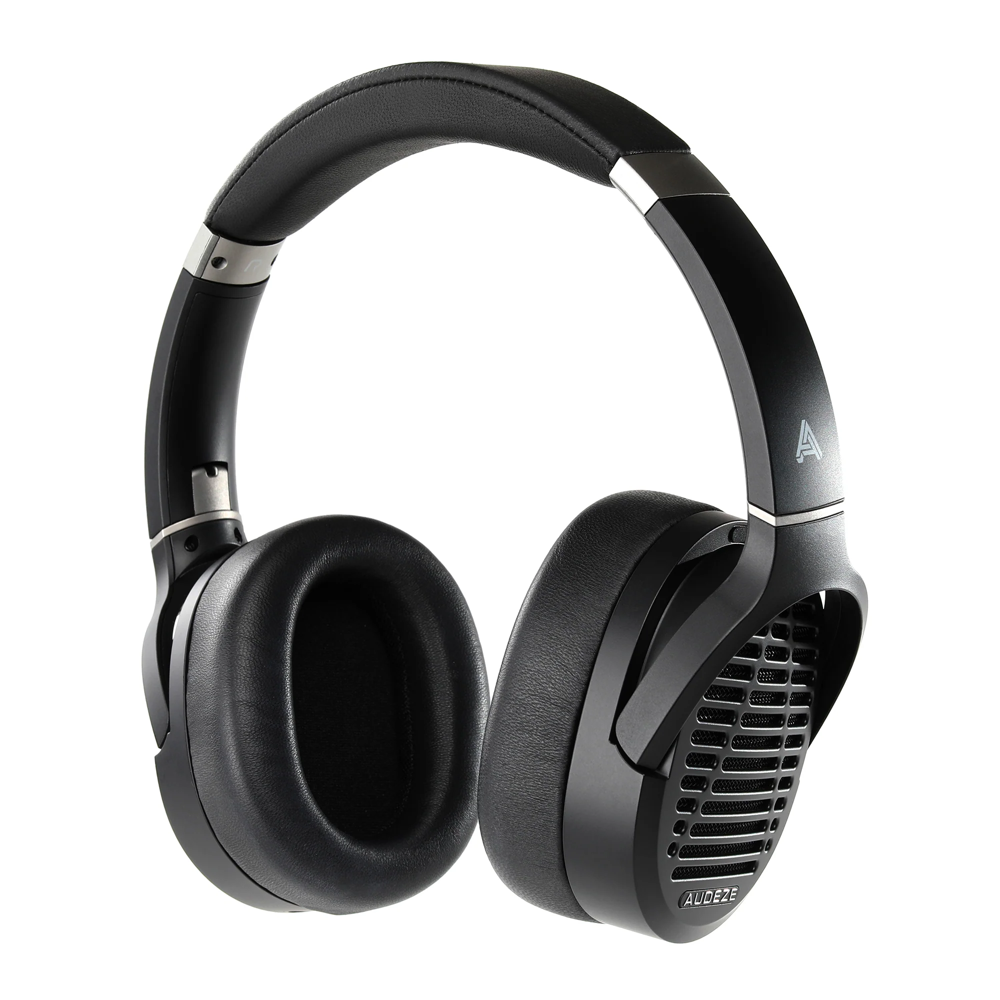

- 罩耳式监听耳机
- 开放
- 平面磁
- 16 Ω
- 99 dB/mW
- 250 g
- 双 3.5 mm，但是接口定义比较独特，最好用原装线
- 官网 $ 399

LCD-1 是一款入门级平板耳机（虽然入门，但还蛮贵的，美国厂子用美元定价就这样 😒），可是得益于 Audeze 毫不妥协的平面磁单元技术和成熟的调音，其声音在“解析力”以及结像方面实在是足够优秀，使其成为了（美国的）高性价比混音监听耳机

这款耳机应该是我听过的，给我主观感觉最“中性”，最“还原”的。宽阔的声场遇上搭载先进平面磁单元的原教旨主义高保真 HiFi，应该会俘获不少追求“声音正确”的发烧友的心。（以下为非常主观不科学的个人听感，因为我的水平实在难以描述，不要参考）另一方面，我主观上感觉这款耳机的音色偏“暗”，虽然三频分布非常均衡，但是比起飞傲 FT3 来说，少了点“亮丽”的感觉

这款耳机全身主要由塑料制成，做工实在差点意思。戴在头上以及移动时，经常发出塑料嘎吱嘎吱的声音，这点非常……影响脑放。不过佩戴倒是得益于其轻盈的材质，仅稍有“夹头感”，毫无“压头”的感觉，长时间佩戴完全不会感到不适，甚至能让人忘记头上戴着东西，可谓是相当舒适。在“易推”和“便携”上，这款耳机不是给外出聆听的人用的，而是更适合录音室混音监听或家用 HiFi。这款耳机的阻抗较低，但是其灵敏度相当之低，非常“难推”，需要搭配强劲的功放使用；另外，全开放的设计也使其毫无隔音效果，且漏音量相当大，完全不可用于公共场合听音乐

这款耳机因为良品率较低（美国爷生产成本控不下来 🤣）目前已经绝版，如果要买只能逛闲鱼了。根据 Audeze 国内代理商 Endgame 称，其继任者型号是 mm-100，不过国内目前好像没找到购买途径

适合：喜欢中正声音的人，颈部肌无力，绝版耳机收藏家  
不适合：在公共场合听音乐的人，不愿意购买耳放的人  
推荐指数：⭐⭐ 声价比不高，塑料质感也影响我开脑放了

https://www.audeze.com/products/lcd-1

# Ultrasone Edition Series

## 直推之王 · UltraSone Edition 11

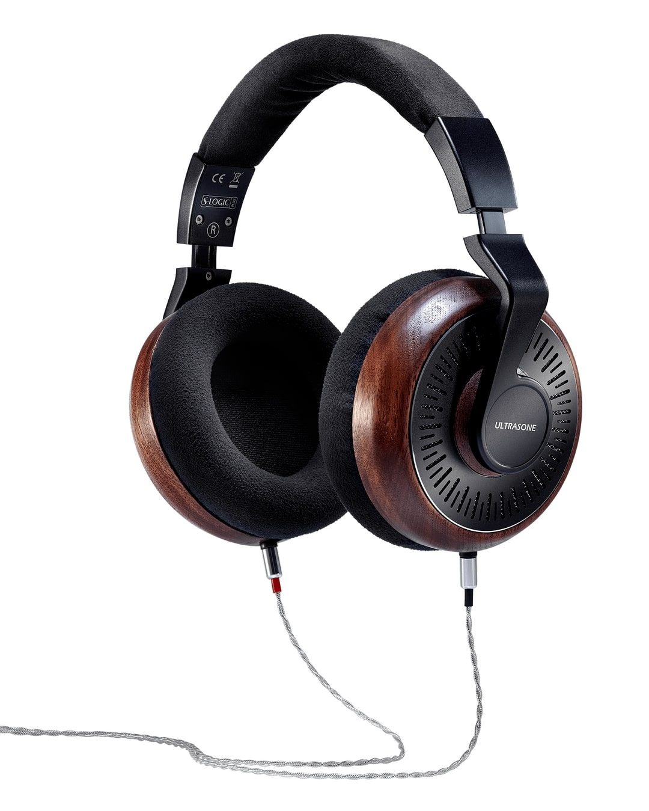

找不到频响曲线，已写信问候 UltraSone。逼养的不回复，你好歹像 VZR 那样给个解释啊

- 罩耳式 HiFi 耳机
- 半开放
- 动圈
- 32 Ω
- 未知灵敏度，已写信问候 UltraSone
- 318 g
- 双定制 2-pin IEM 插针
- 淘宝 ￥ 3499

**作为一款发售价一万元，全球限量 1111 台的耳机，由于营销不给力，现在国内 3200 就可以拿下，性价比相当高！！！**

> 国内的发烧友给德国 ULTRASONE 起了一个违反广告法的中文名字叫：极致。我想这跟 ULTRASONE 经常推出一些采用稀有金属来制作外壳且售价高到让人乍舌还限量销售的耳机作品不无关系。尤其是 Edition 系列，这个系列是最能诠释极致精神的，不管是早期钌金外壳的老版本 Edition 8，还是采用沼泽木材质外壳的 Edition 5，他们无不在选材、做工、声音甚至售价等各个方面在诠释着“极致”
>
> [HiFi 入门小知识连载——以最新的 Edition 11 为例聊聊德国 ULTRASONE 极致耳机 - 什么值得买](https://post.smzdm.com/p/a4w0lzow/)

极致 ed11 是一款三频非常均衡，单元素质非常优秀，声音非常温润，做工极其优良，技术非常先进，适用范围非常广的耳机。常有人拿它和拜亚的经典大耳 dt1990 比较，得出"ed11 是加强版的 dt1990"这一结论，不无道理。戴上 ed11 听音乐是一种纯粹的享受，它在能给你均衡声音体验的同时发挥其强大的单元素质，通过 S-Logic® Plus technology（一种通过引导声音在耳廓内反射而不是传统的直射到耳膜来改进听感的“自然感”的技术）清晰地将声音的结像和声场展现在聆听者脑中

> Here, the transducers are not placed in the middle of the headphone cup but offset forward and downward. As a result, the sound first hits the outer ear – the inclusion of the auricle anatomy in the hearing process creates a spatial perception for all common stereo sources, without any additional electronics.
>
> The result is an impressively natural sound, directions and distances are reproduced without distortion and authentically. With S-Logic® you don’t hear music in your head, but on a large stereo stage in front of you.
>
> [WHAT IS S-LOGIC®? - ultrasone.com](https://ultrasone.com/s-logic-ule)

有意思的是，由于它充分利用了耳廓的声音反射，这款耳机的佩戴对声音的影响极大！当你把耳罩往前后挪挪的时候，或许能得到截然不同的体验

在佩戴上，这款耳机采用了在降噪耳机中常见的无头带可调整头梁高度的设计，但其较低的重量和稍高的夹耳力使其毫不压头，佩戴上非常接近索尼 WH1000 系列以及 Bose QC 系列降噪大耳的体验，非常舒适。另外，这款耳机的阻抗较低，灵敏度也挺高，上海壹视听老板和网上众多烧友都评价其为“最适合直推的耳机”。广泛认可的易推性，不太漏音的半开放式声学设计，再加上古典优雅的外观（包括耳机线也很漂亮），让这款耳机成为了便携 ~~装逼~~ Hi-End 耳机的绝佳之选

适合：直推出街的人，颜值党  
不适合：没有人  
推荐指数：⭐⭐⭐⭐⭐ 价格跳水后非常优秀的小众 Hi-End 耳机

https://ultrasone.com/product/ultrasone-eleven-high-end-headphones

# 音乐精灵 PMH-1

免责声明：来自主动申请并提交押金的厂家送测

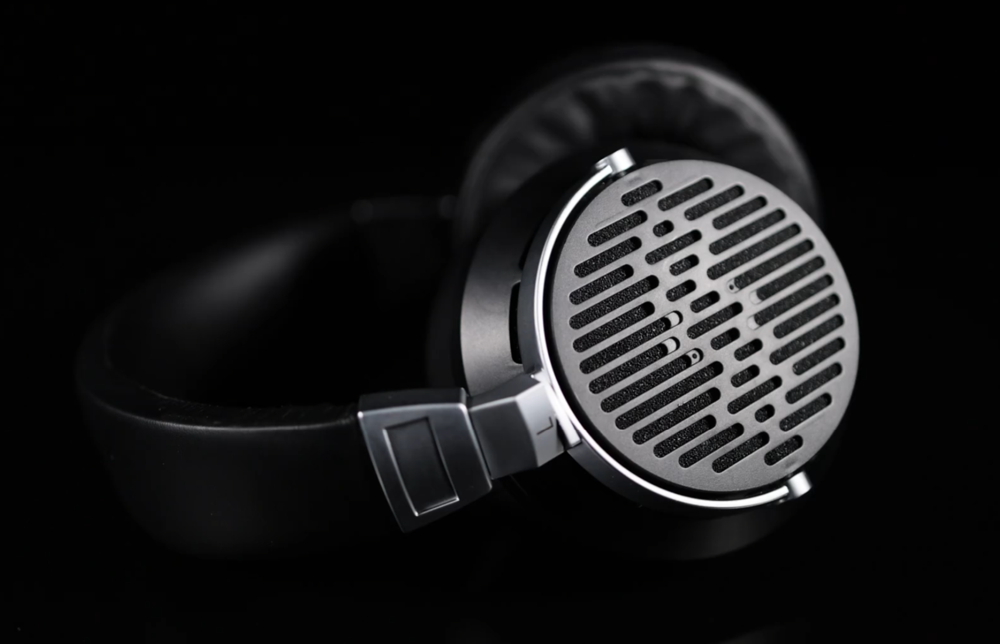  
[【PMH-1】音乐精灵首款开放式平板耳机详细介绍及云试听对比 - bilibili](https://www.bilibili.com/video/BV1RU4y1b7q1/?share_source=copy_web&vd_source=0d156261fad807ac85d735b6ab0a64ed)

已联系周工，无频响图

- 罩耳式 HiFi 耳机
- 开放
- 平面磁
- 60 Ω
- 99 dB/mW
- 560 g
- 双 3.5 mm
- 淘宝 ￥ 3899

音乐精灵是国内解码耳放小厂，其代表人物周工是国内最顶级的也最有技术能力的发烧友之一。PMH-1 是音乐精灵推出的首款大耳

这款耳机的设计上存在一些缺陷，如夹耳的结构设计不是很合理，底部不可避免地漏风，导致严重的低频泄露。重量也控制得不是很到位

适合：试听  
不适合：除此之外所有人  
推荐指数：⭐ 设计上的缺陷使其不值这个价格

# Hi-End DIY 耳机的完美诠释 · ZMF Atticus

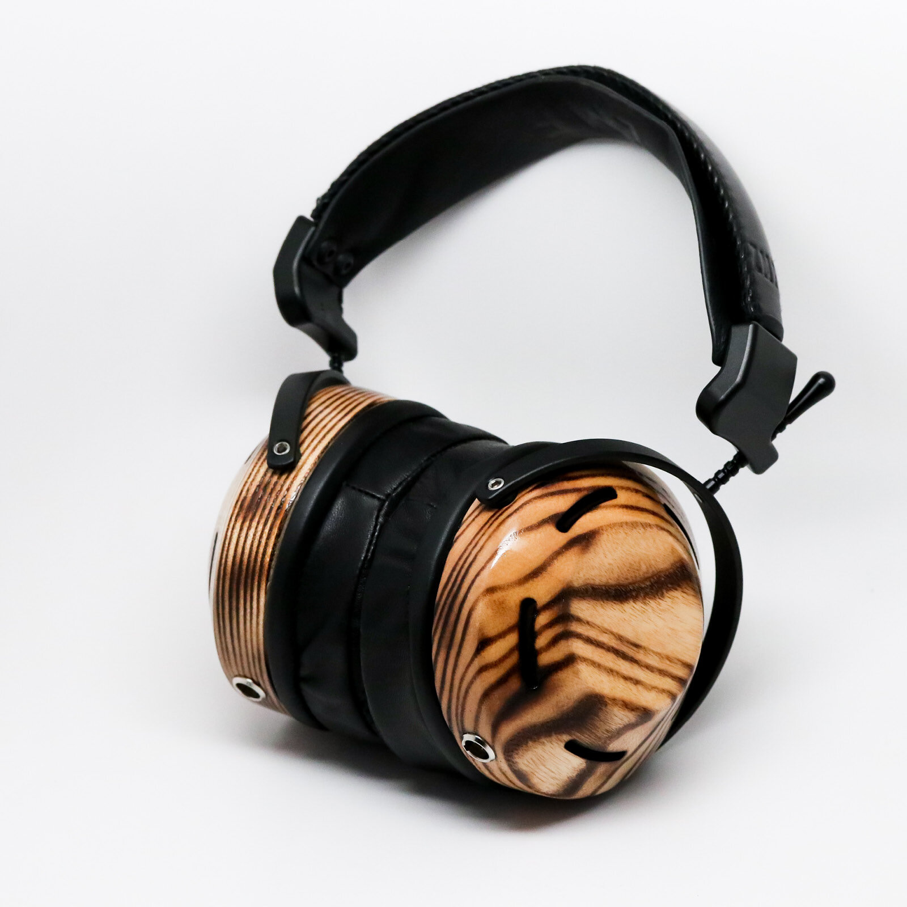

- 罩耳式 HiFi 耳机
- 封闭（具有泄气孔，非典型封闭式）
- 动圈
- 300 Ω
- 99 dB/mW
- 490 g
- 双四芯
- 淘宝 ￥ 9300

感谢 Endgame 送测！

> 如果你最近两年有关注欧美耳机论坛，那对 ZMF Headphones 这家品牌一定不会陌生，它家的多只不同定位的耳机几乎占据各自价位最受欢迎位置，尤其是处于顶级的 Verite 系列，较为小众的木材选用，手工打磨的加工方式，能称得上令人发指的专属耳罩多样性，让它成为两万元价位上最受欧美烧友喜爱的旗舰耳机。但因为品牌规模较小，手工打造的产量问题以及我们众所周知的原因，这一品牌以前在国内既无代理又无售卖，甚至连海淘渠道都少得可怜，所以国内用户对其了解是相当有限的
>
> [聊聊这两年欧美最火的耳机品牌 ZMF Headphone 以及它家旗舰封闭式耳机 Verite Closed - 知乎](https://zhuanlan.zhihu.com/p/381764273)

在收到 Endgame 送测前，我甚至没有听说过这个品牌……可能这就是高端市场 Only 的高贵欧美品牌吧。戴上 Atticus 的一刻，我就被其恐怖的低频“烈度”震撼了，以至于一时间无暇欣赏别的方面。说来惭愧，我平常试听的曲目中，_Stained, Brutal Calamity_ 作为电音的代表，我一直没注意到 4:37 及往后的一段背景中重复的低频，直到 Atticus 把这段低频的质感表现得出色到 @&#\*%^@@!#$&^……

> Note that fair amount of sound escapes the vents so don't assume these are "closed headphones" in the classical sense.
>
> [ZMF Atticus Review - Audio Science Review](https://audiosciencereview.com/forum/index.php?threads/zmf-atticus-review-headphone.24191)

在听过这个耳机之前，我从未意识到 DIY 耳机的价值——给每个用户与众不同的聆听体验。或许正是因为反射强烈的木碗+泄气孔这个奇特的设计，这款耳机是我见过的把低频表达地最好，最独特的耳机。在突出调音特点的同时，Atticus 的单元素质毫不妥协，也具备极强的“解析力”——与像 hd600 那样糊成一团的感觉恰恰相反，Atticus 照样能把每个频段和声部表达地十分清晰

Atticus 的佩戴无功无过，一方面巨大而非常深的耳罩能让耳朵不受挤压，另一方面这么大的木碗也注定了它过高的重量。虽然在我的头上，它已经比较均衡地分布了压力和摩擦力，但这个重量还是会让我感到些许不适。另外，比较高的阻抗和相对较低的灵敏度，以及其 Hi-End DIY 耳机的本质决定了它就是为有丰富听音经验的发烧友而生的，并不是普通耳机市场的产物

适合：Bass-Head，对自己听音喜好有明确了解的资深烧友  
不适合：颈部肌无力，入门烧友  
推荐指数：⭐⭐ 素质优秀而风格独特，盲狙需谨慎

https://www.zmfheadphones.com/atticus-aeolus

# Sennheiser HD 8xx Series

动圈耳机的桂冠系列

## 动圈耳机的桂冠 · Sennheiser HD 800 S

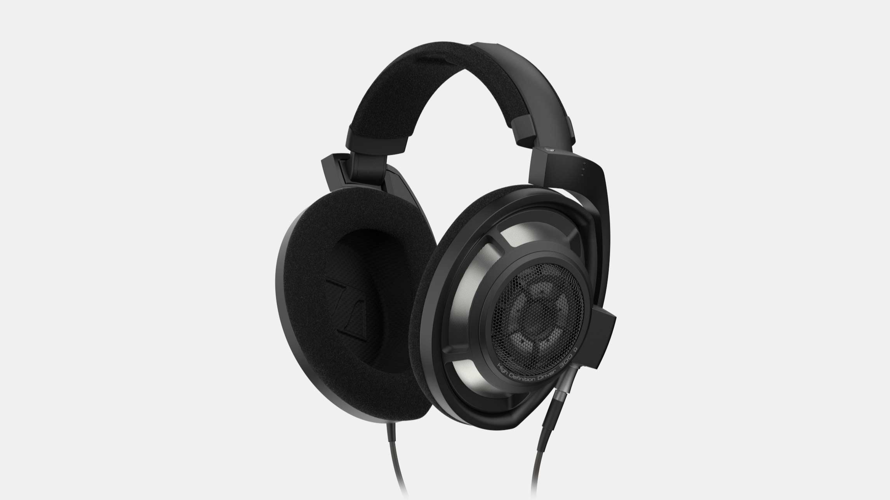

- 罩耳式 HiFi 耳机
- 开放
- 动圈
- 300 Ω
- 102 dB/Vrms
- 330 g
- 双定制 2-pin 插针
- 官网 ￥ 9999

适合：排面富哥，大编制古典爱好者，严肃竞技游戏玩家  
不适合：不愿购买耳放的人，Bass-head  
推荐指数：⭐⭐⭐⭐ 你知道为什么森海被称为第一耳机品牌吗？

https://www.sennheiser-hearing.com/zh-CN/p/hd-800-s

# 鸣谢

- 上海知音堂，在线下试听时给我讲解了不少 HiFi 知识，对正确听音观的构建有很大帮助
- 上海壹视听，提供了最享受的试听环境和氛围，并非常耐心地让我体验了各种 Hi-End 设备
- 海外音频产品代理商 Endgame，送测了 Atticus 样机并提供了一些内部资料
- 音乐精灵的老板周工，提供了 PMH-1 的样机
- **这篇文章的读者们，所有热爱音乐的人**
