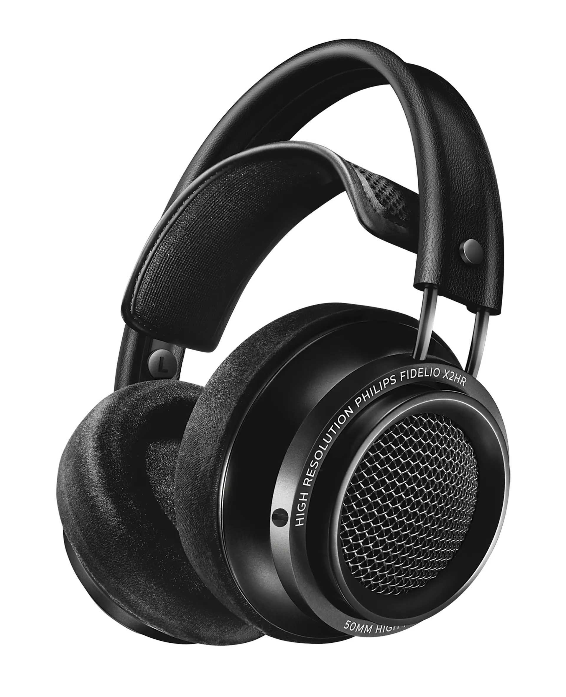
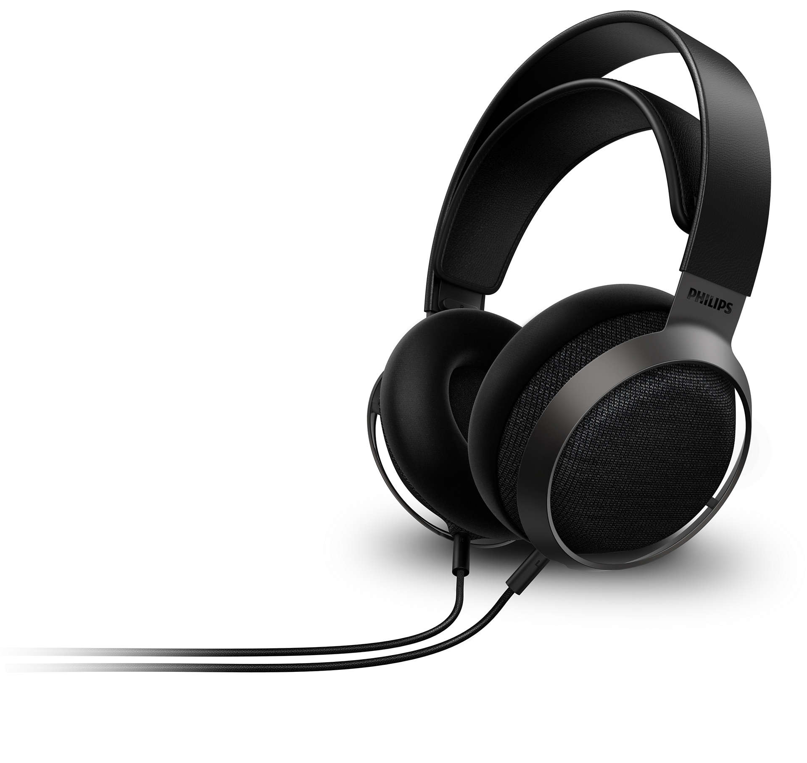
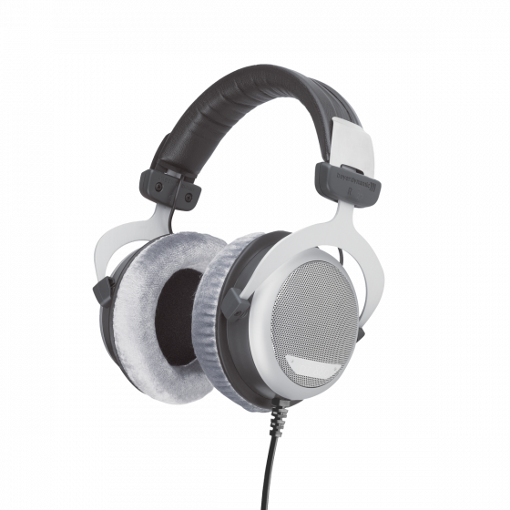

斥资 8w 写成的全网最专业的头戴式耳机选购攻略。本文将随着本人的耳机阅历和空闲时间和摸鱼时间持续更新。本期攻略相当硬核，酌情跳着看，哪一部分看不明白再翻翻前面的。本文基本按照价格升序毫不客气地评测 30 款耳机，我会尽可能少写一些主观的东西，多谈客观风格，减少主观评判。但是由于本人的主观感受和听音偏好的影响以及文笔功力，不可能不存在一些偏差，你的听感和文字描述的不一样很正常

以上所有耳机均为本人自费购买/送测后返还，与任何厂商/经销商不存在任何利益关系。欢迎以任意方式联系我提问声学优化相关问题，我会尽力帮助你，希望你能给这个施工中的知识库点个 Star

- [以原道为例的基础知识](#以原道为例的基础知识)
- [Philips SHP9500](#philips-shp9500)
- [微翼 超新星](#微翼-超新星)
- [飞傲 JT1](#飞傲-jt1)
- [HIFIMAN HE Series](#hifiman-he-series)
  - [HIFIMAN HE400se](#hifiman-he400se)
  - [HIFIMAN HE-R9（新版）](#hifiman-he-r9新版)
- [水月雨 Joker](#水月雨-joker)
- [和声力 Black Hole 黑洞](#和声力-black-hole-黑洞)
- [Philips Fidelio X Series](#philips-fidelio-x-series)
  - [Philips Fidelio X2HR](#philips-fidelio-x2hr)
  - [Philips Fidelio X3](#philips-fidelio-x3)
- [Audio-Technica ATH-M50x](#audio-technica-ath-m50x)
- [Sony MDR Series](#sony-mdr-series)
  - [Sony MDR-CD900ST](#sony-mdr-cd900st)
  - [Sony MDR-Z1R](#sony-mdr-z1r)
- [AKG K7xx Series](#akg-k7xx-series)
  - [AKG K701](#akg-k701)
- [Beyerdynamic DT Series](#beyerdynamic-dt-series)
  - [Beyerdynamic DT 770 Pro](#beyerdynamic-dt-770-pro)
  - [Beyerdynamic DT 700 Pro X](#beyerdynamic-dt-700-pro-x)
  - [Beyerdynamic DT 880](#beyerdynamic-dt-880)
  - [Byerdynamic DT 990 Pro](#byerdynamic-dt-990-pro)
  - [Beyerdynamic DT 900 Pro X](#beyerdynamic-dt-900-pro-x)
- [绯乐 Feature](#绯乐-feature)
- [奥莱尔 AR5000 琉璃](#奥莱尔-ar5000-琉璃)
- [Sennheiser HD 6xx Series](#sennheiser-hd-6xx-series)
  - [Sennheiser HD 600（罗产）](#sennheiser-hd-600罗产)
- [飞傲 FT3 (350 Ω)](#飞傲-ft3-350-ω)
- [水月雨 Para 乐园](#水月雨-para-乐园)
- [Sony WH-1000XM Series](#sony-wh-1000xm-series)
  - [Sony WH-1000XM5](#sony-wh-1000xm5)
- [Audio-Technica ATH-R70x](#audio-technica-ath-r70x)
- [DENON AH-Dx200 Series](#denon-ah-dx200-series)
  - [DENON AH-D5200](#denon-ah-d5200)
  - [DENON AH-D7200](#denon-ah-d7200)
  - [DENON AH-D9200](#denon-ah-d9200)
- [VZR Model One](#vzr-model-one)
- [Audeze Maxwell](#audeze-maxwell)
- [HIFIMAN Edition XS](#hifiman-edition-xs)
- [飞傲 FT5](#飞傲-ft5)
- [Shure SRH Series](#shure-srh-series)
  - [Shure SRH1840](#shure-srh1840)
- [Audeze LCD Series](#audeze-lcd-series)
  - [Audeze LCD-1](#audeze-lcd-1)
  - [Audeze LCD-GX](#audeze-lcd-gx)
  - [Audeze LCD-5](#audeze-lcd-5)
- [Ultrasone Edition Series](#ultrasone-edition-series)
  - [UltraSone Edition 11](#ultrasone-edition-11)
- [绯乐 Century](#绯乐-century)
- [音乐精灵 PMH-1](#音乐精灵-pmh-1)
- [AKG K8xx Series](#akg-k8xx-series)
  - [AKG K812](#akg-k812)
- [Sennheiser HD 8xx Series](#sennheiser-hd-8xx-series)
  - [Sennheiser HD 800 S](#sennheiser-hd-800-s)
- [ZMF Atticus](#zmf-atticus)
- [Focal Utopia (2022)](#focal-utopia-2022)
- [YAMAHA YH-5000SE](#yamaha-yh-5000se)
- [HIFIMAN SUSVARA](#hifiman-susvara)
- [鸣谢](#鸣谢)

# 以原道为例的基础知识

  
https://detail.1688.com/offer/521792513665.html

  
https://zhuanlan.zhihu.com/p/97706759

> 频响曲线（Frequency-Response Curve, 简称 FR），默认来源为 [AutoEq](https://autoeq.app) 网站。下图以 Senheiser HD 800 S 为例介绍如何初步解读 FR
>
>   
> x 轴是频率，单位是 Hz；y 轴是特定频率下产生声音的相对强度，单位为 dBr
>
> - Raw，原始频响曲线。同一款耳机在不同的测试环境下，FR 也可能会有较大差别
> - Error，偏差曲线。此结果为原始曲线和目标曲线的偏差，Error 在某个频段越高则意味着相对于目标曲线，这款耳机更突出这一频段；反之则越削弱这一频段。Error 曲线越平直通常意味着这款耳机的频响越接近目标曲线
> - Target，目标频响曲线。其实这个更适合翻译为“参考曲线”，因为这个曲线并不是耳机的目标调音曲线，而且不同的测试者可能会参考不同的目标曲线，如 Rtings 测试团队可能会使用 _Rtings Harman Over-ear 2018_ 而 Ordinary1990 倾向于 _Harman Over-ear 2018_，本文均使用原测试者的默认参考曲线。关于什么是目标曲线可以参考这篇文章：[什么是哈曼曲线 _Harman Target Curve_ - 知乎](https://zhuanlan.zhihu.com/p/65228980)
> - Equalizer，EQ 曲线。此结果为使用均衡器软件对原始曲线进行的补偿，一般就是低频较少则补偿低频，高频较多就压制高频。本文均使用 EqualizerAPO GraphicEQ 方法
> - Equalized，EQ 后曲线。此结果为将 EQ 曲线和原始曲线叠加后的结果，这条曲线通常和目标曲线吻合度较高，但也因为耳机物理性质的问题无法完全吻合
>
> 以下是 [Mixing Techniques > Audio Spectrum - Teach Me Audio](https://www.teachmeaudio.com/mixing/techniques/audio-spectrum) 提供的非权威的频段划分表
>
> | Frequency Range | Frequency Values |
> | --------------- | ---------------- |
> | Sub-bass        | 20 - 60 Hz       |
> | Bass            | 60 - 250 Hz      |
> | Low midrange    | 250 - 500 Hz     |
> | Midrange        | 500 - 2000 Hz    |
> | Upper midrange  | 2000 - 4000 Hz   |
> | Presence        | 4000 - 6000 Hz   |
> | Brilliance      | 6000 - 20000 Hz  |
>
> 注意，FR **完全不能** 反映一款耳机的好坏，只能 **在一定程度上** 反映一款耳机的调音取向。调出一个“好看”的 FR 容易得很，许多半步烧友往往看了 FR 就对一些耳机下论断，不要犯这种错误

- 平头塞

> 耳机的佩戴类型。大耳有罩耳、压耳两种类型，罩耳式耳机将整个耳朵包住，而压耳式耳机顾名思义贴在耳廓上

- 开放

> 耳机的声学类型。开放式耳机通常漏音较多，无隔音能力但是声场更大，声音更自然；封闭式耳机通常不漏音且有一定隔音能力，但容易有听诊器效应或桶音；半开放式耳机漏音较少但也无隔音能力；半封闭式耳机和封闭式基本类似，但有泄气孔

- 动圈

> 发声单元类型。耳塞，即 IEM 的发声单元主要有动圈、动铁、平面磁、静电四种类型。当然，一个 IEM 也可以容纳多种单元。在大耳中常见的发声单元有动圈、平面磁和静电三种
>
> 其中动圈单元应用最广，绝大部分大耳都是动圈耳机，阻抗和灵敏度天差地别，属于上限高下限低最花样繁多的成熟技术
>
> 平面磁或称平板耳机通常比较重，阻抗较低但需要较大电流。平面磁耳机通常“解析力强”（即更清晰）、频宽广（即更容易同时表达好极高和极低频段），被认为有比动圈耳机更大的潜力
>
> 本文不介绍静电耳机

- 32 Ω

> 阻抗。高阻耳机必须搭配功放，但低阻耳机不一定不需要搭配功放。阻抗可以用来初步衡量耳机的易推性。阻抗并不是电阻

- 113 dB/mW

> 灵敏度，即发声单元在单位功率（dB/mW）或等效交流电压（dB/Vrms）下产生的声压级大小。dB/mW 和 dB/Vrms 灵敏度有着根本的区别，不能相互比较，也不能通过阻抗简单换算。通常可以根据阻抗和灵敏度的大小粗略预测耳机需要多大的“推力”，适不适合直推。如果实在无法确认灵敏度的单位，我会写 dB 而不是 dB/mW 或 dB/Vrms。某些厂家（比如拜亚）测得的灵敏度可能不是 1 kHz 下的，如果能确认的话我也会标出，但不可避免地会有些疏漏见谅

- xx g

> 裸机重量。头戴式耳机的重量会分布在头顶的压力和耳朵附近头皮的摩擦力上，直接影响佩戴舒适度。因此相同重量下，通常越夹头的耳机越不压头，越压头的耳机越不夹头；而更重的耳机总会在某个地方对头部施力更大，因此通常更不舒服。耳机的舒适度很大程度上也取决于头型的适配性，比如像笔者这样吴彦祖头型的人通常更受压头的困扰而不担心夹头

- 3.5 mm AUX 或 USB-C 不可换线

> 接口类型，如未标明可否换线则耳机可以换线，未标明耳机是单双接口则耳机为单接口。3.5 mm 和 6.35 mm 都是单端接口，而 4.4 mm 是平衡接口，理论上抗干扰能力和功率承载能力都会更好一点。本文提到的几乎所有双端 3.5 mm 接口的耳机都支持 4.4 mm 一分二平衡输入，单端 3.5 mm 或 6.35 mm 接口的耳机通常都不支持平衡输入

- 京东 ￥ 20.9

> 定价。如果官网有定价则采用官网定价，找不到定价则优先采用京东官方旗舰店的定价。小黄鱼二手更便宜，不推荐大家盲狙任何全新耳机，不同人的听音偏好和头型相差很大

原道本是经典手机配塞森海塞尔 mx500 耳机的仿品，诞生于小作坊冒牌耳机中。mx500 是由日本丰达制造设计生产的红极一时的经典耳塞，其声音素质之高导致不用高质量单元的仿品能被普通人一耳朵听出区别。后来，丰达设计的应用于 mx500 上的优秀公模外壳搭载廉价国产单元成就了原道耳机。耳塞声音素质是耳机外壳（腔体）气动布局设计和耳机单元两者的共同作用，因此原道耳机的声音素质其实部分来自丰达的技术（[从森海 MX500、原道耳机说起：丰达制造的前世今生 - 什么值得买](https://post.smzdm.com/p/a20wn46n/)）

> 如果这款耳机的文化比较有意思，我通常会介绍下这款耳机的文化背景

~~这款耳机 EQ 后秒杀大奥~~ 5 块钱包邮的原道在人声频段至少发出了 50 块钱的声音，比市场上一众抽象廉价无线耳机好得多。即使单元素质的上限摆在这里，失真是不可避免的，但它讨巧地突出了大部分听众主要关注的频段，把人身表现得很近，搭配扬仕 30 多块钱的小尾巴简直是天籁 p😭q（当然是在两位数价位内）

> 这款耳机的声音素质。由于本人的主观感受和听音偏好的影响以及文笔功力，不可能不存在一些偏差，你的听感和文字描述的不一样很正常

佩戴舒适度方面，公模平头塞肯定没法做得十全十美，对某些人来说可能会比较胀耳朵（我感觉还好）。这个没啥好说的，毕竟是大众货不可能做一些适配特定人群的私模。另外这款耳机在发烧友圈子里也是极有牌面，如果跟别人说你主力塞是一条 [水月雨竹](https://moondroplab.com/cn/products/chu)（￥ 99 平价入耳塞子），国内众多水家黑子可能要讥讽你，哈哈；但是倘若你要说你是原道的拥趸，那么恭喜你成为了一名有品位懂消费的 HiFi 入门烧友。顺带一提，如果你的手机没有 3.5 mm AUX 接口，可以去买条扬仕的 39 块钱包邮小尾巴，你可以暂且理解为 USB-C 到 3.5 mm AUX 转接器

> 佩戴舒适度、做工、功率需求等其他方面的一些综合表现。搭配耳放使用可能会对耳机声音表现有一定提升，但要注意：发声结构永远是影响声音最重要的因素。耳放等前端器材和耳机的关系是一种水桶效应

适合：所有人  
不适合：没有人  
推荐指数：⭐⭐⭐⭐⭐⭐ 所有人都应该拥有一条原道，它是音乐最初的美好

> 最后会总结耳机适合和不适合人群并给出最终得分，⭐ 为垃圾，⭐⭐ 为不推荐，⭐⭐⭐ 为普通，⭐⭐⭐⭐ 为推荐，⭐⭐⭐⭐⭐ 为极其推荐。分数是综合声价比等方面考虑的，shp9500 和 hd800s 都拿三星不代表它们音质差不多

# Philips SHP9500

- 罩耳
- 开放
- 动圈
- 32 Ω
- 101 dB/mW
- 320 g
- 单 3.5 mm AUX
- 京东 ￥ 299

shp9500 刚发布的时候售价为 1680 元左右（[「趣听」跳水之王：飞利浦 SHP9500 头戴式耳机体验测评 - 百度](https://baijiahao.baidu.com/s?id=1616113415942121440)），如今只要 299 元，这是由于飞利浦中国的代理混乱，导致产品定价根本稳不住。飞利浦的 shp9500 和 x2hr 都是典型的代理商互相压价导致定价“虚低”，物超所值的耳机。另一方面，这两款产品的价格跳水也揭露了耳机行业的产品溢价到了什么地步

shp9500 是 HiFi 圈的常青树，也是很多小白入坑头戴耳机绕不过去的一个话题。其高调的全开放式设计提供了宽广的声场，而且对功放推力要求不高，是入门烧友的首选之一。虽然单元素质的局限导致其低频难以做得够好，但也足以应对绝大多数聆听场景

另外，其极轻的重量和透气的编织耳罩设计，使其即使戴一整天都不会让人感到任何不适。而且，编织耳罩易于清洗，不会有绒罩积灰积污的毛病和塑罩碰不得酒精等有机溶剂的毛病。shp9500 的灵敏度较高且阻抗低，非常适合手机、小尾巴直推，也非常适合没有预算购买耳放的烧友

> 9500 是织物头梁，织物耳罩。虽然你实际佩戴会发现织物比蛋白皮和天鹅绒佩戴更舒适，久戴不闷。但是高端一点的耳机基本不太可能用织物，比如飞机自家的 x1s x2 用的就是天鹅绒
>
> [为什么 shp9500 能够降价这么大幅度？- 知乎](https://www.zhihu.com/question/379860823/answer/1284367758)

适合：预算有限，听音环境较安静的竞技游戏玩家，HiFi 入门烧友  
不适合：在公共场合听音乐的人，Bass-Head  
推荐指数：⭐⭐⭐ 入烧首选之一（shp9600 可能更适合大部分人）

https://www.usa.philips.com/c-p/SHP9500_00/HiFi-stereo-headphones

# 微翼 超新星

  
[京东商城产品描述](https://item.jd.com/10089181623572.html)

- 压耳
- 封闭
- 动圈
- 32 Ω
- 103 dB/mW
- 190 g
- 单 3.5 mm AUX
- 京东 ￥ 299

垃圾

适合：没有人  
不适合：人  
推荐指数：⭐

https://www.veclan.com/engappliance_sel_one?eng_ApplianceVo.eac_id=78

# 飞傲 JT1

  
[飞傲官方在贴吧的回复](https://tieba.baidu.com/p/8702156414?share=9105&fr=share&post_id=148980151274&share_from=comment&post_sort=1)

- 罩耳
- 封闭
- 动圈
- 32 Ω
- 103 dB/Vrms
- 300 g
- 双 3.5 mm AUX
- 官网 ￥ 399

之前听了飞傲 FT3，对飞傲这个牌子好感度飙升，因此在闲鱼挂求购蹲了好几天，别说来丢我的，连个上架的都没。于是破天荒地买了个全新耳机 JT1 来评测（要知道我这种穷学生可是从来只买二手耳机的，肉疼）。本来对这种价位的大耳期待也不高，戴了下感觉

**香！**

**太香了！**

**怪不得闲鱼没人卖，这也太好了**

我不知道如何形容它的完美，特别是在这个极少有人涉足的价位，飞傲 JT1 以极低的利润给预算吃紧的用户们提供了一个真正的高品质封闭式 HiFi 耳机解决方案。JT1 的三频和其更高端更早诞生的前辈依旧哈曼（在老烧眼中这是偏低频），低频烈度相当猛（而不像索尼那样徒有低频响度却糊作一团的“轰头感”），高频也没有刺耳的齿音峰

另外，JT1 声场的宽阔好像让人忘记了这是款封闭式耳机（听一下 Hotel California 的前奏就知道了，真不是我乱说，这哪里是封闭式该有的声场啊）；另一方面，非常弱的听诊器效应使它的人体底噪反射非常低，佩戴耳机讲话时也不会将自己的声音放大 10 倍（点名批评 ATH-M50x）。总之，这款封闭式耳机的“自然感”已经逼近开放式了，这种感觉是 9300 块钱的 ZMF Atticus 也给不了的

国内 HiFi 品牌里，飞傲的售后、品控、做工说第二，可能没有牌子敢称第一。如果不提前告诉我这款耳机的价格，我会根据它的外观、做工和声音给它定价 1000 左右。但飞傲显然对自己的产品“不够自信”（笑），给它定在了相当低的价格。即使在关键结构上有不少金属元件，这款耳机还是把重量压制在了一个相当不错的水平，佩戴舒适度由于头带的设计也相当不错。综上，由于它优秀的声音素质，合乎我口味的调音以及低阻高敏的特性，它在我卖掉 dt700prox 后成为了我出街耳机的新宠

这款耳机唯一的缺点可能就是其容易脱落的耳罩——这款耳机的耳罩是快拆设计而且内表面是非圆形的，转动到一定角度即可卸下。然而这款耳机的耳罩转动阻力过小，有些耳罩恰好在转到适合耳朵的角度时就会松动脱落，虽然日常使用时是小问题但偶尔掉耳罩的设计缺陷确实让人烦

另外值得一提的是，这款耳机附赠的线材是一根带有麦克风的单端线材，非常轻便；另外在网上发布 JT1 的评论还可以获赠一条 4.4 mm 升级线

适合：所有人  
不适合：没有人  
推荐指数：⭐⭐⭐⭐⭐ 入门级封闭式耳机的新标杆

https://www.jadeaudio.com/J1

# HIFIMAN HE Series

如果说 Audeze 是平面磁耳机的半壁江山，那 HIFIMAN 就是 1/4 壁。HIFIMAN 的 HE 系列是其中低端平面磁耳机系列，主打一个声价比，主打一个卖不动就价格跳水，是预算相对紧张的平面磁单元爱好者们的首选系列

## HIFIMAN HE400se

- 罩耳
- 开放
- 平面磁

  
双边磁体版

- 25 Ω
- 91 dB
- 390 g
- 双 3.5 mm AUX
- 京东 ￥ 329

  
隐形磁体版

- 32 Ω
- 91 dB
- 385 g
- 双 3.5 mm AUX
- 京东 ￥ 499

he400se 可能是最便宜的平面磁大耳，然而，这款耳机的声音可一点不廉价。he400se 有双边磁体（旧款）和隐形磁体（新款）两个版本。这两个版本稍有区别但调音风格类似，根据频响可知，隐形磁体版的极低频“下潜”更深；HIFIMAN 还称，隐形磁体版还提高了一些“解析力”等素质，姑且认为是进一步降低了一些失真吧。两个版本的 he400se 的外观是完全相同的，因此不太推荐购买二手尤其是无箱说的隐形磁体版，因为如果卖家给你发一个双边磁体版你也很难辨别

在使用飞傲 k9pro ess 解码耳放一体机中等增益驱动时，he400se 的声音没有任何可以指摘之处。he400se 很好地发挥了其平面磁单元频率延展好的特性，“产生了自然的声音和听感”并“比较准确地重现了音频”。在这个价位上，我找不出任何一款有可能和 he400se 的声音一较高下的耳机

对于预算不多而主要在安静环境游玩游戏的玩家而言，he400se 可谓是福音。它均衡的频响，不残废的低频，以及 **非常优秀的声场和结像**（结像可以理解为听声辨位准度）使其成为了影音娱乐的好伙伴

在佩戴方面，得益于其不高的重量，he400se 夹头以及压头的力度都控制地相当不错（点名批评 Edition XS）。he400se 的耳罩虽然亲肤感略逊于皮革或纯绒，但也没什么缺陷。总之，我个人戴上它几个小时是完全没有压力的。HIFIMAN 饱受诟病的做工问题在 he400se 上也不存在，这款耳机的用料非常 decent 而坚固。he400se 的唯一缺点就是“难推”，平面磁耳机的换能特点在 he400se 上完美体现——低阻抗低灵敏度，需要大电流才能驱动。因此，he400se 并不适合“直推”，最好用大推力的小尾巴或入门级别的台式解码耳放驱动

适合：预算不多的烧友  
不适合：出街用户，不愿意购买耳放的人  
推荐指数：⭐⭐⭐⭐⭐ 难推是其唯一的缺点，然而瘦死的骆驼比马大

https://hifiman.cn/products/detail/283

## HIFIMAN HE-R9（新版）

- 罩耳
- 封闭
- 动圈
- 60 Ω
- 100 dB
- 328 g
- 双 3.5 mm AUX，左侧兼容 HIFIMAN 3.5 mm AUX Pro 接口
- 京东 ￥ 699

HIFIMAN 以其中低端产线的耳机价格跳水闻名，而 R9 就是其中一款典型的销量不好惨遭价格跳水的中低端耳机。然而，切勿因为某款耳机价格跳水就跟风购买，R9 的声音表现实在“产生自然的听感”这一方面完全打不过同样封闭的更便宜的飞傲 JT1

R9 是一款平板耳机，而且可能你能买到的最便宜的封闭式平板耳机。理论上，其解析应该会强于动圈，然而在发挥平面磁高解析的优势前，一款耳机首先应该保证其声场的正常以及结像的清晰准确，然而 R9 在产生空间感正常的声场以及给出清晰正确的结像这方面是存在严重问题的，这就导致其不适合玩游戏以及欣赏大编制古典乐了

在佩戴上，R9 无功无过，算是普通 HiFi 耳机的水准，虽然是塑料外壳，但做工也看不出什么毛病。不过，值得一提的是，R9 虽然是一款平面磁耳机，但它对“推力”的需求并没有很高，不需要非常大的电流才能驱动，因此手机/小尾巴直推也是可以的

适合：想尝试廉价封闭平板耳机的人  
不适合：所有对平板耳机没有特别需求的人  
推荐指数：⭐ 声音表现实在太差

https://hifiman.cn/products/detail/290

# 水月雨 Joker

- 罩耳
- 封闭
- 动圈
- 68 Ω
- 106 dB/Vrms
- 289 g
- 双 3.5 mm AUX
- 官网 ￥ 499

谁买谁 Joker

适合：🤡  
不适合：人  
推荐指数：⭐

https://moondroplab.com/cn/products/joker

# 和声力 Black Hole 黑洞

暂无频响

- 罩耳
- 半封闭
- 动圈
- 32 Ω
- 110 dB/Vrms
- 305 g
- 双 3.5 mm AUX
- 京东 ￥ 599

适合：  
不适合：  
推荐指数：

http://www.harmonicdyne.com/h-col-118.html （这个官网显然没做完）

# Philips Fidelio X Series

## Philips Fidelio X2HR

- 罩耳
- 开放
- 动圈
- 30 Ω
- 100 dB/mW
- 380 g
- 单 3.5 mm AUX
- 淘宝 ￥ 799

飞利浦中国的代理非常混乱，导致产品定价根本稳不住。shp9500 和 x2hr 都是典型的代理商互相压价导致定价“虚低”，物超所值的耳机。另一方面，这两款产品的价格跳水也揭露了耳机行业的产品溢价到了什么地步

x2hr 是其前辈 x2 的升级版，体现在包装盒上的区别就是那个 Hi-Res 小金标，可能这就是 hr 的含义吧。x2hr 的调音和 shp9500 不能说有点不同，只能说完全相反——shp9500 的单元素质较弱，专注于中高频而低频残疾；x2hr 虽然作为开放式耳机，却具有非常强劲的低频，which 使其被一众烧友称为影音、游戏利器。而且，这款耳机的声场表现 **相当优秀**，在一众开放式耳机中也是非常超群的存在，这进一步提高了影视以及大型单机游戏的沉浸感，配合一个过得去的小尾巴，可以说能完美胜任这款耳机 Hi-End 影音游戏的定位了

适合影音游戏是这款耳机的一个特点，而不是其唯一适合的用途。x2hr 的频响简直完美贴合了哈曼曲线，这使其能够胜任各种杂食流派。不过，哈曼曲线中频稍有凹陷的特点使其人声不算突出，对于喜欢听人声为主的流行乐的同学来说可能是个缺点

x2hr 的天鹅绒耳罩和 shp9500 一样非常舒适，但是由于其重量相对较高，佩戴会稍有“夹头感”，不过总体上还是很舒适的。从阻抗和灵敏度上看，x2hr 对推力的要求并不高，是比较适合小尾巴推动的耳机，用手机电脑直推基本也能胜任

适合：预算有限，听音环境较安静的影音游戏爱好者，HiFi 入门烧友  
不适合：在公共场合听音乐的人  
推荐指数：⭐⭐⭐⭐⭐ 非常完美的入门级开放式大耳

https://www.philips.com.cn/c-p/X2HR_00/fidelio-headphones

## Philips Fidelio X3

- 罩耳
- 开放
- 动圈
- 30 Ω
- 98 dB/mW
- 340 g
- 双 3.5 mm AUX（线序特殊）
- 京东 ￥ 1199

飞利浦耳机定价虚低的原因同上，x3 作为飞利浦旗舰大耳，原价 2000 多也没稳多久

20 年发售的 x3 与其前辈 x2hr 相比，声场和结像水平得到了，这可能是得益于其内倾斜振膜的设计

在以前，“三频均衡”是一种调音风格。而对于现代音乐，“三频均衡”似乎已经是基本需求。加之动圈和平面磁技术的发展，你可以注意到近年来新出的大耳调音普遍比较均衡，x3 也不例外

> （飞利浦 x3）采用了丹麦奢侈品牌 Kvadrat 布艺面料包裹的耳罩、苏格兰 Muirhead 纯手工进口皮革覆盖头梁，再配合金属框架，营造出轻盈、柔和、现代的感觉
>
> [古典人声皆相宜！浅析飞利浦“新王”Fidelio X3 音色 - Baidu](https://baijiahao.baidu.com/s?id=1695895941688425460)

X3 延续了飞利浦在织物面料上的老传统，但舍弃了在贴耳部分应用织物的传统，转而投向天鹅绒耳罩了。这可能是因为织物耳罩受天气等因素的影响较大，难以保证一致性，因此音质也无从谈起，而天鹅绒耳罩收环境影响相对较小，一致性较好

从佩戴舒适性上

适合：  
不适合：  
推荐指数：

https://www.philips.com.cn/c-p/X3_00/fidelio-x3-wired-over-ear-open-back-headphones

# Audio-Technica ATH-M50x

- 罩耳
- 封闭
- 动圈
- 38 Ω
- 99 dB/mW
- 285 g
- 单 3.5 mm AUX
- 京东 ￥ 999

随着水月雨从铁三角手中接过了“HiFi 界原神”的称号，曾经被黑麻了的铁三角的独特调音已经逐渐被主流听音观认可。~~连一刻都没有为水月的小丑哀悼，立刻来到战场的是~~ 被黑了十年又热销十年的 Audio-Technica ATH-M50x

> 对于 acg（包括 op、ed、角色曲，不含 ost），铁三角绝对是才貌双全的不二选择。对于欧美派和交响粉而言，这牌子（指铁三角）就是悲剧。这是由她骨子带着里准日系病态美的调音决定的
>
> [为什么很多耳机烧友总黑铁三角？- 知乎](https://www.zhihu.com/question/35383173/answer/319428075)

  
回收封面

整体听感上，m50x 是一副忠实于还原出有力的、轰鸣的、清晰的声音的全封闭式混音监听耳机。它中频的稍微凹陷使混音师得以方便地用它来挑高频刺，同时其常见于 DJ 耳机的全封闭设计“不漏气”的特点加强了低频，使其低频容易更快、更足，非常符合大多数现代听众的听音观。然而，这种设计也导致了其严重到已经干扰了正常欣赏音乐的听诊器效应，也使其在声场和定位上表现不佳，这导致了它不太适合用于欣赏音乐或听声辨位

  
别误会，m50x 即使听声辨位能力相对较弱，也比什么主流 crap 游戏耳机强

总结一下，m50x 其实根本不适合用来欣赏音乐或打游戏。它如此热销的原因其实是在于它在音乐制作领域的实用性和名气。作为一款全封闭不漏音的耳机，它可以用于人声录音；对于缺钱的个人音乐作者，它还可以用于混音监听（频响两头翘的 m50x 非常适合挑刺）；更值得一提的是它和主流 carp 耳机听感的契合程度（对于发烧友们来说，这可不是好事！！！）。让我们来看看混音师们对 m50x 到底是如何“又爱又恨”——

> ...my life would be complete if I could reliably mix with one of my Hi-End headphones instead of crap like Beats or ATH M50's...（大概内容就是虽然监听耳机很垃圾，但混音就是不能用 HiFi 耳机而必须要用监听耳机）
>
> [专业混音师评价为什么监听耳机比 Hi-End 耳机更适合混音 - Head-Fi](https://www.head-fi.org/threads/focal-utopia-vs-hd-800s.820234/post-12864469)

> 我会把 m50x 推荐给想自己录东西翻唱，或者初学入门混音的朋友，因为它的频响适合录音也适合混音，可折叠好携带，阻抗低颜色多，保有量大而且还不贵，集合这么多要素于一身的耳机，找不到第二款了
>
> [聊一聊为什么 ATH-M50x 适合作为第一款监听，它好在哪里？ - 知乎](https://zhuanlan.zhihu.com/p/339086256)

不过在本文中即使这款耳机的听诊器效应最强烈，它的佩戴舒适度还是可圈可点的，不夹头不压头重量轻。为隔音设计的耳罩包裹感非常好，使其被动降噪性能非常优秀，但对于大耳朵的人来说耳罩可能有点局促。不过……类似降噪大厂 Bose 的知名蓝牙降噪大耳 [Bose qc35II](https://www.bose.cn/zh_cn/products/headphones/over_ear_headphones/quietcomfort-35-wireless-ii.html)，它的塑料皮耳罩也相当容易破或者变油，这点蛮影响体验的（为了你耳罩的寿命，不建议让酒精等有机溶剂碰它。洁癖用户只能勤快换耳罩）

适合：小成本音乐制作，听音环境较嘈杂的人  
不适合：追求听声辨位的游戏玩家，需要通透声场的人  
推荐指数：⭐⭐ 完全不适合欣赏音乐，只适合小成本音乐制作

https://www.audio-technica.com/en-us/ath-M50x

# Sony MDR Series

MDR 系列是索尼的监听耳机系列，代表作有 7506、cd900st、z7m2、mv1、z1r 等，主要面向专业音频工作者和 HiFi 发烧友。MDR 系列以其独特的“索尼味”调音闻名，是日系耳机调音的代表之一，和传统德奥系如森海拜亚的监听味有明显区别，是东亚监听耳机的主流选择

正因如此，被诸多日本地下偶像、歌手、音乐制作人、声优等广泛使用的 MDR 系列耳机也成为了极为有“厨力”的耳机系列

## Sony MDR-CD900ST

- 压耳
- 封闭
- 动圈
- 63 Ω
- 106 dB/mW
- 200 g
- 6.35 mm 不可换线
- 京东 ￥ 1199

> 就如同跟着电竞职业哥选外设一样，跟着专业音乐制作人选耳机准没错……吗？

MDR 是索尼的招牌监听耳机系列，其中最著名的 MDR-7506  
……  
的继任者 cd900st 被许多烧友认为是索尼史上最佳平价人声监听耳机，也是无数亚洲歌手和录音室的必备工作用机（只要你叫得上名的影视工作者都应该听说过这款耳机或 7506 的大名），堪称“最有厨力的耳机”

  
北村友香 ~~我是你的狗啊 😍~~ 在为《只狼：影逝二度》创作配乐

虽然 HiFi 界知名伪科学大师鬼斧神工 119 给 cd900st 的主观听感打出了相当高的分数（[头戴式耳机终极对比测评与音质排名 - 理性派 HiFi](https://mp.weixin.qq.com/s/wFLpg0yLq7OREaB7eqqMKQ)），但我听一耳朵后觉得……什么破地摊货我 20 买一筐！遂扔进耳机盒。结果在写这篇文章时，刚准备好生骂两句，却又有点被毒到了……可能是它过于塑料的质感和轻巧的设计影响了我的主观听感吧

> **外观和佩戴质感会极大影响人的主观听感评价**
>
> ……耳机的重量能够带来一种不太好形容的「贵重感」，简单来说就是「摸上去就感觉很贵」……Beats 里面完全用于配重的金属物料就占据了 30% 的重量——这些配重对于音质、佩戴舒适度来说没有任何提升作用
>
> [为什么说 Beats 耳机是世界最烂的耳机？ - 知乎](https://zhuanlan.zhihu.com/p/341176005)

总得来说，虽然 cd900st 的声场和定位完全寄了，但它仍是同价位中素质在线的女毒耳机。根据客观频响曲线和主观听感，这款耳机和 shp9500 一样在 sub-bass 频段削弱得厉害，看来听金属和一些前卫电子乐是会漏掉太多信息了。另外，MDR-7506 是以暴露混音问题为创作者服务为第一责任的混音监听耳机，而 cd900st 以让歌手/主持人听见自己的声音为第一责任。因此，cd900st 相比于其前辈 7506 中低频不刺，高频量感略少，不会刻意加强齿音等混音问题，而更适合用来听歌而不是挑刺（[非录音类工作者可以用 MDR-7506 或 cd900st 来日常听歌嘛？ - 知乎](https://www.zhihu.com/question/487990108/answer/2134604827)）

在佩戴舒适性上，由于它极低的重量，短时间佩戴还是挺轻松的，但压耳式设计导致它久戴一小时以上必然导致耳廓生疼。作为一个封闭式耳机，压耳式的设计牺牲了部分隔音能力但也同时减轻了听诊器效应，让其听感还是比 m50x 这种重量级沉闷封闭耳机显得自然通透一些

适合：影音制作者，摄影师，索狗  
不适合：欣赏音乐或打游戏的人  
推荐指数：⭐⭐ 除非你是电影导演或 Vlog 创作者，不然我不知道你买这个干嘛；反过来如果你真是，那你应该早就买了

https://www.smci.jp/s/headp/page/cd900st

## Sony MDR-Z1R

- 罩耳
- 封闭
- 动圈
- 64 Ω
- 100 dB/mW
- 385 g
- 双 3.5 mm AUX
- 官网 ￥ 12999 淘宝 ￥ 8990

适合：  
不适合：  
推荐指数：

https://electronics.sony.com/audio/headphones/headband/p/mdrz1r

# AKG K7xx Series

## AKG K701

- 罩耳
- 半开放
- 动圈
- 62 Ω
- 105 dB/Vrms
- 235 g
- 6.35 mm 不可换线
- 京东 ￥ 1199

AKG 爱科技 曾经与森海、拜亚并列为 HiFi 三巨头之一，但自从 2016 年其母公司哈曼被三星收购后，老 AKG 人走楼空……然而，如今这款传奇资本集团旗下的传奇音频公司旗下的传奇 HiFi 耳机厂的传奇 ~~手办~~ 耳机仍然稳据“HiFi 经典三剑客”（hd600/650、dt880、k701），在广大发烧友心中保持着难以撼动的地位

k701 的单元素质和 hd6xx 系列以及 dtxx0 系列相比并不算优秀，但是其偏高频的调音是日系 ACG 曲目的绝佳搭配，低频稍弱的缺陷也可以由大音量加合理的功放稍微弥补。另外，k701 的半开放式设计和偏高频的调音使其具有不错的声场，打游戏不会成问题。这就使得 ~~傻逼二刺螈死宅~~ 热爱 ACG 和玩游戏的音乐爱好者们对 k701 有极高的好感

在声音之外，“即使是森海拜亚最忠实的拥趸，一想到 k701 的颜值，便会不由自主地低下脑袋”。k701 不仅颜值高，还贴心地给买家准备了底座 ~~，方便以 HiFi 之名行手办之实~~，部分商家也借此将 k701 包装成了二次元潮玩

在佩戴上，k701 采用了轻巧的塑料机身+松紧绳+额外皮带头梁+毛绒耳罩的经典设计，如果要在这篇帖子里评出佩戴最舒适耳机，k701 可能仅次于 shp9500。然而，塑料机身可能会给人廉价感，不过这价格的耳机还要什么质感和做工呢？（不是谁都有飞傲那么夸张的做工的）

不过，k701 在 HiFi 界可谓出了名地“难推”（对耳放需求高，手机、电脑不容易出好声），加之其质感贼差的又长又不可换的 6.35 mm 塑料线，使得它极其依赖功放。因此，如果你在耳机之外还愿意出等量的预算购买耳放再考虑它吧……

适合：游戏玩家，颜值党  
不适合：金属、电子乐爱好者，Bass-Head，不愿购买耳放的人  
推荐指数：⭐⭐⭐ 声价比两星，颜值和二次元属性加成一星

> AKG 的涅槃——[奥世声 Austrian.Audio](https://austrian.audio)
>
> 2017 年，AKG 在奥地利的研发部门和工厂正式宣布解散，一大批 AKG 死忠粉高呼“AKG 不再是 AKG 了”但在同年 10 月，原 AKG 奥地利工厂的 22 位核心成员于维也纳成立了 Austrian.Audio 奥世声。这个名字意味着团队的全部成员来源、设计、研发和制造都完全在奥地利。时隔 3 年，Austrian.Audio 带着首款产品 Hi-X55，低调地杀回来了……
>
> [真·AKG 继任者，Austrian Audio Hi-X55 低调回归 - 知乎](https://zhuanlan.zhihu.com/p/142291876)

https://www.akg.com/Headphones/Professional%20Headphones/K701.html

# Beyerdynamic DT Series

Beyerdynamic 拜亚动力是一家历史悠久的德国音频设备厂商，也是动圈耳机的鼻祖，其经典监听耳机系列 DT 系列的历史可以追溯到上世纪初（Beyer 是创始人的名字，而 Dynamic 就是动圈的英文名）。可以说，拜亚和 dt48 的诞生就标志着高质量音频设备时代的开始

  
dt48 是纳粹德国制式装备，是最早的监听耳机

如今，拜亚动力最活跃的中端监听耳机产线 dt7/8/9 系列仍在 HiFi 市场中占据举足轻重的地位。可以说现在要上市的任何一款大耳定价想超过 1000，就得先掂量掂量自己有没有碰瓷 dt 系列的本事

[《两张图看懂拜亚 dt7/8/9 系列在产型号》](短文/两张图看懂拜亚DT789系列在产型号.md)

## Beyerdynamic DT 770 Pro

- 罩耳
- 封闭
- 动圈
- 32/**80**/250 Ω（本次测评使用 80 Ω）
- 96 dB
- 270 g
- 单 3.5 mm 不可换线
- 京东 ￥ 1099

dt770pro 是世界上最经典的还在产的封闭式监听耳机，可能没有之一，它的单元素质在当年可谓出类拔萃。dt770pro
发售至今已 20 年，单元素质仍没太落后

dt770pro 的耳罩和其他封闭式耳机不同，并没有采用常规的皮质，而是采用了天鹅绒，这导致了其隔音性能并不是很强，虽然是封闭式设计但只是没有漏音

dt770pro 的声音可谓典型的“两头翘”，表达非常直白（虽然不知道 4000 Hz 附近的那个谷是什么意思），是欧美入门音乐人监听制作音乐的首选。如果你喜欢或追求平直“正确”的声音，在低频不弱的同时追求高频清亮，那 dt770pro 想必绝对能满足你

在佩戴上，dt770pro 轻盈的重量使其成为了最接近“无感佩戴”的耳机之一，久戴也非常舒适。dt770pro 对于普通听众来说，可能唯一的缺点就是其过长的不可换线材用起来过于麻烦了。另一方面，现代大部分耳放都是强平衡输出而弱单端输出，只支持单端输入且由于磁路古老而不易驱动的 dt770pro 可能需要与其身价不太匹配的更好的耳放匹配，“单端且不易推”是一个显著的缺点

适合：家用聆听，音乐制作者  
不适合：便携  
推荐指数：⭐⭐⭐ 唯一的缺点就是不可环线且不易推

https://global.beyerdynamic.com/dt-770-pro.html

## Beyerdynamic DT 700 Pro X

- 罩耳
- 封闭
- 动圈
- 48 Ω
- 100 dB/mW (at 500 Hz)
- 350 g
- 单端 mini-XLR
- 京东 ￥ 1899

dt700prox 是其前辈 dt770pro 的继任者，它升级了新单元并改善了头部压力，目前作为拜亚中端封闭式监听耳机的代表作供给民用市场。相比于其前辈 dt770pro，它更“易推”（即直插手机、小尾巴也容易出好声），质感、做工也更上一层楼，也用上了更优质的耳罩和更好的外壳做工

DT 系列的特点就是开放式和封闭式的声音区别不会过于显著，但也完美地保留了各自不可替代的优点（封闭式的不漏音、开放式的自然）。dt770pro 作为曾经 FPS 职业选手的主流选择，其定位能力和声场都是封闭式耳机中独一档的存在，即“让人耳判断发声物体位置的能力”非常优秀。不仅如此，dt770pro 作为封闭式耳机，其低频在 HiFi 耳机中也算相当优秀（比如比起 hd600 来说），因此非常合适听现代曲目，尤其是电子乐、金属乐、流行乐等

> dt700prox 小小的低音开孔，不知道有没有人注意到，这个孔大小决定了这个耳机的低频并没有超出以往 dt770pro 和 dt1770pro……单元上贴的这个棉垫，一定程度上可以衰减刺耳的高频，调节整体共振的效果……耳罩是影响声音的一大环节，这次 dt700prox 上的耳罩，相比经典 dt770pro 的天鹅绒……没有特别明显的区别，或许它衰减了高频刺耳的声音……（dt700prox）单元易推性超级好……
>
> [DT 三分毒! dt1770pro -> dt700prox - 贴吧](https://tieba.baidu.com/p/7810485072?share=9105&fr=sharewise&see_lz=0&share_from=post&sfc=copy&client_type=2&client_version=12.49.1.0&st=1698753297&is_video=false&unique=EEAC3E75E6D9C5A35750620513D4F811)

dt700prox 不算重，对我来说几乎没有压头感，但目前感觉到它的夹耳力相当大，找不到任何缺点（which means 一个人的头型得非常清奇才能不适合这款耳机）。或许唯一造成不适的可能原因就是那保温性能太好，夏天容易闷出汗的耳罩吧……小问题。易推的高性能单元+封闭式的设计，这难道不是一款完美的高性价比出街/图书馆/寝室/办公室用耳机吗？！

适合：追求听声辨位或游戏环境略嘈杂的玩家，出街用耳机的人  
不适合：没有人  
推荐指数：⭐⭐⭐⭐⭐ 它杀死了千元封闭式大耳的市场

https://global.beyerdynamic.com/dt-700-pro-x.html

## Beyerdynamic DT 880

- 罩耳
- 半开放
- 动圈
- 32/**250**/600 Ω（本次测评使用 250 Ω）
- 96 dB
- 290 g
- 3.5 mm AUX 不可换线
- 京东 ￥ 1349

容我隆重向您介绍，“HiFi 三剑客”的均衡之最——dt880。dt880 是一款三频均衡的全能杂食耳机，无论是 Bass-Head 还是大编制古典爱好者都会给他很棒的评价。它的存在和长久以来的热销就是“非烧烧低频，初烧烧三频，中烧烧中频，老烧烧高频”这句 ~~谬论~~ 的印证

不过值得一提的是，dt880 的做工实在不太讨喜，其铁质可调头带总给人一种下一秒就要断掉的感觉。在舒适性上，久戴 dt880 也有可能造成一些头顶的压迫感。另外，dt880 最好还是搭配功放使用（除了 32 Ω 版本），因此可能更适合预算相对较高且有意购买耳放，且有目的性地想感受所谓“正确听音观”的烧友

适合：所有人  
不适合：不愿意购买前端的人（除了 32 Ω 版本）  
推荐指数：⭐⭐⭐⭐⭐ 传说中“最正确”的声音，二手实在太便宜，初烧首选（dt900prox 要是能有 dt700prox 的水准应该也保底四星）

https://global.beyerdynamic.com/dt-880-edition.html

## Byerdynamic DT 990 Pro

- 罩耳
- 开放
- 动圈
- 250 Ω
- 96 dB
- 290 g
- 3.5 mm AUX 不可换线
- 京东 ￥ 1249

是哪个傻逼呢？**是我。** dt990pro 是我第一款真正的 HiFi 耳机。由于当时戴索尼 xm5 大耳打游戏的时候经常被开黑队友喷是聋子，我买这款耳机其实是为了打游戏听声辨位用的

由于 dt990pro 全开放式的设计，它声场开阔，定位准确，早年被许多电竞玩家用于听脚步，直到后来盛行外设厂如罗技、雷蛇等赞助职业战队的商业模式，用专业音频厂耳机的职业哥逐渐少了（几乎仅有少数《彩虹六号》的职业哥仍在使用 dt1990pro 等 HiFi 耳机打游戏，这是由于这个游戏对听声辨位的要求非常大）。这是一次非常可悲的品质降级，在新兴外设厂的冲击下，传统 HiFi 厂商在消费级游戏音频领域逐渐式微

  
拜亚的 HiFi 产品在一众“电竞”外设中显得格格不入

然而，作为一款到手即可退坑的 HiFi 耳机，dt990pro 至今不仅仅是开放式大耳入烧首选，其听声辨位能力仍远强于大多数现役职业选手使用的 crap 游戏耳机如罗技 GPX2、赛睿寒冰新星等，且在理论上声场大于 dt770pro。欣赏音乐方面，这同样是一款三频比较均衡的全能杂食耳机，尤其适用于有外置耳放，预算不多，追求低延迟和精准定位的独居玩家听音乐打游戏，也适用于独立音频制作人做 critical listening ~~和核潜艇声纳兵日常使用~~

在佩戴舒适性上，虽然天鹅绒耳罩戴起来感觉还挺舒服……但是这个耳机对头比较长的人（比如我）极不友好，压头到了每戴两个小时左右就能引发严重疼痛的地步！另外，dt990pro 的全开放设计是没有任何隔音能力的，不适合在嘈杂的环境使用

适合：有安静游戏环境的玩家，愿意购买耳放的人  
不适合：头型细长的人，环境嘈杂或需要在公共场合听音乐的人，不愿购买耳放的人  
推荐指数：⭐⭐ 四星的声音，倒扣两星的佩戴（但 dt990 非 pro 要是佩戴和 dt880 差不多阳间的话应该能拿全四星）

https://global.beyerdynamic.com/dt-990-pro.html

## Beyerdynamic DT 900 Pro X

- 罩耳
- 半开放
- 动圈
- 48 Ω
- 100 dB/mW (at 500 Hz)
- 345 g
- 单端 mini-XLR
- 京东 ￥ 1729

dt700prox 和 dt900prox 都是拜亚动力目前最值得购买的两款耳机。dt 系列的声音素质以及调音有老牌大厂背书，

适合：  
不适合：  
推荐指数：⭐⭐⭐⭐⭐

https://global.beyerdynamic.com/dt-900-pro-x.html

# 绯乐 Feature

- 罩耳
- 封闭
- 动圈
- 32 Ω
- 105 dB/mW
- 330 g
- 双 3.5 mm AUX
- 京东 ￥ 1461

部分图片来源：https://zhuanlan.zhihu.com/p/602509466

许多 Chi-Fi 产品都有个特点，就是产品本身质量过关，但销量基本还是得靠铺天盖地的水军和毒文撑起来。继推出 Century 世纪 这款价格不菲的开放式耳机一年后，Chi-Fi 厂商绯乐沿用了其外观设计思路，推出了一款主打“女毒”（即优化女声表现）的封闭式大耳 —— Feature。即使中文论坛上对绯乐买大批水军的行径“颇有微词”，但这款耳机问世后总体还是比较受好评的

在经过长久的仔细聆听，并把它作为出街用耳机一段时日后，我个人认为，Feature 最大的三个特点就是 **女毒**、**隔音** 和 **直推**

Feature 的调音总体偏上盘，低频量不多，而相对突出中高频的部分，这使它听女声时非常舒服。不过，由于它的低频量不多，听金属乐时有些低频打击声会稍有点埋没在背景中，部分低频较多的电子乐表现得也有点欠缺力量感

与绝大部分媒体评测说的相反，我完全没感受出来 Feature 的声场大在哪里。相反，由于它精准的结像，我感觉它的声场还挺小巧精致的。非常遗憾的是，即使拥有如此精准的结像，我并不认为这款耳机适合打游戏，因为打游戏和看电影是非常需要足够的低频来营造氛围感，以及识别脚步声等信息的

拿飞傲 JT1、天龙 AH-D7200 以及拜亚 dt700prox 来横向对比，我认为 Feature 的女声表现好于 dt700prox 和 JT1，打平 AH-D7200；金属乐表现逊于以上三者；声场和古典乐表现大于 dt700prox，逊于 AH-D7200 和 JT1；隔音优于 JT1，打平 dt700prox 和 AH-D7200。另外值得一提的是，Feature 的听诊器效应控制得很好，没有大多数封闭式耳机都会犯的“空腔音”问题

还值得一提的是这款耳机低阻高敏，易于“直推”的属性。对功放的低要求加上圆滑而不容易产生风噪的外壳使 Feature 成为了一款非常全能的耳机，无论是在家聆听还是出街使用，搭配一条小尾巴即可，不需要台式耳放即可发挥出它的完整实力。在 1000 多元这个价位上，这是非常加分的一点

绯乐的这两款大耳都采用了天龙 AH-Dx200 的金属框架和头梁设计，因此有传闻说，这两个公司之间可能有代工之类的千丝万缕的联系。得益于这个构架，Feature 极其坚固，做工毫无瑕疵，佩戴也相当舒服，这也是我对绯乐好印象的来源之一。不过，这款耳机的耳罩实在是有点小，只能勉强罩住我的耳朵，对于耳朵更大的人，肯定会不太舒服

> 抽象公司绯乐，总共就俩大耳产品还搞不清楚自家二儿子叫啥名，难绷
>
>   
> 

适合：听音环境嘈杂的人，“女毒”爱好者  
不适合：耳朵大的人，Bass-Head  
推荐指数：⭐⭐⭐⭐ dt700prox 的“女毒”替代品

http://www.feaulle.com/c2436.html

# 奥莱尔 AR5000 琉璃

- 罩耳
- 半开放
- 动圈
- 28 Ω
- 108 dB/Vrms
- 350 g
- 双 3.5 mm AUX
- 京东 ￥ 1639

在走出国门的大耳领域，Chi-Fi 最具代表性的老牌厂商 HIFIMAN 称第二没人敢称第一。水月雨和飞傲最近推出的几款大耳在国外口碑也不错。继水月雨、飞傲以及绯乐后，国产解码耳放品牌奥莱尔也在 2023 年末推出了 AR5000 琉璃，这是他们在头戴式大耳领域一次非常成功的尝试，也是 Chi-Fi 大耳目前最值得购买的产品之一

我私以为 AR5000 可以被视作飞利浦 Fidelio x2hr 的升级款，是 dt900prox 的一大竞品。Chi-Fi 大耳普遍具有同价位中出类拔萃的振膜素质，AR5000 也不例外

> 我：“AR5000 素质不错”
>
> 奥莱尔：“得益于创新性的 50 mm MLD 振膜平衡刚性和阻尼……减少了分割振动，降低了 THD，提高了频宽……”
>
> 我：“别问我他在说什么鬼话，我也不知道 😀”

在调音方面，许多国外烧友认为这款耳机在 EQ 增加一定量的低频后听歌会更好，我不以为然。根据频响曲线，AR5000 的低频一点都不弱，甚至可以说有点哈曼。主观听感上，AR5000 也并没有像 k701 或 hd800s 那样让我觉得低频毫无力量。AR5000 虽然并不是为 Bass-Head 设计的耳机，但它也没有拜亚那样显著的高频峰。奥莱尔卖这款耳机的 slogan 之一就是“杂食”——能胜任所有音乐类型，因此和大部分 Chi-Fi 厂商一样采用了保守的类哈曼调音

倾斜振膜的设计曾被应用于 hd800s、飞利浦 Fidelio X3 以及飞傲 ft3 等耳机，是造就它们优秀声场表现的重要功臣。采用了同样设计的 AR5000 也在声场和结像精度两个方面表现得非常不错。在欣赏大编制古典乐，以及 _Hotel California (live)_ 的前奏时，我仿佛置身于音乐现场，完全能听得清什么声音是从何处传来的。我所有听过的耳机，要么声场比它挤（dt700prox），要么结像比它散（hd800s），要么价格比它贵得多（UltraSone Edition 11）

  
内圆和外圆不在同一平面上，是倾斜的

AR5000 只有 350 g，在大尺寸振膜的耳机中并不算很重。它的佩戴舒适性也相当不错。它的皮质耳罩非常柔软，能够贴紧人的耳朵防止低频泄露，也不会造成太大的“夹头感”。值得一提的是，AR5000 好像吸收了飞傲 FT3 在外网被批评“耳罩太浅，容易卡耳朵”的教训，它的耳罩又深又大，进一步提高了舒适性。它的头带设计非常独特，可以从头梁内壁的两侧调整头带两端和耳罩的距离。这使得不同头形的人都能找到合适的头带高度，把整个耳机的重量均匀地分布在头顶

  
中间的这个小卡扣可以上下滑动，调节头带高度并记住位置

值得一提的还有 AR5000 的外观和做工。这款耳机可能是我见过最符合我个人审美的耳机了——玫瑰金的金属质感外壳透出红色的内部滤网和更深层次的东方美学，真是美极了 😍😍😍 独树一帜的外观加上无可挑剔的做工，称 AR5000 为一件 Chi-Fi 艺术品完全不为过。包括我在内的许多烧友看到 AR5000 时，都一度以为这是个平面磁耳机。也有传闻说，奥莱尔未来确实有用相似模具做平面磁耳机的计划

  
老实说这个审美太对我个人胃口了

AR5000 兼具极低的阻抗和极高的灵敏度，可以说被设计出来就是用来“直推”的，不需要昂贵的耳放搭配，性价比非常高。我曾尝试用 31993 小尾巴（即搭载 cx31993 dac 的廉价小尾巴）直接驱动它，完全能听，一点也不糟糕。另一方面，AR5000 的调音在一定程度上依赖耳罩后腔的反射，虽然长得特别“开放式”，但漏音并没有特别大。因此，AR5000 其实应该属于类似 dt880 的半开放式耳机，也不失为一种出街的选择

适合：所有人  
不适合：没有人  
推荐指数：⭐⭐⭐⭐⭐ 无可挑剔的完美耳机

http://cn.auneaudio.com/index.php?s=Home/Article/detail/id/722.html

# Sennheiser HD 6xx Series

> 森海三兄弟（hd600、hd650、hd660s）稳稳地站在中高端市场的交界线上，以致于新晋厂商进入高端头戴式耳机市场就遇到桥头堡，想要把头戴式耳机定价在 2000 以上，hd6xx 系列是一道不可不逾越的鸿沟，如果做出来的声音没有 hd6xx 系列好，就只能退市或者落涯式降价
>
> [真·不止听个响，浅谈耳机界传奇三剑客，相关搭配与见解 - bilibili](https://www.bilibili.com/read/cv1464921)

hd600 作为森海塞尔的旗舰耳机于 1997 年上市，开启了 hd6xx 系列的传奇。hd6xx 系列的后继型号有 hd650（2004）、hd660s（2017）、hd6xx（2018）、hd660s2（2023）。在 hd8xx 系列推出后，hd6xx 系列就作为森海塞尔的次旗舰大耳系列存在了

## Sennheiser HD 600（罗产）

> “HiFi 三剑客”之首也有一种说法是 hd650，不过这俩耳机各方面还是比较相似的，倒也没有必要特别纠结一个名分。另外，不同产地、批次、外壳材质的 hd600 被认为互相之间声音有差异，因此本人特标出“罗产”一词

- 罩耳
- 开放
- 动圈
- 300 Ω
- 97 dB/Vrms
- 260 g
- 3.5 mm AUX 不可换线
- 官网 ￥ 1999

hd600 并不需要我的介绍，而我的文章需要 hd600 来证明它存在的意义……简单为它写几个关键词吧：高阻低敏，被认为非常吃耳放，低频比较匮乏，声场开阔，适合大编制古典。许多烧友用“堂音”（即厅堂感，如同亲临音乐厅一般的听感）来描述这款耳机最大的声音特点

hd600 是 1997 年上市的旗舰耳机，单元素质在今天已经非常落后了，但是其广受好评的调音以及在耳机史上难以撼动的地位使其经久不衰。即使森海推出了多款后继型号如 hd650、hd660s、hd660s2 等，这款耳机的销量仍遥遥领先，足以证明其经典。然而，hd600 的单元素质在客观上已经落后于时代了，因此如果你是一个追求“解析力”的人，hd600 暖糊的声音可能并不适合你。

> hd600 曾多次改变产地、产线甚至材质，这就导致了不同产地、编号的 hd600 可能有不同的调音。我购买的这款是罗马尼亚产的，其他产地的 hd600 的听感可能会稍有不同

hd600 在佩戴上无可挑剔，大多数人都会觉得比较舒服。绒耳罩加中规中矩的头梁使它的佩戴符合绝大多数人的头型。不过，这款耳机的做工（至少是罗产的做工）属实有点一般，拿在手上并没有什么质感可言。另外，300 Ω 的高阻抗和低灵敏度使其需要强劲的功放来驱动，并不适合手机、电脑声卡直推

适合：对森海家调音感兴趣的烧友，大编制古典爱好者  
不适合：追求“解析力”的人，不愿购买耳放的人，Bass-Head  
推荐指数：⭐⭐ 已经落后的单元素质，中端 HiFi 耳机的价格守门人

https://www.sennheiser-hearing.com/zh-CN/p/hd-600

# 飞傲 FT3 (350 Ω)

  
  
FT3 标配两套耳罩，分别为绒面和皮面

- 罩耳
- 半开放
- 动圈
- 350 Ω
- 105 dB/Vrms
- 391 g
- 双 3.5 mm AUX
- 官网 ￥ 1999

> 飞傲一到店，所有发烧友便都看着他笑，有的叫道，“飞傲，你台机销量要被拓品打了!”他不回答，在店里说，“卖个动圈大耳，装 60 mm 单元。”便标上 1999 块钱。他们又故意的高声嚷道，“你一定又调出‘数码声’了！”飞傲睁大眼睛说，“你怎么这样凭空污人清白……”“什么清白？我前天亲眼见你改了 k9 pro 的芯片，ESS 科学声。”飞傲便涨红了脸，额上的青筋条条绽出，争辩道，“‘科学声’不能算调音不好……素质！……高素质的调音，能说差么？”接连便是难懂的话，什么“born for music”，什么“一切只为音质”之类，引得众人都哄笑起来：店内外充满了快活的空气……

飞傲和 HIFIMAN 都成立于 2007 年，都属于主营出口业务的老牌 Chi-Fi 厂商。飞傲主攻解码耳放以及播放器等前端设备，而 HIFIMAN 则深挖平面磁领域。2023 年，飞傲推出了 FT3，标志着飞傲正式开始涉足 HiFi 大耳这个市场了。从技术层面上，飞傲 FT3 的发声单元素质绝对是这个价位上的 T0 级别。它的“解析力”、信噪比和失真都极其优秀，但是相应地，对功放的驱动能力要求也极高。本篇将向你解释，为什么 FT3 是飞傲初涉 HiFi 大耳领域献给发烧友的绝对诚意和优秀之作

> 飞傲的 Slogan 是“音乐，乐无限”，这里借用（音乐，快乐）的多音字乐来包含了两个意思，也就是，即要好听，也要好用好玩体验好……换句话来说，飞傲的设计理念里，用户体验和音质是一样重要的。如果一个产品只有音质，但是质量不好，天天要返修，或者用起来极其麻烦，都不是飞傲的风格……在 FT3 上，这个理念也得到了继承
>
> [飞傲 60 mm 动圈大耳 FT3 研发故事 - 贴吧](https://tieba.baidu.com/p/8330685964)

作为一家打出国门的老牌国产解码耳放厂，飞傲的调音常遭国内烧友讪笑，说什么“数码音”“科学音”之类的。飞傲好像自己也知道这点，所以这次初涉 HiFi 大耳领域，即使用了这么好的单元和做工，也要把定价压到 1999，可以说是对自家产品相当不自信了（笑）

可能是由于本身调音积淀不深，FT3 似乎是完全照着哈曼曲线来调的三频，并不突出人声或任何乐器的频段，给人一种非常中正的聆听。FT3 的整体设计思路可以说是哈曼版 hd600 和 hd800——用高阻抗单元换取高“解析度”和低失真，但目标向哈曼而非德系老厂喜欢的扩散场调音。这使得 FT3 即使是半开放式耳机，低频量也非常到位（欣赏现代曲目，hd600、hd800 以及 dt990 的低频客观上就是瘸腿的，不要盲目推崇）。在总体听感上，FT3 给人一种非常“明亮”“清晰”的感觉，如果这就是老烧们所谓的“科学音”，那我还挺喜欢的。或许是得益于其大单元，FT3 的声场虽不大但非常自然（让我想起隔壁劲浪卖 30000 的大乌），而非 hd800s 那样宽广到几乎“不自然”的地步，其听音辨位的准度，即结像是完全能表现好大编制古典乐的，故而也非常适合严肃电竞玩家使用

在佩戴方面，FT3 的耳罩支持前后旋转，上下扭曲需要的力度也很低，这使得 FT3 能够在丝毫不夹头的情况下让耳罩完美贴合不同头型，减少低频泄露等对音质产生影响的问题。而且，这款耳机的头带能均匀地将重量分布于头顶，把压头和夹头的力度做得非常均衡，头带是好文明。这款耳机的做工也延续了飞傲一贯的作风——在任何价位都把做工拉满，FT3 虽然只卖 2000，但绝对是我用过所有耳机中质感最顶级的。另外值得一提的是，这款耳机标配两套耳罩和配件也是相当良心，飞傲还是那么喜欢堆料 🤣

> The build quality side is strong though. There are no plastic parts on the FT3, which feels excellent in hand. The earcups, the grills, the headband and the yokes are all aluminium and they look and feel extra durable. The inner side of the headband and the suede earpads have a very soft and high-quality finish as well. Overall this is a fantastic build quality for a $ 299 USD headphone.
>
> [FIIO FT3 REVIEW - headfonia.com](https://www.headfonia.com/fiio-ft3-review)

适合：听音环境比较安静的人  
不适合：不愿购买耳放的人  
推荐指数：⭐⭐⭐⭐⭐ 完美（不排除有些人对颜值有意见）

https://www.fiio.com/ft3

# 水月雨 Para 乐园

  
  
Para 标配两套耳罩，分别为椭圆和圆形（暂时不确定上图哪个对应圆形哪个对应椭圆）

- 罩耳
- 开放
- 平面磁
- 8 Ω
- 101 dB/Vrms
- 525 g
- 双 3.5 mm AUX
- 京东 ￥ 1999

虽然 Joker 小丑这款作品实在有点不思进取之嫌（可能是因为这个价位的 HiFi 耳机实在没啥人做），但水月雨毕竟是国内头部 HiFi 厂商之一，总得有一辆款能打的大耳的做排面的。继 Venus 启明星这款物理意义上的“重量级”平板耳机后，水月雨又推出了这款 Para 乐园。个人认为 Para 比 Venus 好听点

从水家官网提供的频响可知，Para 是相当“哈曼”的，which 意味着它可能比那些年代和调音都偏古典的经典耳机更适合听现代流行曲目，更杂食。本次评测我使用的都是默认椭圆耳罩，感受到了由于声场过于逼仄导致的严重的“头中效应”。根据网上的评测，大多认为用附赠的圆耳罩声场以及总体声音表现都会好很多，可惜在我了解到这点前我就把 para 出了，没能体验。不过另一方面，既然椭圆形耳罩是官方默认的耳罩类型，那就应该对它的声音有信心，而不是让用户自己更换耳罩达到它本应有的效果

> 在我们聆听耳机的时候，往往会觉得声源在人头内部，这就是头中效应。很多研究认为这是由于声重放在双耳产生错误的空间信息而引起的。听觉系统判断方位其实就是利用以前听音的经验和接收到的声音信号进行对比，而当声重放无法提供正确的信息的时候，听觉系统就会产生一种声音在头中的错觉。头中效应可以通过 HRTF 对原始信号进行处理解决，也可以使用添加虚拟的反射声进行处理。但是后者有时候会造成方向定位错误的问题。
>
> [“声”临其境的奥秘 | 空间音频简析 - 知乎](https://zhuanlan.zhihu.com/p/356238488)

引用一位烧友的评价

> 乐园我用的 3.5 mm 原线（编者使用的是 4.4 mm 平衡线材，理论上应该更好一点），圆耳罩，耳放 JDS Atom（16 Ω, 1 W）……先谈驱动问题，8 Ω 不难推（编者注：这个是错误的，平板耳机普遍阻抗低灵敏度也低，para 并不“好推”）……椭圆耳罩，声场缩小不少，低频增多，高频减少。这里要注意佩戴问题，耳罩跟耳朵的贴合程度会决定低频泄露量，低频泄露越多，听到的低频就越少。我个人不喜欢椭圆耳罩的声音，听感上声场不够宽松自然，没有利用好平板大振膜的优势……
>
> [评价下水月雨的新平板 乐园 Para - 贴吧](https://tieba.baidu.com/p/8610487983)

  
虽然耳机丑了点但盒子颜值还行

不过这款耳机虽然重，在佩戴体验上还是很不错的，出乎意料得舒服，这可能是得益于其松松软软的头带，值得表扬。然而这耳机的金属头梁做工和质感属实不太行……上手后感觉这薄薄的金属头梁很容易被耳罩的重量拧断（也可能是我多虑了吧）

适合：盒子颜值党  
不适合：游戏玩家，不愿购买功放的人  
推荐指数：⭐⭐ 一般

https://moondroplab.com/cn/products/para

# Sony WH-1000XM Series

## Sony WH-1000XM5

- 主动降噪耳机
- 罩耳
- 封闭
- 动圈
- 250 g
- 蓝牙 5.2、单 3.5 mm AUX
- 京东 ￥ 2399

经典低音轰头的索尼调音味，非常符合我对现代 crap 耳机调音的想象，听录音质量差的口水歌还是挺不错的，如果想听点电音或者金属……为了保护自己的精神状态还是开 EQ 压一下低频吧。那声音只能用又闷又糊来形容，毫无声场可言，自然也不存在竞技游戏中的听声辨位能力了。另一方面，在这么轻的重量集成一个主动降噪耳麦的完整功能，要求它有多高的单元素质确实是奢求，音乐享受者慎选

实测降噪能力（除了在人声频段）还是很不错的，基本戴上后在无论多嘈杂的地方也能享受属于自己的小领域了。250g 的重量使它的佩戴感也十分轻巧，即使连着戴一整天也没感觉，虽然没法折叠但还是相当便携。另外，高度集成且统一的表面材质设计也使它在保证了完美的耳朵贴合度的同时也不会有 Bose 耳罩用半年就烂的臭毛病。虽然在关闭降噪功能时由于严重的听诊器效应 完 全 没 法 用；但是在开启主动降噪后，还是相对比较通透的，主观上感觉整个世界寂静了，而不是被屏蔽了。xm 系列的降噪能力被人夸赞不仅是因为频闭外界声音的能力，它还在用算法尽可能模拟开放式耳机的听觉体验

作为一个无线主动降噪耳机来说，它最大的缺点可能就是高得离谱的无线延迟了，而如果有线使用的话，麦克风是禁用的，直接踢出游戏玩家选项；另外，由于蓝牙的固有缺陷，在连接蓝牙使用麦克风时容易引发严重的音质下降（很恶心，用过蓝牙耳麦打游戏的人应该深有体会）。另外，Sony 的脑瘫无实体按键设计语言导致这个耳机操控起来贼麻烦。哦对了，还有一点——主动降噪耳机没有声场可言，which means 你得和你 ~~自称~~ 最爱的古典音乐和打游戏听声辨位说拜拜了

适合：佩戴耳机出勤需要强降噪的人，颈部肌无力，喜欢听口水歌的人，索尼大法信徒  
不适合：游戏玩家，想在有限预算内追求更佳音质的人，喜欢电音、金属以及古典的人  
推荐指数：⭐⭐⭐ 索尼的降噪耳机是一种流行文化

https://www.sony.com/lr/electronics/headband-headphones/wh-1000xm5

# Audio-Technica ATH-R70x

- 罩耳
- 开放
- 动圈
- 470 Ω
- 99 dB/mW
- 210 g（不含线缆）
- 3.5 mm AUX 不可换线
- 京东 ￥ 2480

铁三角的两款开放式耳机 ADX5000 和 R70x 以其酷似风扇的造型分别得外号“大风扇”“小风扇”，其中被称为“小风扇”的 R70x 是铁三角唯一的专业级开放式参考级监听耳机，which means 这款耳机的所谓“音染”相对较低，更符合大多数听众对于“声音不偏不倚，追求真实”的需求，R 这个字母就是 Reference 的含义。这款耳机的阻抗极高，目标受众就是拥有专业功放的混音师和发烧友

这款耳机的听感可以用“铁三角的 hd600”来比喻（因为听说就是由欧洲团队调的音）。三频分布非常“正确”，听感非常自然，虽然少了 hd600 的所谓“堂音”，但是听上去又有些拜亚 dt9xx 系列去掉了高频峰一般的舒适感。同时，全开放式的设计使其声场开阔，听上去完全没有“头中效应”的不适感，听流行也非常舒服，这点比构造类似的水月雨 para 好多了

值得一提的是，这款耳机的质量相当之轻，它舍弃了一切金属部件，取而代之的是轻盈的塑料。这种设计虽然使它看上去有些“塑料感”，但 戴 起 来 是 真 的 轻 松 😍 轻薄塑料是好文明（水月雨 HIFIMAN 学着点）。另外，这款耳机的阻抗高得吓人，灵敏度也相当低，要“推好”这款耳机不上台式功放是绝对不行的；加之其全开放的设计，这耳机虽然达到了“久戴完全感知不到”的舒适程度，但它就只能家用，完全不适合外出携带

适合：有专业耳放的人，混音师  
不适合：不愿买耳放的人  
推荐指数：⭐⭐ 从佩戴和听感上都非常舒适，但素质不太够，类似 srh1840

https://www.audio-technica.com/en-us/ath-r70x

# DENON AH-Dx200 Series

天龙 DENON 是一家日本音频设备品牌，其 HiFi 大耳产品广受好评。AH-Dx200 系列封闭式监听耳机是天龙最知名和最受好评的耳机系列，按价格升序排列有 D5200、D7200、D9200 三款。这一系列耳机共用了圆形木碗耳罩、皮质头梁加可调式金属框架的设计语言，是全世界最知名的“木碗”大耳系列之一

由于这三个耳机构造几乎完全一样，佩戴就放一块讲吧。这三个耳机的重量都很轻，耳罩是挺耐磨的蛋白皮，但使用好几年还是会破损；但头梁的皮材非常容易磨损，是常见的缺陷。佩戴上三者都非常优秀，而且接口标准通用，虽然原装不配，但非常方便换普通 4.4 mm 平衡线材。另外，这三款耳机的阻抗都很低，灵敏度也很高，不需要强劲的耳放就能推动，且隔音性能都比较优秀，非常适合外出携带

## DENON AH-D5200

- 罩耳
- 封闭
- 动圈
- 24 Ω
- 103 dB/mW
- 385 g
- 双 3.5 mm AUX
- 京东 ￥ 2799

适合：  
不适合：  
推荐指数：

https://www.denon.com.cn/zh-cn/shop/denonapac-classicoveronear_ap/ahd5200_ap

## DENON AH-D7200

- 罩耳
- 封闭
- 动圈
- 25 Ω
- 105 dB/mW
- 385 g
- 双 3.5 mm AUX
- 京东 ￥ 3699

7200 是我听到的第一副天龙耳机，它强力而快速的低频在第一时间抓住了我的耳朵。

适合：  
不适合：  
推荐指数：⭐⭐⭐⭐⭐ 几乎毫无缺点的神机

https://www.denon.com.cn/zh-cn/shop/denonapac-classicoveronear_ap/ahd7200_ap

## DENON AH-D9200

- 罩耳
- 封闭
- 动圈
- 24 Ω
- 105 dB/mW
- 375 g
- 双 3.5 mm AUX
- 京东 ￥ 7788

d9200 采用了与 d7200 不同的碗材质 —— 竹碗。相比于木碗，竹材有着更独特的声学特征。d9200 相比于 d7200，更容易听出“开放感”，声场更宽，也更少有“桶音”。然而，作为当家旗舰，d9200 更追求平衡杂食，而少了 d7200 那独特的低频瞬态，因此为许多喜欢 d7200 音色的烧友所诟病。从 d9200 的曲线上看，它是一款非常哈曼的耳机，如果不是特别喜欢强劲的低频瞬态，d9200 绝对足够均衡杂食

适合：便携出门  
不适合：无  
推荐指数：⭐⭐⭐⭐ 高端封闭式耳机中的佼佼者

https://www.denon.com.cn/zh-cn/shop/denonapac-classicoveronear_ap/ahd9200_ap

# VZR Model One

Victor Tiscareno（VZR 联合创始人、CEO、CTO）认为，频响图只能提供片面的信息且每次测量都会由于测试环境的差异导致不同结果，故拒绝提供官方频响曲线（[Victor 在 Reddit 上的回复](https://www.reddit.com/r/headphones/comments/pcr3be/comment/hal18ey/?utm_source=share&utm_medium=web2x&context=3)），但鼓励第三方发表测量结果。然而我并没有在 AutoEq 上找到 VZR Model One，希望未来有人发布

- 有线游戏耳麦
- 罩耳
- 封闭
- 动圈
- 32 Ω
- 100 dB/mW
- 430 g（卸下麦克风后）
- 双 3.5 mm AUX，但由于有麦克风，左侧 AUX 接口定义比较特殊。使用平衡线材或普通平衡线会导致麦克风失效
- 京东 ￥ 2799

VZR Model One 不是一个耳机，它是个头戴式杜比影厅。戴好它，打开你喜爱的游戏或大片，开始享受最为沉浸的影音体验吧

VZR Model One 于 2021 年在北美面世，以傲视群雄的姿态和领先的音频技术杀进了高端游戏耳机的市场，却在 2023 年 10 月初才终于进入了中国玩家们的视野。作为一款游戏耳麦，VZR Model One 提供了发烧友级别的游戏和影视体验和强大的听声辨位能力

苹果被很多人认为拥有目前最好的空间音频技术，这离不开苹果强大的声学工程师团队。苹果前领衔音频工程师，Victor Tiscareno 在创立 VZR 后发布了一项声音处理技术 —— CrossWave™。这项技术将声通过导管射入耳道，大幅改善了声音的空间感，也因此成就了 VZR Model One 这款被认为具有无与伦比的听声辨位能力的耳机。有些发烧友认为 CrossWave™ 技术和 [Ultrasone 的 S-LOGIC® 技术](https://ultrasone.com/s-logic-ule) 在重塑声音方面有异曲同工之妙，本质上都旨在优化耳机声场和结像精度，同时还能以更小声压级产生相同音量感知从而保护耳朵听力

> ...There's no other analog solution that I know...that works like crosswave. In other words, I don't know of anything that goes in front of the driver specifically to do what we just said earlier...spatializing audio...
>
> [Deep Dive into VZR Model One’s CrossWave Technology - YouTube](https://youtu.be/dBo3xxh8wnE?si=WjJ8xcGZHbhYeLZC)

然而，我并不觉得这款耳机适合用于欣赏大多数类型的音乐，它多得夸张的低频泛音并不是为原教旨主义 HiFi 设计的。VZR Model One 被设计为游戏耳机，为了营造场景的沉浸感，其调音相当突出 Bass，和 hd600、dt880 等“声音正确”的传统 HiFi 耳机简直是两个极端

受限于动圈技术的发展，许多传统发烧友耳机的发声单元低频延展较弱，难以媲美大发声单元音箱的低频表现；而 VZR Model One 则反之，不仅强调低频，还加入了大量的低频泛音，却在中高频上漏掉了不少声音细节。对于打游戏和看电影来说，这款耳机毫无疑问地极其出色；但是在欣赏音乐时，中高频的声音细节明显受到了掩蔽效应的影响，比如玩竞技游戏和队友交流时你很容易感受到这款耳机对人声的“独特”处理。总得来说，VZR Model One 前所未有地逼近了在电影院里看电影的临场感，拥有绝佳的听音辨位性能，非常适合游戏和影视发烧友使用，但我并不认为它适合用作一款原教旨主义高保真耳机

> ...there is a new option that achieves the end-game of the headphone quest: A speaker experience in headphones that brings you closer to "being there" with the artist.
>
> [VZR Model One is arguably a top 5 headphones ever released - Head-Fi.org](https://www.head-fi.org/threads/vzr-model-one.961125/post-17019205)

VZR Model One 采用了碳纤维加固的刚性外壳以及金属头梁，做工非常不错，看起来也足够坚固，但是这也导致了它的重量较高。不过 VZR Model One 的弹性头带可以极大分散头部压力，并不会让人觉得压头，我可以长时间佩戴它而不觉得累

低阻高敏的封闭式耳机通常比较适合戴出街，但这款耳机的便携性却受制于一个非常奇特的因素——风噪。虽然 Model One 没有主动降噪功能，但其棱角分明的外表面（不同于 dt700prox 的圆滑）在风中会产生极其严重的风噪。对于希望买到一款全能耳机的人来说，非常遗憾，较高的重量加上风噪使它并不适合带出户外使用

在功率需求方面，[根据 VZR 官方在 Reddit 上的回复](https://www.reddit.com/r/headphones/comments/pcr3be/comment/halnnlm/?utm_source=share&utm_medium=web2x&context=3)，VZR Model One 虽然“易推”，但更优质的功放仍能大幅提高这款耳机的瞬态及相位性能等。**但是**，亲爱的 VZR 团队，您知道 99% 的耳放不支持线控麦克风吗？或者你们就是想要我们放弃线控麦克风并另外买一根 4.4 mm 平衡线，就像我们音频发烧友对其他双 3.5 mm 接口的耳机做的事一样？老实说，我希望他们没有麦克风——麦克风不仅使其更重，还让换线变得极为麻烦。截至我写这篇文章时，从 VZR 唯一的国行代理商 Endgame 处购买 VZR Model One 可以免费获赠一个支持麦克风小尾巴 Atmos 3，可能就是为了方便一些不懂 AUX 音频接口及其触点定义的玩家

适合：追求最极致影视游戏声学体验的玩家，听音辨位的极致追求者，Bass-Head  
不适合：HiFi，颈部肌无力患者，出街  
推荐指数：⭐⭐⭐ 头戴式杜比影厅

https://vzraudio.com/products/vzr-model-one

# Audeze Maxwell

- 无线游戏耳机
- 罩耳
- 封闭
- 平面磁
- 490 g
- 蓝牙 5.3、USB-C 无线接收器、3.5 mm AUX、USB-C
- 京东 ￥ 2879

相信任何一个关注过声学外设的玩家都听说过 Maxwell 的鼎鼎大名（如果你没有说明你关注得不够），当之无愧的世界最强无线游戏耳机，没有之一！五星评论家麦克阿瑟曾说过：“我也曾相信‘用 HiFi 耳机打游戏不一定傻逼，但用游戏耳机听音乐绝对傻逼’，直到我使用 Audeze Maxwell”如果忽略那有点吓人的重量，那 Maxwell 就正如其名，是 Max-Well 的最佳无线游戏耳麦解决方案

我通常不会评价也不会在意一款无线耳机的声音，因为绝大多数无线耳机的 dac、功放模块以及振膜都是电子垃圾，直到 Maxwell 颠覆了这个印象。无线耳机是一众外设厂和索尼、Bose、苹果、Beats 等科技公司的主战场，传统音频大厂如森海拜亚的木馒头、lagoon 等无论从销量还是口碑都被 XM 和 Airpods 吊打，直到 Audeze 的搅局让音质这个词重新进入了游戏外设领域

> 考虑到绝大部分人对耳机价格的接受程度和无线需求，Audeze 于 2023 年初推出了一款一经发售就享誉世界，被冠以“世界第一游戏耳机”的“平价”（相对于 Audeze 其他产品来说算便宜了）无线游戏耳机 Maxwell。Maxwell 是其已停产的前辈 Hi-End 有线有源游戏大耳 Mobius 的继任者，在优化软件的同时彻底摒弃了有源有线设计，以 LCD-GX 作为 Mobius 的上位替代，而 Maxwell 则主打主流价格的无线耳机市场。不得不说 Audeze 的产品是真贵，将近 3000 的耳机在人家的产线里主打低端市场的……

**Maxwell 的声音相当自然**

等等，一个游戏耳机的声音“自然”？在我们的印象中，游戏耳机通常和“重低音”“突出脚步”等词语挂钩，好像这就能给竞技玩家带来优势一样。Maxwell 以其出色的单元素质（废话这可是高贵的次世代的平面磁振膜）和原始调音（驱动软件里有相当多种预设的 EQ 可选）将一款用于欣赏音乐和影视娱乐的耳机该有的样子重新表达给了听众和玩家们——最自然均衡的声音，最原教旨主义高保真的声音，就是最适合打游戏的声音。在无线耳机欺行霸市的今日，能让美的声音重现在无线这一领域，足以让 WH1000-XM5 等背离了“耳机是音频工程师的乐器”这一宗旨的电子产品们汗颜

Maxwell 的做工无可挑剔，但佩戴却有点一言难尽。虽然并不夹头，头部压力大小也分布地比较均衡，但这款耳机 **实 在 太 重 了**，which means 它几乎不允许你低头使用，而且长久佩戴对脖子压力相当大，或许这就是 80+ 小时续航大电池的代价吧。还值得一提的是这款耳机优秀的被动降噪性能，Maxwell 的被动降噪能力好得出奇，不是降噪耳机，胜似降噪耳机，这也是支持它在各种环境下畅快游戏的根基之一

另外，作为一款游戏耳机 Maxwell 的功能堆料也是相当厉害，它的软件几乎把所有玩家需要的功能都集成了，包括但不限于：EQ、虚拟 7.1、蓝牙 5.3（比 xm5 先进一代）、同步返听、内置麦克风降噪、双声信号输入比例控制（可方便调节游戏的音量和其他软件音量的比例等）。我甚至从代理商 Endgame 处了解到，Maxwell 的固件还在不断更新，它甚至还有头追功能（当你听到右侧有动静，你把头转向右侧，声音就好像从你正前方传来。本质上是头部动补和 hrtf 技术的结合，技术难度很高，cool 得一批）被封印在硬件中，等待着未来可能的固件更新解锁。更别提它的智能降噪麦克风了，这个功能可以让你拜托 Nvidia Broadcasting 的麦克风降噪，给你节省出宝贵的显存

> 虽然知名评测网站 Rtings 将 Maxwell 评为“最佳游戏耳机”，但它在声场、延迟和定位上给 Maxwell 打了不够高的分数。Audeze 认为这是由于 Rtings 在测量延迟和相位失配的方法不严谨导致的，并为此写了一篇文章 _[In Response to RTings.com's Maxwell Review](https://www.audeze.com/blogs/publication-reviews/in-response-to-rtings-coms-maxwell-review)_ 批评 Rtings 的测量技术落后导致严重系统误差

适合：对无线耳麦有刚需的游戏玩家  
不适合：颈部肌无力患者  
推荐指数：⭐⭐⭐⭐ 如果你只考虑无线耳机，那么选它

https://www.audeze.com/products/maxwell-wireless-gaming-headset

# HIFIMAN Edition XS

- 罩耳
- 开放
- 平面磁
- 18 Ω
- 92 dB
- 405 g
- 双 3.5 mm AUX
- 官网 ￥ 2999

适合：对平板磁耳机感兴趣的烧友，

https://hifiman.cn/products/detail/289

# 飞傲 FT5

飞傲拒绝提供 ft5 的频响曲线，tmd 搞这一出有意思吗？我之前冒充洋鬼子发英文邮件给你们要 ft3 的频响，你们屁颠屁颠地就来联系我。我又在贴吧里发了篇热度挺高的 jt1 的毒文，里面提了一句我没频响，你们就屁颠屁颠地把频响发在下面。这次我写中文邮件要 ft5 的频响你们回都不回；微信上联系你们工作人员要 ft5 的频响，过了两天跟我说不能给？真是有病！

这一段骂厂商的话我就是最终拿到频响图了也不删，对频响讳莫如深藏着掖着我不懂飞傲怎么想的。你频响最终不还是要放到 AutoEq 上？

- 罩耳
- 开放
- 平面磁
- 36 Ω
- 110 dB/Vrms, 96 dB/mW
- 456 g
- 双 3.5 mm AUX
- 官网 ￥ 2999

> The build quality is strong, with no plastic parts on the FT5, which feels excellent. The earcups, grills, headband, and yokes are all aluminium and look and feel extra durable. The inner side of the headband and the suede earpads have a very soft and high-quality finish as well. Overall, this is a fantastic build quality for a $ 449 headphone.
>
> [FIIO FT5 REVIEW - headfonia.com](https://www.headfonia.com/fiio-ft5-review)

https://www.fiio.com/ft5

# Shure SRH Series

## Shure SRH1840

- 罩耳
- 开放
- 动圈
- 65 Ω
- 96 dB/mW
- 268 g
- 双 mmcx
- 京东 ￥ 3098

这款耳机自 2012 年发售至今，已历经 11 年，其监听的实用性和行业认可度已无须赘述。1840 那均衡而“没有音染”的声音至今是各种混音工作室的宠儿，它也因此成了少数盗版最猖獗的耳机之一。如今，虽然 1840 年代久远的发声单元素质已落后于时代，缺乏现代耳机的“解析力”，其一尘不染的纯洁音色还是吸引了无数音乐工作者和发烧友

虽然 1840 的漏音程度和它的外观一样都长得十分开阔，但非常遗憾的是，它的声场完全对不起自己全开放式耳机的类别，虽然不像水月雨 Para 椭圆耳罩那样拥挤，也完全说不上宽阔。同时，与 1840 那一尘不染的音色相反，从客观参数上看，1840 具有极高的 THD（总谐波失真），这使得有些人认为 1840 其实根本不适合用作监听耳机。这倒是说明 THD 完全代表不了听感

1840 的配戴倒是可圈可点，这款耳机相当轻盈，可伸缩头梁方便不同头型的混音工作者把耳机调整到最舒服的姿势。在做工和外观方面，1840 除了头梁垫部分都十分优秀——1840 的头梁垫出了名的容易烂

在使用环境方面考虑，这款耳机的阻抗偏低，但灵敏度也极低。这可能是根据其录音室专业混音监听耳机的定位，它必须搭配比较合格的功放使用才能达到最佳效果。1840 全开放的设计使其毫无隔音能力，无法用于人声返听或现场监听，且几乎没有漏音控制，不适合用于公共场合听音乐

**2022 年开始，舒尔已经逐步更新其监听耳机产线，如 srh840 更新到 srh840a。我们有理由相信，1840 作为舒尔的经典监听王牌，也会得到一次审慎而彻底的升级**

> Tips: 谨慎购买二手 srh1840，这款耳机的假货可能是耳机界最多的

适合：混音师  
不适合：除此之外所有人  
推荐指数：⭐⭐ 单元素质落后且价格偏高

https://www.shure.com/en-US/products/headphones/srh1840?variant=SRH1840-BK

# Audeze LCD Series

2008 年在美国成立的 Audeze 奥帝兹 是最有代表性的平面磁大耳厂商之一，以其创新的平板磁技术闻名。可以说，Audeze 的发展历史就是半部平面磁单元的发展历史。LCD 系列作为 Audeze 的招牌平面磁耳机系列，以其卓越的音质和精湛的工艺而闻名

## Audeze LCD-1

- 罩耳
- 开放
- 平面磁
- 16 Ω
- 99 dB/mW
- 250 g
- 双 3.5 mm AUX，但是接口定义比较独特，最好用原装线
- 已绝版

LCD-1 是一款入门级平板耳机（虽然入门，但还蛮贵的，美国厂子用美元定价就这样 😒），可是得益于 Audeze 毫不妥协的平面磁单元技术和成熟的调音，其声音在“解析力”以及结像方面实在是足够优秀，使其成为了（美国的）高性价比混音监听耳机

这款耳机应该是我听过的，给我主观感觉最“中性”，最“还原”的。宽阔的声场遇上搭载先进平面磁单元的原教旨主义高保真 HiFi，应该会俘获不少追求“声音正确”的发烧友的心。（以下为非常主观不科学的个人听感，因为我的水平实在难以描述，不要参考）另一方面，我主观上感觉这款耳机的音色偏“暗”，虽然三频分布非常均衡，但是比起飞傲 FT3 来说，少了点“亮丽”的感觉

这款耳机全身主要由塑料制成，做工实在差点意思。戴在头上以及移动时，经常发出塑料嘎吱嘎吱的声音，这点非常……影响脑放。不过佩戴倒是得益于其轻盈的材质，仅稍有“夹头感”，毫无“压头”的感觉，长时间佩戴完全不会感到不适，甚至能让人忘记头上戴着东西，可谓是相当舒适。在“易推”和“便携”上，这款耳机不是给外出聆听的人用的，而是更适合录音室混音监听或家用 HiFi。这款耳机的阻抗较低，但是其灵敏度相当之低，非常“难推”，需要搭配强劲的功放使用；另外，全开放的设计也使其毫无隔音效果，且漏音量相当大，完全不可用于公共场合听音乐

这款耳机因为良品率较低（美国爷生产成本控不下来 🤣）目前已经绝版，如果要买只能逛闲鱼了。根据 Audeze 国内代理商 Endgame 称，其继任者型号是 mm-100，不过国内目前好像没找到购买途径

适合：喜欢中正声音的人，颈部肌无力，绝版耳机收藏家  
不适合：在公共场合听音乐的人，不愿意购买耳放的人  
推荐指数：⭐⭐ 声价比不高，塑料质感也影响我开脑放了

https://www.audeze.com/products/lcd-1

## Audeze LCD-GX

- 罩耳
- 开放
- 平面磁
- 20 Ω
- 100 dB/mW
- 454 g
- 双 3.5 mm AUX
- 京东 ￥ 6399

适合：  
不适合：  
推荐指数：

https://www.audeze.com/products/lcd-gx

## Audeze LCD-5

- 罩耳
- 开放
- 平面磁
- 14 Ω
- 90 dB/mW
- 420 g
- 双 mini-XLR
- 淘宝 ￥ 31258

LCD-5 作为 Audeze 的旗舰平面磁产品，售价和它的声音品质一样高昂。好听

适合：平面磁单元爱好者  
不适合：none  
推荐指数：

https://www.audeze.com/products/lcd-5

# Ultrasone Edition Series

## UltraSone Edition 11

找不到频响曲线，已写信问候 UltraSone。逼养的不回复，你好歹像 VZR 那样给个解释啊

- 罩耳
- 半开放
- 动圈
- 32 Ω
- 未知灵敏度，已写信问候 UltraSone，不过听说能直推
- 318 g
- 双定制 2-pin IEM 插针
- 淘宝 ￥ 3499

**作为一款发售价一万元，全球限量 1111 台的耳机，由于营销不给力，现在国内 3200 就可以拿下，性价比相当高！！！**

> 国内的发烧友给德国 ULTRASONE 起了一个违反广告法的中文名字叫：极致。我想这跟 ULTRASONE 经常推出一些采用稀有金属来制作外壳且售价高到让人乍舌还限量销售的耳机作品不无关系。尤其是 Edition 系列，这个系列是最能诠释极致精神的，不管是早期钌金外壳的老版本 Edition 8，还是采用沼泽木材质外壳的 Edition 5，他们无不在选材、做工、声音甚至售价等各个方面在诠释着“极致”
>
> [HiFi 入门小知识连载——以最新的 Edition 11 为例聊聊德国 ULTRASONE 极致耳机 - 什么值得买](https://post.smzdm.com/p/a4w0lzow/)

极致 ed11 是一款三频非常均衡，单元素质非常优秀，声音非常温润，做工极其优良，技术非常先进，适用范围非常广的耳机。常有人拿它和拜亚的经典大耳 dt1990 比较，得出"ed11 是加强版的 dt1990"这一结论，不无道理。戴上 ed11 听音乐是一种纯粹的享受，它在能给你均衡声音体验的同时发挥其强大的单元素质，通过 S-Logic® Plus technology（一种通过引导声音在耳廓内反射而不是传统的直射到耳膜来改进听感的“自然感”的技术）清晰地将声音的结像和声场展现在聆听者脑中

> Here, the transducers are not placed in the middle of the headphone cup but offset forward and downward. As a result, the sound first hits the outer ear – the inclusion of the auricle anatomy in the hearing process creates a spatial perception for all common stereo sources, without any additional electronics.
>
> The result is an impressively natural sound, directions and distances are reproduced without distortion and authentically. With S-Logic® you don’t hear music in your head, but on a large stereo stage in front of you.
>
> [WHAT IS S-LOGIC®? - ultrasone.com](https://ultrasone.com/s-logic-ule)

有意思的是，由于它充分利用了耳廓的声音反射，佩戴方式对这款耳机声音的影响极大。当你把耳罩往前后挪挪的时候，或许能得到截然不同的体验！

在佩戴上，这款耳机采用了在降噪耳机中常见的无头带可调整头梁高度的设计，但其较低的重量和稍高的夹耳力使其毫不压头，体感上非常接近索尼 WH1000XM 系列以及 Bose QC 系列降噪大耳的体验，非常舒适。另外，这款耳机的阻抗较低，灵敏度也挺高，上海壹视听老板和网上众多烧友都评价其为“最适合直推的耳机”。广泛认可的易推性，不太漏音的半开放式声学设计，再加上古典优雅的外观（包括耳机线也很漂亮），让这款耳机成为了便携 ~~装逼~~ Hi-End 耳机的绝佳之选

适合：直推出街的人，颜值党  
不适合：没有人  
推荐指数：⭐⭐⭐⭐⭐ 价格跳水后最接近“完美”的耳机

https://ultrasone.com/product/ultrasone-eleven-high-end-headphones

# 绯乐 Century

- 罩耳
- 开放
- 动圈
- 32 Ω
- 110 dB/mW
- 330 g
- 双 3.5 mm AUX
- 京东 ￥ 3860

适合：  
不适合：  
推荐指数：

http://www.feaulle.com/c2424.html

# 音乐精灵 PMH-1

  
[【PMH-1】音乐精灵首款开放式平板耳机详细介绍及云试听对比 - bilibili](https://www.bilibili.com/video/BV1RU4y1b7q1/?share_source=copy_web&vd_source=0d156261fad807ac85d735b6ab0a64ed)

暂无频响图

- 罩耳
- 开放
- 平面磁
- 60 Ω
- 99 dB/mW
- 560 g
- 双 3.5 mm AUX
- 淘宝 ￥ 3899

音乐精灵是国内解码耳放小厂，其代表人物周工是国内最顶级的也最有技术能力的发烧友之一。PMH-1 是音乐精灵推出的首款大耳

这款耳机的设计上存在一些缺陷，如夹耳的结构设计不是很合理，底部不可避免地漏风，导致严重的低频泄露。重量也控制得不是很到位

适合：试听  
不适合：所有人  
推荐指数：⭐ 设计的缺陷大于声音的优秀

# AKG K8xx Series

## AKG K812

- 罩耳
- 开放
- 动圈
- 36 Ω
- 110 dB/Vrms
- 390 g
- 单端三芯 mini-XLR
- 淘宝 ￥ 6699

适合：  
不适合：  
推荐指数：

https://www.akg.com/Headphones/Professional%20Headphones/K812.html

# Sennheiser HD 8xx Series

动圈耳机的桂冠系列

## Sennheiser HD 800 S

- 罩耳
- 开放
- 动圈
- 300 Ω
- 102 dB/Vrms
- 330 g
- 双定制 2-pin 插针
- 官网 ￥ 9999 淘宝 ￥ 6999

适合：排面富哥，大编制古典爱好者，严肃竞技游戏玩家  
不适合：不愿购买耳放的人，Bass-Head  
推荐指数：⭐⭐⭐⭐ 所有发烧友绕不过的坎

https://www.sennheiser-hearing.com/zh-CN/p/hd-800-s

# ZMF Atticus

  
频响图仅供参考，因为这款耳机采用“木碗”设计，木材的选用可能对声音产生一些影响。而且 ZMF 的出货量小，同系列每个耳机间声音很可能稍有不同

- 罩耳
- 半封闭（后背具有泄气孔）
- 动圈
- 300 Ω
- 99 dB/mW
- 490 g
- 双四芯
- 淘宝 ￥ 9300

感谢 Endgame 送测！

> 如果你最近两年有关注欧美耳机论坛，那对 ZMF Headphones 这家品牌一定不会陌生，它家的多只不同定位的耳机几乎占据各自价位最受欢迎位置，尤其是处于顶级的 Verite 系列，较为小众的木材选用，手工打磨的加工方式，能称得上令人发指的专属耳罩多样性，让它成为两万元价位上最受欧美烧友喜爱的旗舰耳机。但因为品牌规模较小，手工打造的产量问题以及我们众所周知的原因，这一品牌以前在国内既无代理又无售卖，甚至连海淘渠道都少得可怜，所以国内用户对其了解是相当有限的
>
> [聊聊这两年欧美最火的耳机品牌 ZMF Headphone 以及它家旗舰封闭式耳机 Verite Closed - 知乎](https://zhuanlan.zhihu.com/p/381764273)

ZMF 是一家介于定制和量产之间的 Hi-End 发烧耳机品牌在收到 Endgame 送测前，我甚至没有听说过这个品牌……可能这就是高端市场 Only 的高贵欧美品牌吧。戴上 Atticus 的一刻，我就被其恐怖的低频“烈度”震撼了，以至于一时间无暇欣赏别的方面。说来惭愧，我平常试听的曲目中，_Stained, Brutal Calamity_ 作为电音的代表，我一直没注意到 4:37 及往后的一段背景中重复的低频，直到 Atticus 把这段低频的质感表现得出色到 @&#\*%^@@!#$&^……

> Note that fair amount of sound escapes the vents so don't assume these are "closed headphones" in the classical sense.
>
> [ZMF Atticus Review - Audio Science Review](https://audiosciencereview.com/forum/index.php?threads/zmf-atticus-review-headphone.24191)

在听过这个耳机之前，我从未意识到 DIY 耳机的价值——给每个用户与众不同的聆听体验。或许正是因为反射强烈的木碗+泄气孔这个奇特的设计，这款耳机是我见过的把低频表达地最好，最独特的耳机。在突出调音特点的同时，Atticus 的单元素质毫不妥协，也具备极强的“解析力”——与像 hd600 那样糊成一团的感觉恰恰相反，Atticus 照样能把每个频段和声部表达地十分清晰

Atticus 的佩戴无功无过，一方面巨大而非常深的耳罩能让耳朵不受挤压，另一方面这么大的木碗也注定了它过高的重量。虽然在我的头上，它已经比较均衡地分布了压力和摩擦力，但这个重量还是会让我感到些许不适。另外，比较高的阻抗和相对较低的灵敏度，以及其 Hi-End DIY 耳机的本质决定了它就是为有丰富听音经验的发烧友而生的，并不是普通耳机市场的产物

适合：Bass-Head，对自己听音喜好有明确了解的资深烧友  
不适合：颈部肌无力，入门烧友  
推荐指数：⭐⭐ 素质优秀而风格独特，盲狙需谨慎

https://www.zmfheadphones.com/atticus-aeolus

# Focal Utopia (2022)

- 罩耳
- 开放
- 动圈
- 80 Ω
- 104 dB/mW
- 490 g
- 双 3.5 mm AUX
- 京东 ￥ 30800

适合：富哥  
不适合：颈部肌无力  
推荐指数：

https://www.focal.com/en/headphones-0/headphones/for-home/utopia-2022

# YAMAHA YH-5000SE

暂无 FR

- 罩耳
- 开放
- 平面磁
- 34 Ω
- 98 dB/mW
- 320 g
- 双 3.5 mm AUX
- 京东 ￥ 31800

适合：  
不适合：  
推荐指数：

# HIFIMAN SUSVARA

- 罩耳
- 开放
- 平面磁
- 60 Ω
- 83 dB
- 450 g
- 双 3.5 mm AUX
- 京东 ￥ 33160

适合：  
不适合：颈部肌无力  
推荐指数：

https://hifiman.com/products/detail/275

# 鸣谢

- 上海知音堂，在线下试听时给我讲解了不少 HiFi 知识，对正确听音观的构建有很大帮助
- 上海壹视听，提供了最享受的试听环境和氛围，并非常耐心地让我体验了各种 Hi-End 设备
- 海外音频产品代理商 Endgame，送测了 Atticus 样机并提供了一些内部资料
- 音乐精灵的老板周工，提供了 PMH-1 的样机
- **这篇文章的读者们，所有热爱音乐的人**
