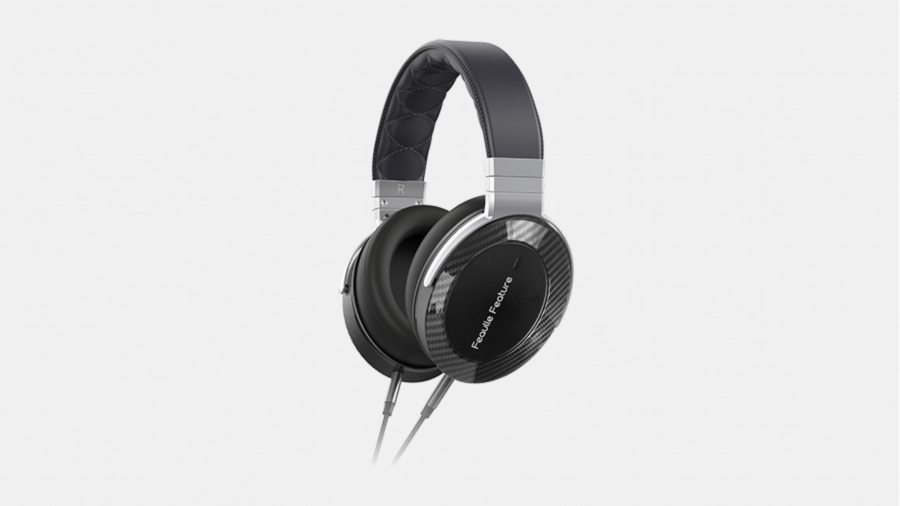

- [为什么是 QA？](#为什么是-qa)
- [这篇文章主要写什么？](#这篇文章主要写什么)
- [我为什么需要一个好耳机？](#我为什么需要一个好耳机)
- [耳机有什么分类？](#耳机有什么分类)
- [打游戏用什么耳机好？](#打游戏用什么耳机好)
	- [游戏耳机的选择](#游戏耳机的选择)
	- [游戏耳机的骗局](#游戏耳机的骗局)
	- [需求分析和选购建议](#需求分析和选购建议)
- [耳机有哪些“坑”？](#耳机有哪些坑)
	- [虚拟/物理多声道](#虚拟物理多声道)
	- [杜比/DTS 音效](#杜比dts-音效)
- [耳机系统是什么？](#耳机系统是什么)
- [“好”的耳机系统需要多少钱？](#好的耳机系统需要多少钱)
- [说到底，各价位什么耳机我无脑入？](#说到底各价位什么耳机我无脑入)
	- [300 ~ 600](#300--600)
	- [600 ~ 1000](#600--1000)
	- [1000 ~ 1600](#1000--1600)
	- [1600 ~ 2500](#1600--2500)
	- [2500 +](#2500-)
- [那么，可以选择什么声卡呢？](#那么可以选择什么声卡呢)

# 为什么是 QA？

普通文章花几个小时精心构建的架构往往在读者匮乏的注意力下显得脆弱不堪。本期文章信息量相对较低，理解不难，我希望小白读者按顺序读也能吸收得轻松愉快

# 这篇文章主要写什么？

根据自己的潜在听音环境和需求以及知识储备等条件，进行 **需求分析**，以在合理的预算内（本文只讨论 30 元到 30000 元区间的）搭配出一套最适合你的耳机系统

**这篇文章一点也不 HiFi ！**

# 我为什么需要一个好耳机？

回答这个问题之前，先讲讲 **你为什么不需要一个好耳机**

绝大部分受众听的流媒体音乐，除了部分电影原声带以及小部分面向发烧友的专辑，在混音过程中就考虑了大部分受众的垃圾听音环境，很少会有垃圾耳机听不清而只有 Hi-End 耳机能听清的

好耳机不能使你四六级得分更高。人声是人耳极其敏感的频段，再廉价的耳机比如原道都能使人耳 **准确分辨一段录制良好的人声的信息**。好的耳机或许能让你听清更多音乐细节，但再差的耳机也绝不会让你听不清人讲话

好耳机能提高你的听声辨位准度，但几乎不能让你在 FPS 竞技游戏中获得任何优势。下文会详细说明这个问题

**那什么人在什么情况下需要一个好耳机呢？**

你是一名听音环境不算吵的音乐爱好者，尤其是古典、爵士、实验音乐以及电影原声带爱好者。虽然一般的耳机就能让你听到音乐，但是更好的耳机能让你更快乐地欣赏音乐，而以上几种音乐类型对耳机的要求相对最高（解释具体原因的话，篇幅就太长了）

你的环境很嘈杂而且你需要安静，或许要听音乐。这种情况下，主动降噪耳机是你的好选择

你是一名音乐相关工作者。这个不解释

# 耳机有什么分类？

从用途上：HiFi 耳机、监听耳机、降噪耳机、游戏耳机…  
从佩戴方式上：入耳式耳塞、平头耳塞、头戴式罩耳耳机、头戴式压耳耳机…  
从发声原理上：动圈、动铁、平面磁、~~静电~~…

根据用途分类的耳机之间的关系可以概括为上图

# 打游戏用什么耳机好？

## 游戏耳机的选择

玩家选购打游戏用的耳机的主流选择。游戏耳机肯定最适合打游戏……吗？  

买只降噪耳机顺便打游戏也是一种主流，然而目前绝大部分主动降噪耳机比如索尼的头戴 XM5 并不具备足够的听声辨位能力，**只有极端嘈杂的情况下你才应该考虑用降噪耳机打游戏**  

网上好多人说什么监听耳机听声辨位准适合打游戏，然而这纯扯淡。纯监听耳机根本不适合任何非音乐工作者，很多小白却上了“监听”二字的当  

事实上，在有限的预算内，追求最佳游戏体验/听声辨位应该这样选（可能需要自购一个麦克风或买根带麦的耳机线）  

## 游戏耳机的骗局

先对硬核 FPS 竞技玩家泼一瓢冷水——好耳机能提高你的听声辨位准度，但几乎不能让你在 FPS 竞技游戏中获得任何优势

[  
没有耳机能让你玩得更好【空降 10:40】- bilibili](https://www.bilibili.com/video/BV1SP411N74m/?share_source=copy_web&vd_source=0d156261fad807ac85d735b6ab0a64ed&t=640)

> 《彩虹六号》是一款对听声辨位要求极高的 FPS 竞技游戏，然而即使在这个游戏中，大多数职业玩家仍选择使用游戏耳机，而非诸如 dt1990 以及 dt990 这种结像精度（俗称听声辨位）非常优秀的监听耳机。这并不是因为某些游戏耳机的结像精度超越了 dt1990 或 dt990，而是因为尽管高质量的耳机能提高你的听声辨位准度，但在 FPS 竞技游戏中，这微弱的优势小到完全可以忽略

**生产游戏耳机的外设厂商成功地营造了一种假象——游戏耳机适合打游戏**

[  
游戏耳机与 HiFi 耳机，区别在哪 - bilibili](https://www.bilibili.com/video/BV1JN411u7kK/?share_source=copy_web&vd_source=0d156261fad807ac85d735b6ab0a64ed)

相比于同价位的 HiFi 耳机，游戏耳机往往更注重功能性和营销噱头，而非声音本身的质量。换句话说，游戏耳机除了可能无线方便点，和 HiFi 耳机比起来没有任何优点

[  
游戏耳机和音乐耳机的音质要求有差别么 - bilibili](https://www.bilibili.com/video/BV1pu4y1A7V6/?share_source=copy_web&vd_source=0d156261fad807ac85d735b6ab0a64ed)

“游戏耳机通常听声辨位好”完全是扯淡。对于 HiFi 耳机来说，结像精度是一项基本素质。换句话说，HiFi 耳机的听声辨位降维打击游戏耳机

## 需求分析和选购建议

作为一名玩家，而且很可能是一名硬核 FPS 竞技玩家，那么你至少需要一个 **够用的** 耳机来做到

1. 听到自然还原的声音
2. 足够准确的听声辨位
3. （对于环境嘈杂的玩家）降低环境噪音的干扰

选购游戏耳机的要求和选购 HiFi 耳机的需求本质上是一样的，只是有一些侧重——适合竞技游戏的耳机要求高结像精度（听声辨位）；用于影音娱乐以及非竞技游戏，尤其是大型单机游戏的耳机则应该确保低频更足，因为低频量对营造氛围感和沉浸感非常重要

# 耳机有哪些“坑”？

## 虚拟/物理多声道

[  
游戏耳机虚拟 7.1 和物理 7.1 - bilibili](https://www.bilibili.com/video/BV1Lu4y1b7eh/?share_source=copy_web&vd_source=0d156261fad807ac85d735b6ab0a64ed)

要说耳机的坑，~~首当其冲的~~ 首恶绝对是所谓“虚拟 5.1/7.1 声道”以及“物理 5.1/7.1 声道”

声道数即发声单元的数量，绝大部分耳机除了华硕创世 7.1 耳机等物理多声道耳机确实具有多个发声单元外，其他耳机每边都只有一个发声单元，因此都是双声道。真正意义上的多声道系统只有使用多个音箱的家庭影院以及电影院才能实现

  
5.1/7.1 多声道家庭影院系统是通过摆放多个音箱实现的

虚拟多声道即“下混”，指将多声道的音频转为双声道播放。有些院线电影的资源的音轨是多声道的，而许多观影者只有双声道系统，因此有了将多声道音频转为双声道播放的需求，这就是虚拟多声道的由来

首先，目前所有音频的主要受众都使用双声道系统，只有电影以及部分游戏才会有对多声道系统比如 5.1、7.1 声道的音频优化，因此普通耳机是完全够用的。而虚拟多声道的算法并不完美，是对原始音频的一种重塑，必然会导致增加一定失真，因此除非是欣赏院线电影资源，否则使用虚拟多声道是没有任何正面意义的

其次，虚拟多声道是不挑耳机的。虚拟多声道的算法是由 cpu 完成的，只有输出是通过声卡的，任何耳机都可以兼容虚拟多声道，并不存在某些耳机“适合虚拟多声道”或“不适合虚拟多声道”的问题。某些外设耳机的“虚拟多声道”宣传完全是混淆视听

另外，物理多声道耳机如华硕创世 7.1 以及雷蛇迪亚海魔 7.1 之类的，恕我直言——就是 trash。先不说 cs 等 FPS 竞技游戏的音频本来就是为双声道优化的，即使是多声道音频，也是为音箱系统优化的，而不是为耳机优化的。很多情况下，你还会经历“上混”，即双声道提升到多声道，可以参考上文中的“下混”的负面效果。与商家宣传的相反，物理多声道不仅客观上无法提高你的听音体验，在竞技游戏中还会 **降低你的听声辨位准度**

**结论：纯噱头**

## 杜比/DTS 音效

杜比和 DTS 本身并不是噱头，本质上是一种 3D 音频算法，我们可以称之为 HRTF，即头相关函数

  
Windows 设置 > 系统 > 声音 > 选择声音输出 > 空间音效

目前主流 3D 音频算法只有 Windows Sonic、Dolby Atmos 和 DTS 三种，而后两者是需要付费的（买断制，绑定在微软账号上，闲鱼渠道打包买也就 30 多块），Windows Sonic 是微软自家的 3D 音频算法，免费，但是效果不如后两者

目前，绝大部分大型单机游戏以及部分网游都需要配合 3D 音频算法使用，只有一些竞技 FPS 游戏如 CS2、PUBG、彩虹六号、卡拉比丘等内置了 HRTF（Apex 没有）

那么，杜比/DTS 和耳机有什么关系呢？  
答案是 —— **没有**

当一款耳机声称支持杜比/DTS 音效，那么它通常只是在软件里加了一层杜比/DTS, which 你的电脑也完全能做到，而且还得担心下会不会和内置 HRTF 的游戏相冲突；要么就是干脆给你附赠一份杜比/DTS 激活码，成本三十多块，你自己也能买

和虚拟多声道类似，HRTF 也是不挑耳机的，并不存在某些耳机“支持杜比/DTS”。某些外设耳机宣传支持杜比音效什么的，完全是混淆视听

结论：**纯噱头**

# 耳机系统是什么？

一个典型的耳机系统包括 **音源 + 数字接口 + DAC + 功放 + 发声单元**，**缺一不可**。通常 **音源** 就是我们的手机、电脑等，**数字接口 + DAC + 功放** 往往作为一个整体被称为 **声卡**（不考虑录音时），**发声单元** 就是我们的耳机、音箱等

无线耳机虽然拥有更高的集成度，但也包含以上全部元件且更复杂——在以上所有部件外还需要额外的无线通信和编码模块

台式的解码耳放和“小尾巴”（即 USB-AUX 接口转接器，取缔了 3.5 mm 接口的手机接有线耳机用的东西）本质上是一种东西，只是体积和功率不同而已。电脑主板、手机集成的声卡通常只是勉强够用，因此有线耳机通常需要搭配外置声卡使用

小尾巴的主流价格是从 30 块包邮到小几百元左右，而台式解码耳放通常需要至少大几百，主流是千元左右。随着现在手机删除 3.5mm 接口的趋势，推荐用有线耳机的大家都买一个小尾巴

# “好”的耳机系统需要多少钱？

好的耳机系统并不奢侈，下至 5 块钱包邮的原道配 30 块钱的扬仕小尾巴也可以 HiFi，而上至 10000 元的 hd800s 配两万的高登序曲也不够 HiFi。对于大多数人而言，一套耳机系统全新 2500，二手 1500 左右就达到边际效应了（再加钱获得的提升对绝大多数人而言非常小）

就头戴式耳机而言，1200 多的高阻版 dt770/880/990 搭配 1000 左右的台式解码耳放一体机就是一种典型的家用聆听最优声价比方案，而 1700 多的 dt700prox 搭配一条“小尾巴”（便携解码耳放一体机）则是兼顾便携和家用的最优声价比方案之一。如果接受二手的话，以上两个方案还都可以优化到 1400 以内，甚至哪天玩腻了还能接近原价卖出去

**想把耳机卖上千？先掂量掂量自己过不过得了 DT 系列这关！**

还有一些国产厂商如 HIFIMAN、水月雨、飞傲等等提供了更具声价比的解决方案，不一定要外国货。在 HiFi 大耳领域，目前国产比较受认可的除了 HIFIMAN 的系列产品外暂时只有水月雨 Para 乐园、飞傲 JT1、FT3、奥莱尔 AR5000 琉璃以及绯乐 Feature（非广告）

# 说到底，各价位什么耳机我无脑入？

1. 根据环境嘈杂程度以及是否需要控制漏音选择开放、半开放或封闭式（通常开放式耳机声场更自然，封闭式耳机隔音和漏音控制更好）
2. 根据预算和是否有便携需求限定一款高敏或低敏耳机（预算几百或需要便携则倾向高敏耳机，预算上千且不需要便携则倾向低敏耳机，需要搭配台式耳放使用）
3. 根据听音偏好、需求以及头型选择适合的耳机调音以及侧重一些特性

下文是我个人认为各预算区间内最值得推荐的耳机搭配，推荐按顺序阅读。以下产品大多都可以在 [《头戴式耳机评测》](头戴式耳机评测.md) 这篇文章中找到详细评测

## 300 ~ 600

小几百是绝大部分听众耳机的主流价位，也是大耳性价比最高的价位。主要推荐低阻高敏耳机搭配小尾巴

绝大部分听众不能接受漏音或需要一定隔音能力，推荐小尾巴搭配高敏低阻封闭式耳机。这个价位不推荐海外大厂刀法精准的产品，更推荐选这个国产大耳新秀飞傲 jt1。这款耳机刚出不久，没几个二手可收的，基本只能买全新

飞傲 JT1 全新 ￥ 399 | 二手 ￥ 360  

部分主要在家聆听的听众能接受漏音且不需要隔音能力，也可以考虑用小尾巴搭配开放式耳机获得更自然的听感和更开阔的声场。目前最值得购买的廉价开放式耳机就是 HIFIMAN 的 he400se。之所以不推荐功率需求更低的飞利浦 shp9500/9600 是因为瘦死的骆驼比马大。he400se 的硬素质比 shp9500/9600 强一截

HIFIMAN HE400se 双边磁体版 全新 ￥ 329 | 二手 ￥ 260  
HIFIMAN HE400se 隐形磁体版 全新 ￥ 499 | 二手 ￥ 330  

以上两个耳机都可以搭配入门级小尾巴（从 30 多块的 cx31993 到百元价位的 ka3）

## 600 ~ 1000

大几百到千元内是一个相对尴尬的价位，性价比不如小几百，也没有声音绝对广受好评的大厂产品。不过还是能挑出几款比较值得推荐的

如果不能接受漏音，但隔音需求不高，对音质比较看重，回头买飞傲 jt1

如果有较强的隔音需求或有录歌、制作电音等任何音乐创作需求，需要一个监听耳机，那 ATH-M50x 就是最优解。这款耳机非常适合人声返听以及混音挑刺，但听感其实并不太好。这款耳机全新刚好千元，配上小尾巴就不符合预算范围了；二手价格较低，但有买到假货的风险，注意甄别

Audio-Technica ATH-M50x 全新 ￥ 999 | 二手 ￥ 650  

如果主要在家聆听，能接受漏音且不需要隔音能力，目前这个价位最值得购买的是飞利浦的另两个跳水王 x2hr 和 x3，全新和二手都比较值得入手，应该没假货

Philips Fidelio X2HR 全新 ￥ 799 | 二手 ￥ 420  

Philips Fidelio X3 全新 ￥ 1200 | 二手 ￥ 800  

如果你有录歌或者电音等任何音乐创作需求，需要一个监听耳机 **且有其他耳机用于欣赏音乐**，那 ATH-M50x 就是最优解。这款耳机非常适合人声返听以及混音挑刺，但听感其实并不好。这款耳机全新刚好千元，配上小尾巴就不符合预算范围了；二手价格较低，但有买到假货的风险，注意甄别

Audio-Technica ATH-M50x 全新 ￥ 999 | 二手 ￥ 650  

这个预算区间，小尾巴的预算从几十到两三白根据预算取舍。要注意的是以上三款推荐的耳机都只支持单端，记得别买平衡口的小尾巴

## 1000 ~ 1600

千元价位是非常值得推荐的价位，这个价位全新和二手都有非常不错的搭配方案，是可以真正走入发烧殿堂的预算区间，而且需求也可以进一步细分，不仅局限在低阻高敏耳机上了

如果不能接受漏音或需要一定隔音能力，这个价位最适合的就是二手 dt700prox，这款耳机全新二手差价相当高，二手非常划算，没有假货风险

Beyerdynamic DT 700 Pro X 全新 ￥ 1728 | 二手 ￥ 1149  

如果需求相近但不接受二手的话，也可以考虑国产封闭式直推大耳绯乐 Feature。即使水军相当多，但这款耳机的声音评价都还是不错的。这款耳机发售不久，主要推荐买全新，二手便宜不了多少（除非你能刀到 1100，那还算值得）。这款耳机可以换成 4.4 mm 平衡线搭配平衡口小尾巴

绯乐 Feature 全新 ￥ 1461 | 二手 ￥ 1200  

如果主要在家聆听，能接受漏音且不需要隔音能力，有便携需求的话，可以考虑用小尾巴搭配高敏低阻的开放式耳机获得更自然的听感和更开阔的声场。国产厂商奥莱尔最近新出的 AR5000 琉璃绝对是极其优秀的耳机，这款耳机推出不久，但全新和二手差价相当高，只推荐买二手，没有假货风险。这款耳机可以换成 4.4 mm 平衡线搭配平衡口小尾巴

奥莱尔 AR5000 琉璃 全新 ￥ 1699 | 二手 ￥ 1000  

如果只考虑大厂产品，也可以选择绝佳的 HiFi 入门大耳 —— dt900prox。这款耳机易推，搭配小尾巴或手机直推即可。全新和二手差价比较高，全新超预算，主要推荐买二手，没有假货风险

Beyerdynamic DT 900 Pro X 全新 ￥ 1728 | 二手 ￥ 1340  

如果无便携需求的话，可以考虑 dt880 高阻版本配合台式解码耳放（记得不要买 dt990pro 那是专业人士用的）。dt880 全新和二手差价相当高，主要推荐买二手

Beyerdynamic DT 880 全新 ￥ 1299 | 二手 ￥ 778  

如果对平面磁单元和更高的解析素质感兴趣，也非常推荐 HIFIMAN he400se 隐形磁体版。选择 he400se 还是 dt880 主要取决于你更希望听到更受认可的均衡调音（dt880）还是更强大的解析素质（he400se）。这款耳机的全新和二手差价不高，主要推荐买全新，但也没有假货风险。这款耳机虽然绝对价格低，但是需要搭配台式解码耳放驱动，主要预算都花在台机上，因此放在这个价位区间。这款耳机可以换成 4.4 mm 平衡线搭配平衡口小尾巴

HIFIMAN HE400se 隐形磁体版 全新 ￥ 499 | 二手 ￥ 380  

这个价位的声卡不仅可以考虑小几百的小尾巴，驱动 dt880 和 he400se 也可以选择搭配大几百上千的台式解码耳放（俗称台机）

## 1600 ~ 2500

这个价位是全新 HiFi 大耳最主流的价位，也是一个非常值得推荐的价位。需求继续细分，也终于可以放开一些手脚买全新了 😭。在上一个预算区间内推荐的二手 dt700prox、ar5000 琉璃以及 dt900prox 在这个价位的预算可以买全新了，都非常值得推荐，但随着预算的提高我们还可以考虑以下几款

如果你想买一款“最优秀的便携大耳”，那么逼格极高的“直推大耳终极形态”极致 Edition 11 搭配小尾巴绝对符合你的需求。这款耳机在任何方面都极其接近完美，价格却非常亲民。ed11 全新和二手差价较高，但容易脏污，在我们的预算内，二手比较推荐

Ultrasone Edition 11 全新 ￥ 3499 | 二手 ￥ 2299  

如果主要在家聆听，能接受漏音且不需要隔音能力，且没有便携需求的话，非常推荐飞傲 FT3（截至文章发布，国内只发售了 350 Ω 版本）搭配台式解码耳放。这款耳机二手跌价非常多，而且发售时间很近，品控和售后都非常顶级，还没有假货风险，因此只推荐买二手。这款耳机自带平衡线材

飞傲 FT3 全新 ￥ 1999 | 二手 ￥ 1099  

相似需求情况下，如果只接受大厂经典产品，或者你需要一个混音监听耳机，或者对耳机重量控制的要求极高，那么加钱买铁三角的 ATH-R70x 搭配台式解码耳放绝对是不二之选。这款耳机全新二手差价较高，在我们的预算区间内推荐买二手

Audio-Technica ATH-R70x 全新 ￥ 2240 | 二手 ￥ 1680  

笔者对无线耳机了解不多，但如果你一定需要无线耳机，而且对主动降噪需求不高，在这个价位可以考虑一步到位世界最强没有之一的无线耳机——Audeze Maxwell。这款耳机全新和二手差价较高，但各种国行渠道的保修都还不错，全新和二手都可以考虑

Audeze Maxwell 全新 ￥ 2446 | 二手 ￥ 1800  

和上个价位区间一样，可以考虑小几百的小尾巴，也可以选择搭配大几百上千的台机

## 2500 +

这个价位的主要都是面向“口味刁钻”的发烧友的产品了。这个价位基本就没有“差的耳机”，而只有面向不同听音偏好和需求的耳机。不仅上一个价位区间内提到的极致 ed11、飞傲 FT3 以及 r70x 都可以买全新，还有一些细分市场的产品可以推荐

**以下产品都是小众细分市场的非主流选择！主流 HiFi 耳机这个价位太多了**

如果你是绝对的影音游戏发烧友且并没有听音乐的需求，那有一个小众选择 VZR Model One 非常值得推荐。VZR Model One 阻抗较低且带麦克风，搭配小尾巴或手机直推即可。这款耳机在国外卖了几年，但 10 月才有国行代理，应该没得二手可买。这款耳机虽然支持替换平衡线材，但换线会导致无法使用自带的麦克风

VZR Model One 全新 ￥ 2799  

如果你只考虑无线耳机，还对声音有极高的要求，那么可以考虑一下世界第一无线游戏耳机 Audeze Maxwell。这款耳机除了重没有任何缺点，二手优惠不多。不过这款耳机发售不久，二手通常还是保存得比较好的，全新和二手都可以买

Audeze Maxwell 全新 ￥ 2445 | 二手 ￥ 2000  

如果你是财大气粗入坑 HiFi 一步到位的大佬，那么 hd800s 可能是一道越不过的坎。hd800s 不仅是大多数烧友的终点，也代表着一种身份认同。这款耳机全新和箱说齐全的二手差价不算很高，因为二手线材通常缺胳膊少腿的。这款耳机没有假货风险，自带平衡线材

Sennheiser HD 800 S 全新 ￥ 6999  

ZMF 是一家介于量产和定制之间的 Hi-End 耳机厂商。如果你想要一个“被认可的高端 diy 耳机”，且对自己的听音偏好已基本有了了解，那么 ZMF 的一些产品可能是你的选择，比如这款低频量感绝佳的木碗大耳 Atticus。买这种东西就别想着二手了

ZMF Atticus 全新 ￥ 9300  

这个预算区间的台机就可以不仅限于大几百价位，而可以考虑几千上万的台机甚至分体系统来获得更完美的声音体验了

# 那么，可以选择什么声卡呢？

笔者只用过以下几款声卡，不能保证以下声卡是近似预算区间内最好的，只能说至少是“不会太错”的选择。因此，**这一段仅作为上一个问题搭配声卡的补充，不作任何推荐**

几十块钱价位的小尾巴，笔者用过一个 30 多块的扬仕小尾巴（没错这款小尾巴甚至没有名字 🤣）。它甚至还支持麦克风 🤣！配合原道用，主打一个出声

扬仕 cx31993 小尾巴 全新 ￥ 33.9  

笔者目前自用的便携大耳是飞傲 JT1，因此觉得搭配飞傲自家的小尾巴 ka1 应该不会错，反正出门在外噪音这么高，支持麦克风，能出声，别太差就行。ka1 并不支持平衡接口

飞傲 ka1 全新 ￥ 219  

这里我假装推荐一个平衡接口的小尾巴，因为我没用过任何平衡接口的小尾巴。但是如果你想要稍强的驱动能力，那么可以考虑平衡接口（通常是 4.4 mm 接口）的小尾巴，配合支持平衡线材的耳机使用

入门级别台式解码耳放一体机可以考虑 ifi zen dac v2，网上说这玩意性价比高，笔者用过，没啥毛病。这款台机的优点主要是可以选择接不接外置电源使用，而且如果用户想提升预算，还能无缝叠加一个长得差不多的 ifi zen can 纯耳放使用，非常灵活，因此它被称为 ifi 叠叠乐。缺点是偶尔有奇怪的电流音，但关机重启一下就好了

ifi zen dac v2 全新 ￥ 1088 | 二手 ￥ 730  

笔者入烧一段时间后，提高了台机的预算，出于对飞傲这牌子的信任买了飞傲 k9pro ess 解码耳放一体机。没啥毛病，优点是做工和质感好，缺点是重（这算得上缺点吗）

飞傲 k9pro ess 全新 ￥ 4999 | 二手 ￥ 3500  

更贵的台机比如 hdv820 啥的笔者就不提了，玩 Hi-End 的大佬自己挑选就行
