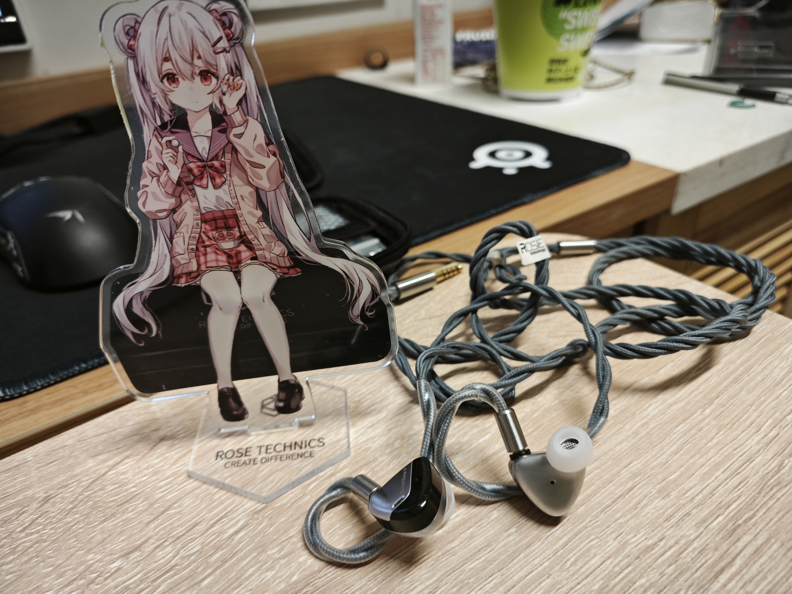

贴吧文，每一个分割线代表一个楼层

- [讲讲平头塞、原道和 diy](#讲讲平头塞原道和-diy)
- [我与平头塞的邂逅](#我与平头塞的邂逅)
- [平头塞的没落](#平头塞的没落)
- [我为什么钟爱平头塞](#我为什么钟爱平头塞)
- [高尔基的 DIY 平头塞](#高尔基的-diy-平头塞)
- 

# 讲讲平头塞、原道和 diy

写篇文章讲讲平头塞、原道和 DIY

这篇文章不是水文，如果你对 DIY 一点不感冒，可以跳过一些部分。为了防止吞楼层补发后文章次序乱掉，我在每一楼末尾都会写个页码

# 我与平头塞的邂逅

2010 年左右，我从老爹的抽屉里掏出一根黑黑带线的小喇叭，插到手机上一个圆圆的孔里，发现了一个能只让自己听而不让别人听到声音的办法。蓦然回首，才知道那条平头塞叫 ATH-C502，铁三角家 low 得不行的东西，却构建了我最初的听音观

1

# 平头塞的没落

2010 年后，手游市场的高歌猛进带动了耳塞市场的繁荣，IEM 即入耳塞越来越流行，而 earbuds 即平头塞则逐渐被边缘化。

耳塞这种东西，制作难度、设计成本都不高，和大耳不可同日而语；在如今愈发浮躁的社会风气下，也比大耳更方便，能揣口袋里随时听个响；这就是为什么如今有诸多国产品牌加入塞子市场的内卷，做大耳的却寥寥——研发成本和市场需求摆在这

口罩这些年来全球经济的萧条，也进一步加速了 IEM 挤占平头塞市场的趋势。国产 HiFi 厂商把目标瞄准有更高品质音乐需求而财力较弱的受众，耳塞产品走向“泛 HiFi 化”——各厂商一方面把三位数主流入门塞的价格向下内卷，一方面把又把旗舰塞卖上五位数天价。平价走量和“割一个算一个”的玩法并存，听起来像不像国产手游月卡+“捕鲸”的套路？

  
弱水时砂 · 静海 典型的水军走量 IEM，不到 300，~~专割~~ 专门卖给非烧但是对声音稍有追求的人

同时随着混合单元技术的进步，3D 打印的成熟，以及人们对降噪、隔音的需求愈发强烈，许多 HiFi 厂商纷纷投入更容易做出“高素质”以及更隔音的入耳塞。在烧友们的眼中，平头塞这种“低频拉跨”“没有隔音”“受耳道影响大，声音不好控制”的东西，就慢慢走向边缘化了

2

# 我为什么钟爱平头塞

大家都说平头塞的天花板低，我不以为然。平头塞作为一种介于入耳塞和开放式大耳之间的耳机，其极低的听诊器效应、更自然的声场以及更大的发声单元尺寸都是让它区别于入耳塞的优点

首先是听诊器效应，你会发现大多数入耳塞的线都是绕耳的，而平头塞通常都是直下式。这是因为入耳塞的听诊器效应较强，需要通过线材绕耳的方式减小噪音，而平头塞就没有这种烦恼。这个类似于封闭式与开放式大耳的区别，越良好的密封越容易放大机械运动的噪音

  
飞傲的平头塞都是直下式线材，比绕耳式方便得多

平头塞并不像入耳塞那样，把声音直接通过导音管射进靠近鼓膜的最后一段平整的耳道，而是在耳朵中部就将声散射开。因此，相对于入耳塞而言，平头塞的声音会比较多地受听者耳朵形状的影响，调音更难以受厂商控制，却也更容易产生宽广自然的声场

平头塞可以拥有更大的发声单元尺寸。和相机类似，“底大一级压死人”的道理在 HiFi 界也能用。大单元的“优势”或者说特点见仁见智吧，虽然理论上更大的单元能更精密地推动更多空气，营造更真实的低频；但由于平头塞不可能像橡胶软套一样完全贴合耳道，这种结构会导致严重的低频泄露，往往让平头的低频发虚，难以 punch 出力量感

3

# 高尔基的 DIY 平头塞

**Warning: 如果你对 DIY 极其厌恶或毫无兴趣的话，请跳过这段。我认为 DIY 也可能做出不错的产品，但如果你更看中品牌耳机的受认可的声音，那 DIY 可能就不会是你的选择**

前段时间有位烧友（下文我们称之为高尔基）以“无条件退货”为旗号在吧里宣传自己的 DIY 平头塞，我本着白嫖绝不缺席的原则要了几副听听，结果出乎意料的惊喜，也算是改变了我原先“DIY 只有垃圾”的印象

高尔基总共寄给我 5 对平头塞，从他家闲鱼店的标价升序是 Loli、Maid 两个版本、Macho 以及 Dame。其中 Loli 给我的感觉就像 SRH1840，声音干冷而一坨，没有评测价值。Dame 作为高尔基的“旗舰 DIY 平头”，当时给我留下的印象也并不咋样。寄回后高尔基说这对塞子出了点品控问题——正负极接反了 🙂 那我的听感暂且看一乐吧

哦对了，前端用的 hdv820；线材杂牌 4.4 mm 转双 mmcx；主打一个能听就

4

#

<!-- 萝莉 低频太少，声音特别干冷（Fires of Rubicon 1:37 这段尤其，和其他的对比一下就知道了）……然后声场也特别远，总体听起来就跟你用座机和人打电话，对方在电话另一边放音乐一样的感觉（点名批评 srh1840，声音和这坨东西十分神似），很难想象真的会有人喜欢这种声音？除非就是要面向这类癖好干冷声音的独特听众否则没啥必要留了（高尔基说适合 acg？不过我也不听日本电子女声，就不评价了）
我起个好听点的名字叫 凛冬，就是说这个又远又干瘪，还有种冷漠疏远的感觉

少女 太中正了！除了均衡外没啥显著的特点，就像那种 eq 到哈曼后的 dt990 一样！初烧可以玩玩这个调音准没错，把这幅耳机放到 acg 录音室去做最终混音监听，放到流行乐录音室去做最终混音监听是没问题的，毕竟干活不是欣赏音乐，找到正确的声音就行了。从另一方面来讲，这也是典型的杂食耳机，什么声音（除了大编制古典……有这需求的别考虑塞子了奥）基本都能对付对付（Fires of Rubicon 1:37 这段爆裂的瞬态居然也能还原得还行，可见单元素质确实不算差；6 Lieder 整首曲子下来高音也拿捏得还不错）。另外少女 16 和 17 的区别不大，我觉得没必要分开讲
少女这个名字我个人觉得不太恰当，这个调音这么中正为什么叫少女呢？叫比如 奇异点 什么的，就挺好，然后后续可以根据这个原型迭代，之所以叫奇异点就是它是第一代成熟的调音

壮汉 我听完觉得最有意思的耳机，它绝对不正确，但是爽！完全阉割特高频（1812 序曲 2:50 一听就知道），但是低音相当有力度！就是听电音的（Stained, Brutal Calamity 6:00 以及 Subhuman 人声部分）低频的泛音（不知道是不是这么叫，可能叫延展？）相当多，是刻意加了谐波失真吗？这个耳机我很喜欢拿来听 Stained, Brutal Calamity 和 Acheron 这两首曲子。特别牛逼的就是它的低音不会像索尼的 WH1000XM5 式的调音那样轰得头晕，突出低频而不轰头，这是很难得的。对于那些追求还原中正声音、ACG 的日本歌姬的华丽声音的人以及刚开始构建听音观的初烧来说这个耳机是不合适的，但是对于知道自己想要听什么的人，比如就喜欢死喉和 Mick Gordon 的 Glitch 金属中那些“电锯”元素的人，那用这个偶尔调剂下爽的一批！顺便，其实电子乐工程师可以用来混音的时候专门用来监听那些超低频的声音，俗称在这一频段上挑刺，说高端点就叫 Critical Listening。同时对于不喜欢刺耳超高频的人（Stained, Brutal Calamity 6:30 仔细听，有一条超高频类似管风琴声音的，这一段会被压下来，对比一下其他耳机就知道了），其实这个耳机也可以将这些类似管风琴的声音变得可接受地很多，就像是在高频率上进行了一个缩限
壮汉这个名字虽然恰当但不好听，不够吸引人，但它反而是这几个耳机里最具特色的一个，我个人是有点喜欢的，极度不正确但是爽，低频太爽了，从来没听过这种感觉！老烧交流会上我是很愿意掏一个这玩意出来和大家交流交流的，指不定突然就觉醒了某个老烧的金属魂
我建议改名叫 地狱歌手，因为我拿这个塞子听 Acheron 就是出自一个叫 Metal: Hellsinger 的游戏的原声带，这种低频也很适合这个名字，够刺激

贵妇 其实感觉就是在少女的基础上稍作调音修改，把人声偏低的频段和中高频段拉高了点，听 Hela。另一方面，在听女声的时候，不会把人声表现得很完整，会“收束”得比较快（Beauty Queen 0:20 歌词：in our li~~~ves 部分很明显），给人稍快节奏的感觉。我觉得这个耳机既然是被卖得最贵的，那肯定就是代表了高尔基本人的听音观，他觉得什么声音足够正确还能足够好听，它和少女相比就像拜亚的 T1 和 dt990，森海的 hd800s 和 hd650 一样，但是达不到这个区别程度。见仁见智，但我个人是觉得不值得比少女贵这么多的，就像你现在没能力做出 HD800，但是已经做出 HD600，然后非要把 HD600 调一下就称之为 HD800 一样，这不太妥。
对应 奇异点 这个名字，我会称之为 分歧点，原因就在文字和感受里了

Stained 1:46 背景低频我今天才听出来 -->
