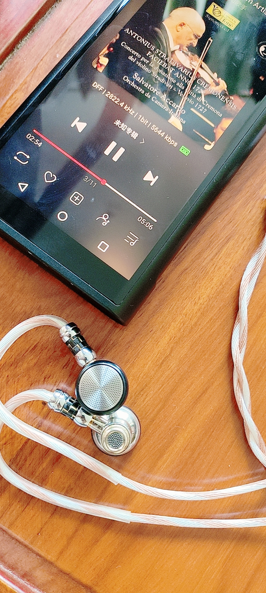
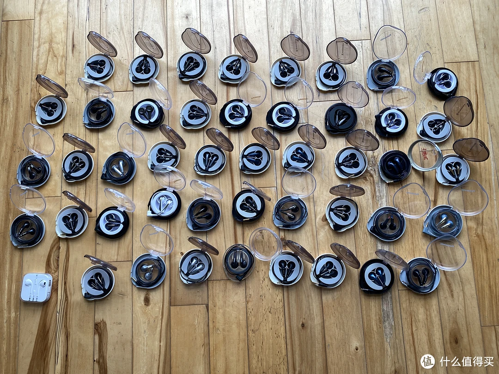
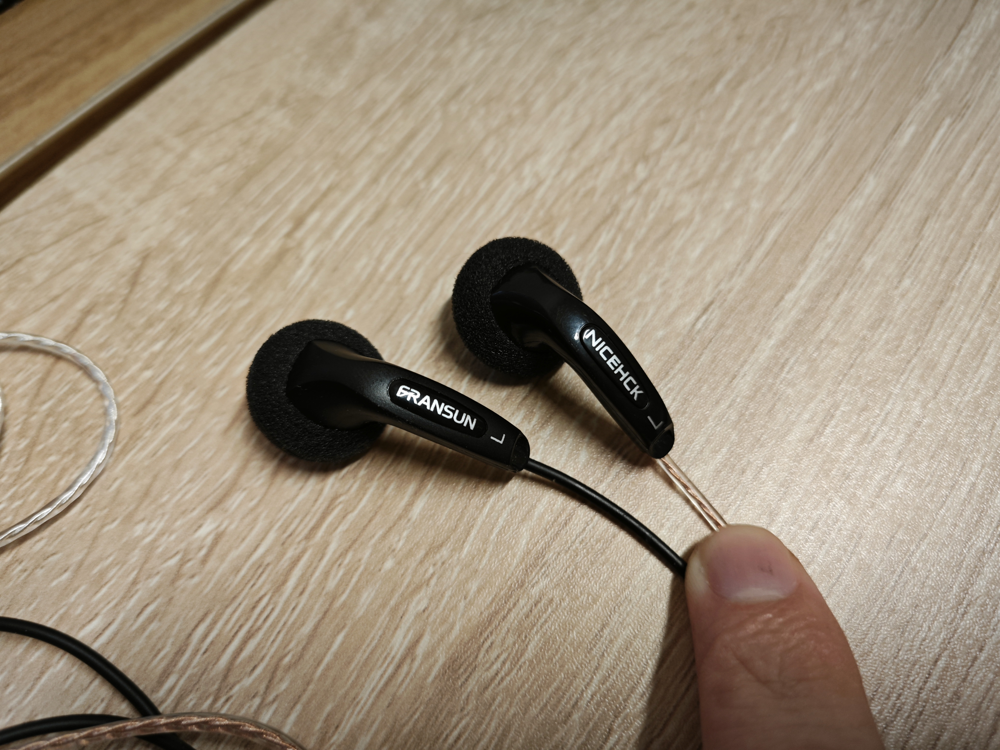
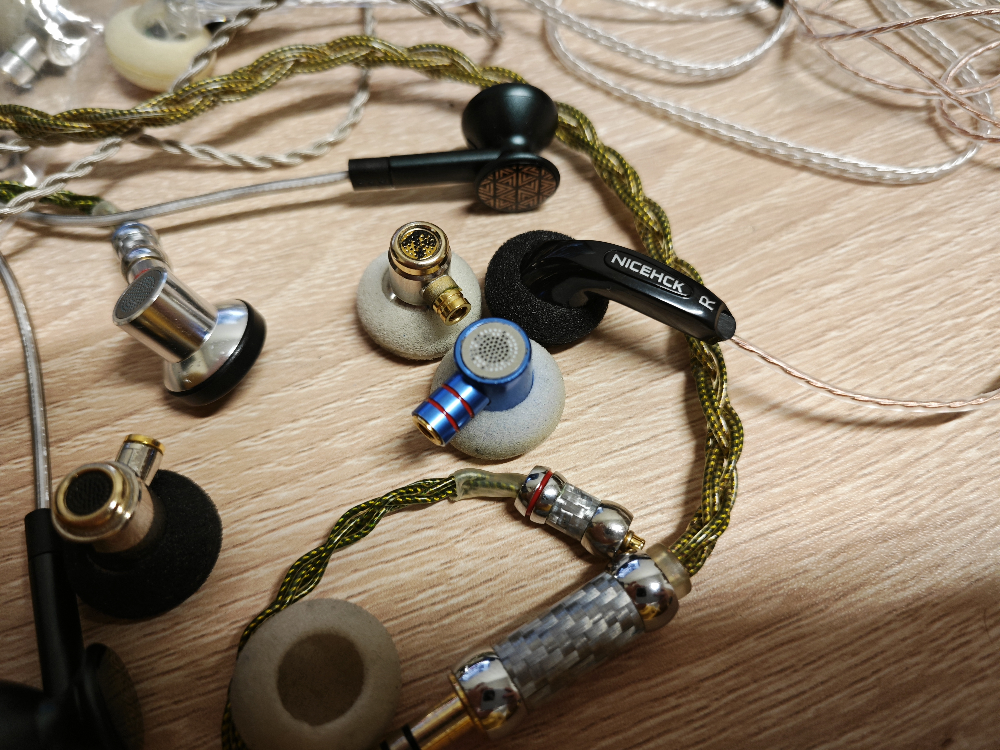
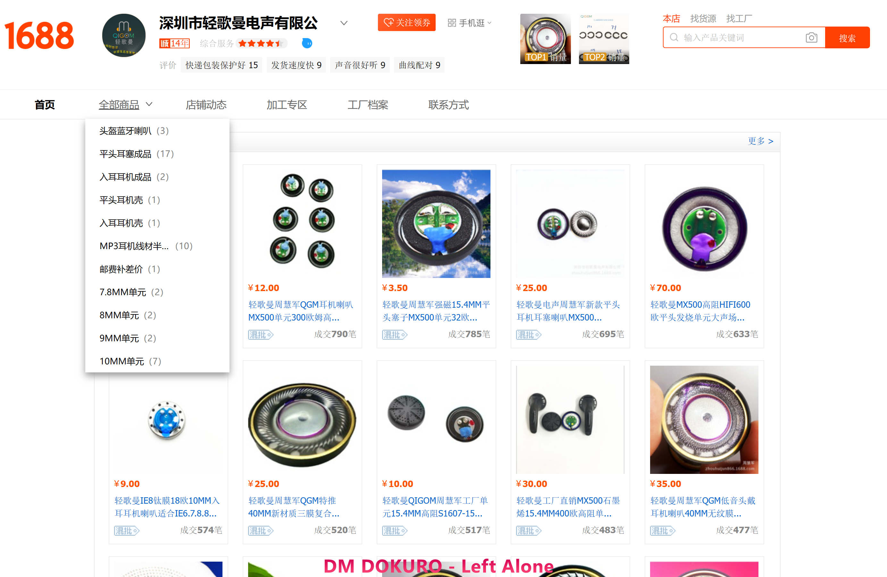
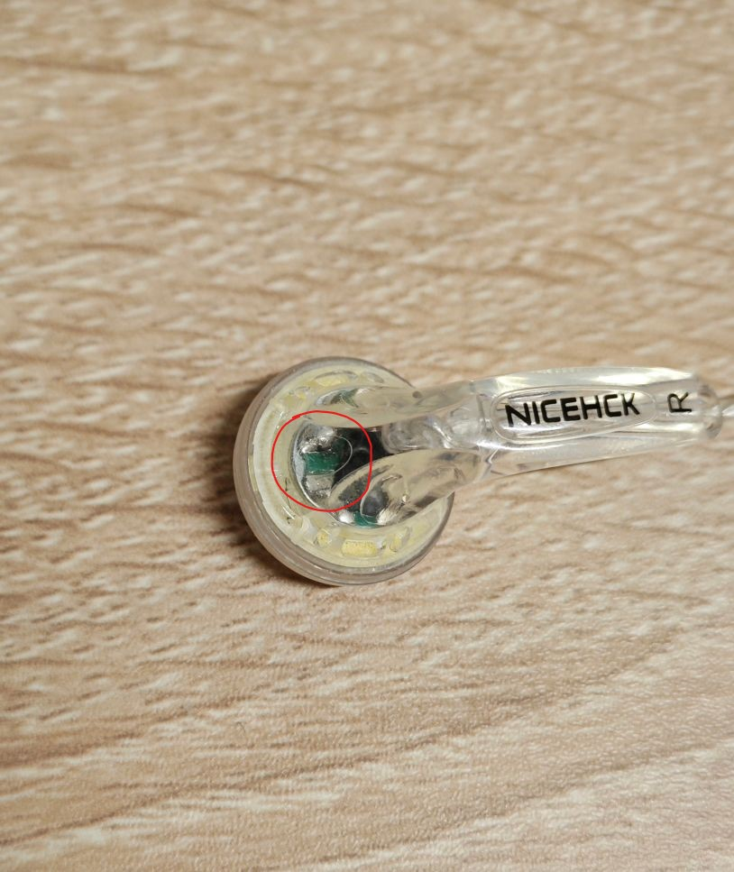

本文是仿贴吧文体，每一个标题代表一个楼层，但合起来也可以当作一篇连贯文章阅读

- [末法时代的平头塞：原道与 DIY 平头塞](#末法时代的平头塞原道与-diy-平头塞)
- [与平头塞的邂逅](#与平头塞的邂逅)
- [平头塞的没落](#平头塞的没落)
- [我为什么钟爱平头塞](#我为什么钟爱平头塞)
- [DIY 平头塞从何而来](#diy-平头塞从何而来)
	- [外壳篇](#外壳篇)
	- [单元篇](#单元篇)
	- [工艺篇](#工艺篇)
- [结语](#结语)
- [各家听感](#各家听感)
- [Reference](#reference)

# 末法时代的平头塞：原道与 DIY 平头塞

即使在普遍式微、市场萎缩的 HiFi 圈中，平头塞也算特别式微的一个小类，而 DIY 平头塞则更是小众又小众

我不是什么商家，也没收什么人的钱，只是想作为一个音乐爱好者的角度，通过这篇文章向吧友介绍一下 DIY 平头塞。同时揭开吧塞“原道”的神秘面纱，再使吧友们既不会受南海小吴之流蒙骗，也不至于闻 DIY 色变

为防止吞楼层补发后文章次序乱掉，我在每一楼末尾都会写个页码

0

# 与平头塞的邂逅

2010 年左右，我从老爹的抽屉里掏出一根黑黑带线的小喇叭，插到手机上一个圆圆的孔里，发现了一个能只让自己听而不让别人听到声音的办法。蓦然回首，才知道那条平头塞叫 ATH-C502，铁三角家 low 得不行的东西，却构建了我最初的听音观

现在应该已经买不到真正的 ath-c502 了，只有淘宝仿品。根据网上人们对正品 mx500 听感的描述、我对 ath-c502 的声音记忆以及我手上这四条原道的声音，我私以为 c502 比 mx500 更接近现代原道的声音

1

# 平头塞的没落

2010 年开始，手游市场的高歌猛进带动了耳塞市场的繁荣，IEM 即入耳塞越来越流行，而平头塞则逐渐被边缘化了

耳塞这种东西，制作难度、设计成本都不高，和大耳不可同日而语；在如今愈发浮躁的社会风气下，也比大耳更方便，能揣口袋里随时听个响；这就是为什么如今有诸多国产品牌加入塞子市场的内卷，做大耳的却寥寥 —— 研发成本和市场需求摆在这

  
弱水时砂 · 静海 典型的 ~~水军~~ 走量 IEM，不到 300，~~专割~~ 专门卖给非烧但是对声音稍有追求的人（不作批评或推荐）

口罩这些年来全球经济的萧条，也进一步加速了 IEM 挤占平头塞市场的趋势。国产 HiFi 厂商把目标瞄准有更高品质音乐需求而财力较弱的受众，耳塞产品走向“泛 HiFi 化”。各厂商一方面把主流塞的价格向下内卷，一方面把又把旗舰塞卖上天价。平价走量和“割一个算一个”的玩法并存，听起来像不像国产手游月卡+“捕鲸”的套路？

[Chi-Fi 行业领头人，飞傲 James 也承认，“从 HiFi 耳塞来说，圈铁架构，多单元动铁技术，3D 打印腔体，金属 5 轴 CNC 工艺，平面磁振膜，静电单元等技术百花齐放，迅速发展。不过这两年技术上的创新和发展已经明显的感觉到头了。”](https://m.weibo.cn/status/4984979138544838)

  
水月雨 · 梅 动圈+平面磁，官价 398，以前你敢想？（不作批评或推荐）

中高端 IEM 的最大特点就是多单元。每个单元专注于自己的频段，这样理论上即使每个单元的频宽有所不足，也能在协同中合成出更优秀的声音

随着技术进步以及人们对降噪的需求愈发强烈，许多 HiFi 厂商纷纷投入更有噱头的 IEM 而舍弃了平头的市场。在烧友们的眼中，平头这种“低频拉”“0 隔音”“受耳道影响大，声音不好把控”的东西，就慢慢走向边缘化了

2

# 我为什么钟爱平头塞

大家都说平头塞的天花板低，我不以为然。平头塞作为一种介于入耳塞和大耳之间的耳机，其极低的听诊器效应、更自然的声场以及更大的发声单元尺寸都是让它区别于入耳塞的优点

首先是 **听诊器效应**，你会发现大多数入耳塞的线都是绕耳的，而平头塞通常都是直下式。这是因为入耳塞的听诊器效应较强，需要通过线材绕耳的方式减小噪音，而平头塞就没有这种烦恼。这个类似于封闭式与开放式大耳的区别，越良好的密封越容易放大机械运动的噪音

  
飞傲的平头塞都是直下式线材（仅作引用，不做推荐）

平头塞并不像入耳塞那样，把声音直接通过导音管射进靠近鼓膜的最后一段平整的耳道，而是在耳朵中部就将声散射开。因此，相对于入耳塞而言，平头塞的声音会比较多地受听者耳朵形状的影响，调音更难以受厂商控制，却也更容易产生 **宽广自然的声场**

  
飞傲 FF3S 采用了后背“腰鼓式双低频共振腔体”设计，且有类似 ZMF Atticus 的泄气孔，以深化低频下潜（仅作引用，不做推荐）

平头塞可以拥有 **更大的发声单元尺寸**。和相机类似，“底大一级压死人”的道理在 HiFi 界也能用。大单元的“优势”或者说特点见仁见智吧，虽然理论上更大的单元能更精密地推动更多空气，营造更真实的低频；但由于平头塞不可能像橡胶软套一样完全贴合耳道，这种结构会导致严重的低频泄露，往往让平头的低频发虚，更难以 punch 出力量感

3

# DIY 平头塞从何而来

**平头塞的声音素质 = 30% 腔体 + 50% 单元 + 20% 工艺**

本章节将分三楼讲解 DIY 平头塞的由来。当然，本文讲的 DIY 平头塞不是那种随便找公模组几个废单元，再塞点棉调一下就标榜“秒超平”的欺人渣滓，而是“不满足于市场上现有的声音，就动手做出想要的声音”的工艺品

**感谢吧友以及闲鱼 DIY 爱好者借出平头塞并讲解关于 DIY 平头塞外壳、单元以及内部工艺的知识**

4

## 外壳篇

原道的外壳和腔体设计沿袭于森海 MX500，单元则应该是某种国产自研单元

如今平头塞的利润式微，市面上除了一些早已停产的经典平头塞已经没什么假货了，你只要别故意冲着假货买根本买不到。从上个世纪运作到现在的耳机产线继续生产着这些公模自组平头塞，当年人人喊打的假货产线，如今却是怀旧党和 DIY 爱好者的宝藏

由于没有企业买断某款耳机的独家外观专利，丰达给多家企业代工的同一型号耳机只需添加各自的标志即可出厂。这些耳机外壳被称为“公模”

  

经过长时间市场检验的公模不仅让国产量产平头塞有了从 0 到 1 的土壤，还使 FRANSUN 和 NICEHCK 原道得以在维持声音品质的情况下把成本压制在一个低得夸张的水平

不过，公模也仅仅是平头塞外壳的来路之一。一些 DIY 或量产平头塞并不满足于公模的声音，转而选择自己设计或选购第三方设计的单元比如下面这种常见的“大锤头”。这类 DIY 和量产平头塞的区别其实就是从淘宝闲鱼进货或者上 1688 批发的区别而已

5

## 单元篇

原道的单元没啥好说的，早期就是国产仿制 mx500 的自研单元，后来在时代变迁中逐渐改进并变成现在的“女毒”味人声塞。DIY 耳塞通常没有技术实力自研单元，而是从大代工厂购买全新单元或回收拆机单元

轻歌曼是国内最大的平头塞单元厂商，为许多 DIY 爱好者提供了大量品控稳定的单元。绝版的丰达单元和一些高端耳塞拆机单元也是一部分来源，这些单元量少且价格高，通常只见于买一副少一副的高价 DIY 耳塞中。而且，许多有追求的 DIY 卖家也会对拿到的单元进行改造，以求得更“定制化”的声音

一位 DIY 爱好者告诉我，“每对成品都是大概一周时间的精细调音，无数次的开壳，开一次壳子里面的调音纸调音棉就要换新，单元原代焊锡都要换成我满意的龙格 2080，开十次以上单元基本就要报废一对，所以你手上的成品都是以十多对单元为代价的优中选优的听感”

  
七克二百元的 Ranko Acoustics RSS 2080

虽然我本人并不是太在乎线材的 cable man，但通常看 DIY 爱好者们敢下多少血本去改造单元，去买线基和焊锡，就能看出他们对声音有多少追求

6

## 工艺篇

工艺就是在选定壳体和单元并做好改造后的调音。

  
不要小看调音工艺对声音的影响，hd800s 和 hd820 就用了 ie800 的技术提升高频细节

无论是物料成本，还是研发和物料成本之和，品牌的单机成本都比 DIY 更低，低得多。品牌向轻歌曼定制同一种单元，或自研单元找深圳工厂代工，中高端平头塞一个单元可能也就五元一个但是要一万以上的量，私模壳子要是量足也就五元一对，定价按声音定，单机利润基本取决于敢卖多少。然而，许多 DIY 平头塞的售价通常就标示了其成本，定价按成本定，单机利润得从成本和售价的差额里挤出来

我采访了几位 DIY 爱好者，他们的单元所用焊锡和调音等等工艺不能说略有不同，只能说天差地别。当然，部分工艺属于“商业机密”，应他们要求，我也不便透露。当然如果你有购买意愿，许多 DIY 爱好者也愿意给你透露更多秘密

7

# 结语

DIY 耳塞根本不是便宜买卖，相同价格的 DIY 耳塞产品几乎是绝对比品牌产品用料（在单元和工艺方面）豪华得多。而且，做 DIY 平头塞根本不赚什么钱 —— 平头塞的市场就那么丁点大，出不了 **音乐精灵**、出不了 **南海小吴**，也出不了什么 **DIY 汤老师**，只有一些发烧友们用自己的爱好和智慧创造了许多让人惊艳的作品，并不靠卖 DIY 创多少收

当然，的确有部分败类对 DIY 音乐产品的声誉造成了不小的损害

南海小吴发过一个视频《[请问你购买 Susvara Utopia DCA 这些产品的时候，是否提出过试听七天的要求](https://www.bilibili.com/video/BV1v14y1k7ri/?share_source=copy_web&vd_source=0d156261fad807ac85d735b6ab0a64ed)》试图以此证明自己不接受免费试听是合理的，这就摆明了其江湖骗子的本质。DIY 产品之所以能买，就是因为能够免费试听，而不像品牌产品一样买来就得脑放到满意。**但凡是 DIY 音响类产品，有且只有支持免费试听的才值得购买**

9

# 各家听感

高尔基总共寄给我 5 对平头塞，从他家闲鱼店的标价升序是 Loli、Maid 两个版本、Macho 以及 Dame。其中 Loli 给我的感觉就像 SRH1840，声音干冷而一坨，没有评测价值。Dame 作为高尔基的“旗舰 DIY 平头”，当时给我留下的印象也并不咋样。寄回后高尔基说这对塞子出了点品控问题——正负极接反了 🙂 那我的听感暂且看一乐吧

哦对了，前端用的 hdv820 和 k9pro ess；线材杂牌 4.4 mm 转双 mmcx；主打一个随便听听

<!-- 萝莉 低频太少，声音特别干冷（Fires of Rubicon 1:37 这段尤其，和其他的对比一下就知道了）……然后声场也特别远，总体听起来就跟你用座机和人打电话，对方在电话另一边放音乐一样的感觉（点名批评 srh1840，声音和这坨东西十分神似），很难想象真的会有人喜欢这种声音？除非就是要面向这类癖好干冷声音的独特听众否则没啥必要留了（高尔基说适合 acg？不过我也不听日本电子女声，就不评价了）
我起个好听点的名字叫 凛冬，就是说这个又远又干瘪，还有种冷漠疏远的感觉

少女 太中正了！除了均衡外没啥显著的特点，就像那种 eq 到哈曼后的 dt990 一样！初烧可以玩玩这个调音准没错，把这幅耳机放到 acg 录音室去做最终混音监听，放到流行乐录音室去做最终混音监听是没问题的，毕竟干活不是欣赏音乐，找到正确的声音就行了。从另一方面来讲，这也是典型的杂食耳机，什么声音（除了大编制古典……有这需求的别考虑塞子了奥）基本都能对付对付（Fires of Rubicon 1:37 这段爆裂的瞬态居然也能还原得还行，可见单元素质确实不算差；6 Lieder 整首曲子下来高音也拿捏得还不错）。另外少女 16 和 17 的区别不大，我觉得没必要分开讲
少女这个名字我个人觉得不太恰当，这个调音这么中正为什么叫少女呢？叫比如 奇异点 什么的，就挺好，然后后续可以根据这个原型迭代，之所以叫奇异点就是它是第一代成熟的调音

壮汉 我听完觉得最有意思的耳机，它绝对不正确，但是爽！完全阉割特高频（1812 序曲 2:50 一听就知道），但是低音相当有力度！就是听电音的（Stained, Brutal Calamity 6:00 以及 Subhuman 人声部分）低频的泛音（不知道是不是这么叫，可能叫延展？）相当多，是刻意加了谐波失真吗？这个耳机我很喜欢拿来听 Stained, Brutal Calamity 和 Acheron 这两首曲子。特别牛逼的就是它的低音不会像索尼的 WH1000XM5 式的调音那样轰得头晕，突出低频而不轰头，这是很难得的。对于那些追求还原中正声音、ACG 的日本歌姬的华丽声音的人以及刚开始构建听音观的初烧来说这个耳机是不合适的，但是对于知道自己想要听什么的人，比如就喜欢死喉和 Mick Gordon 的 Glitch 金属中那些“电锯”元素的人，那用这个偶尔调剂下爽的一批！顺便，其实电子乐工程师可以用来混音的时候专门用来监听那些超低频的声音，俗称在这一频段上挑刺，说高端点就叫 Critical Listening。同时对于不喜欢刺耳超高频的人（Stained, Brutal Calamity 6:30 仔细听，有一条超高频类似管风琴声音的，这一段会被压下来，对比一下其他耳机就知道了），其实这个耳机也可以将这些类似管风琴的声音变得可接受地很多，就像是在高频率上进行了一个缩限
壮汉这个名字虽然恰当但不好听，不够吸引人，但它反而是这几个耳机里最具特色的一个，我个人是有点喜欢的，极度不正确但是爽，低频太爽了，从来没听过这种感觉！老烧交流会上我是很愿意掏一个这玩意出来和大家交流交流的，指不定突然就觉醒了某个老烧的金属魂
我建议改名叫 地狱歌手，因为我拿这个塞子听 Acheron 就是出自一个叫 Metal: Hellsinger 的游戏的原声带，这种低频也很适合这个名字，够刺激
-
女声的张力太差，但是低频很足，非常有力

贵妇 其实感觉就是在少女的基础上稍作调音修改，把人声偏低的频段和中高频段拉高了点，听 Hela。另一方面，在听女声的时候，不会把人声表现得很完整，会“收束”得比较快（Beauty Queen 0:20 歌词：in our li~~~ves 部分很明显），给人稍快节奏的感觉。我觉得这个耳机既然是被卖得最贵的，那肯定就是代表了高尔基本人的听音观，他觉得什么声音足够正确还能足够好听，它和少女相比就像拜亚的 T1 和 dt990，森海的 hd800s 和 hd650 一样，但是达不到这个区别程度。见仁见智，但我个人是觉得不值得比少女贵这么多的，就像你现在没能力做出 HD800，但是已经做出 HD600，然后非要把 HD600 调一下就称之为 HD800 一样，这不太妥。
对应 奇异点 这个名字，我会称之为 分歧点，原因就在文字和感受里了

Stained 1:46 背景低频我今天才听出来 -->

# Reference

[从森海 MX500、原道耳机说起：丰达制造的前世今生](https://post.smzdm.com/p/a20wn46n)
